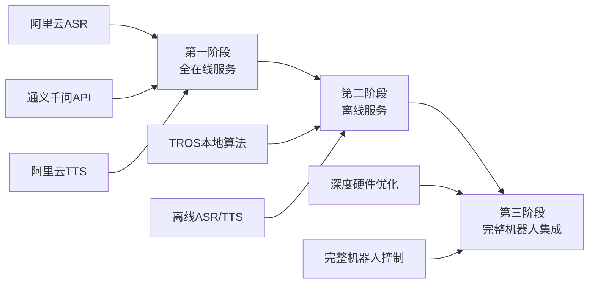
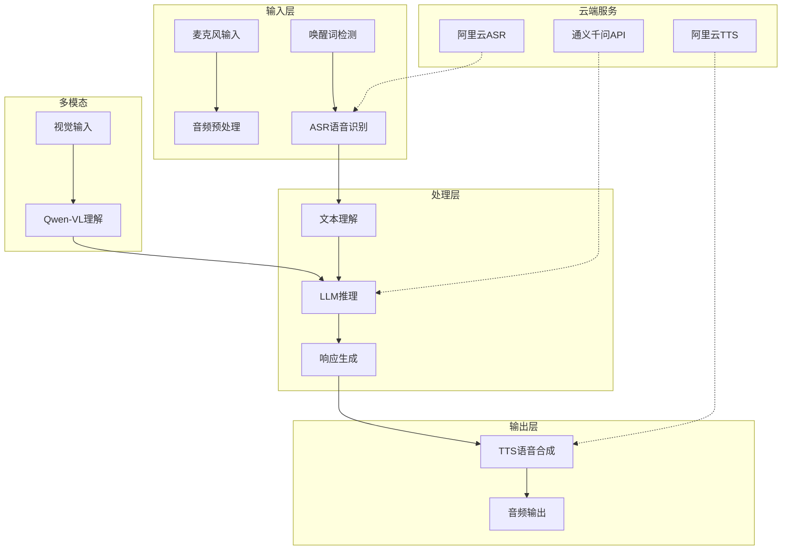

# XLeRobot - 智能粤语语音机器人系统

## 🤖 项目概述

XLeRobot是一个基于ROS2的智能粤语语音机器人系统，运行在D-Robotics RDK X5硬件平台上。项目采用企业级Brownfield Level 4标准，实现了完整的语音交互功能，支持粤语语音识别、自然语言理解和语音合成。

### 🌟 核心特性

- **🎤 粤语语音识别** - 阿里云ASR服务，支持实时语音转文本
- **🧠 智能对话理解** - 通义千问大语言模型，自然语言处理
- **🔊 高质量语音合成** - 阿里云TTS服务，自然语音输出
- **👁️ 多模态集成** - Qwen-VL视觉理解，支持图像+文本交互
- **⚡ 唤醒词检测** - "傻强"唤醒词，低功耗待机
- **🔧 ROS2分布式架构** - 15个专业化节点，支持模块化扩展
- **🚀 硬件加速** - RDK X5 NPU/BPU硬件优化

### 🏗️ 三阶段架构演进



## 🚀 快速开始

### ⚠️ 环境要求（重要）

**✅ 必需环境：**
- Python 3.10.12（系统版本，**不是**Miniconda 3.13）
- ROS2 Humble
- D-Robotics RDK X5硬件平台

**❌ 禁止使用：**
- Python 3.13（Miniconda）- 与ROS2不兼容
- 任何conda虚拟环境

### 🛡️ Miniconda冲突解决方案

XLeRobot项目已实现完整的环境冲突解决方案：

```bash
# ✅ 新的环境初始化方式 (推荐)
cd /home/sunrise/xlerobot

# 加载XLeRobot专用环境 (自动解决所有冲突)
source ./xlerobot_env.sh

# 验证环境配置
./verify_xlerobot_environment.sh
```

**🔧 自动环境管理：**
- 所有启动脚本现在都会自动加载正确环境
- 无需手动配置Python路径
- 自动检测和隔离conda/miniconda路径

**⚡ 快速验证：**
```bash
# 检查环境状态
echo $PYTHON_EXECUTABLE      # 应显示: /usr/bin/python3.10
which python3               # 应指向系统python3
./verify_xlerobot_environment.sh  # 应无错误
```

### 1. 传统环境初始化（可选）

```bash
# 进入项目目录
cd /home/sunrise/xlerobot

# 激活ROS2环境
source /opt/ros/humble/setup.bash

# 配置API密钥（生产环境）
export ALIBABA_CLOUD_ACCESS_KEY_ID="your_access_key_id"
export ALIBABA_CLOUD_ACCESS_KEY_SECRET="your_access_key_secret"
export ALIYUN_NLS_APPKEY="your_nls_appkey"
export QWEN_API_KEY="your_qwen_api_key"
```

### 2. 依赖安装

```bash
# 确保正确环境
source ./xlerobot_env.sh

# 安装Python依赖 (使用环境变量中的Python)
$PYTHON_EXECUTABLE -m pip install -r requirements.txt

# 验证环境
./verify_xlerobot_environment.sh
./start_voice_assistant.sh check
```

### 3. 启动系统

```bash
# 启动语音助手服务（推荐）
./start_voice_assistant.sh

# 或强制启动（跳过环境检查）
./start_voice_assistant.sh --force
```

### 4. 运行测试

```bash
# 完整集成测试
python3.10 tests/test_epic1_complete_integration.py

# 功能验证测试
python3.10 tests/verify_epic1_complete_functionality.py

# 运行所有测试
python3.10 tests/run_all_tests.py
```

## 🏛️ 系统架构

### 核心模块架构



### ROS2节点架构

系统采用微服务架构，包含15个专业化ROS2节点：

| 节点类型 | 功能描述 | 通信方式 |
|---------|---------|---------|
| **输入节点** | 音频采集、预处理、唤醒检测 | sensor_msgs/Audio |
| **ASR节点** | 语音识别、文本提取 | std_msgs/String |
| **LLM节点** | 语言理解、对话管理 | std_msgs/String |
| **TTS节点** | 语音合成、音频输出 | sensor_msgs/Audio |
| **视觉节点** | 图像采集、视觉理解 | sensor_msgs/Image |
| **控制节点** | 系统协调、状态管理 | custom_msgs/Control |

## 📁 项目结构

```
xlerobot/
├── 📂 src/                          # 源代码
│   ├── 📂 modules/                  # 核心功能模块
│   │   ├── 📂 asr/                  # 语音识别模块
│   │   ├── 📂 llm/                  # 大语言模型模块
│   │   ├── 📂 tts/                  # 语音合成模块
│   │   └── 📂 system_control/       # 系统控制模块
│   ├── 📂 xlerobot_vision/          # 视觉模块 (Qwen-VL)
│   ├── 📂 xlerobot_online_dialogue/ # 在线对话服务
│   └── 🐍 start_epic1_services.py   # 主服务启动脚本
├── 📂 tests/                        # 测试套件
│   ├── 📄 README.md                 # 测试文档
│   ├── 🐍 run_all_tests.py          # 测试管理器
│   └── [20+ 测试文件]               # 各类测试
├── 📂 docs/                         # 项目文档
│   ├── 📄 project-overview.md       # 项目概览
│   ├── 📄 architecture-analysis.md  # 架构分析
│   └── 📂 verification_reports/     # 验证报告
├── 📂 scripts/                      # 脚本工具
├── 📂 config/                       # 配置文件
├── 📂 testing_data/                 # 测试数据
├── 📄 requirements.txt              # Python依赖
├── 📄 start_voice_assistant.sh      # 主启动脚本
└── 📄 CLAUDE.md                     # 开发指南
```

## 🧪 测试指南

### 测试分类

| 类别 | 测试文件 | 描述 |
|-----|---------|------|
| **集成测试** | `test_epic1_complete_integration.py` | Epic 1完整功能测试 |
| **API测试** | `test_aliyun_api_integration.py` | 阿里云服务连接测试 |
| **音频测试** | `test_audio_components.py` | 音频设备功能测试 |
| **端到端测试** | `test_e2e_integration.py` | 完整流程验证 |

### 运行测试

```bash
# 运行所有测试
python3.10 tests/run_all_tests.py

# 运行特定类别测试
python3.10 tests/run_all_tests.py --category integration
python3.10 tests/run_all_tests.py --category api

# 快速验证
python3.10 tests/quick_verification.py

# 真实环境测试
python3.10 tests/real_epic1_verification.py
```

## 🔧 配置说明

### 环境变量配置

创建 `.env` 文件或设置环境变量：

```bash
# 阿里云服务配置
ALIBABA_CLOUD_ACCESS_KEY_ID="your_access_key_id"
ALIBABA_CLOUD_ACCESS_KEY_SECRET="your_access_key_secret"
ALIYUN_NLS_APPKEY="your_nls_appkey"

# 大语言模型配置
QWEN_API_KEY="your_qwen_api_key"

# 系统配置
ROS_DOMAIN_ID=42
PYTHONPATH="/home/sunrise/xlerobot/src"
```

### 音频设备配置

```bash
# 检查录音设备
arecord -l

# 检查播放设备
aplay -l

# 测试录音
arecord -d 3 -f cd test_recording.wav

# 测试播放
aplay test_recording.wav
```

## 🐛 故障排查

### 常见问题

#### 1. 服务无法启动
```bash
# 检查环境
./start_voice_assistant.sh check

# 检查Python版本
python3.10 --version

# 检查ROS2环境
echo $ROS_DISTRO
```

#### 2. API调用失败
```bash
# 测试网络连接
bash scripts/test_aliyun_connection.sh

# 验证API配置
bash scripts/validate_aliyun_config.sh

# 查看详细日志
./start_voice_assistant.sh logs
```

#### 3. 音频问题
```bash
# 检查音频设备
arecord -l && aplay -l

# 测试音频功能
arecord -d 3 test.wav && aplay test.wav

# 检查ALSA权限
groups $USER | grep audio
```

#### 4. ROS2节点问题
```bash
# 查看节点状态
ros2 node list

# 检查话题
ros2 topic list

# 监控消息
ros2 topic echo /voice_command
```

## 📚 相关文档

- **[CLAUDE.md](CLAUDE.md)** - 详细开发指南
- **[docs/project-overview.md](docs/project-overview.md)** - 完整项目概览
- **[docs/architecture-analysis.md](docs/architecture-analysis.md)** - 系统架构分析
- **[docs/file-structure.md](docs/file-structure.md)** - 文件结构说明

## 🤝 贡献指南

### 开发流程

1. **环境准备**
   ```bash
   source /opt/ros/humble/setup.bash
   export PYTHONPATH="/home/sunrise/xlerobot/src:$PYTHONPATH"
   ```

2. **代码规范**
   - 遵循PEP 8编码规范
   - 使用类型提示
   - 添加完整文档注释
   - 编写对应测试

3. **测试要求**
   - 所有新功能必须有测试
   - 运行完整测试套件
   - 真实环境验证（不使用Mock）

4. **提交规范**
   - 使用清晰的提交信息
   - 确保CI/CD通过
   - 更新相关文档

## 📄 许可证

本项目采用 MIT 许可证 - 查看 [LICENSE](LICENSE) 文件了解详情。

## 📞 联系信息

- **项目负责人**: Jody
- **开发语言**: Python 3.10 + ROS2
- **沟通语言**: 中文
- **项目标准**: Brownfield Level 4 Enterprise Scale

---

*最后更新: 2025-11-15*