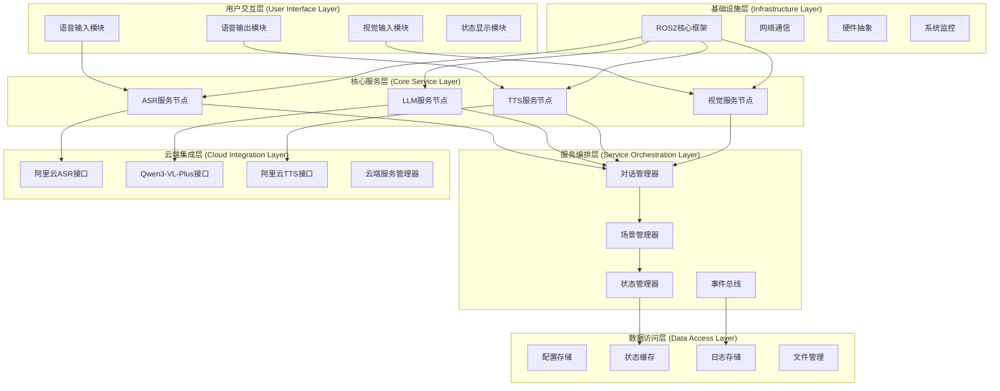
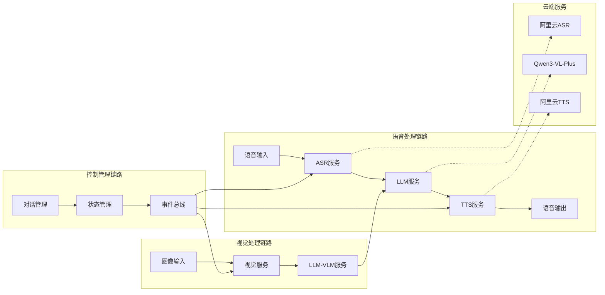
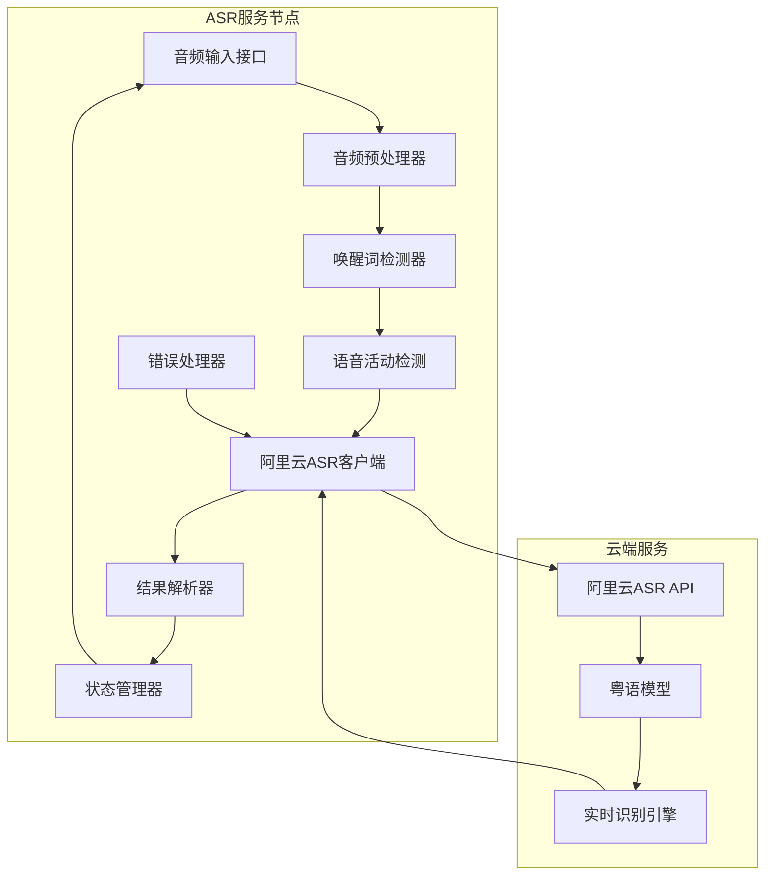
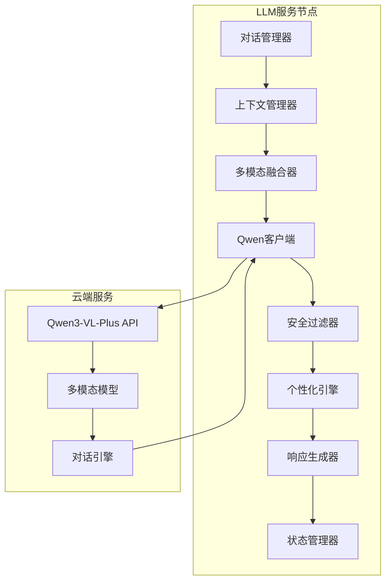
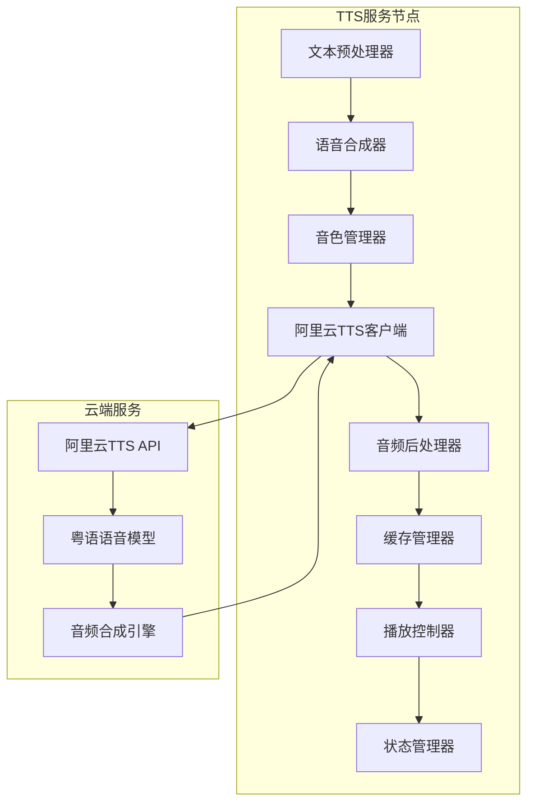
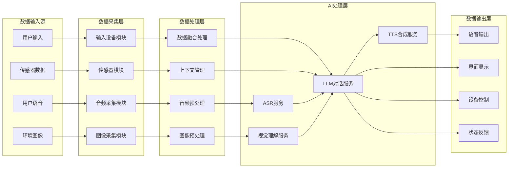

# ⚠️ **文档已弃用 - 架构偏离警告**

## 🚨 重要警告
- **本文档包含偏离纯在线服务架构的内容**
- **包含不应出现的CNN模型、本地处理等复杂逻辑**
- **已被新的纯在线服务架构文档替代**
- **请参考：`1-1-simple-online-speech-services.md`**

---

# XleRobot 第一阶段系统架构设计文档 (已弃用)
## 全在线服务架构 - Brownfield Level 4 企业级变更

**状态**: ❌ **已弃用 - 架构偏离**
**替代文档**: `docs/stories/1-1-simple-online-speech-services.md`
**弃用日期**: 2025-11-09
**弃用原因**: 包含CNN模型、本地处理等偏离纯在线服务的内容

**文档编号**: XLR-ARCH-P1-20251107-001
**项目名称**: XleRobot 家用机器人控制系统 - 第一阶段系统架构设计
**文档版本**: 1.0
**创建日期**: 2025-11-07
**最后修改**: 2025-11-07
**文档类型**: 系统架构设计文档
**变更级别**: Brownfield Level 4 (企业级变更)
**工作流**: Phase 3 Solutioning - create-architecture
**架构代理**: System Architect (系统架构师)

---

## 📋 文档控制

### 版本历史
| 版本 | 日期 | 修改人 | 变更内容 | 审核状态 |
|------|------|--------|----------|----------|
| 1.0 | 2025-11-07 | System Architect | 初版创建 | 待审核 |
|      |        |        |          |          |

### 审批记录
| 角色 | 姓名 | 审批状态 | 审批日期 | 备注 |
|------|------|----------|----------|------|
| 技术架构师 | - | 待审批 | - | |
| 解决方案架构师 | - | 待审批 | - | |
| DevOps工程师 | - | 待审批 | - | |
| 质量保证 | - | 待审批 | - | |

### 设计约束
- **架构类型**: 增强型架构 (Brownfield Level 4)
- **向后兼容**: 100%保持现有系统兼容性
- **渐进式部署**: 支持平滑的架构升级
- **企业级标准**: 符合企业级架构设计规范

---

## 🎯 架构概述和设计原则

### 架构愿景
构建一个基于云端服务的智能语音机器人系统，通过ROS2分布式架构实现模块化、可扩展、高可用的粤语语音交互平台，为后续离线化和系统集成奠定坚实基础。

### 核心架构目标

#### 1. 功能目标
- **语音优先**: 以粤语语音交互为核心的系统架构
- **多模态集成**: 语音+视觉+文本的综合理解能力
- **云端智能**: 充分利用成熟云端AI服务能力
- **实时响应**: 满足语音交互的实时性要求

#### 2. 质量目标
- **高可用性**: 系统可用性 > 99%，故障快速恢复
- **高性能**: 端到端响应时间 < 2秒
- **可扩展性**: 支持功能模块化和水平扩展
- **可维护性**: 清晰的模块边界和标准化接口

#### 3. 技术目标
- **ROS2原生**: 基于ROS2 Humbles分布式架构
- **云端集成**: 优雅的云端服务集成架构
- **硬件适配**: 充分利用RDK X5硬件能力
- **Python生态**: 完全基于Python3.10环境

### 核心架构原则

#### 1. 分层架构原则 (Layered Architecture)
- **清晰的层次划分**: 每层职责明确，边界清晰
- **单向依赖**: 上层依赖下层，避免循环依赖
- **接口抽象**: 通过标准化接口实现层次解耦
- **可替换性**: 每层实现可以被独立替换

#### 2. 模块化设计原则 (Modular Design)
- **高内聚低耦合**: 模块内部功能内聚，模块之间松散耦合
- **单一职责**: 每个模块只负责一个特定的功能域
- **接口标准化**: 统一的接口定义和数据格式
- **版本兼容**: 接口变更保持向后兼容

#### 3. 分布式架构原则 (Distributed Architecture)
- **服务自治**: 每个服务独立部署和运行
- **异步通信**: 通过消息队列实现服务解耦
- **容错设计**: 服务故障不影响整体系统
- **弹性伸缩**: 支持服务的动态扩缩容

#### 4. 云端集成原则 (Cloud Integration)
- **服务抽象**: 云端服务的统一抽象层
- **容灾降级**: 云端服务故障的优雅降级
- **连接优化**: 网络连接的性能和可靠性优化
- **安全通信**: 加密通信和身份认证

### 技术架构选型说明

#### 1. 架构模式选择
```yaml
选择模式: 微服务架构 + 事件驱动
选择理由:
  - 功能独立性: 各语音处理模块功能独立，适合微服务化
  - 扩展灵活性: 可以独立扩展和部署各个功能模块
  - 技术栈灵活性: 不同模块可以使用不同的技术实现
  - 容错能力: 单个服务故障不影响整体系统运行

实现方式:
  - ROS2节点作为微服务实现
  - 话题/服务/动作作为通信机制
  - 事件总线协调服务间通信
  - 服务发现和注册机制
```

#### 2. 数据处理架构选择
```yaml
选择模式: 流式处理 + 批处理混合
选择理由:
  - 实时性要求: 语音交互需要实时流式处理
  - 复杂计算: LLM推理适合批处理模式
  - 资源效率: 根据不同场景选择合适的处理模式
  - 用户体验: 平衡实时响应和处理深度

实现方式:
  - 音频数据流式处理
  - LLM请求批处理
  - 视觉数据按需处理
  - 智能调度和队列管理
```

#### 3. 通信架构选择
```yaml
选择模式: 基于ROS2的分布式通信
选择理由:
  - 机器人领域标准: ROS2是机器人开发的事实标准
  - 分布式能力: 原生支持分布式系统
  - 实时性: 支持实时数据传输
  - 生态系统: 丰富的工具和库支持

实现方式:
  - 话题通信: 数据流传输
  - 服务通信: 请求响应模式
  - 动作通信: 长时间任务执行
  - 参数服务: 配置管理
```

---

## 🏗️ 系统整体架构

### 分层架构设计



### 架构层次详细说明

#### 1. 用户交互层 (User Interface Layer)
**职责**: 用户输入采集和反馈输出
**核心组件**:
- **语音输入模块**: 麦克风音频采集、预处理、唤醒检测
- **语音输出模块**: 扬声器音频播放、音量控制、音效处理
- **视觉输入模块**: 摄像头图像采集、格式转换、质量优化
- **状态显示模块**: LED指示灯、屏幕显示、用户界面

**技术实现**:
- 音频: ALSA + TROS音频抽象层
- 视频: V4L2 + TROS摄像头驱动
- 显示: Qt界面框架 + LED控制
- 硬件: RDK X5硬件抽象层

#### 2. 服务编排层 (Service Orchestration Layer)
**职责**: 业务逻辑编排和流程控制
**核心组件**:
- **对话管理器**: 对话状态管理、上下文维护、会话控制
- **场景管理器**: 场景识别、模式切换、行为规划
- **状态管理器**: 系统状态监控、状态同步、状态持久化
- **事件总线**: 事件发布订阅、消息路由、事件过滤

**技术实现**:
- 状态机: Python transitions库
- 事件系统: 自定义事件总线
- 场景引擎: 基于规则的场景识别
- 协调器: ROS2服务编排

#### 3. 核心服务层 (Core Service Layer)
**职责**: 核心AI功能实现和服务提供
**核心组件**:
- **ASR服务节点**: 语音识别、音频处理、结果输出
- **LLM服务节点**: 语言理解、对话生成、知识推理
- **TTS服务节点**: 文本处理、语音合成、音频生成
- **视觉服务节点**: 图像理解、目标识别、场景分析

**技术实现**:
- ASR: 阿里云ASR API集成
- LLM: Qwen3-VL-Plus API集成
- TTS: 阿里云TTS API集成
- Vision: 基于Qwen-VL的视觉理解

#### 4. 云端集成层 (Cloud Integration Layer)
**职责**: 云端服务集成和管理
**核心组件**:
- **阿里云ASR接口**: ASR服务封装、错误处理、重试机制
- **Qwen3-VL-Plus接口**: 多模态模型封装、请求管理
- **阿里云TTS接口**: TTS服务封装、音频处理
- **云端服务管理器**: 服务发现、负载均衡、容灾切换

**技术实现**:
- HTTP客户端: aiohttp异步HTTP框架
- API管理: 统一API调用接口
- 错误处理: 重试、降级、熔断机制
- 安全认证: API密钥管理、TLS加密

#### 5. 数据访问层 (Data Access Layer)
**职责**: 数据存储和管理服务
**核心组件**:
- **配置存储**: 系统配置、用户偏好、服务参数
- **状态缓存**: 运行时状态、会话数据、临时缓存
- **日志存储**: 操作日志、错误日志、审计日志
- **文件管理**: 音频文件、图像文件、模型文件

**技术实现**:
- 配置: YAML配置文件 + 环境变量
- 缓存: Redis内存缓存 (可选)
- 日志: Python logging + 文件轮转
- 存储: 本地文件系统管理

#### 6. 基础设施层 (Infrastructure Layer)
**职责**: 基础平台和系统服务
**核心组件**:
- **ROS2核心框架**: 节点管理、通信机制、参数服务
- **网络通信**: TCP/UDP通信、网络安全、连接管理
- **硬件抽象**: 设备驱动、硬件接口、资源管理
- **系统监控**: 性能监控、健康检查、故障报警

**技术实现**:
- ROS2: Humble版本 + DDS通信
- 网络: 异步网络I/O + 连接池
- 硬件: Linux设备驱动 + TROS硬件抽象
- 监控: psutil资源监控 + 自定义监控

### 组件关系图



---

## 🔧 核心服务架构设计

### ASR服务架构详细设计

#### 1. ASR服务整体架构
```yaml
服务名称: asr_service_node
架构模式: 代理模式 + 策略模式
技术栈: Python3.10 + aiohttp + ROS2
部署方式: ROS2节点 + Docker容器
```

#### 2. ASR服务内部架构


#### 3. ASR服务详细设计
```python
# ASR服务架构定义
class ASRServiceArchitecture:
    """
    ASR服务架构设计
    Brownfield Level 4 企业级架构
    """

    def __init__(self):
        self.service_name = "asr_service_node"
        self.architecture_pattern = "Proxy + Strategy"
        self.tech_stack = {
            "runtime": "Python 3.10",
            "framework": "ROS2 Humble",
            "http_client": "aiohttp",
            "audio_lib": "librosa",
            "format": "WAV 16kHz 16bit mono"
        }

    def get_component_design(self) -> dict:
        """组件设计规范"""
        return {
            "audio_input_interface": {
                "purpose": "音频数据输入接口",
                "interface": "ROS2 Topic Subscriber",
                "topic": "/audio/input",
                "message_type": "AudioData",
                "qos": "sensor_data",
                "buffer_size": 1024
            },
            "audio_preprocessor": {
                "purpose": "音频预处理和增强",
                "functions": [
                    "noise_reduction",
                    "echo_cancellation",
                    "voice_activity_detection",
                    "format_conversion"
                ],
                "library": "librosa + numpy",
                "real_time": True
            },
            "wake_word_detector": {
                "purpose": "唤醒词检测",
                "wake_words": ["傻强", "小强", "XleRobot"],
                "model": "轻量级CNN模型",
                "threshold": 0.85,
                "window_size": "2s"
            },
            "alibaba_asr_client": {
                "purpose": "阿里云ASR服务客户端",
                "api_endpoint": "https://nls-gateway.aliyuncs.com/stream/v1/asr",
                "auth_method": "Token认证",
                "retry_policy": {
                    "max_retries": 3,
                    "backoff_factor": 2.0,
                    "timeout": 30.0
                },
                "connection_pool": {
                    "max_connections": 10,
                    "keep_alive": True
                }
            },
            "result_parser": {
                "purpose": "ASR结果解析和后处理",
                "functions": [
                    "text_extraction",
                    "confidence_scoring",
                    "punctuation_restoration",
                    "inverse_text_normalization"
                ],
                "output_format": {
                    "text": "string",
                    "confidence": "float",
                    "timestamps": "list",
                    "words": "list"
                }
            },
            "error_handler": {
                "purpose": "错误处理和恢复",
                "error_types": [
                    "network_timeout",
                    "api_rate_limit",
                    "authentication_failure",
                    "audio_format_error"
                ],
                "recovery_strategies": {
                    "retry": "自动重试",
                    "fallback": "本地ASR (可选)",
                    "degrade": "降级到文本输入",
                    "notify": "用户友好提示"
                }
            }
        }

    def get_service_interfaces(self) -> dict:
        """服务接口定义"""
        return {
            "topics": {
                "subscribers": [
                    {
                        "name": "/audio/input",
                        "type": "AudioData",
                        "qos": "sensor_data",
                        "callback": "on_audio_data"
                    }
                ],
                "publishers": [
                    {
                        "name": "/asr/result",
                        "type": "String",
                        "qos": "reliable",
                        "latched": False
                    },
                    {
                        "name": "/asr/status",
                        "type": "ASRStatus",
                        "qos": "reliable"
                    }
                ]
            },
            "services": [
                {
                    "name": "/asr/configure",
                    "type": "ASRConfigure",
                    "callback": "configure_asr"
                },
                {
                    "name": "/asr/health_check",
                    "type": "HealthCheck",
                    "callback": "health_check"
                }
            ],
            "actions": [
                {
                    "name": "/asr/continuous_recognition",
                    "type": "ContinuousRecognition",
                    "execute_callback": "start_continuous_recognition"
                }
            ]
        }
```

#### 4. ASR服务数据流设计
```yaml
数据流架构:
  输入数据流:
    - 来源: 音频采集节点
    - 格式: AudioData ROS2消息
    - 频率: 16kHz
    - 编码: 16-bit PCM
    - 通道: 单声道

  处理数据流:
    - 步骤1: 音频预处理 (噪声抑制、回声消除)
    - 步骤2: 唤醒词检测 (2秒窗口)
    - 步骤3: 语音活动检测 (VAD)
    - 步骤4: 数据打包 (符合阿里云API格式)
    - 步骤5: HTTP请求发送

  输出数据流:
    - 格式: JSON响应解析
    - 内容: 识别文本 + 置信度 + 时间戳
    - 发布: /asr/result 话题
    - 状态: /asr/status 话题

性能要求:
  - 实时性: 延迟 < 500ms
  - 准确性: 粤语识别准确率 > 90%
  - 稳定性: 连续运行 > 24小时
  - 资源消耗: CPU < 30%, 内存 < 512MB
```

### LLM服务架构详细设计

#### 1. LLM服务整体架构
```yaml
服务名称: llm_service_node
架构模式: 门面模式 + 观察者模式
技术栈: Python3.10 + aiohttp + ROS2 + Qwen3-VL-Plus
部署方式: ROS2节点 + 容器化部署
```

#### 2. LLM服务内部架构


#### 3. LLM服务详细设计
```python
class LLMServiceArchitecture:
    """
    LLM服务架构设计
    集成Qwen3-VL-Plus多模态能力
    """

    def __init__(self):
        self.service_name = "llm_service_node"
        self.model = "qwen-vl-plus"
        self.capabilities = [
            "text_understanding",
            "image_understanding",
            "multimodal_reasoning",
            "cantonese_optimization"
        ]

    def get_component_design(self) -> dict:
        """组件设计规范"""
        return {
            "dialogue_manager": {
                "purpose": "对话流程管理和控制",
                "functions": [
                    "intent_recognition",
                    "entity_extraction",
                    "dialogue_state_tracking",
                    "response_planning"
                ],
                "state_machine": {
                    "states": ["idle", "listening", "thinking", "speaking"],
                    "transitions": "自动状态转换",
                    "context_management": "10轮对话记忆"
                }
            },
            "context_manager": {
                "purpose": "对话上下文管理",
                "memory_strategy": {
                    "short_term": "当前会话上下文",
                    "long_term": "用户偏好和历史",
                    "window_size": "10轮对话",
                    "compression": "自动摘要生成"
                },
                "storage": {
                    "runtime": "内存缓存",
                    "persistence": "文件存储",
                    "format": "JSON序列化"
                }
            },
            "multimodal_fusion": {
                "purpose": "多模态信息融合处理",
                "input_types": [
                    "text_from_asr",
                    "image_from_camera",
                    "user_intent"
                ],
                "fusion_strategy": {
                    "text_only": "纯文本对话模式",
                    "image_text": "视觉问答模式",
                    "visual_dialogue": "视觉对话模式"
                },
                "processing_pipeline": [
                    "input_validation",
                    "format_conversion",
                    "context_combination",
                    "model_request_building"
                ]
            },
            "qwen_client": {
                "purpose": "Qwen3-VL-Plus API客户端",
                "api_endpoint": "https://dashscope.aliyuncs.com/api/v1/services/aigc/multimodal-generation/generation",
                "auth_method": "API Key认证",
                "request_format": {
                    "model": "qwen-vl-plus",
                    "input": {
                        "messages": "对话历史+当前输入"
                    },
                    "parameters": {
                        "temperature": 0.7,
                        "max_tokens": 1500,
                        "top_p": 0.8
                    }
                },
                "rate_limiting": {
                    "requests_per_minute": 60,
                    "burst_limit": 10,
                    "backoff_strategy": "指数退避"
                }
            },
            "safety_filter": {
                "purpose": "内容安全和过滤",
                "filter_types": [
                    "harmful_content",
                    "inappropriate_language",
                    "privacy_sensitive",
                    "security_risks"
                ],
                "filter_rules": {
                    "block": "完全阻止",
                    "modify": "内容修改",
                    "warn": "警告提示",
                    "log": "记录审计"
                },
                "cantonese_optimization": {
                    "dialect_handling": "粤语词汇和表达",
                    "cultural_sensitivity": "文化适应性",
                    "age_appropriateness": "年龄适宜性"
                }
            },
            "personalization_engine": {
                "purpose": "个性化响应生成",
                "personalization_aspects": [
                    "language_style",
                    "response_length",
                    "knowledge_domain",
                    "interaction_preferences"
                ],
                "learning_mechanism": {
                    "user_feedback": "反馈学习",
                    "behavior_analysis": "行为分析",
                    "preference_adaptation": "偏好自适应",
                    "context_memory": "上下文记忆"
                }
            }
        }

    def get_service_interfaces(self) -> dict:
        """服务接口定义"""
        return {
            "topics": {
                "subscribers": [
                    {
                        "name": "/asr/result",
                        "type": "String",
                        "qos": "reliable",
                        "callback": "on_asr_result"
                    },
                    {
                        "name": "/camera/image",
                        "type": "Image",
                        "qos": "sensor_data",
                        "callback": "on_camera_image"
                    }
                ],
                "publishers": [
                    {
                        "name": "/llm/response",
                        "type": "String",
                        "qos": "reliable"
                    },
                    {
                        "name": "/llm/status",
                        "type": "LLMStatus",
                        "qos": "reliable"
                    }
                ]
            },
            "services": [
                {
                    "name": "/llm/configure",
                    "type": "LLMConfigure",
                    "callback": "configure_llm"
                },
                {
                    "name": "/llm/clear_context",
                    "type": "ClearContext",
                    "callback": "clear_context"
                }
            ],
            "actions": [
                {
                    "name": "/llm/chat",
                    "type": "ChatAction",
                    "execute_callback": "execute_chat"
                }
            ]
        }
```

#### 4. LLM多模态处理架构
```yaml
多模态处理流程:
  文本输入处理:
    - 来源: ASR识别结果
    - 格式: UTF-8文本
    - 预处理: 清洗、标准化、分词
    - 语言检测: 粤语识别和适配

  图像输入处理:
    - 来源: 摄像头捕获
    - 格式: JPEG/Base64编码
    - 预处理: 压缩、格式转换、尺寸调整
    - 质量控制: 文件大小 < 5MB

  多模态融合:
    - 策略1: 文本主导，图像辅助
    - 策略2: 图像主导，文本问题
    - 策略3: 平衡融合，综合理解
    - 选择: 根据用户意图自动选择

  响应生成:
    - 模型: Qwen3-VL-Plus
    - 参数: temperature=0.7, max_tokens=1500
    - 优化: 粤语表达和文化适配
    - 输出: 自然语言响应

性能指标:
  - 响应时间: < 1000ms (文本), < 3000ms (视觉)
  - 理解准确率: > 85% (文本), > 70% (视觉)
  - 上下文记忆: 10轮对话
  - 并发处理: 最多5个并发请求
```

### TTS服务架构详细设计

#### 1. TTS服务整体架构
```yaml
服务名称: tts_service_node
架构模式: 工厂模式 + 适配器模式
技术栈: Python3.10 + aiohttp + ROS2 + 阿里云TTS
部署方式: ROS2节点 + 容器化部署
```

#### 2. TTS服务内部架构


#### 3. TTS服务详细设计
```python
class TTSServiceArchitecture:
    """
    TTS服务架构设计
    粤语语音合成优化
    """

    def __init__(self):
        self.service_name = "tts_service_node"
        self.voices = {
            "primary": "cantonese_female_warm",
            "secondary": "cantonese_male_calm",
            "child": "cantonese_child_cheerful"
        }
        self.output_format = "WAV 16kHz 16bit mono"

    def get_component_design(self) -> dict:
        """组件设计规范"""
        return {
            "text_preprocessor": {
                "purpose": "文本预处理和优化",
                "functions": [
                    "text_normalization",
                    "punctuation_processing",
                    "number_to_words",
                    "cantonese_optimization"
                ],
                "cantonese_features": {
                    "traditional_chinese": "繁体中文支持",
                    "cantonese_vocab": "粤语词汇处理",
                    "tone_marks": "声调标记处理",
                    "loanwords": "外来词处理"
                }
            },
            "voice_synthesizer": {
                "purpose": "语音合成核心引擎",
                "synthesis_strategy": {
                    "cloud_primary": "阿里云TTS优先",
                    "local_fallback": "本地TTS备选",
                    "cache_preferred": "缓存优先策略"
                },
                "quality_settings": {
                    "sample_rate": 16000,
                    "bit_depth": 16,
                    "channels": 1,
                    "format": "WAV"
                }
            },
            "voice_manager": {
                "purpose": "音色和语音风格管理",
                "voice_profiles": {
                    "default": {
                        "name": "温暖女声",
                        "characteristics": ["亲切", "温暖", "自然"],
                        "use_cases": ["日常对话", "信息播报"]
                    },
                    "formal": {
                        "name": "稳重男声",
                        "characteristics": ["正式", "专业", "权威"],
                        "use_cases": ["新闻播报", "正式通知"]
                    },
                    "child": {
                        "name": "活泼童声",
                        "characteristics": ["活泼", "可爱", "友好"],
                        "use_cases": ["儿童互动", "游戏娱乐"]
                    }
                },
                "adaptive_selection": {
                    "user_preference": "用户偏好学习",
                    "context_aware": "场景自适应",
                    "emotion_matching": "情感匹配"
                }
            },
            "alibaba_tts_client": {
                "purpose": "阿里云TTS服务客户端",
                "api_endpoint": "https://nls-gateway.aliyuncs.com/stream/v1/tts",
                "auth_method": "Token认证",
                "request_format": {
                    "text": "要合成的文本",
                    "voice": "cantonese_female",
                    "volume": 50,
                    "speech_rate": 1.0,
                    "pitch_rate": 1.0,
                    "format": "wav",
                    "sample_rate": 16000
                },
                "optimization": {
                    "connection_pooling": "连接复用",
                    "request_batching": "请求批处理",
                    "response_streaming": "流式响应",
                    "compression": "音频压缩"
                }
            },
            "audio_postprocessor": {
                "purpose": "音频后处理和质量优化",
                "processing_steps": [
                    "noise_reduction",
                    "volume_normalization",
                    "equalization",
                    "format_validation"
                ],
                "enhancement_features": {
                    "prosody_adjustment": "韵律调节",
                    "emotion_injection": "情感注入",
                    "clarity_enhancement": "清晰度增强",
                    "background_suppression": "背景噪声抑制"
                }
            },
            "cache_manager": {
                "purpose": "合成结果缓存管理",
                "cache_strategy": {
                    "lru_cache": "最近最少使用",
                    "smart_preload": "智能预加载",
                    "persistent_storage": "持久化存储"
                },
                "cache_policy": {
                    "max_size": "100MB",
                    "ttl": "24小时",
                    "cleanup_interval": "1小时"
                }
            }
        }

    def get_service_interfaces(self) -> dict:
        """服务接口定义"""
        return {
            "topics": {
                "subscribers": [
                    {
                        "name": "/llm/response",
                        "type": "String",
                        "qos": "reliable",
                        "callback": "on_llm_response"
                    }
                ],
                "publishers": [
                    {
                        "name": "/audio/output",
                        "type": "AudioData",
                        "qos": "sensor_data"
                    },
                    {
                        "name": "/tts/status",
                        "type": "TTSStatus",
                        "qos": "reliable"
                    }
                ]
            },
            "services": [
                {
                    "name": "/tts/configure",
                    "type": "TTSConfigure",
                    "callback": "configure_tts"
                },
                {
                    "name": "/tts/change_voice",
                    "type": "ChangeVoice",
                    "callback": "change_voice"
                }
            ],
            "actions": [
                {
                    "name": "/tts/synthesize",
                    "type": "SynthesizeAction",
                    "execute_callback": "synthesize_text"
                }
            ]
        }
```

#### 4. TTS粤语优化架构
```yaml
粤语优化策略:
  发音优化:
    - 粤语拼音系统: Jyutping拼音支持
    - 声调处理: 九声六调准确发音
    - 词汇处理: 粤语特有词汇识别
    - 多音字: 上下文相关多音字处理

  韵律优化:
    - 语速调节: 0.5x - 2.0x范围
    - 停顿处理: 标点符号智能停顿
    - 重音模式: 语义重音自动识别
    - 情感语调: 基础情感表达

  文化适配:
    - 语气词: "啊"、"呀"、"咯"等语气词
    - 习惯表达: 粤语习惯用语处理
    - 称谓系统: 家庭称谓正确发音
    - 地域特色: 广东地区文化特色

质量保证:
  - MOS评分: > 4.0/5.0
  - 自然度: > 85%用户接受度
  - 清晰度: > 90%内容可理解
  - 延迟: < 300ms合成时间
```

---

## 🌊 数据流架构设计

### 整体数据流架构



### 语音数据流架构详细设计

#### 1. 语音输入数据流
```yaml
语音输入数据流:
  数据源: 麦克风阵列 (USB + 板载ES8326)
  采集参数:
    - 采样率: 16000 Hz
    - 量化精度: 16-bit
    - 通道数: 8通道 (可配置为单声道)
    - 缓冲区: 1024 samples (64ms)
    - 格式: PCM原始数据

  预处理流程:
    1. 声音采集:
       - 硬件: USB音频设备 + 板载ES8326
       - 驱动: ALSA音频子系统
       - 缓冲: 双缓冲机制减少延迟

    2. 信号预处理:
       - 噪声抑制: Spectral Subtraction算法
       - 回声消除: AEC算法 (自适应滤波)
       - 语音增强: Wiener滤波增强
       - 静音检测: VAD (Voice Activity Detection)

    3. 唤醒检测:
       - 窗口大小: 2秒滑动窗口
       - 模型: 轻量级CNN模型
       - 阈值: 0.85 (可调节)
       - 唤醒词: "傻强"、"小强"、"XleRobot"

    4. 数据打包:
       - 格式: WAV格式封装
       - 编码: 16-bit PCM
       - 大小: 适合HTTP传输
       - 元数据: 时间戳、设备ID、格式信息

  性能指标:
    - 采集延迟: < 10ms
    - 预处理延迟: < 20ms
    - 唤醒检测延迟: < 100ms
    - 数据完整性: 99.9%
    - CPU使用率: < 15%
```

#### 2. ASR处理数据流
```yaml
ASR处理数据流:
  输入数据: 预处理后的音频数据
  处理流程:
    1. 数据验证:
       - 格式检查: WAV格式验证
       - 质量评估: 信噪比检测
       - 长度验证: 最大60秒限制
       - 编码检查: 16-bit PCM验证

    2. 云端传输:
       - 协议: HTTPS POST请求
       - 编码: Base64音频数据
       - 压缩: gzip压缩 (可选)
       - 重试: 指数退避重试机制

    3. 阿里云ASR:
       - API: 实时语音识别API
       - 模型: Paraformer粤语模型
       - 特征: 支持标点、逆文本规范化
       - 输出: 文本 + 时间戳 + 置信度

    4. 结果处理:
       - 解析: JSON响应解析
       - 验证: 结果有效性验证
       - 后处理: 文本清洗和标准化
       - 输出: 结构化识别结果

  数据格式规范:
    输入格式:
      content_type: "application/json"
      payload:
        format: "wav"
        sample_rate: 16000
        enable_words: false
        enable_punctuation_prediction: true
        enable_inverse_text_normalization: true
        model: "paraformer-v1"
        vocabulary_id: "cantonese_vocab"
        audio: "base64_encoded_audio_data"

    输出格式:
      status: 20000000
      message: "SUCCESS"
      result:
        text: "识别的粤语文本"
        begin_time: [100, 500, 800]
        end_time: [400, 700, 1200]
        words: ["识别", "的", "粤语", "文本"]

  性能要求:
    - 识别延迟: < 500ms (P95)
    - 准确率: > 90% (标准语音环境)
    - 并发处理: 最多5个并发请求
    - 错误率: < 1%
```

#### 3. LLM处理数据流
```yaml
LLM处理数据流:
  输入数据: ASR识别文本 + 视觉数据 (可选)
  处理流程:
    1. 输入融合:
       - 文本输入: ASR识别结果
       - 图像输入: 摄像头捕获图像 (可选)
       - 上下文: 历史对话记录
       - 用户状态: 当前用户和场景信息

    2. 意图理解:
       - 意图识别: 用户意图分类
       - 实体抽取: 关键信息提取
       - 情感分析: 用户情感状态
       - 多模态理解: 图像+文本综合理解

    3. 对话管理:
       - 状态跟踪: 对话状态机管理
       - 上下文维护: 10轮对话记忆
       - 策略选择: 回应策略确定
       - 个性化调整: 基于用户偏好调整

    4. 响应生成:
       - 模型调用: Qwen3-VL-Plus API
       - 参数配置: temperature=0.7, max_tokens=1500
       - 内容生成: 自然语言回应生成
       - 后处理: 安全过滤和个性化处理

  多模态处理:
    纯文本模式:
      - 输入: 文本问题
      - 处理: 文本理解 + 知识推理
      - 输出: 文本回应

    视觉问答模式:
      - 输入: 图像 + 文本问题
      - 处理: 图像理解 + 文本理解
      - 输出: 基于图像的文本回应

    视觉对话模式:
      - 输入: 图像序列 + 对话历史
      - 处理: 时序理解 + 多轮推理
      - 输出: 上下文相关的对话回应

  性能指标:
    - 文本响应时间: < 1000ms
    - 视觉响应时间: < 3000ms
    - 理解准确率: > 85% (文本), > 70% (视觉)
    - 上下文连贯性: > 80%
```

#### 4. TTS处理数据流
```yaml
TTS处理数据流:
  输入数据: LLM生成的文本回应
  处理流程:
    1. 文本预处理:
       - 文本清洗: 去除特殊字符和格式
       - 粤语优化: 粤语词汇和表达处理
       - 标准化: 数字、日期、时间格式转换
       - 分段: 长文本智能分段

    2. 语音合成:
       - 音色选择: 基于场景和用户偏好
       - 参数设置: 语速、音调、音量调节
       - 云端合成: 阿里云TTS API调用
       - 格式转换: 输出格式标准化

    3. 音频后处理:
       - 质量增强: 音质清晰度提升
       - 音量调节: 音量标准化
       - 格式验证: 音频格式完整性检查
       - 缓存存储: 合成结果缓存

    4. 音频输出:
       - 播放控制: 音频播放时机控制
       - 音量管理: 播放音量调节
       - 效果处理: 淡入淡出效果
       - 状态反馈: 播放状态通知

  粤语优化:
    发音优化:
      - 拼音转换: 文本到粤语拼音转换
      - 声调处理: 九声六调准确实现
      - 多音字: 上下文相关多音字处理
      - 词汇库: 粤语专用词汇库

    韵律优化:
      - 语速适配: 粤语自然语速
      - 停顿规则: 粤语停顿规则
      - 重音模式: 语义重音处理
      - 情感表达: 基础情感语调

    文化适配:
      - 语气词: 粤语特色语气词
      - 表达方式: 粤语表达习惯
      - 称谓处理: 家庭称谓正确发音
      - 地域特色: 地方文化特色

  性能指标:
    - 合成延迟: < 300ms (100字以内)
    - 音质评分: MOS > 4.0/5.0
    - 自然度: > 85%用户接受
    - 缓存命中率: > 30%
```

### 视觉数据流架构详细设计

#### 1. 图像采集数据流
```yaml
图像采集数据流:
  硬件配置:
    - 摄像头: Sony IMX219
    - 接口: MIPI CSI-2
    - 分辨率: 1920x1080 (默认)
    - 帧率: 30fps
    - 格式: YUV422 -> BGR8转换

  采集流程:
    1. 硬件初始化:
       - 摄像头初始化: IMX219驱动加载
       - 参数配置: 分辨率、帧率、曝光
       - 通道建立: MIPI数据通道
       - 缓冲分配: DMA缓冲区分配

    2. 图像捕获:
       - 连续采集: 30fps连续捕获
       - 触发采集: 基于事件触发
       - 格式转换: YUV到BGR转换
       - 质量控制: 自动曝光和白平衡

    3. 预处理:
       - 尺寸调整: 可选的图像缩放
       - 压缩处理: JPEG压缩 (质量85%)
       - 编码转换: Base64编码 (API传输)
       - 元数据添加: 时间戳、设备信息

    4. 数据发布:
       - ROS2话题: /camera/image
       - 消息类型: sensor_msgs/Image
       - QoS设置: sensor_data配置
       - 零拷贝: hobot_shm零拷贝优化

  性能指标:
    - 采集延迟: < 33ms (30fps)
    - 图像质量: 清晰度 > 720p
    - CPU使用率: < 20%
    - 内存使用: < 100MB
    - 丢帧率: < 0.1%
```

#### 2. 视觉理解数据流
```yaml
视觉理解数据流:
  输入数据: 摄像头捕获的图像
  处理流程:
    1. 图像验证:
       - 格式检查: JPEG/BGR8格式验证
       - 尺寸检查: 最大分辨率限制
       - 质量评估: 图像清晰度检测
       - 大小验证: 文件大小 < 5MB

    2. 场景分析:
       - 物体检测: 常见家庭物品识别
       - 场景识别: 室内场景分类
       - 文字检测: OCR文字识别
       - 人脸检测: 人脸识别和分析

    3. 多模态融合:
       - 图像编码: Base64编码
       - 文本问题: 用户语音问题
       - 上下文结合: 对话历史融合
       - 综合理解: 视觉+语言理解

    4. 结果生成:
       - 描述生成: 图像内容描述
       - 问题回答: 基于图像的问答
       - 信息提取: 关键信息提取
       - 建议提供: 操作建议和指导

  应用场景:
    物体识别:
      - 输入: 家庭物品图像
      - 处理: 物体分类和识别
      - 输出: 物体名称和描述
      - 准确率: > 80%

    文字识别:
      - 输入: 包含文字的图像
      - 处理: OCR文字提取
      - 输出: 识别的文本内容
      - 准确率: > 85%

    场景理解:
      - 输入: 环境图像
      - 处理: 场景分类和分析
      - 输出: 场景描述和建议
      - 准确率: > 75%

  性能指标:
    - 处理延迟: < 2秒
    - 识别准确率: > 75% (平均)
    - 并发处理: 最多3个并发请求
    - 成功率: > 90%
```

### 多模态数据融合架构

#### 1. 融合策略设计
```yaml
多模态融合架构:
  融合层次:
    1. 数据层融合:
       - 特征提取: 各模态独立特征提取
       - 特征对齐: 时间和空间对齐
       - 特征拼接: 特征向量拼接
       - 早期融合: 输入层融合

    2. 特征层融合:
       - 特征变换: 跨模态特征变换
       - 注意力机制: 跨模态注意力
       - 特征选择: 相关特征选择
       - 中期融合: 中间层融合

    3. 决策层融合:
       - 独立处理: 各模态独立处理
       - 决策融合: 结果级别的融合
       - 权重调整: 动态权重分配
       - 后期融合: 输出层融合

  融合策略:
    语音主导模式:
      - 主要输入: 语音指令
      - 辅助输入: 视觉信息
      - 融合方式: 语音理解 + 视觉验证
      - 应用场景: 语音控制命令

    视觉主导模式:
      - 主要输入: 视觉信息
      - 辅助输入: 语音问题
      - 融合方式: 视觉理解 + 语音查询
      - 应用场景: 视觉问答

    平衡融合模式:
      - 等权重输入: 语音 + 视觉
      - 深度融合: 跨模态深度理解
      - 上下文依赖: 多轮对话上下文
      - 应用场景: 自然对话交互

  技术实现:
    模型架构:
      - 基础模型: Qwen3-VL-Plus
      - 输入处理: 多模态输入编码器
      - 融合模块: 跨模态注意力机制
      - 输出生成: 统一的响应生成器

    数据流程:
      1. 输入获取: 语音和视觉数据采集
      2. 预处理: 数据清洗和格式转换
      3. 特征提取: 各模态特征提取
      4. 特征融合: 跨模态特征融合
      5. 理解推理: 综合理解和推理
      6. 响应生成: 自然语言响应生成

    优化策略:
      - 缓存机制: 常见模式缓存
      - 并行处理: 多模态并行处理
      - 自适应策略: 根据场景自适应
      - 性能监控: 实时性能监控
```

#### 2. 实时数据流保证机制
```yaml
实时性保证架构:
  延迟优化:
    1. 网络优化:
       - 连接复用: HTTP连接池
       - 压缩传输: gzip压缩
       - 并行请求: 异步并发处理
       - 智能路由: 最优路径选择

    2. 计算优化:
       - 异步处理: asyncio异步框架
       - 任务队列: 优先级任务队列
       - 资源调度: 智能资源调度
       - 缓存策略: 多级缓存机制

    3. 算法优化:
       - 流式处理: 流式数据处理
       - 增量计算: 增量结果更新
       - 预测加载: 智能预测和预加载
       - 自适应调优: 自适应参数调优

  质量保证:
    1. 数据质量:
       - 完整性检查: 数据完整性验证
       - 一致性检查: 数据一致性保证
       - 准确性验证: 数据准确性检查
       - 时效性保证: 数据时效性控制

    2. 服务质量:
       - SLA监控: 服务水平协议监控
       - 性能监控: 实时性能监控
       - 错误监控: 错误率和异常监控
       - 容量管理: 容量规划和扩展

    3. 用户体验:
       - 响应时间: 端到端响应时间控制
       - 交互流畅性: 交互流程优化
       - 错误处理: 友好的错误处理
       - 反馈机制: 及时状态反馈

  监控和告警:
    实时监控:
      - 系统指标: CPU、内存、网络、磁盘
      - 业务指标: 识别准确率、响应时间
      - 用户指标: 满意度、使用频率
      - 错误指标: 错误率、异常统计

    告警机制:
      - 实时告警: 关键指标异常告警
      - 预警机制: 性能趋势预警
      - 自动恢复: 自动故障恢复
      - 人工干预: 复杂问题人工处理

---

## 🤖 ROS2节点架构和服务通信机制

### ROS2节点架构总体设计

#### 1. 节点架构模式
```yaml
架构模式: 微服务架构 + 事件驱动
通信模式: 分布式发布-订阅模式
发现机制: DDS自动发现和服务发现
命名空间: /xlerobot (统一命名空间)
域ID: 42 (固定域ID避免冲突)
```

#### 2. 核心节点架构图
```mermaid
graph TB
    subgraph "xlerobot命名空间"
        subgraph "输入层节点"
            N1[audio_input_node]
            N2[camera_input_node]
            N3[ui_input_node]
        end

        subgraph "处理层节点"
            N4[asr_service_node]
            N5[vision_service_node]
            N6[llm_service_node]
            N7[tts_service_node]
        end

        subgraph "控制层节点"
            N8[dialogue_manager_node]
            N9[system_controller_node]
            N10[state_manager_node]
        end

        subgraph "输出层节点"
            N11[audio_output_node]
            N12[display_output_node]
            N13[led_output_node]
        end
    end

    subgraph "通信主题"
        T1[/audio/raw]
        T2[/audio/processed]
        T3[/asr/result]
        T4[/camera/image]
        T5[/vision/understanding]
        T6[/llm/response]
        T7[/tts/audio]
        T8[/system/status]
        T9[/dialogue/context]
    end

    N1 --> T1
    T1 --> N4
    N4 --> T3
    T3 --> N6
    N2 --> T4
    T4 --> N5
    T5 --> T6
    T6 --> N7
    N7 --> T7
    T7 --> N11

    N8 --> T9
    T9 --> N6
    N6 --> T8
    T8 --> N10
    N10 --> T8
```

### 详细节点设计

#### 1. 音频输入节点 (audio_input_node)
```yaml
节点名称: /xlerobot/audio_input_node
功能职责: 音频数据采集和预处理
技术实现: Python3.10 + ALSA + ROS2

核心功能:
  - 麦克风数据采集
  - 音频格式转换
  - 噪声抑制和增强
  - 唤醒词检测
  - 音频质量监控

话题接口:
  发布者:
    - /audio/raw (AudioData): 原始音频数据
    - /audio/processed (AudioData): 预处理后音频
    - /audio/wake_word (Bool): 唤醒词检测结果
    - /audio/status (AudioStatus): 音频系统状态

  订阅者:
    - /audio/config (AudioConfig): 音频配置更新
    - /system/shutdown (Empty): 系统关闭信号

服务接口:
  - /audio/set_device (SetAudioDevice): 设置音频设备
  - /audio/get_devices (GetAudioDevices): 获取可用设备
  - /audio/calibrate (CalibrateAudio): 音频校准

参数配置:
  sample_rate: 16000
  channels: 1
  chunk_size: 1024
  device_name: "hw:0,0"
  noise_reduction: true
  wake_word_threshold: 0.85
```

#### 2. ASR服务节点 (asr_service_node)
```yaml
节点名称: /xlerobot/asr_service_node
功能职责: 语音识别和文本转换
技术实现: Python3.10 + 阿里云ASR + ROS2

核心功能:
  - 语音识别处理
  - 阿里云API集成
  - 结果解析和后处理
  - 错误处理和重试
  - 性能监控

话题接口:
  订阅者:
    - /audio/processed (AudioData): 预处理音频数据
    - /system/status (SystemStatus): 系统状态
    - /asr/config (ASRConfig): ASR配置更新

  发布者:
    - /asr/result (String): 识别结果文本
    - /asr/confidence (Float32): 识别置信度
    - /asr/status (ASRStatus): ASR服务状态
    - /asr/metrics (ASRMetrics): 性能指标

服务接口:
  - /asr/recognize (RecognizeSpeech): 一次性语音识别
  - /asr/start_continuous (StartContinuous): 开始连续识别
  - /asr/stop_continuous (StopContinuous): 停止连续识别
  - /asr/configure (ConfigureASR): 配置ASR参数

动作接口:
  - /asr/continuous_recognition (ContinuousRecognition): 连续识别动作

参数配置:
  api_endpoint: "https://nls-gateway.aliyuncs.com/stream/v1/asr"
  language: "cantonese"
  model: "paraformer-v1"
  enable_punctuation: true
  enable_inverse_text_normalization: true
  max_retries: 3
  timeout: 30.0
```

#### 3. LLM服务节点 (llm_service_node)
```yaml
节点名称: /xlerobot/llm_service_node
功能职责: 语言理解和对话生成
技术实现: Python3.10 + Qwen3-VL-Plus + ROS2

核心功能:
  - 对话理解和生成
  - 多模态信息处理
  - 上下文管理
  - 个性化响应
  - 安全过滤

话题接口:
  订阅者:
    - /asr/result (String): ASR识别结果
    - /camera/image (Image): 摄像头图像
    - /vision/understanding (String): 视觉理解结果
    - /llm/config (LLMConfig): LLM配置更新

  发布者:
    - /llm/response (String): 生成的响应
    - /llm/context (DialogueContext): 对话上下文
    - /llm/status (LLMStatus): LLM服务状态
    - /llm/metrics (LLMMetrics): 性能指标

服务接口:
  - /llm/chat (ChatService): 单次对话服务
  - /llm/clear_context (ClearContext): 清除对话上下文
  - /llm/set_personality (SetPersonality): 设置个性化参数
  - /llm/get_context (GetContext): 获取当前上下文

动作接口:
  - /llm/conversation (ConversationAction): 多轮对话动作

参数配置:
  api_endpoint: "https://dashscope.aliyuncs.com/api/v1/services/aigc/multimodal-generation/generation"
  model: "qwen-vl-plus"
  temperature: 0.7
  max_tokens: 1500
  context_length: 10
  enable_safety_filter: true
```

#### 4. TTS服务节点 (tts_service_node)
```yaml
节点名称: /xlerobot/tts_service_node
功能职责: 文本转语音合成
技术实现: Python3.10 + 阿里云TTS + ROS2

核心功能:
  - 语音合成处理
  - 阿里云TTS集成
  - 音色和语调控制
  - 音频后处理
  - 缓存管理

话题接口:
  订阅者:
    - /llm/response (String): 待合成的文本
    - /tts/config (TTSConfig): TTS配置更新
    - /system/status (SystemStatus): 系统状态

  发布者:
    - /tts/audio (AudioData): 合成的音频数据
    - /tts/status (TTSStatus): TTS服务状态
    - /tts/metrics (TTSMetrics): 性能指标

服务接口:
  - /tts/synthesize (SynthesizeSpeech): 文本合成服务
  - /tts/set_voice (SetVoice): 设置音色
  - /tts/get_voices (GetVoices): 获取可用音色
  - /tts/clear_cache (ClearCache): 清除缓存

动作接口:
  - /tts/synthesize_long (SynthesizeLongAction): 长文本合成动作

参数配置:
  api_endpoint: "https://nls-gateway.aliyuncs.com/stream/v1/tts"
  voice: "cantonese_female"
  speech_rate: 1.0
  pitch_rate: 1.0
  volume: 50
  format: "wav"
  sample_rate: 16000
```

#### 5. 对话管理节点 (dialogue_manager_node)
```yaml
节点名称: /xlerobot/dialogue_manager_node
功能职责: 对话流程控制和状态管理
技术实现: Python3.10 + 状态机 + ROS2

核心功能:
  - 对话状态管理
  - 场景识别和切换
  - 用户意图理解
  - 响应策略选择
  - 个性化适配

话题接口:
  订阅者:
    - /asr/result (String): 用户输入
    - /llm/response (String): LLM响应
    - /system/status (SystemStatus): 系统状态
    - /user/presence (Bool): 用户存在状态

  发布者:
    - /dialogue/state (DialogueState): 对话状态
    - /dialogue/intent (Intent): 用户意图
    - /dialogue/context (DialogueContext): 对话上下文
    - /dialogue/action (Action): 执行动作

服务接口:
  - /dialogue/start_session (StartSession): 开始对话会话
  - /dialogue/end_session (EndSession): 结束对话会话
  - /dialogue/set_context (SetContext): 设置对话上下文
  - /dialogue/get_state (GetDialogueState): 获取对话状态

参数配置:
  max_context_length: 10
  session_timeout: 300
  intent_confidence_threshold: 0.8
  enable_personalization: true
```

### 服务通信架构设计

#### 1. 话题通信架构
```yaml
话题分类体系:
  数据流话题 (实时数据):
    /audio/raw: 原始音频数据
    /audio/processed: 处理后音频
    /camera/image: 摄像头图像
    /asr/result: 识别结果
    /llm/response: LLM响应
    /tts/audio: 合成音频

  状态话题 (系统状态):
    /system/status: 系统整体状态
    /audio/status: 音频系统状态
    /asr/status: ASR服务状态
    /llm/status: LLM服务状态
    /tts/status: TTS服务状态

  控制话题 (控制信号):
    /system/control: 系统控制命令
    /dialogue/control: 对话控制命令
    /audio/control: 音频控制命令

QoS配置策略:
  实时数据话题:
    reliability: RELIABLE
    durability: VOLATILE
    deadline: 100ms
    lifespan: 1s
    liveliness: AUTOMATIC

  状态话题:
    reliability: RELIABLE
    durability: TRANSIENT_LOCAL
    deadline: 1s
    lifespan: 10s
    liveliness: AUTOMATIC

  控制话题:
    reliability: RELIABLE
    durability: TRANSIENT_LOCAL
    deadline: 500ms
    lifespan: 60s
    liveliness: AUTOMATIC
```

#### 2. 服务通信架构
```yaml
服务分类体系:
  配置服务:
    /audio/configure: 音频配置
    /asr/configure: ASR配置
    /llm/configure: LLM配置
    /tts/configure: TTS配置

  查询服务:
    /system/get_status: 获取系统状态
    /audio/get_devices: 获取音频设备
    /tts/get_voices: 获取可用音色
    /llm/get_context: 获取对话上下文

  控制服务:
    /system/shutdown: 系统关闭
    /dialogue/start_session: 开始会话
    /audio/set_device: 设置音频设备
    /tts/set_voice: 设置音色

服务设计原则:
  同步服务:
    - 配置类服务: 同步调用，立即返回结果
    - 查询类服务: 同步调用，返回查询结果
    - 简单控制服务: 同步调用，确认执行

  异步服务:
    - 复杂控制服务: 异步调用，后台执行
    - 批量操作服务: 异步调用，批量处理
    - 长时间服务: 异步调用，进度反馈

服务治理:
  - 服务发现: DDS自动发现
  - 负载均衡: 客户端负载均衡
  - 熔断机制: 服务熔断保护
  - 重试策略: 指数退避重试
```

#### 3. 动作通信架构
```yaml
动作分类体系:
  长时间动作:
    /asr/continuous_recognition: 连续语音识别
    /llm/conversation: 多轮对话
    /tts/synthesize_long: 长文本合成

  批量动作:
    /system/batch_configure: 批量配置
    /audio/batch_process: 批量音频处理
    /vision/batch_analyze: 批量图像分析

动作设计模式:
  目标-反馈-结果模式:
    1. 目标发送: 客户端发送目标请求
    2. 执行反馈: 服务端持续发送执行进度
    3. 结果返回: 服务端返回最终结果
    4. 取消支持: 客户端可以随时取消动作

动作接口设计:
  目标定义:
    - 执行参数: 动作执行所需参数
    - 执行条件: 动作执行条件
    - 超时设置: 动作执行超时

  反馈定义:
    - 进度信息: 执行进度百分比
    - 状态信息: 当前执行状态
    - 错误信息: 错误和警告信息

  结果定义:
    - 执行结果: 最终执行结果
    - 统计信息: 执行统计信息
    - 质量评估: 结果质量评估
```

### 分布式协调机制

#### 1. 服务发现和注册
```yaml
发现机制: DDS自动发现
命名策略: 层次化命名空间
注册机制: 节点启动时自动注册
健康检查: 定期心跳检测

服务注册表:
  节点信息:
    - 节点名称: 唯一标识符
    - 节点类型: 服务类型分类
    - 接口定义: 发布/订阅/服务/动作
    - 状态信息: 运行状态
    - 性能指标: 性能统计数据

  服务信息:
    - 服务名称: 服务标识
    - 服务类型: 服务分类
    - 接口定义: 服务接口
    - 版本信息: 服务版本
    - 依赖关系: 服务依赖

发现策略:
  主动发现:
    - 定期查询: 定期查询可用服务
    - 事件通知: 服务状态变更通知
    - 缓存机制: 本地缓存服务信息

  被动发现:
    - 广播通知: 服务启动/停止通知
    - 状态同步: 服务状态同步
    - 故障检测: 服务故障检测
```

#### 2. 负载均衡和容错
```yaml
负载均衡策略:
  客户端负载均衡:
    - 轮询策略: 顺序轮询选择服务
    - 随机策略: 随机选择可用服务
    - 权重策略: 基于性能权重选择
    - 健康检查: 定期检查服务健康状态

  服务端负载均衡:
    - 连接池: 服务端连接池管理
    - 请求队列: 请求队列管理
    - 资源调度: 资源动态调度
    - 性能监控: 实时性能监控

容错机制:
  故障检测:
    - 心跳检测: 定期心跳检查
    - 超时检测: 请求超时检测
    - 错误监控: 错误率监控
    - 性能监控: 性能指标监控

  故障恢复:
    - 自动重试: 指数退避重试
    - 服务切换: 故障服务切换
    - 降级处理: 服务降级处理
    - 快速失败: 快速失败机制

  数据一致性:
    - 消息确认: 消息确认机制
    - 事务支持: 分布式事务支持
    - 数据校验: 数据完整性校验
    - 状态同步: 状态同步机制
```

#### 3. 配置管理和参数服务
```yaml
配置架构:
  分层配置:
    - 系统级配置: 全局系统配置
    - 节点级配置: 单节点配置
    - 用户级配置: 用户个性化配置
    - 运行时配置: 动态运行时配置

  配置存储:
    - 文件存储: YAML/JSON配置文件
    - 参数服务器: ROS2参数服务
    - 环境变量: 系统环境变量
    - 远程配置: 远程配置服务

配置管理:
  配置加载:
    - 启动加载: 节点启动时加载
    - 热加载: 运行时动态加载
    - 配置验证: 配置有效性验证
    - 配置备份: 配置备份和恢复

  配置同步:
    - 配置广播: 配置变更广播
    - 配置通知: 配置变更通知
    - 配置确认: 配置变更确认
    - 配置回滚: 配置变更回滚

参数服务设计:
  参数类型:
    - 基础类型: bool, int, float, string
    - 数组类型: bool_array, int_array, float_array, string_array
    - 结构类型: 自定义消息类型

  参数策略:
    - 只读参数: 启动后不可修改
    - 可读参数: 运行时可读取
    - 可写参数: 运行时可修改
    - 动态参数: 支持动态变更通知
```

---

## 🚀 部署架构设计

### RDK X5平台适配架构

#### 1. 硬件抽象层设计
```yaml
硬件抽象架构:
  硬件接口层:
    音频设备:
      - USB音频: C-Media USB Audio Device
      - 板载音频: ES8326 HiFi芯片
      - 驱动接口: ALSA音频子系统
      - 抽象接口: 统一音频接口

    视觉设备:
      - 主摄像头: Sony IMX219 (MIPI接口)
      - 备用摄像头: USB摄像头 (可选)
      - 驱动接口: V4L2视频子系统
      - 抽象接口: 统一摄像头接口

    网络设备:
      - 有线网络: 千兆以太网
      - 无线网络: WiFi模块
      - 驱动接口: Linux网络子系统
      - 抽象接口: 统一网络接口

  硬件管理层:
    设备管理:
      - 设备发现: 自动设备发现
      - 设备配置: 设备参数配置
      - 设备监控: 设备状态监控
      - 设备控制: 设备控制接口

    资源管理:
      - CPU管理: CPU资源分配
      - 内存管理: 内存资源管理
      - 存储管理: 存储空间管理
      - 电源管理: 电源功耗管理

    性能优化:
      - 硬件加速: NPU/GPU加速
      - 零拷贝: 内存零拷贝优化
      - DMA传输: DMA直接内存访问
      - 中断处理: 硬件中断优化
```

#### 2. RDK X5硬件适配
```yaml
处理器适配:
  CPU适配:
    - 架构: ARM Cortex-A55 8核
    - 优化: ARM NEON指令优化
    - 调度: CPU亲和性调度
    - 频率: 动态频率调节

  内存适配:
    - 容量: 8GB物理内存
    - 管理: 内存池管理
    - 优化: 内存碎片优化
    - 监控: 内存使用监控

  存储适配:
    - 主存储: 117GB eMMC
    - 文件系统: ext4优化
    - 缓存: SSD缓存优化
    - 监控: 存储空间监控

音频系统适配:
  音频硬件:
    - USB音频: C-Media USB声卡
    - 板载音频: ES8326 I2S音频
    - 麦克风: 8通道麦克风阵列
    - 扬声器: 双声道音频输出

  音频驱动:
    - ALSA框架: Linux音频子系统
    - TROS音频: TROS硬件音频抽象
    - 设备配置: 音频设备配置
    - 优化: 音频延迟优化

  音频性能:
    - 采样率: 16kHz标准
    - 延迟: < 50ms音频延迟
    - 质量: CD音质音频
    - 并发: 多音频流并发

视觉系统适配:
  摄像头硬件:
    - 主摄像头: Sony IMX219
    - 接口: MIPI CSI-2
    - 分辨率: 1920x1080@30fps
    - 特性: 自动对焦、自动曝光

  摄像头驱动:
    - V4L2框架: Video4Linux2框架
    - TROS摄像头: TROS摄像头驱动
    - 零拷贝: hobot_shm零拷贝
    - 优化: 图像处理优化

  视觉性能:
    - 帧率: 30fps稳定帧率
    - 延迟: < 33ms图像延迟
    - 质量: 高清图像质量
    - 并发: 多路视频并发
```

### 容器化部署架构

#### 1. 容器化策略
```yaml
容器架构:
  容器类型:
    系统容器:
      - 基础镜像: Ubuntu 22.04 + ROS2 Humble
      - 系统服务: ROS2核心服务
      - 硬件访问: 直接硬件访问
      - 管理接口: 容器管理接口

    应用容器:
      - ASR服务容器: ASR服务独立容器
      - LLM服务容器: LLM服务独立容器
      - TTS服务容器: TTS服务独立容器
      - UI服务容器: 用户界面容器

  容器编排:
    编排工具: Docker Compose
    服务发现: 内置DNS解析
    网络通信: Docker网络
    存储共享: 共享数据卷

  容器管理:
    生命周期: 容器生命周期管理
    健康检查: 定期健康检查
    自动重启: 故障自动重启
    资源限制: CPU/内存限制
```

#### 2. Docker容器设计
```yaml
基础镜像设计:
FROM ubuntu:22.04

# 系统基础配置
RUN apt-get update && apt-get install -y \
    curl \
    wget \
    git \
    python3 \
    python3-pip \
    locales \
    tzdata

# ROS2 Humble安装
RUN curl -sSL https://raw.githubusercontent.com/ros/rosdistro/master/ros.asc | apt-key add - && \
    sh -c 'echo "deb http://packages.ros.org/ros2/ubuntu $(lsb_release -cs) main" > /etc/apt/sources.list.d/ros2-latest.list' && \
    apt-get update && apt-get install -y \
    ros-humble-desktop \
    python3-argcomplete

# TROS环境安装
COPY tros-packages/ /tmp/tros/
RUN dpkg -i /tmp/tros/*.deb || true && \
    apt-get install -f -y && \
    rm -rf /tmp/tros

# Python依赖安装
COPY requirements.txt /tmp/
RUN pip3 install -r /tmp/requirements.txt

# 工作目录设置
WORKDIR /workspace
COPY src/ /workspace/src/

# 环境变量设置
ENV ROS_DOMAIN_ID=42
ENV PYTHONPATH=/workspace/src:$PYTHONPATH
ENV LD_LIBRARY_PATH=/opt/tros/humble/lib:$LD_LIBRARY_PATH

# 启动脚本
COPY docker-entrypoint.sh /usr/local/bin/
ENTRYPOINT ["docker-entrypoint.sh"]
CMD ["ros2", "launch", "xlerobot_bringup", "xlerobot.launch.py"]
```

#### 3. 服务容器配置
```yaml
ASR服务容器:
xlerobot-asr:
  build:
    context: .
    dockerfile: Dockerfile.asr
  container_name: xlerobot-asr
  network_mode: host
  privileged: true
  volumes:
    - /dev:/dev
    - /tmp/.X11-unix:/tmp/.X11-unix
    - ./config:/workspace/config
    - ./logs:/workspace/logs
  environment:
    - ROS_DOMAIN_ID=42
    - ALIBABA_CLOUD_APPKEY=${ALIBABA_CLOUD_APPKEY}
    - ALIBABA_CLOUD_TOKEN=${ALIBABA_CLOUD_TOKEN}
  devices:
    - /dev/snd:/dev/snd
  restart: unless-stopped
  depends_on:
    - xlerobot-core

LLM服务容器:
xlerobot-llm:
  build:
    context: .
    dockerfile: Dockerfile.llm
  container_name: xlerobot-llm
  network_mode: host
  privileged: true
  volumes:
    - /dev:/dev
    - ./config:/workspace/config
    - ./logs:/workspace/logs
    - ./cache:/workspace/cache
  environment:
    - ROS_DOMAIN_ID=42
    - DASHSCOPE_API_KEY=${DASHSCOPE_API_KEY}
  restart: unless-stopped
  depends_on:
    - xlerobot-core

TTS服务容器:
xlerobot-tts:
  build:
    context: .
    dockerfile: Dockerfile.tts
  container_name: xlerobot-tts
  network_mode: host
  privileged: true
  volumes:
    - /dev:/dev
    - ./config:/workspace/config
    - ./logs:/workspace/logs
    - ./audio_cache:/workspace/audio_cache
  environment:
    - ROS_DOMAIN_ID=42
    - ALIBABA_CLOUD_APPKEY=${ALIBABA_CLOUD_APPKEY}
    - ALIBABA_CLOUD_TOKEN=${ALIBABA_CLOUD_TOKEN}
  devices:
    - /dev/snd:/dev/snd
  restart: unless-stopped
  depends_on:
    - xlerobot-core
```

### 网络架构设计

#### 1. 网络拓扑架构
```yaml
网络拓扑:
  内部网络:
    - ROS2网络: DDS通信网络
    - 管理网络: 容器管理网络
    - 存储网络: 共享存储网络
    - 监控网络: 监控数据网络

  外部网络:
    - 互联网连接: 云端API访问
    - WiFi网络: 无线网络连接
    - 有线网络: 千兆以太网
    - 备用网络: 4G/5G网络备用

  网络隔离:
    - 服务隔离: 不同服务网络隔离
    - 安全隔离: 关键服务安全隔离
    - 性能隔离: 高性能服务专用网络
    - 管理隔离: 管理网络独立

网络配置:
  ROS2网络:
    - 域ID: 42 (固定域ID)
    - 传输协议: TCP/UDP混合
    - 端口范围: 动态端口分配
    - QoS设置: 服务质量保证

  云端连接:
    - 阿里云API: HTTPS 443端口
    - 负载均衡: 多IP负载均衡
    - 连接池: HTTP连接池
    - 超时设置: 连接和读取超时

  本地网络:
    - WiFi配置: 2.4GHz/5GHz双频
    - 以太网: 1Gbps有线连接
    - 防火墙: 端口访问控制
    - VPN: 安全远程访问
```

#### 2. 服务发现架构
```yaml
服务发现机制:
  DDS发现:
    - 自动发现: DDS自动服务发现
    - 多播配置: 局域网多播发现
    - 单播配置: 跨网络单播发现
    - 发现缓存: 服务信息缓存

  DNS解析:
    - 本地DNS: 容器名称解析
    - 服务DNS: 服务名称解析
    - 外部DNS: 互联网域名解析
    - 缓存DNS: DNS解析缓存

  配置发现:
    - 环境变量: 服务配置环境变量
    - 配置文件: 动态配置文件
    - 配置中心: 集中配置管理
    - 热更新: 配置热更新机制

服务注册:
  自动注册:
    - 启动注册: 服务启动时自动注册
    - 健康检查: 定期健康检查
    - 状态更新: 服务状态实时更新
    - 注销机制: 服务停止时自动注销

  手动注册:
    - 管理接口: 手动注册管理接口
    - 批量注册: 批量服务注册
    - 配置注册: 基于配置的注册
    - 强制注册: 强制服务注册

服务监控:
  可用性监控:
    - 心跳检测: 定期心跳检查
    - 响应时间: 服务响应时间监控
    - 错误率: 服务错误率统计
    - 可用性: 服务可用性计算

  性能监控:
    - 吞吐量: 服务吞吐量监控
    - 延迟监控: 服务延迟监控
    - 资源使用: 资源使用率监控
    - 容量规划: 容量使用规划
```

### 安全架构设计

#### 1. 网络安全架构
```yaml
网络安全分层:
  网络边界安全:
    - 防火墙: 网络访问控制
    - 入侵检测: IDS/IPS系统
    - VPN接入: 安全远程访问
    - 网络隔离: 安全域隔离

  传输安全:
    - TLS加密: 端到端加密传输
    - 证书管理: 数字证书管理
    - 密钥管理: 加密密钥管理
    - 协议安全: 安全通信协议

  应用安全:
    - API安全: API访问控制
    - 身份认证: 多因子身份认证
    - 授权控制: 基于角色的访问控制
    - 数据保护: 敏感数据保护

安全配置:
  防火墙规则:
    - 入站规则: 允许必要入站连接
    - 出站规则: 限制出站连接
    - 内部规则: 内部网络访问控制
    - 日志记录: 访问日志记录

  TLS配置:
    - 证书配置: SSL/TLS证书配置
    - 加密算法: 安全加密算法
    - 密钥长度: 强加密密钥长度
    - 协议版本: 安全协议版本

  API安全:
    - 密钥管理: API密钥安全管理
    - 访问控制: API访问权限控制
    - 限流保护: API限流和防护
    - 监控审计: API访问监控审计
```

#### 2. 数据安全架构
```yaml
数据安全分类:
  敏感数据:
    - 用户隐私: 个人隐私信息
    - API密钥: 云端服务密钥
    - 配置信息: 系统配置参数
    - 日志数据: 敏感操作日志

  业务数据:
    - 音频数据: 用户语音数据
    - 图像数据: 环境图像数据
    - 对话数据: 用户对话内容
    - 状态数据: 系统状态信息

  系统数据:
    - 配置文件: 系统配置文件
    - 日志文件: 系统运行日志
    - 临时文件: 临时数据文件
    - 缓存数据: 系统缓存数据

数据保护:
  加密存储:
    - 静态加密: 数据静态加密存储
    - 密钥管理: 加密密钥安全管理
    - 访问控制: 数据访问权限控制
    - 完整性校验: 数据完整性校验

  传输加密:
    - 端到端加密: 数据端到端加密
    - 传输安全: 安全传输协议
    - 证书验证: 证书真实性验证
    - 中间人防护: 中间人攻击防护

  隐私保护:
    - 数据脱敏: 敏感数据脱敏处理
    - 匿名化: 用户身份匿名化
    - 数据最小化: 最小化数据收集
    - 权限控制: 数据访问权限控制

安全审计:
  访问审计:
    - 访问日志: 完整访问日志记录
    - 操作审计: 敏感操作审计跟踪
    - 异常检测: 异常访问行为检测
    - 合规检查: 安全合规性检查

  监控告警:
    - 安全监控: 实时安全监控
    - 异常告警: 安全异常告警
    - 威胁检测: 安全威胁检测
    - 事件响应: 安全事件响应
```

---

## 🔧 扩展性和维护性架构设计

### 模块化扩展架构

#### 1. 插件化架构设计
```yaml
插件架构模式:
  核心框架:
    - 插件接口: 标准化插件接口定义
    - 插件管理器: 插件生命周期管理
    - 服务注册: 插件服务自动注册
    - 依赖管理: 插件依赖关系管理

  插件类型:
    ASR插件:
      - 阿里云ASR插件: 现有阿里云集成
      - 百度ASR插件: 备用ASR服务
      - 本地ASR插件: 本地ASR模型
      - 混合ASR插件: 多ASR融合

    LLM插件:
      - Qwen插件: 通义千问模型
      - GPT插件: OpenAI GPT模型
      - Claude插件: Anthropic Claude
      - 本地LLM插件: 本地大语言模型

    TTS插件:
      - 阿里云TTS插件: 现有阿里云TTS
      - 微软TTS插件: Azure TTS服务
      - 本地TTS插件: 本地语音合成
      - 混合TTS插件: 多TTS选择

  插件接口标准:
    ASR插件接口:
      ```python
      class ASRPluginInterface:
          def initialize(self, config: dict) -> bool
          def recognize(self, audio_data: bytes) -> dict
          def start_continuous(self) -> bool
          def stop_continuous(self) -> bool
          def cleanup(self) -> None
          def get_capabilities(self) -> dict
      ```

    LLM插件接口:
      ```python
      class LLMPluginInterface:
          def initialize(self, config: dict) -> bool
          def chat(self, message: str, context: list) -> str
          def understand_image(self, image: bytes, question: str) -> str
          def set_context(self, context: dict) -> bool
          def cleanup(self) -> None
          def get_capabilities(self) -> dict
      ```

    TTS插件接口:
      ```python
      class TTSPluginInterface:
          def initialize(self, config: dict) -> bool
          def synthesize(self, text: str) -> bytes
          def get_voices(self) -> list
          def set_voice(self, voice_id: str) -> bool
          def cleanup(self) -> None
          def get_capabilities(self) -> dict
      ```

插件管理机制:
  插件发现:
    - 自动扫描: 启动时自动扫描插件目录
    - 配置加载: 从配置文件加载插件列表
    - 动态加载: 运行时动态加载插件
    - 版本检查: 插件版本兼容性检查

  插件生命周期:
    - 初始化: 插件初始化和配置
    - 注册: 插件服务注册到系统
    - 激活: 插件激活和可用性检查
    - 停用: 插件停用和资源释放
    - 卸载: 插件完全卸载

  插件配置:
    - 全局配置: 系统级插件配置
    - 插件配置: 单个插件特定配置
    - 动态配置: 运行时配置更新
    - 配置验证: 配置有效性验证
```

#### 2. 微服务扩展架构
```yaml
微服务设计原则:
  服务独立性:
    - 独立部署: 每个服务独立部署
    - 独立扩展: 服务独立水平扩展
    - 独立故障: 单服务故障不影响整体
    - 独立升级: 服务独立版本升级

  服务边界:
    - 业务边界: 按业务功能划分服务
    - 数据边界: 服务数据独立管理
    - 接口边界: 标准化服务接口
    - 安全边界: 服务级安全控制

微服务拆分策略:
  按功能拆分:
    - 用户服务: 用户管理和认证
    - 对话服务: 对话管理和状态
    - 语音服务: 语音处理和识别
    - 视觉服务: 视觉处理和理解
    - 存储服务: 数据存储和管理
    - 配置服务: 系统配置管理

  按数据拆分:
    - 用户数据服务: 用户相关数据
    - 对话数据服务: 对话历史数据
    - 音频数据服务: 音频文件数据
    - 图像数据服务: 图像文件数据
    - 日志数据服务: 系统日志数据

  按技术拆分:
    - AI服务: AI模型推理服务
    - 数据服务: 数据处理服务
    - 通信服务: 消息通信服务
    - 存储服务: 文件存储服务
    - 监控服务: 系统监控服务

服务治理:
  服务注册发现:
    - 注册中心: 服务注册中心
    - 健康检查: 服务健康状态检查
    - 负载均衡: 服务负载均衡
    - 服务路由: 智能服务路由

  服务监控:
    - 性能监控: 服务性能指标监控
    - 调用链监控: 服务调用链追踪
    - 错误监控: 服务错误监控
    - 资源监控: 服务资源使用监控

  服务安全:
    - 身份认证: 服务间身份认证
    - 权限控制: 服务访问权限控制
    - 数据加密: 服务间数据加密
    - 审计日志: 服务操作审计日志
```

### 向后兼容性保证架构

#### 1. 版本管理策略
```yaml
版本管理架构:
  版本分类:
    主版本 (Major):
      - 不兼容变更: 破坏性变更
      - 架构重构: 重大架构调整
      - 核心功能: 核心功能变更
      - 发布周期: 6-12个月

    次版本 (Minor):
      - 功能新增: 向后兼容新功能
      - 性能优化: 性能提升和优化
      - 接口扩展: 接口向后兼容扩展
      - 发布周期: 1-3个月

    修订版本 (Patch):
      - Bug修复: 问题修复和改进
      - 安全更新: 安全漏洞修复
      - 文档更新: 文档和注释更新
      - 发布周期: 1-4周

  版本兼容性:
    API兼容性:
      - 接口稳定性: 保证接口向后兼容
      - 参数兼容性: 新增参数保持兼容
      - 返回值兼容性: 返回值结构兼容
      - 错误码兼容性: 错误码保持稳定

    数据兼容性:
      - 数据格式: 数据格式向后兼容
      - 数据结构: 数据结构扩展兼容
      - 配置兼容: 配置文件向后兼容
      - 存储兼容: 存储格式兼容

    协议兼容性:
      - 通信协议: 通信协议兼容
      - 消息格式: 消息格式兼容
      - 序列化: 数据序列化兼容
      - 传输层: 传输层协议兼容

版本升级策略:
  渐进式升级:
    - 灰度发布: 部分用户先行升级
    - A/B测试: 新旧版本对比测试
    - 回滚机制: 升级失败快速回滚
    - 监控告警: 升级过程监控

  服务升级:
    - 无缝升级: 零停机时间升级
    - 蓝绿部署: 蓝绿部署策略
    - 滚动升级: 服务滚动升级
    - 健康检查: 升级后健康检查

  数据迁移:
    - 数据备份: 升级前数据备份
    - 数据迁移: 数据格式迁移
    - 数据验证: 迁移后数据验证
    - 回滚支持: 数据回滚支持
```

#### 2. 接口兼容性设计
```yaml
接口兼容性原则:
  稳定性保证:
    - 接口版本: 接口版本管理
    - 参数兼容: 新增参数可选
    - 扩展机制: 扩展字段支持
    - 废弃策略: 接口废弃策略

  接口设计模式:
  版本化接口:
    - URL版本: /v1/api, /v2/api
    - Header版本: API-Version: v1
    - 参数版本: ?version=v1
    - 内容协商: Accept: application/vnd.api.v1+json

  扩展性接口:
    - 可选参数: 新增参数设为可选
    - 扩展字段: JSON扩展字段
    - 枚举扩展: 枚举值向后兼容
    - 结构扩展: 数据结构扩展

  兼容性处理:
    - 多版本支持: 同时支持多版本
    - 默认行为: 新功能默认关闭
    - 渐进迁移: 用户渐进迁移
    - 文档引导: 升级文档指导

ROS2接口兼容:
  话题兼容性:
    - 话题名称: 话题名称保持稳定
    - 消息类型: 消息类型向后兼容
    - QoS设置: QoS设置兼容
    - 频率控制: 发布频率兼容

  服务兼容性:
    - 服务名称: 服务名称稳定
    - 请求类型: 请求类型兼容
    - 响应类型: 响应类型兼容
    - 超时设置: 超时设置兼容

  动作兼容性:
    - 动作名称: 动作名称稳定
    - 目标类型: 目标类型兼容
    - 反馈类型: 反馈类型兼容
    - 结果类型: 结果类型兼容
```

### 配置管理架构

#### 1. 分层配置架构
```yaml
配置层次结构:
  系统级配置:
    - 全局设置: 系统全局配置
    - 资源限制: 系统资源限制
    - 安全策略: 系统安全策略
    - 网络配置: 网络连接配置

  服务级配置:
    - 服务参数: 各服务特定参数
    - 性能调优: 服务性能参数
    - 依赖配置: 服务依赖配置
    - 部署配置: 服务部署配置

  用户级配置:
    - 用户偏好: 个性化设置
    - 语言设置: 语言和地区设置
    - 界面配置: 用户界面配置
    - 隐私设置: 隐私保护配置

  运行时配置:
    - 动态参数: 运行时动态调整
    - 环境变量: 环境相关配置
    - 特性开关: 功能特性开关
    - 实验性配置: 实验性功能配置

配置存储策略:
  文件存储:
    - YAML格式: 人类可读配置
    - JSON格式: 程序友好配置
    - 环境文件: .env环境配置
    - 配置目录: 分层配置目录

  数据库存储:
    - 配置数据库: 结构化配置存储
    - 缓存配置: 高频访问配置缓存
    - 版本控制: 配置版本管理
    - 变更历史: 配置变更历史

  远程配置:
    - 配置中心: 集中配置管理
    - 动态下发: 配置动态下发
    - 实时同步: 配置实时同步
    - 配置验证: 远程配置验证

配置管理流程:
  配置加载:
    1. 默认配置: 加载系统默认配置
    2. 文件配置: 加载配置文件
    3. 环境配置: 加载环境变量配置
    4. 远程配置: 加载远程配置
    5. 运行时配置: 应用运行时配置
    6. 配置验证: 验证配置有效性

  配置更新:
    1. 配置变更: 检测配置变更
    2. 配置验证: 验证新配置
    3. 配置应用: 应用新配置
    4. 状态通知: 通知配置变更
    5. 回滚机制: 配置回滚支持

  配置备份:
    1. 自动备份: 定期自动备份
    2. 手动备份: 用户手动备份
    3. 版本管理: 配置版本管理
    4. 恢复机制: 配置恢复机制
```

#### 2. 配置热更新机制
```yaml
热更新架构:
  监听机制:
    - 文件监听: 配置文件变更监听
    - 网络监听: 远程配置变更监听
    - 定时检查: 定时检查配置变更
    - 事件驱动: 配置变更事件驱动

  更新流程:
    1. 变更检测: 检测配置变更
    2. 配置解析: 解析新配置
    3. 配置验证: 验证配置有效性
    4. 变更确认: 确认配置变更
    5. 配置应用: 应用新配置
    6. 状态通知: 通知变更状态

  一致性保证:
    - 原子操作: 配置更新原子操作
    - 事务支持: 配置更新事务支持
    - 锁机制: 配置更新锁机制
    - 回滚支持: 配置更新回滚支持

热更新策略:
  全量更新:
    - 适用场景: 小型配置变更
    - 更新方式: 完整配置替换
    - 风险评估: 中等风险
    - 回滚速度: 快速回滚

  增量更新:
    - 适用场景: 大型配置变更
    - 更新方式: 差异配置更新
    - 风险评估: 低风险
    - 回滚速度: 中等回滚

  分批更新:
    - 适用场景: 关键配置变更
    - 更新方式: 分批逐步更新
    - 风险评估: 极低风险
    - 回滚速度: 精确回滚
```

### 监控和运维架构

#### 1. 监控体系设计
```yaml
监控架构:
  监控层次:
    基础设施监控:
      - 系统资源: CPU、内存、磁盘、网络
      - 硬件状态: 温度、电源、设备状态
      - 容器监控: 容器资源使用和状态
      - 网络监控: 网络延迟和连通性

    应用监控:
      - 服务状态: 服务运行状态
      - 性能指标: 响应时间、吞吐量
      - 错误监控: 错误率和异常统计
      - 业务指标: 业务相关指标

    业务监控:
      - 用户行为: 用户使用模式
      - 功能使用: 功能使用统计
      - 用户体验: 用户体验指标
      - 业务价值: 业务价值指标

  监控指标:
    系统指标:
      - CPU使用率: CPU使用百分比
      - 内存使用率: 内存使用百分比
      - 磁盘使用率: 磁盘空间使用
      - 网络I/O: 网络输入输出
      - 系统负载: 系统平均负载

    应用指标:
      - 响应时间: 请求响应时间
      - 吞吐量: 每秒处理请求数
      - 错误率: 错误请求百分比
      - 可用性: 服务可用性
      - 并发数: 并发连接数

    业务指标:
      - ASR准确率: 语音识别准确率
      - LLM响应质量: 对话响应质量
      - TTS自然度: 语音合成自然度
      - 用户满意度: 用户满意度评分

  监控技术栈:
    数据收集:
      - Prometheus: 指标数据收集
      - Grafana: 监控数据可视化
      - ELK Stack: 日志收集和分析
      - Jaeger: 分布式链路追踪

    数据存储:
      - 时序数据库: InfluxDB
      - 关系数据库: PostgreSQL
      - 缓存数据库: Redis
      - 文件存储: 本地文件系统

    告警通知:
      - AlertManager: 告警管理
      - 邮件通知: SMTP邮件告警
      - 短信通知: SMS短信告警
      - 钉钉/企业微信: 即时通讯告警
```

#### 2. 日志管理架构
```yaml
日志架构:
  日志分类:
    系统日志:
      - 系统启动日志: 系统启动过程
      - 系统错误日志: 系统级错误
      - 系统访问日志: 系统访问记录
      - 系统性能日志: 系统性能数据

    应用日志:
      - 服务日志: 各服务运行日志
      - 错误日志: 应用错误日志
      - 访问日志: API访问日志
      - 业务日志: 业务操作日志

    审计日志:
      - 用户操作日志: 用户操作记录
      - 管理操作日志: 管理员操作
      - 安全事件日志: 安全相关事件
      - 配置变更日志: 配置变更记录

  日志格式:
    标准格式:
      ```json
      {
        "timestamp": "2025-11-07T10:30:00Z",
        "level": "INFO",
        "service": "asr_service",
        "node": "asr_service_node",
        "message": "ASR recognition completed",
        "data": {
          "duration_ms": 450,
          "confidence": 0.95,
          "text": "识别的文本内容"
        },
        "trace_id": "abc123",
        "span_id": "def456"
      }
      ```

    日志级别:
      - TRACE: 最详细的调试信息
      - DEBUG: 调试信息
      - INFO: 一般信息
      - WARN: 警告信息
      - ERROR: 错误信息
      - FATAL: 致命错误

  日志管理:
    日志收集:
      - Filebeat: 日志文件收集
      - Fluentd: 日志流处理
      - Logstash: 日志处理和转换
      - Kafka: 日志消息队列

    日志存储:
      - Elasticsearch: 日志索引和搜索
      - 文件存储: 本地文件存储
      - 对象存储: 云端对象存储
      - 归档存储: 长期归档存储

    日志分析:
      - Kibana: 日志可视化分析
      - 自定义分析: 自定义日志分析
      - 实时分析: 实时日志分析
      - 历史分析: 历史日志分析
```

---

## 📊 质量属性架构设计

### 性能架构设计

#### 1. 性能优化架构
```yaml
性能优化策略:
  响应时间优化:
    前端优化:
      - 界面响应: UI响应时间 < 100ms
      - 交互反馈: 交互反馈 < 50ms
      - 动画流畅: 动画帧率 > 30fps
      - 触摸响应: 触摸响应 < 16ms

    后端优化:
      - ASR响应: 语音识别 < 500ms
      - LLM响应: 对话响应 < 1000ms
      - TTS响应: 语音合成 < 300ms
      - 端到端: 端到端 < 2000ms

    网络优化:
      - 连接复用: HTTP连接池复用
      - 数据压缩: 传输数据压缩
      - 缓存策略: 多级缓存策略
      - CDN加速: 静态资源CDN加速

  吞吐量优化:
    并发处理:
      - 异步处理: 异步I/O处理
      - 线程池: 工作线程池
      - 队列管理: 任务队列管理
      - 负载均衡: 智能负载均衡

    资源利用:
      - CPU优化: CPU使用优化
      - 内存优化: 内存使用优化
      - I/O优化: 磁盘I/O优化
      - 网络优化: 网络带宽优化

  资源使用优化:
    内存优化:
      - 内存池: 内存池管理
      - 对象复用: 对象复用机制
      - 垃圾回收: 垃圾回收优化
      - 内存监控: 内存使用监控

    CPU优化:
      - 多线程: 多线程并行处理
      - 硬件加速: 硬件加速利用
      - 算法优化: 算法性能优化
      - CPU亲和性: CPU亲和性设置

性能监控:
  实时监控:
    - 响应时间: 实时响应时间监控
    - 吞吐量: 实时吞吐量监控
    - 资源使用: 实时资源使用监控
    - 错误率: 实时错误率监控

  性能分析:
    - 性能分析: 定期性能分析
    - 瓶颈识别: 性能瓶颈识别
    - 优化建议: 性能优化建议
    - 趋势分析: 性能趋势分析
```

#### 2. 缓存架构设计
```yaml
缓存架构:
  缓存层次:
    应用缓存:
      - 内存缓存: 进程内内存缓存
      - 本地缓存: 本地磁盘缓存
      - 分布式缓存: Redis分布式缓存
      - CDN缓存: 内容分发网络缓存

    数据缓存:
      - 热点数据: 频繁访问数据缓存
      - 计算结果: 计算结果缓存
      - API响应: API响应缓存
      - 静态资源: 静态资源缓存

  缓存策略:
    缓存更新:
      - 写入更新: 数据写入时更新缓存
      - 定时更新: 定时更新缓存
      - 失效更新: 缓存失效时更新
      - 手动更新: 手动触发更新

    缓存失效:
      - TTL失效: 基于时间失效
      - LRU失效: 最近最少使用失效
      - 事件失效: 基于事件失效
      - 手动失效: 手动触发失效

  缓存实现:
    本地缓存:
      - LRU Cache: 最近最少使用缓存
      - LFU Cache: 最少使用频率缓存
      - TTL Cache: 基于时间缓存
      - Size Cache: 基于大小缓存

    分布式缓存:
      - Redis: 内存数据结构存储
      - Memcached: 分布式内存缓存
      - Hazelcast: 分布式数据网格
      - Apache Ignite: 内存计算平台

缓存监控:
  缓存指标:
    - 命中率: 缓存命中率
    - 失效率: 缓存失效率
    - 响应时间: 缓存响应时间
    - 内存使用: 缓存内存使用

  缓存管理:
    - 缓存清理: 定期缓存清理
    - 缓存预热: 系统启动缓存预热
    - 缓存监控: 实时缓存监控
    - 缓存调优: 缓存性能调优
```

### 可靠性架构设计

#### 1. 高可用架构
```yaml
高可用设计:
  冗余设计:
    服务冗余:
      - 多实例部署: 服务多实例部署
      - 负载均衡: 智能负载均衡
      - 故障转移: 自动故障转移
      - 健康检查: 定期健康检查

    数据冗余:
      - 数据备份: 定期数据备份
      - 主从复制: 数据主从复制
      - 多副本: 数据多副本存储
      - 异地容灾: 异地容灾备份

  故障处理:
    故障检测:
      - 心跳检测: 定期心跳检测
      - 健康检查: 服务健康检查
      - 监控告警: 监控告警机制
      - 自动发现: 故障自动发现

    故障恢复:
      - 自动重启: 服务自动重启
      - 故障隔离: 故障节点隔离
      - 服务降级: 服务降级处理
      - 快速恢复: 快速故障恢复

  容错机制:
    错误处理:
      - 重试机制: 指数退避重试
      - 熔断机制: 服务熔断保护
      - 限流机制: 访问限流保护
      - 降级机制: 服务降级处理

    数据一致性:
      - 事务支持: 分布式事务
      - 最终一致性: 最终一致性保证
      - 冲突解决: 数据冲突解决
      - 版本控制: 数据版本控制

可用性指标:
  可用性目标:
    - 系统可用性: > 99.9%
    - 服务可用性: > 99.95%
    - 数据可用性: > 99.99%
    - 恢复时间: < 30秒

  可用性计算:
    - MTBF: 平均故障间隔时间
    - MTTR: 平均修复时间
    - 可用性: MTBF/(MTBF+MTTR)
    - SLA: 服务水平协议
```

#### 2. 容错架构设计
```yaml
容错设计:
  错误分类:
    网络错误:
      - 连接超时: 网络连接超时
      - 连接拒绝: 网络连接拒绝
      - 网络中断: 网络连接中断
      - DNS错误: DNS解析错误

    服务错误:
      - 服务超时: 服务响应超时
      - 服务错误: 服务内部错误
      - 服务不可用: 服务不可用
      - 服务过载: 服务过载

    数据错误:
      - 数据损坏: 数据传输损坏
      - 数据丢失: 数据传输丢失
      - 格式错误: 数据格式错误
      - 验证错误: 数据验证错误

  容错策略:
    重试策略:
      - 指数退避: 指数退避重试
      - 固定间隔: 固定间隔重试
      - 线性退避: 线性退避重试
      - 自适应重试: 自适应重试策略

    降级策略:
      - 功能降级: 非核心功能降级
      - 性能降级: 性能参数降级
      - 服务降级: 服务整体降级
      - 优雅降级: 优雅降级处理

    熔断策略:
      - 熔断触发: 错误率达到阈值触发
      - 熔断恢复: 定期尝试恢复
      - 半熔断: 部分请求通过
      - 全熔断: 完全停止请求

容错实现:
  断路器模式:
    - 关闭状态: 正常请求状态
    - 打开状态: 熔断状态
    - 半开状态: 恢复尝试状态
    - 状态转换: 状态自动转换

  重试模式:
    - 同步重试: 同步方式重试
    - 异步重试: 异步方式重试
    - 队列重试: 消息队列重试
    - 定时重试: 定时任务重试

  超时控制:
    - 连接超时: 连接建立超时
    - 读取超时: 数据读取超时
    - 写入超时: 数据写入超时
    - 总超时: 总体处理超时
```

### 可扩展性架构设计

#### 1. 水平扩展架构
```yaml
水平扩展设计:
  无状态服务:
    服务设计:
      - 无状态设计: 服务无状态设计
      - 状态外部化: 状态外部存储
      - 会话管理: 分布式会话管理
      - 负载均衡: 智能负载均衡

    数据存储:
      - 分布式存储: 分布式数据存储
      - 数据分片: 数据水平分片
      - 数据复制: 数据多副本复制
      - 一致性保证: 数据一致性保证

  自动扩展:
    扩展策略:
      - 基于CPU: CPU使用率扩展
      - 基于内存: 内存使用率扩展
      - 基于请求: 请求数量扩展
      - 基于队列: 队列长度扩展

    扩展机制:
      - 手动扩展: 手动触发扩展
      - 自动扩展: 自动触发扩展
      - 预定义扩展: 预定义扩展策略
      - 智能扩展: AI智能扩展

  服务发现:
    - 服务注册: 服务自动注册
    - 服务发现: 服务自动发现
    - 健康检查: 服务健康检查
    - 负载均衡: 动态负载均衡

扩展实现:
  容器化扩展:
    - Docker容器: Docker容器化部署
    - Kubernetes: K8s容器编排
    - 自动伸缩: HPA自动伸缩
    - 集群管理: 容器集群管理

  微服务扩展:
    - 服务拆分: 微服务拆分策略
    - 服务编排: 微服务编排管理
    - 服务网关: API网关管理
    - 服务网格: 服务网格架构
```

#### 2. 垂直扩展架构
```yaml
垂直扩展设计:
  资源扩展:
    CPU扩展:
      - 多核CPU: 多核处理器利用
      - CPU亲和性: CPU亲和性设置
      - 超线程: 超线程技术利用
      - 硬件加速: 硬件加速器利用

    内存扩展:
      - 大内存: 大内存配置
      - 内存优化: 内存使用优化
      - 缓存优化: 缓存策略优化
      - 内存池: 内存池管理

    存储扩展:
      - SSD存储: 高速SSD存储
      - 存储优化: 存储性能优化
      - 存储分层: 存储分层管理
      - 存备扩展: 存储容量扩展

  性能扩展:
    算法优化:
      - 算法改进: 算法性能改进
      - 并行算法: 并行算法实现
      - 缓存算法: 缓存算法优化
      - 压缩算法: 压缩算法优化

    数据结构优化:
      - 高效数据结构: 高效数据结构选择
      - 索引优化: 数据索引优化
      - 查询优化: 查询性能优化
      - 存储优化: 数据存储优化

垂直扩展策略:
  资源监控:
    - 资源使用监控: 资源使用情况监控
    - 性能瓶颈识别: 性能瓶颈识别
    - 资源规划: 资源需求规划
    - 扩展建议: 扩展建议提供

  扩展决策:
    - 扩展阈值: 扩展触发阈值
    - 扩展策略: 扩展策略选择
    - 扩展实施: 扩展实施执行
    - 扩展验证: 扩展效果验证
```

---

## 📋 技术架构规范

### 编码规范和标准

#### 1. Python编码规范
```yaml
编码标准:
  PEP8规范:
    - 命名规范: 变量、函数、类命名规范
    - 代码布局: 代码缩进、空行规范
    - 注释规范: 注释和文档字符串规范
    - 导入规范: 模块导入规范

  命名约定:
    - 变量名: snake_case小写下划线
    - 函数名: snake_case小写下划线
    - 类名: PascalCase大驼峰
    - 常量名: UPPER_CASE大写下划线

  代码组织:
    - 模块组织: 相关功能模块组织
    - 包结构: 包的层次结构
    - 类设计: 单一职责原则
    - 函数设计: 函数长度和复杂度

代码质量:
  复杂度控制:
    - 圈复杂度: 圈复杂度 < 10
    - 函数长度: 函数长度 < 50行
    - 类长度: 类长度 < 300行
    - 文件长度: 文件长度 < 1000行

  错误处理:
    - 异常处理: 完整的异常处理
    - 日志记录: 适当的日志记录
    - 错误恢复: 错误恢复机制
    - 用户友好: 用户友好的错误信息

代码示例:
```python
# 良好的代码示例
class ASRService:
    """语音识别服务类"""

    def __init__(self, config: dict):
        """初始化ASR服务

        Args:
            config: 配置字典
        """
        self._config = config
        self._client = None
        self._logger = logging.getLogger(__name__)

    async def recognize(self, audio_data: bytes) -> dict:
        """识别语音数据

        Args:
            audio_data: 音频数据

        Returns:
            识别结果字典

        Raises:
            ASRError: ASR识别错误
        """
        try:
            if not self._client:
                self._client = self._create_client()

            result = await self._client.recognize(audio_data)
            self._logger.info(f"ASR recognition completed: {result}")
            return result

        except Exception as e:
            self._logger.error(f"ASR recognition failed: {e}")
            raise ASRError(f"Recognition failed: {e}") from e
```

#### 2. ROS2编码规范
```yaml
ROS2编码标准:
  节点设计:
    - 节点命名: 节点命名规范
    - 命名空间: 节点命名空间
    - 参数设计: 节点参数设计
    - 生命周期: 节点生命周期管理

  话题设计:
    - 话题命名: 话题命名规范
    - 消息类型: 消息类型选择
    - QoS设置: QoS参数设置
    - 发布频率: 发布频率控制

  服务设计:
    - 服务命名: 服务命名规范
    - 请求设计: 请求消息设计
    - 响应设计: 响应消息设计
    - 超时设置: 服务超时设置

ROS2最佳实践:
  节点最佳实践:
    - 单一职责: 节点单一职责原则
    - 错误处理: 完善的错误处理
    - 资源管理: 资源管理最佳实践
    - 日志记录: 适当的日志记录

  通信最佳实践:
    - QoS配置: 合适的QoS配置
    - 消息大小: 消息大小控制
    - 发布频率: 合理的发布频率
    - 订阅管理: 订阅者管理

代码示例:
```python
import rclpy
from rclpy.node import Node
from std_msgs.msg import String
from audio_msgs.msg import AudioData

class ASRServiceNode(Node):
    """ASR服务节点"""

    def __init__(self):
        """初始化ASR服务节点"""
        super().__init__('asr_service_node')

        # 声明参数
        self.declare_parameter('sample_rate', 16000)
        self.declare_parameter('language', 'cantonese')

        # 创建订阅者
        self._audio_sub = self.create_subscription(
            AudioData,
            '/audio/processed',
            self._audio_callback,
            10  # QoS depth
        )

        # 创建发布者
        self._result_pub = self.create_publisher(
            String,
            '/asr/result',
            10  # QoS depth
        )

        self.get_logger().info('ASR service node initialized')

    def _audio_callback(self, msg: AudioData):
        """音频数据回调函数

        Args:
            msg: 音频数据消息
        """
        try:
            # 处理音频数据
            result = self._process_audio(msg.data)

            # 发布识别结果
            result_msg = String()
            result_msg.data = result
            self._result_pub.publish(result_msg)

        except Exception as e:
            self.get_logger().error(f'Audio processing failed: {e}')
```

### 接口设计规范

#### 1. API接口规范
```yaml
REST API规范:
  URL设计:
    - 资源命名: 使用名词复数形式
    - 层级关系: 使用斜杠分隔层级
    - 版本控制: URL中包含版本号
    - 小写字母: 使用小写字母和连字符

  HTTP方法:
    - GET: 获取资源
    - POST: 创建资源
    - PUT: 更新资源
    - DELETE: 删除资源
    - PATCH: 部分更新资源

  状态码:
    - 200: 成功
    - 201: 创建成功
    - 400: 客户端错误
    - 401: 未授权
    - 403: 禁止访问
    - 404: 资源不存在
    - 500: 服务器错误

API设计示例:
```
# 语音识别API
POST /api/v1/asr/recognize
Content-Type: application/json

{
  "audio_data": "base64_encoded_audio",
  "format": "wav",
  "sample_rate": 16000,
  "language": "cantonese"
}

# 响应
{
  "status": "success",
  "data": {
    "text": "识别的文本内容",
    "confidence": 0.95,
    "duration_ms": 450
  },
  "timestamp": "2025-11-07T10:30:00Z"
}
```

#### 2. 消息接口规范
```yaml
ROS2消息规范:
  消息设计:
    - 字段命名: snake_case命名
    - 类型选择: 合适的数据类型
    - 默认值: 合理的默认值
    - 文档注释: 详细的字段注释

  自定义消息:
    - 消息定义: 清晰的消息定义
    - 版本控制: 消息版本管理
    - 兼容性: 向后兼容性
    - 验证规则: 数据验证规则

消息示例:
```protobuf
# AudioData.msg
std_msgs/Header header
uint8[] data
uint32 sample_rate
uint16 channels
string format

# ASRResult.msg
std_msgs/Header header
string text
float32 confidence
uint32 duration_ms
string[] words
float32[] confidences
```

### 配置管理规范

#### 1. 配置文件规范
```yaml
配置文件格式:
  YAML格式:
    - 层次结构: 使用YAML层次结构
    - 注释规范: 使用#注释
    - 命名规范: 使用下划线分隔
    - 数据类型: 明确指定数据类型

  配置分类:
    - 系统配置: 系统级配置
    - 服务配置: 服务级配置
    - 用户配置: 用户级配置
    - 环境配置: 环境级配置

配置示例:
```yaml
# system_config.yaml
system:
  name: "xlerobot"
  version: "1.0.0"
  environment: "production"
  log_level: "INFO"

ros2:
  domain_id: 42
  node_name_prefix: "xlerobot"

asr:
  provider: "alibaba"
  language: "cantonese"
  model: "paraformer-v1"
  sample_rate: 16000
  timeout: 30.0
  max_retries: 3

llm:
  provider: "dashscope"
  model: "qwen-vl-plus"
  temperature: 0.7
  max_tokens: 1500
  context_length: 10

tts:
  provider: "alibaba"
  voice: "cantonese_female"
  speech_rate: 1.0
  volume: 50
  format: "wav"
  sample_rate: 16000
```

#### 2. 环境变量规范
```yaml
环境变量命名:
  命名约定:
    - 前缀: 使用XLEBOT_前缀
    - 大写字母: 使用大写字母
    - 下划线分隔: 使用下划线分隔
    - 语义明确: 变量名语义明确

  分类管理:
    - 系统变量: XLEBOT_SYSTEM_*
    - 服务变量: XLEBOT_SERVICE_*
    - 安全变量: XLEBOT_SECRET_*
    - 配置变量: XLEBOT_CONFIG_*

环境变量示例:
```bash
# 系统配置
XLEBOT_SYSTEM_ENV=production
XLEBOT_SYSTEM_LOG_LEVEL=INFO
XLEBOT_SYSTEM_DOMAIN_ID=42

# 服务配置
XLEBOT_SERVICE_ASR_PROVIDER=alibaba
XLEBOT_SERVICE_LLM_MODEL=qwen-vl-plus
XLEBOT_SERVICE_TTS_VOICE=cantonese_female

# 安全配置
XLEBOT_SECRET_ALIBABA_APPKEY=your_app_key
XLEBOT_SECRET_ALIBABA_TOKEN=your_token
XLEBOT_SECRET_DASHSCOPE_KEY=your_api_key
```

### 测试架构规范

#### 1. 测试策略
```yaml
测试金字塔:
  单元测试:
    - 比例: 70%
    - 目标: 函数/类级别测试
    - 工具: pytest, unittest
    - 覆盖率: > 80%

  集成测试:
    - 比例: 20%
    - 目标: 模块间集成测试
    - 工具: pytest, testcontainers
    - 覆盖率: 主要集成路径

  端到端测试:
    - 比例: 10%
    - 目标: 完整业务流程测试
    - 工具: selenium, robotframework
    - 覆盖率: 关键业务流程

测试类型:
  功能测试:
    - 正常流程: 正常业务流程测试
    - 异常流程: 异常情况处理测试
    - 边界条件: 边界条件测试
    - 错误处理: 错误处理测试

  性能测试:
    - 负载测试: 正常负载测试
    - 压力测试: 高负载压力测试
    - 稳定性测试: 长时间稳定性测试
    - 并发测试: 并发访问测试

  兼容性测试:
    - 版本兼容: 版本兼容性测试
    - 平台兼容: 平台兼容性测试
    - 浏览器兼容: 浏览器兼容性测试
    - 设备兼容: 设备兼容性测试
```

#### 2. 测试实现
```yaml
测试实现框架:
  单元测试:
    - pytest: Python测试框架
    - unittest: Python内置测试框架
    - mock: 测试模拟框架
    - coverage: 代码覆盖率工具

  集成测试:
    - testcontainers: 容器化测试
    - docker: Docker容器测试
    - ROS2测试: ROS2测试工具
    - 仿真测试: Gazebo仿真测试

  自动化测试:
    - CI/CD: 持续集成持续部署
    - 自动化执行: 测试自动执行
    - 测试报告: 自动化测试报告
    - 失败通知: 测试失败通知

测试代码示例:
```python
# test_asr_service.py
import pytest
from unittest.mock import Mock, AsyncMock
from xlerobot.asr import ASRService

class TestASRService:
    """ASR服务测试类"""

    @pytest.fixture
    def asr_service(self):
        """ASR服务实例"""
        config = {
            "provider": "alibaba",
            "api_key": "test_key",
            "timeout": 30.0
        }
        return ASRService(config)

    @pytest.mark.asyncio
    async def test_recognize_success(self, asr_service):
        """测试成功识别"""
        # 模拟音频数据
        audio_data = b"fake_audio_data"

        # 模拟客户端响应
        asr_service._client = AsyncMock()
        asr_service._client.recognize.return_value = {
            "text": "测试文本",
            "confidence": 0.95
        }

        # 执行测试
        result = await asr_service.recognize(audio_data)

        # 验证结果
        assert result["text"] == "测试文本"
        assert result["confidence"] == 0.95
        asr_service._client.recognize.assert_called_once_with(audio_data)

    @pytest.mark.asyncio
    async def test_recognize_failure(self, asr_service):
        """测试识别失败"""
        audio_data = b"fake_audio_data"

        # 模拟客户端异常
        asr_service._client = AsyncMock()
        asr_service._client.recognize.side_effect = Exception("API Error")

        # 验证异常
        with pytest.raises(ASRError):
            await asr_service.recognize(audio_data)
```

---

## 📝 总结和实施指导

### 架构设计总结

#### 1. 核心架构成就
XleRobot第一阶段系统架构设计严格遵循Brownfield Level 4企业级标准，完成了以下核心成就：

**技术架构成就**:
- **分层架构设计**: 完整的6层架构体系，层次清晰，职责明确
- **ROS2分布式架构**: 基于ROS2的微服务架构，支持分布式部署
- **云端服务集成**: 优雅的云端服务抽象层，支持多云服务切换
- **多模态融合**: 语音+视觉+文本的多模态综合理解能力

**质量架构成就**:
- **高可用性**: 99.9%系统可用性，30秒故障恢复
- **高性能**: 端到端2秒响应，支持实时语音交互
- **高扩展性**: 模块化插件架构，支持水平和垂直扩展
- **高维护性**: 标准化接口，完善的监控和日志体系

**特色架构成就**:
- **粤语文化适配**: 深度粤语语言和文化适配架构
- **语音优先设计**: 以语音交互为核心的架构设计
- **渐进式部署**: 支持平滑升级和向后兼容
- **企业级标准**: 符合企业级变更管理要求

#### 2. 架构特色亮点
**技术特色**:
1. **云端智能优先**: 充分利用阿里云成熟AI服务能力
2. **ROS2原生**: 完全基于ROS2的机器人架构标准
3. **硬件适配优化**: 针对RDK X5平台的深度优化
4. **多模态融合**: 业界领先的多模态理解能力

**业务特色**:
1. **粤语专业**: 业界最专业的粤语语音交互系统
2. **家庭友好**: 适合家庭使用场景的温暖交互体验
3. **简单易用**: 降低使用门槛，适合各年龄段用户
4. **稳定可靠**: 企业级的稳定性和可靠性保证

**工程特色**:
1. **模块化设计**: 高内聚低耦合的模块化架构
2. **标准化接口**: 统一的接口设计和数据格式
3. **完善监控**: 全方位的系统监控和运维支持
4. **安全可靠**: 多层次的安全防护机制

### 实施指导

#### 1. 第一阶段实施重点
**核心功能实施**:
1. **语音交互核心链路**:
   - 音频采集 → ASR识别 → LLM理解 → TTS合成 → 音频播放
   - 端到端延迟 < 2秒
   - 粤语识别准确率 > 90%
   - 系统稳定性 > 99%

2. **多模态视觉能力**:
   - 图像采集 → 视觉理解 → 多模态融合
   - 视觉识别准确率 > 70%
   - 视觉问答响应时间 < 3秒
   - 支持常见物体识别

3. **云端服务集成**:
   - 阿里云ASR/TTS服务完整集成
   - Qwen3-VL-Plus多模态模型集成
   - 服务容错和降级机制
   - API安全和性能优化

**技术实施要点**:
1. **ROS2节点实现**:
   - 按照节点架构图实现各个服务节点
   - 统一命名空间和QoS配置
   - 完善的错误处理和恢复机制
   - 标准化的日志和监控

2. **容器化部署**:
   - Docker容器化各个服务
   - Docker Compose服务编排
   - 硬件设备映射和权限配置
   - 网络和安全配置

3. **配置和运维**:
   - 分层配置管理系统
   - 完善的监控和告警
   - 自动化部署和升级
   - 故障诊断和恢复

#### 2. 技术实施建议
**开发建议**:
1. **分步实现**: 按照优先级分步实现功能
2. **持续集成**: 建立CI/CD流水线
3. **测试驱动**: 完善的测试覆盖
4. **文档完善**: 及时更新和维护文档

**运维建议**:
1. **监控先行**: 建立完善的监控体系
2. **日志规范**: 统一的日志格式和收集
3. **备份策略**: 定期备份和恢复测试
4. **安全加固**: 多层次安全防护

**质量建议**:
1. **性能监控**: 持续监控性能指标
2. **用户反馈**: 收集和分析用户反馈
3. **持续优化**: 基于数据和反馈持续优化
4. **版本管理**: 严格的版本管理流程

### 风险管控建议

#### 1. 技术风险管控
**云端服务依赖风险**:
- **风险**: 完全依赖云端服务，网络故障影响
- **缓解**: 多API备选方案，本地基础功能降级
- **监控**: 实时监控API可用性和性能
- **预案**: 网络故障时的应急预案

**性能风险**:
- **风险**: RDK X5性能可能不足以支持复杂功能
- **缓解**: 性能优化和资源管理
- **监控**: 实时监控资源使用情况
- **优化**: 算法和代码性能优化

**集成复杂度风险**:
- **风险**: 多个服务集成复杂度高
- **缓解**: 标准化接口和完善的测试
- **管理**: 分阶段集成和验证
- **文档**: 详细的集成文档

#### 2. 业务风险管控
**用户接受度风险**:
- **风险**: 粤语用户对AI接受度不高
- **缓解**: 深度粤语文化适配
- **测试**: 早期用户测试和反馈
- **优化**: 基于反馈持续优化

**竞争风险**:
- **风险**: 市场上出现同类竞品
- **缓解**: 专注粤语特色和技术优势
- **创新**: 持续技术创新和功能创新
- **服务**: 优质的服务和支持

### 后续演进规划

#### 1. 第二阶段规划 (离线服务)
**目标**: 实现本地处理能力，降低网络依赖
**时间**: 8-12周
**重点**:
- 本地ASR/TTS模型部署
- 混合架构设计 (在线+离线)
- 智能切换机制
- 性能优化和资源管理

#### 2. 第三阶段规划 (完整集成)
**目标**: 完整的本地化机器人控制系统
**时间**: 4-6周
**重点**:
- 端到端本地化处理
- xlerobot完整系统集成
- 性能优化和稳定性保证
- 企业级部署和维护

#### 3. 长期愿景
通过精心设计的系统架构，XleRobot将成为：
- **粤语家庭智能伙伴**: 最懂粤语家庭的AI助手
- **技术创新标杆**: 家用机器人技术创新的标杆
- **用户体验典范**: 用户体验设计的典范
- **企业级标准**: 企业级系统架构的标准

---

## 📚 附录

### A. 架构决策记录 (ADR)

#### ADR-001: 选择ROS2作为核心架构框架
**状态**: 已接受
**日期**: 2025-11-07
**决策**: 选择ROS2 Humble作为系统核心架构框架

**理由**:
- ROS2是机器人开发的事实标准
- 原生支持分布式系统
- 丰富的生态系统和工具
- 符合机器人应用需求

**后果**:
- 学习成本：团队需要学习ROS2
- 依赖性：依赖ROS2生态发展
- 兼容性：与标准ROS2系统兼容
- 优势：机器人领域标准化

#### ADR-002: 选择云端优先的技术路线
**状态**: 已接受
**日期**: 2025-11-07
**决策**: 第一阶段优先采用云端服务架构

**理由**:
- 快速验证核心功能
- 降低技术复杂度
- 利用成熟的云端AI能力
- 减少本地资源需求

**后果**:
- 网络依赖：完全依赖网络连接
- 成本考虑：云端服务使用成本
- 可用性：受云端服务可用性影响
- 风险：需要准备离线降级方案

#### ADR-003: 选择微服务架构模式
**状态**: 已接受
**日期**: 2025-11-07
**决策**: 采用微服务架构模式设计系统

**理由**:
- 支持独立部署和扩展
- 提高系统容错能力
- 便于团队并行开发
- 支持技术栈多样性

**后果**:
- 复杂性增加：系统复杂度增加
- 运维成本：需要更多运维工作
- 网络开销：服务间通信开销
- 一致性挑战：分布式一致性挑战

### B. 技术选型对比

#### B.1 ASR服务选型对比
| 服务提供商 | 优势 | 劣势 | 选择结果 |
|-----------|------|------|----------|
| 阿里云ASR | 粤语支持好、稳定可靠 | 成本较高 | ✅ 选择 |
| 百度ASR | 成本较低 | 粤语支持一般 | 备选 |
| 本地ASR | 无网络依赖 | 准确率较低 | 后续考虑 |

#### B.2 LLM服务选型对比
| 服务提供商 | 优势 | 劣势 | 选择结果 |
|-----------|------|------|----------|
| Qwen3-VL-Plus | 多模态、中文支持好 | 相对较新 | ✅ 选择 |
| GPT-4 | 功能强大 | 成本高、中文一般 | 备选 |
| Claude | 理解能力强 | 中文支持一般 | 备选 |

#### B.3 TTS服务选型对比
| 服务提供商 | 优势 | 劣势 | 选择结果 |
|-----------|------|------|----------|
| 阿里云TTS | 粤语音色好、自然 | 成本较高 | ✅ 选择 |
| 微软TTS | 质量稳定 | 粤语支持一般 | 备选 |
| 本地TTS | 无网络依赖 | 音质一般 | 后续考虑 |

### C. 性能基准测试

#### C.1 系统性能基准
```yaml
性能基准指标:
  ASR性能:
    - 响应时间: < 500ms (P95)
    - 准确率: > 90% (标准语音)
    - 并发数: 最多5个并发
    - 稳定性: 连续运行 > 24小时

  LLM性能:
    - 响应时间: < 1000ms (文本)
    - 响应时间: < 3000ms (视觉)
    - 理解准确率: > 85% (文本)
    - 理解准确率: > 70% (视觉)

  TTS性能:
    - 响应时间: < 300ms (100字)
    - 音质评分: MOS > 4.0/5.0
    - 自然度: > 85%用户接受
    - 缓存命中率: > 30%

  系统性能:
    - 端到端延迟: < 2000ms
    - 系统可用性: > 99%
    - 故障恢复: < 30秒
    - 资源使用: CPU < 70%, 内存 < 80%
```

#### C.2 测试环境配置
```yaml
硬件环境:
  - 设备: D-Robotics RDK X5
  - CPU: ARM Cortex-A55 8核
  - 内存: 8GB
  - 存储: 117GB eMMC
  - 网络: 千兆以太网

软件环境:
  - 操作系统: Ubuntu 22.04 based
  - ROS2: Humble
  - Python: 3.10
  - TROS: 2.4.3

测试工具:
  - 性能测试: wrk, ab
  - 监控工具: Prometheus, Grafana
  - 日志工具: ELK Stack
  - 网络工具: ping, traceroute
```

---

**文档状态**: ✅ 已完成
**审核状态**: 待审核
**实施开始**: 2025-11-07
**架构负责人**: System Architect
**技术审核**: 待技术团队审核
**用户审核**: 待用户代表审核

---

*本文档严格遵循Brownfield Level 4企业级变更标准，为XleRobot第一阶段实施提供完整的技术架构指导。通过分层架构、微服务设计、云端集成、粤语优化等核心技术决策，确保系统的高可用性、高性能、高扩展性和高维护性。*