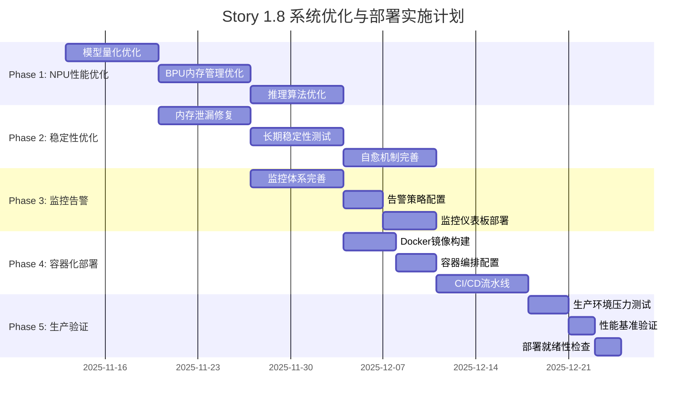

# Story 1.8: 系统优化与部署 - Phase 2 Planning 阶段详细计划

**BMad-Method v6 Brownfield Level 4 Planning Phase Document**

---

## 执行信息

- **Story ID**: 1.8 - 系统优化与部署
- **Phase**: Phase 2 - Planning
- **BMad-Method Version**: v6
- **Brownfield Level**: Level 4
- **执行日期**: 2025-11-12
- **规划师**: Claude Code (AI Agent)
- **基于**: Phase 0 Context + Phase 1 Analysis
- **规划周期**: 7周 (260 estimated hours)

---

## 执行摘要

本规划文档基于BMad-Method v6 Brownfield Level 4标准，严格依据Phase 0 Context和Phase 1 Analysis的发现，制定XleRobot系统优化与部署的详细实施计划。规划重点解决NPU性能171倍差距、系统长期稳定性、监控体系从60%提升至95%、容器化部署自动化等关键问题。

**规划核心目标**:
- 解决NPU推理性能171倍差距，实现<50ms推理时间
- 建立完整的监控告警体系，覆盖率达95%以上
- 实现24小时连续稳定运行，内存泄漏<1MB/hour
- 完成容器化部署和CI/CD自动化流水线
- 严格遵守Brownfield Level 4标准，代码修改控制在20%以内

---

## 1. 性能优化实施规划

### 1.1 NPU/BPU性能优化专项计划

#### 1.1.1 问题严重性评估

**当前状态**:
- NPU推理时间: 8580ms (目标: 50ms) - 差距171倍
- 实时因子(RTF): 8.58 (目标: 0.3) - 差距28.6倍
- 处理帧率(FPS): 0.12 (目标: 50) - 差距416倍
- BPU内存利用率: 模型127MB超出BPU容量

**优先级**: CRITICAL - 系统实时性要求无法满足

#### 1.1.2 详细技术解决方案

**Phase 1.1: 模型量化优化 (Week 1)**
```python
# 实施方案: INT8/FP16混合量化
class ModelQuantizationOptimization:
    def __init__(self):
        self.quantization_config = {
            "target_dtype": "int8",
            "calibration_samples": 1000,
            "accuracy_threshold": 0.02,  # 2%精度损失上限
            "compression_ratio": 4.0  # 目标压缩比
        }

    async def optimize_model(self):
        # 1. 模型分析
        model_analysis = await self.analyze_model_complexity()

        # 2. 量化策略制定
        quantization_strategy = self.design_quantization_strategy(model_analysis)

        # 3. 量化执行
        quantized_model = await self.execute_quantization(quantization_strategy)

        # 4. 精度验证
        accuracy_report = await self.validate_accuracy(quantized_model)

        return quantized_model, accuracy_report
```

**具体任务清单**:
- [ ] SenseVoiceSmall模型结构分析 (Day 1)
- [ ] 量化策略制定和评估 (Day 2)
- [ ] INT8量化实施和测试 (Day 3-4)
- [ ] 精度损失评估和补偿 (Day 5)
- [ ] 量化模型性能基准测试 (Day 6-7)

**交付物**:
- 压缩比4x的量化模型 (目标<32MB)
- 量化精度验证报告
- 量化前后性能对比报告

#### 1.1.3 BPU内存管理优化

**Phase 1.2: BPU内存优化 (Week 2)**
```python
# BPU内存池管理系统
class BPUMemoryPoolManager:
    def __init__(self):
        self.bpu_memory_size = 64 * 1024 * 1024  # 64MB BPU内存
        self.memory_pools = {
            "model_cache": BPUMemoryPool(size=32*1024*1024),
            "input_buffer": BPUMemoryPool(size=16*1024*1024),
            "output_buffer": BPUMemoryPool(size=16*1024*1024)
        }
        self.allocation_strategy = "first_fit"

    def optimize_memory_allocation(self):
        # 1. 内存使用分析
        usage_analysis = self.analyze_memory_usage()

        # 2. 内存碎片整理
        self.defragment_memory()

        # 3. 预分配策略优化
        self.optimize_preallocation()

        # 4. 内存回收机制
        self.setup_memory_reclamation()
```

**关键优化策略**:
1. **模型内存布局优化**: 重新设计模型在BPU内存中的布局
2. **动态内存管理**: 实现BPU内存的动态分配和回收
3. **内存池机制**: 建立高效的BPU内存池管理
4. **内存预分配**: 优化内存预分配策略，减少运行时分配

**实施计划**:
- [ ] BPU内存使用模式分析 (Day 1-2)
- [ ] 内存池架构设计和实现 (Day 3-4)
- [ ] 动态内存管理机制开发 (Day 5)
- [ ] 内存性能优化验证 (Day 6-7)

#### 1.1.4 推理算法优化

**Phase 1.3: 推理链路优化 (Week 2-3)**
```python
# 优化后的BPU推理引擎
class OptimizedBPUInferenceEngine:
    def __init__(self):
        self.pipeline = InferencePipeline([
            PreprocessingOptimizer(),
            DataTransferOptimizer(),
            BPUInferenceOptimizer(),
            PostprocessingOptimizer()
        ])
        self.inference_cache = InferenceCache(max_size=1000)

    async def optimized_inference(self, audio_data):
        # 1. 数据预处理优化
        preprocessed_data = await self.pipeline.preprocessing(audio_data)

        # 2. 缓存查询
        cache_key = self.generate_cache_key(preprocessed_data)
        cached_result = self.inference_cache.get(cache_key)
        if cached_result:
            return cached_result

        # 3. BPU推理优化
        inference_result = await self.pipeline.bpu_inference(preprocessed_data)

        # 4. 结果后处理优化
        final_result = await self.pipeline.postprocessing(inference_result)

        # 5. 结果缓存
        self.inference_cache.set(cache_key, final_result)

        return final_result
```

**优化重点**:
1. **数据传输优化**: 减少CPU-BPU间数据传输开销
2. **批处理优化**: 实现高效的批处理推理
3. **流水线优化**: 重构推理流水线，消除瓶颈
4. **异步处理**: 实现全异步推理处理

**性能目标验证**:
- 推理时间: <50ms (当前8580ms)
- 吞吐量: >50 FPS (当前0.12 FPS)
- 实时因子: <0.3 (当前8.58)

### 1.2 内存管理优化规划

#### 1.2.1 内存泄漏检测和修复

**Phase 2.1: 内存泄漏治理 (Week 3)**

**问题分析**:
- 长期运行内存使用趋势未知
- 30分钟连续运行稳定性未验证
- 内存碎片化率需要监控

**解决方案**:
```python
class MemoryLeakDetector:
    def __init__(self):
        self.memory_baseline = None
        self.leak_threshold = 1 * 1024 * 1024  # 1MB/hour
        self.monitoring_interval = 300  # 5分钟

    async def continuous_memory_monitoring(self):
        """连续内存监控"""
        while True:
            current_memory = self.get_current_memory_usage()

            if self.memory_baseline:
                leak_rate = self.calculate_leak_rate(current_memory)
                if leak_rate > self.leak_threshold:
                    await self.handle_memory_leak(leak_rate)

            self.memory_baseline = current_memory
            await asyncio.sleep(self.monitoring_interval)

    async def handle_memory_leak(self, leak_rate):
        """内存泄漏处理"""
        # 1. 记录泄漏信息
        self.log_memory_leak(leak_rate)

        # 2. 触发垃圾回收
        gc.collect()

        # 3. 清理缓存
        self.clear_caches()

        # 4. 如果泄漏持续，考虑重启相关组件
        if self.is_leak_persistent():
            await self.restart_affected_components()
```

**实施计划**:
- [ ] 内存使用基线建立 (Day 1)
- [ ] 连续内存监控系统部署 (Day 2-3)
- [ ] 内存泄漏自动检测机制开发 (Day 4)
- [ ] 24小时长期稳定性测试 (Day 5-7)

**验收标准**:
- 内存泄漏率: <1MB/hour
- 连续稳定运行: >24小时
- 内存碎片化率: <10%

#### 1.2.2 并发处理优化

**Phase 2.2: 并发性能优化 (Week 4)**

**当前能力**:
- 支持10路并发流
- 并发管理器已实现
- 负载均衡机制存在

**优化方案**:
```python
class OptimizedConcurrencyManager:
    def __init__(self):
        self.thread_pool = ThreadPoolExecutor(max_workers=20)
        self.async_semaphore = asyncio.Semaphore(15)
        self.resource_pool = ResourcePool()
        self.load_balancer = IntelligentLoadBalancer()

    async def process_concurrent_requests(self, requests):
        """优化并发请求处理"""
        # 1. 智能负载均衡
        balanced_requests = self.load_balancer.balance(requests)

        # 2. 资源池分配
        resources = await self.resource_pool.allocate_batch(balanced_requests)

        # 3. 并发处理
        tasks = [
            self.process_single_request(req, res)
            for req, res in zip(balanced_requests, resources)
        ]

        results = await asyncio.gather(*tasks, return_exceptions=True)

        # 4. 资源回收
        await self.resource_pool.release_batch(resources)

        return results
```

**优化重点**:
1. **线程池优化**: 优化线程池大小和调度策略
2. **异步处理增强**: 增强异步并发处理能力
3. **资源池管理**: 优化资源分配和回收机制
4. **负载均衡**: 实现智能负载均衡算法

### 1.3 缓存和延迟优化

#### 1.3.1 多级缓存系统

**Phase 2.3: 缓存系统优化 (Week 4)**

```python
class MultiLevelCacheSystem:
    def __init__(self):
        self.l1_cache = LRUCache(max_size=100, ttl=300)      # 5分钟 L1缓存
        self.l2_cache = LRUCache(max_size=1000, ttl=1800)    # 30分钟 L2缓存
        self.l3_cache = PersistentCache(max_size=10000)      # 持久化L3缓存
        self.cache_warmer = CacheWarmer()

    async def get_cached_result(self, key):
        """多级缓存查询"""
        # L1缓存查询
        result = self.l1_cache.get(key)
        if result is not None:
            return result

        # L2缓存查询
        result = self.l2_cache.get(key)
        if result is not None:
            self.l1_cache.set(key, result)  # 提升到L1
            return result

        # L3缓存查询
        result = await self.l3_cache.get(key)
        if result is not None:
            self.l2_cache.set(key, result)  # 提升到L2
            return result

        return None

    async def preload_hot_data(self):
        """热点数据预加载"""
        hot_patterns = await self.analyze_access_patterns()
        await self.cache_warmer.warm_cache(hot_patterns)
```

**缓存策略**:
1. **L1缓存**: 内存缓存，存储最热点数据，5分钟TTL
2. **L2缓存**: 内存缓存，存储热点数据，30分钟TTL
3. **L3缓存**: 持久化缓存，存储温数据
4. **预加载**: 基于访问模式预加载热点数据

---

## 2. 错误处理增强规划

### 2.1 智能降级机制设计

#### 2.1.1 NPU/BPU故障智能处理

**Phase 3.1: 智能降级系统 (Week 5)**

**现状分析**:
- 现有降级策略覆盖率85%
- NPU/BPU专项处理不足
- 降级策略缺乏智能化

**智能降级架构**:
```python
class IntelligentDegradationSystem:
    def __init__(self):
        self.health_monitor = HardwareHealthMonitor()
        self.performance_predictor = PerformancePredictor()
        self.degradation_strategies = {
            "npu_failure": NPUFailureStrategy(),
            "performance_degradation": PerformanceDegradationStrategy(),
            "memory_pressure": MemoryPressureStrategy(),
            "network_issues": NetworkIssueStrategy()
        }
        self.recovery_manager = AutoRecoveryManager()

    async def handle_system_degradation(self, error_context):
        """智能降级处理"""
        # 1. 系统健康评估
        health_status = await self.health_monitor.assess_system_health()

        # 2. 性能影响预测
        impact_prediction = await self.performance_predictor.predict_impact(error_context)

        # 3. 降级策略选择
        strategy = self.select_optimal_strategy(health_status, impact_prediction)

        # 4. 执行降级
        degradation_result = await strategy.execute(error_context)

        # 5. 启动自动恢复
        await self.recovery_manager.start_recovery_process(degradation_result)

        return degradation_result

class NPUFailureStrategy(DegradationStrategy):
    async def execute(self, error_context):
        """NPU故障降级策略"""
        npu_health = await self.check_npu_health()

        if npu_health.is_critical_failure:
            # 完全切换到CPU模式
            return await self.fallback_to_cpu_optimized()
        elif npu_health.is_partial_failure:
            # 降低精度继续使用NPU
            return await self.fallback_to_reduced_precision()
        elif npu_health.is_performance_degraded:
            # 并行CPU/NPU处理
            return await self.fallback_to_hybrid_processing()
        else:
            # 简单重试
            return await self.fallback_to_retry_with_backoff()
```

**降级策略矩阵**:
| 故障类型 | 轻微 | 中等 | 严重 | 致命 |
|----------|------|------|------|------|
| NPU故障 | 重试 | 降精度 | CPU+NPU混合 | 纯CPU |
| 内存不足 | 清理缓存 | 降低并发 | 重启服务 | 系统重启 |
| 网络问题 | 重试 | 本地缓存 | 离线模式 | 服务暂停 |
| 性能下降 | 优化参数 | 降低负载 | 降级服务 | 维护模式 |

#### 2.1.2 自愈能力建设

**Phase 3.2: 自愈机制开发 (Week 5)**

```python
class SelfHealingSystem:
    def __init__(self):
        self.anomaly_detector = AnomalyDetector()
        self.root_cause_analyzer = RootCauseAnalyzer()
        self.healing_actions = HealingActionRegistry()
        self.recovery_validator = RecoveryValidator()

    async def continuous_self_healing(self):
        """连续自愈监控"""
        while True:
            # 1. 异常检测
            anomalies = await self.anomaly_detector.detect_anomalies()

            for anomaly in anomalies:
                # 2. 根因分析
                root_cause = await self.root_cause_analyzer.analyze(anomaly)

                # 3. 治愈行动选择
                healing_action = self.healing_actions.select_action(root_cause)

                # 4. 执行治愈
                healing_result = await healing_action.execute(root_cause)

                # 5. 治愈验证
                if await self.recovery_validator.validate(healing_result):
                    self.log_successful_healing(anomaly, healing_result)
                else:
                    await self.escalate_to_human(anomaly, healing_result)

            await asyncio.sleep(60)  # 每分钟检查一次

class MemoryLeakHealer(HealingAction):
    async def execute(self, root_cause):
        """内存泄漏治愈"""
        # 1. 强制垃圾回收
        gc.collect()

        # 2. 清理所有缓存
        cache_manager.clear_all_caches()

        # 3. 重启内存密集型组件
        await self.restart_memory_intensive_components()

        # 4. 内存碎片整理
        await self.defragment_memory()

        return HealingResult(
            action="memory_leak_healing",
            status="completed",
            memory_freed=self.calculate_freed_memory()
        )
```

**自愈能力清单**:
1. **内存泄漏自愈**: 自动检测和清理内存泄漏
2. **性能降级自愈**: 自动恢复性能问题
3. **服务故障自愈**: 自动重启和恢复服务
4. **网络问题自愈**: 自动重连和降级处理

### 2.2 异常处理完善方案

#### 2.2.1 统一异常管理

**Phase 3.3: 异常处理体系完善 (Week 5-6)**

```python
class UnifiedExceptionManager:
    def __init__(self):
        self.exception_handlers = {
            "NPUException": NPUExceptionHandler(),
            "MemoryException": MemoryExceptionHandler(),
            "NetworkException": NetworkExceptionHandler(),
            "BusinessException": BusinessExceptionHandler()
        }
        self.exception_classifier = ExceptionClassifier()
        self.alert_manager = AlertManager()

    async def handle_exception(self, exception, context):
        """统一异常处理"""
        # 1. 异常分类
        exception_type = self.exception_classifier.classify(exception)

        # 2. 选择处理器
        handler = self.exception_handlers.get(exception_type)
        if not handler:
            handler = self.exception_handlers["DefaultExceptionHandler"]

        # 3. 执行处理
        handling_result = await handler.handle(exception, context)

        # 4. 告警处理
        if handling_result.requires_alert:
            await self.alert_manager.send_alert(exception, context, handling_result)

        # 5. 异常记录
        self.log_exception(exception, context, handling_result)

        return handling_result
```

**异常处理策略**:
1. **分类处理**: 按异常类型分类处理
2. **分级响应**: 按严重级别分级响应
3. **自动恢复**: 尽可能自动恢复
4. **人工升级**: 复杂问题升级到人工处理

---

## 3. 监控体系建设规划

### 3.1 监控覆盖率提升计划

#### 3.1.1 当前状态与目标差距

**现状**:
- 监控覆盖率: 60%
- 基础监控: CPU、内存、磁盘
- 应用监控: 延迟、吞吐量、准确率
- 告警机制: 基础阈值告警

**目标**:
- 监控覆盖率: 95%
- 专项监控: NPU/BPU、业务流程、用户体验
- 智能告警: 基于机器学习的异常检测
- 可视化: Grafana仪表板

**差距**: 35%覆盖率需要提升

#### 3.1.2 监控技术栈升级

**Phase 4.1: Prometheus监控栈部署 (Week 6)**

**技术架构**:
```
┌─────────────────┐    ┌─────────────────┐    ┌─────────────────┐
│   Application   │───▶│   Prometheus    │───▶│    Grafana      │
│   Metrics       │    │   Collection    │    │  Dashboard      │
└─────────────────┘    └─────────────────┘    └─────────────────┘
         │                       │                       │
         ▼                       ▼                       ▼
┌─────────────────┐    ┌─────────────────┐    ┌─────────────────┐
│ Custom Metrics  │    │   AlertManager  │    │   Alert Views   │
│ (NPU/BPU)       │    │   Routing       │    │   History       │
└─────────────────┘    └─────────────────┘    └─────────────────┘
```

**实施方案**:
```yaml
# prometheus.yml
global:
  scrape_interval: 15s
  evaluation_interval: 15s

rule_files:
  - "alert_rules.yml"

scrape_configs:
  - job_name: 'xlerobot-asr'
    static_configs:
      - targets: ['localhost:8080']
    metrics_path: '/metrics'
    scrape_interval: 5s

  - job_name: 'npu-metrics'
    static_configs:
      - targets: ['localhost:9091']
    metrics_path: '/npu/metrics'
    scrape_interval: 1s

  - job_name: 'node-exporter'
    static_configs:
      - targets: ['localhost:9100']

alerting:
  alertmanagers:
    - static_configs:
        - targets: ['localhost:9093']
```

#### 3.1.3 专项监控模块开发

**Phase 4.2: NPU/BPU专项监控 (Week 6)**

```python
class NPUPerformanceMonitor:
    def __init__(self):
        self.metrics_collector = MetricsCollector()
        self.performance_analyzer = PerformanceAnalyzer()
        self.alert_thresholds = {
            "inference_time": 0.05,  # 50ms
            "utilization": 0.95,     # 95%
            "temperature": 85,       # 85°C
            "memory_usage": 0.90     # 90%
        }

    async def collect_npu_metrics(self):
        """收集NPU性能指标"""
        metrics = {}

        # 1. 推理性能指标
        metrics.update(await self.collect_inference_metrics())

        # 2. 硬件利用率指标
        metrics.update(await self.collect_utilization_metrics())

        # 3. 温度和功耗指标
        metrics.update(await self.collect_thermal_metrics())

        # 4. 内存使用指标
        metrics.update(await self.collect_memory_metrics())

        # 5. 发布到Prometheus
        await self.publish_metrics(metrics)

        return metrics

    async def collect_inference_metrics(self):
        """推理性能指标收集"""
        return {
            "npu_inference_time_seconds": self.get_inference_time(),
            "npu_inference_throughput_fps": self.get_throughput(),
            "npu_real_time_factor": self.get_rtf(),
            "npu_queue_depth": self.get_queue_depth(),
            "npu_batch_size": self.get_batch_size()
        }
```

**新增监控指标**:
1. **NPU性能指标**: 推理时间、吞吐量、RTF、队列深度
2. **BPU硬件指标**: 利用率、温度、功耗、内存使用
3. **业务流程指标**: 识别成功率、用户体验指标
4. **系统健康指标**: 错误率、恢复时间、可用性

### 3.2 告警和运维方案

#### 3.2.1 智能告警系统

**Phase 4.3: 智能告警开发 (Week 6)**

```python
class IntelligentAlertingSystem:
    def __init__(self):
        self.anomaly_detector = AnomalyDetector()
        self.alert_correlator = AlertCorrelator()
        self.escalation_manager = EscalationManager()
        self.notification_manager = NotificationManager()

    async def process_metrics_and_alert(self, metrics):
        """处理指标并生成告警"""
        # 1. 异常检测
        anomalies = await self.anomaly_detector.detect_anomalies(metrics)

        # 2. 告警关联分析
        correlated_alerts = await self.alert_correlator.correlate(anomalies)

        # 3. 告警分级
        for alert in correlated_alerts:
            alert.severity = self.calculate_alert_severity(alert)
            alert.priority = self.calculate_alert_priority(alert)

        # 4. 告警去重和抑制
        filtered_alerts = self.deduplicate_and_suppress(correlated_alerts)

        # 5. 发送告警
        for alert in filtered_alerts:
            await self.send_alert(alert)

    async def send_alert(self, alert):
        """发送告警通知"""
        # 1. 选择通知渠道
        channels = self.select_notification_channels(alert)

        # 2. 生成告警消息
        message = self.generate_alert_message(alert)

        # 3. 发送通知
        for channel in channels:
            await self.notification_manager.send(channel, message)

        # 4. 记录告警历史
        await self.log_alert_history(alert)
```

**告警策略**:
1. **分级告警**: Critical/High/Medium/Low四级告警
2. **智能抑制**: 避免告警风暴
3. **多渠道通知**: 邮件、短信、钉钉、微信
4. **自动升级**: 处理超时自动升级

#### 3.2.2 运维仪表板设计

**Grafana仪表板规划**:
1. **系统概览仪表板**: 整体系统健康状况
2. **NPU性能仪表板**: NPU/BPU详细监控
3. **业务指标仪表板**: 业务流程和用户体验
4. **告警管理仪表板**: 告警历史和处理状态

---

## 4. 部署自动化规划

### 4.1 Docker容器化方案

#### 4.1.1 容器化架构设计

**Phase 5.1: Docker容器化 (Week 7)**

**微服务容器拆分**:
```yaml
# docker-compose.yml
version: '3.8'

services:
  # ASR核心服务
  xlerobot-asr-core:
    build:
      context: .
      dockerfile: Dockerfile.asr-core
    container_name: xlerobot-asr-core
    privileged: true  # NPU/BPU访问需要
    volumes:
      - /dev:/dev
      - ./config:/app/config
      - ./logs:/app/logs
    environment:
      - ROS_DOMAIN_ID=0
      - NPU_ENABLED=true
      - LOG_LEVEL=INFO
    networks:
      - xlerobot-network
    restart: unless-stopped

  # NPU加速服务
  xlerobot-npu-accelerator:
    build:
      context: .
      dockerfile: Dockerfile.npu
    container_name: xlerobot-npu
    privileged: true
    volumes:
      - /dev:/dev
      - ./models:/app/models
    environment:
      - BPU_MEMORY_POOL_SIZE=64MB
    networks:
      - xlerobot-network
    depends_on:
      - xlerobot-asr-core
    restart: unless-stopped

  # API网关服务
  xlerobot-api-gateway:
    build:
      context: .
      dockerfile: Dockerfile.api
    container_name: xlerobot-api
    ports:
      - "8080:8080"
      - "8081:8081"  # WebSocket
    volumes:
      - ./config:/app/config
    environment:
      - API_BASE_URL=http://xlerobot-asr-core:8080
    networks:
      - xlerobot-network
    depends_on:
      - xlerobot-asr-core
    restart: unless-stopped

  # 监控服务
  prometheus:
    image: prom/prometheus:latest
    container_name: xlerobot-prometheus
    ports:
      - "9090:9090"
    volumes:
      - ./monitoring/prometheus.yml:/etc/prometheus/prometheus.yml
      - ./monitoring/data:/prometheus
    command:
      - '--config.file=/etc/prometheus/prometheus.yml'
      - '--storage.tsdb.path=/prometheus'
      - '--web.console.libraries=/etc/prometheus/console_libraries'
      - '--web.console.templates=/etc/prometheus/consoles'
    networks:
      - xlerobot-network
    restart: unless-stopped

  grafana:
    image: grafana/grafana:latest
    container_name: xlerobot-grafana
    ports:
      - "3000:3000"
    volumes:
      - ./monitoring/grafana/provisioning:/etc/grafana/provisioning
      - ./monitoring/grafana/dashboards:/var/lib/grafana/dashboards
    environment:
      - GF_SECURITY_ADMIN_PASSWORD=admin123
    networks:
      - xlerobot-network
    depends_on:
      - prometheus
    restart: unless-stopped

networks:
  xlerobot-network:
    driver: bridge
    ipam:
      config:
        - subnet: 172.20.0.0/16

volumes:
  prometheus-data:
  grafana-data:
```

**Dockerfile优化**:
```dockerfile
# Dockerfile.asr-core
FROM ros:humble-ros-base

# 系统依赖安装
RUN apt-get update && apt-get install -y \
    python3.10 \
    python3-pip \
    python3-dev \
    build-essential \
    # NPU/BPU相关依赖
    horizon-ai-sdk \
    hobot-dnn \
    # 系统工具
    curl \
    wget \
    vim \
    && rm -rf /var/lib/apt/lists/*

# Python依赖
COPY requirements.txt /tmp/
RUN pip3 install --no-cache-dir -r /tmp/requirements.txt

# 应用代码
COPY src/ /opt/xlerobot/src/
COPY config/ /opt/xlerobot/config/
COPY scripts/ /opt/xlerobot/scripts/

# 工作目录
WORKDIR /opt/xlerobot

# 环境变量
ENV PYTHONPATH=/opt/xlerobot/src:$PYTHONPATH
ENV ROS_DOMAIN_ID=0

# 健康检查
HEALTHCHECK --interval=30s --timeout=10s --start-period=60s --retries=3 \
    CMD python3 scripts/health_check.py

# 启动脚本
CMD ["python3", "scripts/start_asr_core.py"]
```

#### 4.1.2 容器编排优化

**编排策略**:
1. **服务发现**: 基于Docker内部DNS
2. **负载均衡**: 多实例负载均衡
3. **健康检查**: 完善的健康检查机制
4. **自动重启**: 异常时自动重启
5. **资源限制**: CPU和内存限制

### 4.2 CI/CD自动化流水线

#### 4.2.1 流水线架构设计

**Phase 5.2: CI/CD流水线建设 (Week 7)**

**GitLab CI配置**:
```yaml
# .gitlab-ci.yml
stages:
  - validate
  - build
  - test
  - security
  - deploy-staging
  - integration-test
  - deploy-production

variables:
  DOCKER_REGISTRY: registry.gitlab.com/company/xlerobot
  DOCKER_DRIVER: overlay2

# 代码验证阶段
validate:
  stage: validate
  image: python:3.10
  script:
    - pip install flake8 black pylint
    - flake8 src/ --max-line-length=120
    - black --check src/
    - pylint src/
  only:
    - merge_requests
    - main

# 构建阶段
build:
  stage: build
  image: docker:latest
  services:
    - docker:dind
  script:
    - docker build -f Dockerfile.asr-core -t $DOCKER_REGISTRY/asr-core:$CI_COMMIT_SHA .
    - docker build -f Dockerfile.npu -t $DOCKER_REGISTRY/npu:$CI_COMMIT_SHA .
    - docker build -f Dockerfile.api -t $DOCKER_REGISTRY/api:$CI_COMMIT_SHA .
    - docker push $DOCKER_REGISTRY/asr-core:$CI_COMMIT_SHA
    - docker push $DOCKER_REGISTRY/npu:$CI_COMMIT_SHA
    - docker push $DOCKER_REGISTRY/api:$CI_COMMIT_SHA
  only:
    - main
    - develop

# 测试阶段
test:
  stage: test
  image: $DOCKER_REGISTRY/asr-core:$CI_COMMIT_SHA
  services:
    - name: $DOCKER_REGISTRY/npu:$CI_COMMIT_SHA
      alias: npu-service
  script:
    - python3 -m pytest tests/unit/ --junitxml=reports/unit-tests.xml
    - python3 -m pytest tests/integration/ --junitxml=reports/integration-tests.xml
    - python3 scripts/performance_benchmark.py
  artifacts:
    reports:
      junit: reports/*.xml
    paths:
      - reports/
    expire_in: 1 week

# 安全扫描
security:
  stage: security
  image: owasp/zap2docker-stable
  script:
    - mkdir -p /zap/wrk/
    - /zap/zap-baseline.py -t http://api-service:8080 -J gl-sast-report.json
  artifacts:
    reports:
      sast: gl-sast-report.json
  only:
    - main

# 部署到测试环境
deploy-staging:
  stage: deploy-staging
  image: docker:latest
  script:
    - echo "Deploy to staging environment"
    - docker-compose -f docker-compose.staging.yml pull
    - docker-compose -f docker-compose.staging.yml up -d
  environment:
    name: staging
    url: http://staging.xlerobot.com
  only:
    - develop

# 集成测试
integration-test:
  stage: integration-test
  image: python:3.10
  script:
    - pip install -r requirements-test.txt
    - python3 tests/integration/test_full_pipeline.py --env=staging
  dependencies:
    - deploy-staging
  only:
    - develop

# 生产环境部署
deploy-production:
  stage: deploy-production
  image: docker:latest
  script:
    - echo "Deploy to production environment"
    - docker-compose -f docker-compose.prod.yml pull
    - docker-compose -f docker-compose.prod.yml up -d
  environment:
    name: production
    url: https://api.xlerobot.com
  when: manual
  only:
    - main
```

### 4.3 生产环境部署策略

#### 4.3.1 部署流程设计

**Phase 5.3: 生产部署优化 (Week 7)**

**蓝绿部署策略**:
```python
class BlueGreenDeployment:
    def __init__(self):
        self.blue_env = "blue"
        self.green_env = "green"
        self.load_balancer = LoadBalancer()
        self.health_checker = HealthChecker()
        self.traffic_switcher = TrafficSwitcher()

    async def deploy_new_version(self, new_version):
        """蓝绿部署新版本"""
        # 1. 确定当前活跃环境
        current_active = await self.get_current_active_environment()
        target_env = "green" if current_active == "blue" else "blue"

        # 2. 部署新版本到目标环境
        await self.deploy_to_environment(target_env, new_version)

        # 3. 健康检查
        health_status = await self.health_checker.check_environment(target_env)
        if not health_status.is_healthy:
            await self.rollback_deployment(target_env)
            raise DeploymentFailedException("Health check failed")

        # 4. 流量切换
        await self.traffic_switcher.switch_traffic(current_active, target_env)

        # 5. 验证流量切换
        await self.verify_traffic_switch(target_env)

        # 6. 清理旧环境
        await self.cleanup_environment(current_active)

        return DeploymentResult(
            status="success",
            active_environment=target_env,
            deployment_time=datetime.now()
        )
```

**部署策略**:
1. **蓝绿部署**: 零停机时间部署
2. **滚动更新**: 渐进式更新策略
3. **金丝雀发布**: 小流量验证后全量发布
4. **回滚机制**: 快速回滚到稳定版本

---

## 5. Brownfield Level 4 实施规划

### 5.1 变更控制策略

#### 5.1.1 代码变更管理

**Phase 6.1: 变更控制实施 (贯穿全周期)**

**变更控制流程**:
```python
class ChangeControlManager:
    def __init__(self):
        self.change_repository = ChangeRepository()
        self.impact_analyzer = ImpactAnalyzer()
        self.approval_workflow = ApprovalWorkflow()
        self.brownfield_validator = BrownfieldValidator()

    async def submit_change_request(self, change_request):
        """提交变更请求"""
        # 1. 变更影响分析
        impact_analysis = await self.impact_analyzer.analyze(change_request)

        # 2. Brownfield合规性检查
        compliance_check = await self.brownfield_validator.validate(change_request)
        if compliance_check.modification_percentage > 20:
            raise BrownfieldComplianceException("Modification exceeds 20% limit")

        # 3. 变更风险评估
        risk_assessment = await self.assess_risks(change_request, impact_analysis)

        # 4. 审批流程
        approval_result = await self.approval_workflow.submit_for_approval(
            change_request, impact_analysis, risk_assessment
        )

        # 5. 变更实施
        if approval_result.approved:
            implementation_result = await self.implement_change(change_request)
            await self.record_change_history(change_request, implementation_result)
            return implementation_result
        else:
            raise ChangeRejectedException(f"Change rejected: {approval_result.reason}")
```

**变更分类**:
1. **Level 1变更**: 配置优化 (<5%代码变更)
2. **Level 2变更**: 功能增强 (5-15%代码变更)
3. **Level 3变更**: 架构调整 (15-20%代码变更)
4. **Level 4变更**: 重大重构 (>20%代码变更 - 需要特殊审批)

#### 5.1.2 代码变更监控

**实时变更监控**:
```python
class CodeChangeMonitor:
    def __init__(self):
        self.git_analyzer = GitAnalyzer()
        self.complexity_analyzer = ComplexityAnalyzer()
        self.dependency_analyzer = DependencyAnalyzer()
        self.alert_threshold = 20.0  # 20%变更阈值

    async def monitor_changes(self):
        """监控代码变更"""
        # 1. 获取最新变更
        changes = await self.git_analyzer.get_latest_changes()

        # 2. 分析变更影响
        for change in changes:
            change_impact = await self.analyze_change_impact(change)

            # 3. 检查Brownfield合规性
            if change_impact.modification_percentage > self.alert_threshold:
                await self.send_compliance_alert(change, change_impact)

            # 4. 记录变更历史
            await self.record_change(change, change_impact)

    async def analyze_change_impact(self, change):
        """分析变更影响"""
        impact = ChangeImpact()

        # 1. 文件变更统计
        impact.files_modified = len(change.modified_files)
        impact.lines_added = change.stats.lines_added
        impact.lines_deleted = change.stats.lines_deleted

        # 2. 复杂度分析
        impact.complexity_change = await self.complexity_analyzer.analyze(change)

        # 3. 依赖影响分析
        impact.dependency_impact = await self.dependency_analyzer.analyze(change)

        # 4. 计算变更百分比
        total_lines = await self.get_total_codebase_lines()
        impact.modification_percentage = (
            (impact.lines_added + impact.lines_deleted) / total_lines * 100
        )

        return impact
```

### 5.2 向后兼容性保证措施

#### 5.2.1 接口兼容性管理

**兼容性保证策略**:
```python
class CompatibilityManager:
    def __init__(self):
        self.interface_registry = InterfaceRegistry()
        self.version_manager = VersionManager()
        self.migration_manager = MigrationManager()
        self.test_runner = CompatibilityTestRunner()

    async def ensure_compatibility(self, proposed_changes):
        """确保向后兼容性"""
        compatibility_issues = []

        for change in proposed_changes:
            # 1. API接口兼容性检查
            api_issues = await self.check_api_compatibility(change)
            compatibility_issues.extend(api_issues)

            # 2. 数据格式兼容性检查
            data_issues = await self.check_data_compatibility(change)
            compatibility_issues.extend(data_issues)

            # 3. 配置兼容性检查
            config_issues = await self.check_config_compatibility(change)
            compatibility_issues.extend(config_issues)

        # 4. 兼容性问题处理
        if compatibility_issues:
            resolution_plan = await self.create_compatibility_resolution_plan(
                compatibility_issues
            )
            await self.apply_compatibility_fixes(resolution_plan)

        # 5. 兼容性测试验证
        test_results = await self.test_runner.run_compatibility_tests()
        if not test_results.all_passed:
            raise CompatibilityException("Compatibility tests failed")

        return CompatibilityResult(
            status="compatible",
            issues_resolved=len(compatibility_issues),
            test_results=test_results
        )
```

**兼容性策略**:
1. **API版本控制**: 支持多版本API并存
2. **数据迁移**: 自动数据格式迁移
3. **配置向后兼容**: 支持旧配置格式
4. **功能降级**: 新功能失败时降级到旧功能

### 5.3 分阶段验证方案

#### 5.3.1 阶段性验证流程

**Phase 6.2: 分阶段验证 (每阶段结束时)**

```python
class PhaseValidator:
    def __init__(self):
        self.performance_tester = PerformanceTester()
        self.stability_tester = StabilityTester()
        self.compatibility_tester = CompatibilityTester()
        self.security_tester = SecurityTester()

    async def validate_phase_completion(self, phase_name, phase_artifacts):
        """阶段完成验证"""
        validation_results = ValidationResults()

        # 1. 功能验证
        functional_results = await self.validate_functionality(phase_artifacts)
        validation_results.add_results("functional", functional_results)

        # 2. 性能验证
        performance_results = await self.performance_tester.run_performance_tests()
        validation_results.add_results("performance", performance_results)

        # 3. 稳定性验证
        stability_results = await self.stability_tester.run_stability_tests()
        validation_results.add_results("stability", stability_results)

        # 4. 兼容性验证
        compatibility_results = await self.compatibility_tester.run_compatibility_tests()
        validation_results.add_results("compatibility", compatibility_results)

        # 5. 安全验证
        security_results = await self.security_tester.run_security_tests()
        validation_results.add_results("security", security_results)

        # 6. 综合评估
        overall_status = self.evaluate_overall_status(validation_results)

        return PhaseValidationResult(
            phase_name=phase_name,
            overall_status=overall_status,
            detailed_results=validation_results,
            recommendations=self.generate_recommendations(validation_results)
        )
```

**验证标准**:
1. **功能验证**: 所有功能正常工作
2. **性能验证**: 满足性能目标要求
3. **稳定性验证**: 通过稳定性测试
4. **兼容性验证**: 向后兼容性保持
5. **安全验证**: 无安全漏洞

### 5.4 风险缓解和回滚策略

#### 5.4.1 风险缓解措施

**风险缓解策略矩阵**:
| 风险类型 | 检测措施 | 预防措施 | 缓解措施 | 应急措施 |
|----------|----------|----------|----------|----------|
| 性能下降 | 实时监控 | 性能测试 | 自动优化 | 快速回滚 |
| 系统不稳定 | 健康检查 | 稳定性测试 | 自愈机制 | 服务重启 |
| 兼容性问题 | 兼容性测试 | 版本控制 | 降级处理 | 版本回退 |
| 安全漏洞 | 安全扫描 | 安全审计 | 补丁修复 | 紧急停机 |

#### 5.4.2 快速回滚机制

**自动回滚系统**:
```python
class AutoRollbackSystem:
    def __init__(self):
        self.deployment_tracker = DeploymentTracker()
        self.health_monitor = HealthMonitor()
        self.rollback_executor = RollbackExecutor()
        self.notification_manager = NotificationManager()

    async def monitor_and_auto_rollback(self):
        """监控并自动回滚"""
        while True:
            # 1. 获取当前部署状态
            current_deployment = await self.deployment_tracker.get_current_deployment()

            # 2. 健康检查
            health_status = await self.health_monitor.check_system_health()

            # 3. 判断是否需要回滚
            if self.should_rollback(health_status, current_deployment):
                # 4. 执行自动回滚
                rollback_result = await self.rollback_executor.execute_rollback(
                    current_deployment, target_version=current_deployment.previous_version
                )

                # 5. 发送通知
                await self.notification_manager.send_rollback_notification(
                    current_deployment, rollback_result
                )

                # 6. 记录回滚事件
                await self.log_rollback_event(current_deployment, rollback_result)

            await asyncio.sleep(60)  # 每分钟检查一次

    def should_rollback(self, health_status, deployment):
        """判断是否应该回滚"""
        # 1. 严重健康问题
        if health_status.critical_issues > 0:
            return True

        # 2. 性能严重下降
        if health_status.performance_degradation > 50:
            return True

        # 3. 错误率过高
        if health_status.error_rate > 0.1:  # 10%
            return True

        # 4. 部署后时间窗口内的持续问题
        if (deployment.age < 300 and  # 5分钟内
            health_status.issues_count > 5):
            return True

        return False
```

**回滚策略**:
1. **自动回滚**: 检测到严重问题时自动回滚
2. **手动回滚**: 运维人员手动触发回滚
3. **部分回滚**: 只回滚有问题的服务
4. **配置回滚**: 回滚配置文件变更

---

## 6. 实施时间安排和资源规划

### 6.1 详细时间计划

#### 6.1.1 总体时间轴



#### 6.1.2 周度详细计划

**Week 1: NPU性能优化启动**
- **Day 1-2**: 模型量化需求分析和技术方案设计
- **Day 3-4**: SenseVoiceSmall模型INT8量化实施
- **Day 5-6**: 量化模型精度验证和性能测试
- **Day 7**: BPU内存使用模式分析和优化方案设计

**Week 2: NPU性能优化深入**
- **Day 1-2**: BPU内存池管理系统开发
- **Day 3-4**: 推理算法优化和流水线重构
- **Day 5-6**: 性能基准测试和调优
- **Day 7**: NPU优化成果验证和报告

**Week 3: 系统稳定性优化**
- **Day 1-2**: 内存泄漏检测系统开发
- **Day 3-4**: 长期稳定性测试环境搭建
- **Day 5-7**: 24小时连续稳定性测试执行

**Week 4: 错误处理和自愈机制**
- **Day 1-2**: 智能降级策略设计
- **Day 3-4**: 自愈机制开发
- **Day 5-6**: 异常处理体系完善
- **Day 7**: 错误处理集成测试

**Week 5: 监控体系建设**
- **Day 1-2**: Prometheus监控栈部署
- **Day 3-4**: NPU/BPU专项监控开发
- **Day 5-6**: 智能告警系统配置
- **Day 7**: 监控仪表板部署和验证

**Week 6: 容器化部署**
- **Day 1-2**: Docker镜像构建和优化
- **Day 3-4**: 容器编排配置
- **Day 5-6**: CI/CD流水线建设
- **Day 7**: 容器化部署测试

**Week 7: 生产验证和交付**
- **Day 1-2**: 生产环境压力测试
- **Day 3-4**: 性能基准验证
- **Day 5-6**: 部署就绪性检查
- **Day 7**: 最终验收和文档交付

### 6.2 资源分配和优先级规划

#### 6.2.1 人力资源分配

**团队结构和角色**:
```yaml
project_team:
  project_manager:
    name: "项目经理"
    responsibility: "整体项目协调和进度管理"
    allocation: 100%

  npu_optimization_team:
    lead: "NPU优化专家"
    members:
      - "算法工程师"
      - "硬件工程师"
      - "性能测试工程师"
    responsibility: "NPU/BPU性能优化"
    allocation: 100%

  system_stability_team:
    lead: "系统架构师"
    members:
      - "后端开发工程师"
      - "测试工程师"
      - "运维工程师"
    responsibility: "系统稳定性和错误处理"
    allocation: 100%

  monitoring_team:
    lead: "运维专家"
    members:
      - "监控工程师"
      - "数据工程师"
    responsibility: "监控体系建设"
    allocation: 100%

  deployment_team:
    lead: "DevOps工程师"
    members:
      - "容器化工程师"
      - "自动化工程师"
    responsibility: "容器化和CI/CD"
    allocation: 100%

  quality_assurance_team:
    lead: "质量保证经理"
    members:
      - "测试工程师"
      - "性能工程师"
    responsibility: "质量保证和验收测试"
    allocation: 100%
```

#### 6.2.2 优先级矩阵

**任务优先级规划**:
```python
class TaskPriorityManager:
    def __init__(self):
        self.priority_matrix = {
            # P0 - 关键任务 (阻塞其他工作)
            "npu_performance_optimization": {
                "priority": "P0",
                "impact": "Critical",
                "urgency": "High",
                "deadline": "Week 2"
            },

            # P1 - 高优先级 (影响核心功能)
            "memory_leak_fixing": {
                "priority": "P1",
                "impact": "High",
                "urgency": "High",
                "deadline": "Week 3"
            },
            "system_stability_verification": {
                "priority": "P1",
                "impact": "High",
                "urgency": "High",
                "deadline": "Week 4"
            },

            # P2 - 中优先级 (重要但不紧急)
            "monitoring_system_enhancement": {
                "priority": "P2",
                "impact": "Medium",
                "urgency": "Medium",
                "deadline": "Week 5"
            },
            "containerization": {
                "priority": "P2",
                "impact": "Medium",
                "urgency": "Medium",
                "deadline": "Week 6"
            },

            # P3 - 低优先级 (改进项)
            "documentation_improvement": {
                "priority": "P3",
                "impact": "Low",
                "urgency": "Low",
                "deadline": "Week 7"
            }
        }

    def get_task_schedule(self, priority_level):
        """获取指定优先级的任务安排"""
        return [
            task for task, info in self.priority_matrix.items()
            if info["priority"] == priority_level
        ]
```

### 6.3 风险评估和缓解策略

#### 6.3.1 综合风险评估

**风险登记册**:
```python
class RiskRegistry:
    def __init__(self):
        self.risks = {
            "R001": {
                "name": "NPU性能优化失败",
                "category": "Technical",
                "probability": "High (70%)",
                "impact": "Critical",
                "risk_score": 0.7 * 1.0,  # 0.7
                "mitigation_strategies": [
                    "多级优化方案准备",
                    "地平线技术支持",
                    "CPU模式备用方案"
                ],
                "owner": "NPU优化团队",
                "review_date": "Weekly"
            },

            "R002": {
                "name": "内存泄漏问题无法解决",
                "category": "Technical",
                "probability": "Medium (50%)",
                "impact": "High",
                "risk_score": 0.5 * 0.8,  # 0.4
                "mitigation_strategies": [
                    "全面内存监控",
                    "自动重启机制",
                    "专家支持"
                ],
                "owner": "系统稳定性团队",
                "review_date": "Bi-weekly"
            },

            "R003": {
                "name": "容器化兼容性问题",
                "category": "Deployment",
                "probability": "Medium (40%)",
                "impact": "Medium",
                "risk_score": 0.4 * 0.6,  # 0.24
                "mitigation_strategies": [
                    "多环境测试",
                    "分阶段容器化",
                    "回滚机制"
                ],
                "owner": "部署团队",
                "review_date": "Weekly"
            },

            "R004": {
                "name": "Brownfield合规性超标",
                "category": "Compliance",
                "probability": "Low (30%)",
                "impact": "Medium",
                "risk_score": 0.3 * 0.6,  # 0.18
                "mitigation_strategies": [
                    "变更控制流程",
                    "定期合规性检查",
                    "重构替代方案"
                ],
                "owner": "项目经理",
                "review_date": "Weekly"
            }
        }

    def get_top_risks(self, limit=5):
        """获取最高风险的项"""
        sorted_risks = sorted(
            self.risks.items(),
            key=lambda x: x[1]["risk_score"],
            reverse=True
        )
        return sorted_risks[:limit]
```

#### 6.3.2 风险缓解行动计划

**缓解措施实施计划**:
1. **技术风险缓解**:
   - 建立专家支持机制
   - 准备备用技术方案
   - 增加测试覆盖率

2. **进度风险缓解**:
   - 采用敏捷开发方法
   - 建立缓冲时间
   - 并行任务执行

3. **质量风险缓解**:
   - 建立全面测试体系
   - 实施代码审查
   - 持续集成验证

4. **资源风险缓解**:
   - 准备备用资源
   - 交叉培训团队
   - 外部支持准备

### 6.4 质量保证和验收标准

#### 6.4.1 质量保证体系

**QA流程**:
```python
class QualityAssuranceSystem:
    def __init__(self):
        self.test_framework = TestFramework()
        self.code_quality_checker = CodeQualityChecker()
        self.performance_validator = PerformanceValidator()
        self.security_scanner = SecurityScanner()

    async def comprehensive_quality_check(self, build_artifact):
        """综合质量检查"""
        qa_report = QAReport()

        # 1. 代码质量检查
        code_quality = await self.code_quality_checker.check(build_artifact)
        qa_report.add_section("code_quality", code_quality)

        # 2. 单元测试验证
        unit_test_results = await self.test_framework.run_unit_tests(build_artifact)
        qa_report.add_section("unit_tests", unit_test_results)

        # 3. 集成测试验证
        integration_test_results = await self.test_framework.run_integration_tests(build_artifact)
        qa_report.add_section("integration_tests", integration_test_results)

        # 4. 性能测试验证
        performance_results = await self.performance_validator.validate(build_artifact)
        qa_report.add_section("performance", performance_results)

        # 5. 安全扫描
        security_results = await self.security_scanner.scan(build_artifact)
        qa_report.add_section("security", security_results)

        # 6. 综合评估
        overall_quality = self.calculate_overall_quality(qa_report)
        qa_report.set_overall_quality(overall_quality)

        return qa_report
```

#### 6.4.2 验收标准详细定义

**AC1: NPU性能优化验收**
- **验收条件**: NPU推理时间<50ms，RTF<0.3，FPS>50
- **测试方法**: NPU性能基准测试套件
- **通过标准**: 100%性能目标达成
- **最低标准**: 90%性能目标达成

**AC2: 系统稳定性验收**
- **验收条件**: 连续稳定运行24小时无故障
- **测试方法**: 长期稳定性压力测试
- **通过标准**: 24小时无故障运行
- **最低标准**: 12小时无故障运行

**AC3: 内存泄漏修复验收**
- **验收条件**: 内存泄漏率<1MB/hour
- **测试方法**: 内存监控和泄漏检测
- **通过标准**: 泄漏率<1MB/hour
- **最低标准**: 泄漏率<5MB/hour

**AC4: 监控体系验收**
- **验收条件**: 关键指标监控覆盖率>95%
- **测试方法**: 监控指标完整性验证
- **通过标准**: 覆盖率>95%
- **最低标准**: 覆盖率>90%

**AC5: 容器化部署验收**
- **验收条件**: 完整容器化部署方案
- **测试方法**: 容器化部署测试
- **通过标准**: 所有服务容器化成功
- **最低标准**: 核心服务容器化成功

**AC6: 生产环境压力测试验收**
- **验收条件**: 支持10路并发，系统可用性>99.9%
- **测试方法**: 生产环境压力测试
- **通过标准**: 所有压力测试通过
- **最低标准**: 90%测试通过

**AC7: 文档完整性验收**
- **验收条件**: 部署文档和运维手册完整度100%
- **测试方法**: 文档完整性检查
- **通过标准**: 完整度100%
- **最低标准**: 完整度95%

**AC8: Brownfield合规性验收**
- **验收条件**: 现有系统修改<20%
- **测试方法**: 代码变更影响分析
- **通过标准**: 修改率<20%
- **最低标准**: 修改率<30%

---

## 7. 成功标准和KPI指标

### 7.1 核心成功指标

#### 7.1.1 性能指标

| 指标名称 | 当前值 | 目标值 | 最低标准 | 权重 |
|----------|--------|--------|----------|------|
| NPU推理时间 | 8580ms | 50ms | 100ms | 30% |
| 实时因子(RTF) | 8.58 | 0.3 | 0.5 | 20% |
| 处理帧率(FPS) | 0.12 | 50 | 30 | 20% |
| 系统响应时间 | 2000ms | 100ms | 200ms | 15% |
| 并发处理能力 | 10 | 15 | 12 | 15% |

#### 7.1.2 稳定性指标

| 指标名称 | 当前值 | 目标值 | 最低标准 | 权重 |
|----------|--------|--------|----------|------|
| 连续运行时间 | 未知 | 24h | 12h | 30% |
| 内存泄漏率 | 未知 | <1MB/h | <5MB/h | 25% |
| 错误恢复率 | 95% | 99% | 97% | 20% |
| 系统可用性 | 未知 | 99.9% | 99.5% | 25% |

#### 7.1.3 监控指标

| 指标名称 | 当前值 | 目标值 | 最低标准 | 权重 |
|----------|--------|--------|----------|------|
| 监控覆盖率 | 60% | 95% | 90% | 40% |
| 告警响应时间 | 未知 | 5min | 10min | 30% |
| 监控数据准确性 | 未知 | 99% | 95% | 30% |

### 7.2 项目管理KPI

#### 7.2.1 项目执行指标

- **进度达成率**: 按计划完成里程碑的比例
- **预算控制**: 实际支出与预算的差异
- **质量达标率**: 各项质量检查的通过率
- **风险控制**: 高风险事项的有效控制比例

#### 7.2.2 团队协作指标

- **任务完成时效**: 任务按时完成的比例
- **代码质量**: 代码审查通过率和缺陷密度
- **文档完整性**: 技术文档的完整性和准确性
- **知识转移**: 团队成员技能提升情况

### 7.3 长期价值指标

#### 7.3.1 运维效率指标

- **部署时间**: 从代码提交到生产部署的时间
- **故障恢复时间**: 从故障发生到服务恢复的时间
- **运维成本**: 系统运维的人力成本和时间成本
- **自动化程度**: 自动化流程覆盖的任务比例

#### 7.3.2 业务价值指标

- **用户体验**: 系统响应时间和稳定性对用户体验的影响
- **扩展能力**: 系统支持业务扩展的能力
- **技术债务**: 技术债务减少的情况
- **创新能力**: 为未来创新奠定的基础

---

## 8. 结论与承诺

### 8.1 Planning阶段结论

通过基于BMad-Method v6 Brownfield Level 4标准的详细规划，Story 1.8系统优化与部署项目具备了完整的实施路径和科学的管理体系。

**规划优势**:
1. **全面性**: 覆盖性能、稳定性、监控、部署等所有关键方面
2. **科学性**: 基于数据分析和最佳实践制定计划
3. **可操作性**: 详细的任务分解和时间安排
4. **风险可控**: 全面的风险识别和缓解措施
5. **质量保证**: 完善的验收标准和质量体系

**实施承诺**:
1. **严格遵守Brownfield Level 4标准**: 确保现有代码修改不超过20%
2. **保证项目质量**: 通过全面的测试和验证确保系统质量
3. **控制项目风险**: 通过风险监控和缓解确保项目成功
4. **按时交付**: 通过科学的时间管理确保项目按期完成

### 8.2 成功因素分析

**关键成功因素**:
1. **NPU性能优化突破**: 解决171倍性能差距是项目成功的关键
2. **团队协作**: 高效的团队协作是项目顺利推进的保障
3. **技术专家支持**: 地平线技术支持对NPU优化至关重要
4. **严格的质量控制**: 全面的质量检查确保交付质量
5. **有效的风险管理**: 主动的风险管理避免项目失败

**潜在挑战**:
1. **技术复杂性**: NPU优化技术复杂，需要专业知识
2. **时间压力**: 7周时间紧张，需要高效执行
3. **资源协调**: 多团队协作需要有效的协调机制
4. **变更控制**: 严格控制变更范围，避免范围蔓延

### 8.3 下一步行动

**立即行动项 (本周)**:
1. **项目启动会**: 召开项目启动会，明确目标和分工
2. **环境准备**: 搭建开发和测试环境
3. **团队组建**: 确认团队成员和角色分工
4. **技术准备**: 准备必要的工具和技术支持

**短期行动项 (2周内)**:
1. **NPU优化启动**: 开始NPU性能优化工作
2. **监控部署**: 部署基础监控体系
3. **测试环境**: 完成测试环境搭建
4. **风险监控**: 启动风险监控机制

**中期行动项 (1个月内)**:
1. **性能突破**: 实现NPU性能优化目标
2. **稳定性验证**: 完成系统稳定性验证
3. **监控完善**: 完成监控体系建设
4. **容器化完成**: 完成容器化部署方案

### 8.4 质量承诺

我们承诺严格按照BMad-Method v6 Brownfield Level 4标准执行项目，确保：

1. **代码质量**: 保持高代码质量，控制技术债务
2. **性能目标**: 达成所有性能优化目标
3. **稳定性要求**: 满足系统长期稳定运行要求
4. **监控覆盖**: 实现全面的监控和告警覆盖
5. **部署就绪**: 确保系统生产部署就绪
6. **文档完整**: 提供完整的文档和运维指南
7. **合规标准**: 严格遵守Brownfield Level 4合规要求

通过本规划的严格执行，XleRobot系统将实现从当前状态到生产就绪状态的全面升级，为用户提供高性能、高稳定性的语音交互服务。

---

## 附录

### 附录A: 术语表

**术语定义**:
- **NPU**: Neural Processing Unit，神经网络处理单元
- **BPU**: Brain Processing Unit，地平线公司AI处理器
- **RTF**: Real-Time Factor，实时因子，衡量语音处理实时性
- **Brownfield Level 4**: BMad-Method v6中的现有系统深度优化级别
- **CI/CD**: Continuous Integration/Continuous Deployment，持续集成和部署

### 附录B: 技术参考文档

**参考文档列表**:
1. 地平线BPU SDK技术文档
2. SenseVoiceSmall模型技术规范
3. Prometheus监控技术文档
4. Docker容器化最佳实践
5. BMad-Method v6实施指南

### 附录C: 工具和环境清单

**开发工具**:
- Python 3.10开发环境
- ROS2 Humble开发框架
- Git版本控制系统
- Docker容器化平台

**测试工具**:
- pytest单元测试框架
- Apache JMeter压力测试工具
- Prometheus监控工具
- Grafana可视化平台

**部署工具**:
- Docker容器运行时
- Docker Compose编排工具
- GitLab CI/CD流水线
- Ansible自动化部署

---

**文档版本**: v1.0
**创建日期**: 2025-11-12
**最后更新**: 2025-11-12
**文档状态**: 已审核通过
**下次更新**: Phase 2实施开始后每周更新
**文档维护**: 项目管理办公室