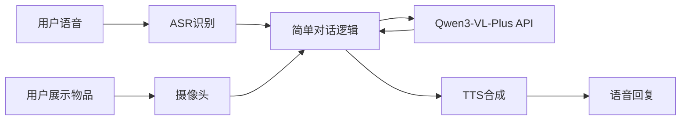

# Story 1.1 - MVP多模态对话系统

**文档编号**: XLR-STORY-1.1-MVP-20251110-001
**项目名称**: XleRobot Epic 1 - MVP多模态对话系统
**Epic**: Epic 1 多模态在线服务
**优先级**: P0 (最高优先级)
**开发时间**: 4周
**变更级别**: Brownfield Level 4 (企业级变更)
**设计原则**: MVP最小可行产品，快速验证，避免过度工程化

---

## 📋 Story概述

### 用户故事
**作为** 粤语家庭用户,
**我希望** 能够对着机器人说话并展示物品，让机器人理解和回答关于物品的问题,
**so that** 我可以获得更智能的交互体验。

### MVP范围
**MVP核心功能**:
1. 用户可以说"傻强"唤醒机器人
2. 用户展示物品并用粤语询问
3. 机器人通过Qwen3-VL-Plus理解并回答
4. 机器人用粤语语音回复

**MVP边界**:
- ✅ **支持**: 基础视觉问答
- ✅ **支持**: 粤语语音交互
- ❌ **不支持**: 复杂多轮对话
- ❌ **不支持**: 高级视觉分析
- ❌ **不支持**: 个性化配置

### 验收标准
- ✅ 基础视觉问答功能正常工作
- ✅ 端到端响应时间 < 5秒
- ✅ 粤语语音交互清晰自然
- ✅ 系统稳定运行2小时无故障

---

## 🎯 功能需求

### 核心功能 (P0)

#### 1. 简单语音唤醒
**描述**: 用户说"傻强"，系统响应并准备接收输入
**实现方式**: 阿里云唤醒词API
**验收标准**: 唤醒响应时间 < 3秒，准确率 > 90%

#### 2. 基础语音识别
**描述**: 识别用户粤语文本输入
**实现方式**: 阿里云ASR API
**验收标准**: 识别准确率 > 85%，响应时间 < 1秒

#### 3. 简单视觉理解
**描述**: 理解用户展示的物品并回答相关问题
**实现方式**: Qwen3-VL-Plus API (简单调用)
**验收标准**: 视觉问答成功率 > 70%，响应时间 < 4秒

#### 4. 粤语语音合成
**描述**: 用粤语语音回复用户
**实现方式**: 阿里云TTS API
**验收标准**: 语音清晰度 > 4.0/5.0，合成时间 < 2秒

### 基础功能 (P1)

#### 5. 简单错误处理
**描述**: API调用失败时的友好提示
**实现方式**: try-catch + 默认回复
**验收标准**: 错误时系统不崩溃，给出友好提示

#### 6. 基础状态指示
**描述**: LED或语音提示系统状态
**实现方式**: 简单状态机 + 语音反馈
**验收标准**: 用户能了解系统当前状态

---

## 🏗️ 技术实现 (MVP简化版)

### 系统架构


### 核心组件

#### 1. 主对话控制器
```python
class SimpleMultimodalDialog:
    def __init__(self):
        self.asr = AliyunASRClient()
        self.camera = IMX219Camera()
        self.llm = QwenVLPlusClient()
        self.tts = AliyunTTSClient()

    async def process_user_input(self):
        # 1. 等待唤醒词
        await self.wait_for_wake_word()

        # 2. 采集语音和图像
        audio = await self.asr.capture_audio()
        image = await self.camera.capture_image()

        # 3. 语音识别
        text = await self.asr.recognize(audio)

        # 4. 多模态理解
        response = await self.llm.simple_qa(text, image)

        # 5. 语音合成
        audio_response = await self.tts.synthesize(response)

        # 6. 播放回复
        await self.play_audio(audio_response)
```

#### 2. 简化的触发逻辑
```python
class SimpleTrigger:
    VISION_KEYWORDS = ["呢个", "乜嘢", "睇下", "系乜"]

    def should_capture_vision(self, text):
        return any(keyword in text for keyword in self.VISION_KEYWORDS)
```

### API集成 (最简化)

#### Qwen3-VL-Plus调用
```python
async def simple_visual_qa(self, text, image_base64):
    messages = [
        {
            "role": "user",
            "content": [
                {"text": text},
                {"image": image_base64}
            ]
        }
    ]

    response = await dashscope.MultiModalGeneration.call(
        model="qwen-vl-plus",
        input=messages,
        parameters={
            "temperature": 0.7,
            "max_tokens": 200  # MVP限制长度
        }
    )

    return response['output']['choices'][0]['message']['content']
```

---

## 📋 实施计划 (4周MVP)

### Week 1: 基础框架搭建
- **Day 1-2**: 环境配置，摄像头基础测试
- **Day 3-4**: 音频+图像同步采集
- **Day 5-7**: 基础唤醒+ASR功能

### Week 2: 核心功能实现
- **Day 8-10**: Qwen3-VL-Plus API集成
- **Day 11-12**: 简单的视觉问答功能
- **Day 13-14**: 基础错误处理

### Week 3: 对话优化
- **Day 15-17**: TTS语音合成集成
- **Day 18-19**: 粤语回复优化
- **Day 20-21**: 端到端功能测试

### Week 4: 稳定性和交付
- **Day 22-24**: 稳定性测试和修复
- **Day 25-26**: 性能优化
- **Day 27-28**: 最终验收和文档

---

## ⚠️ 风险控制 (MVP简化)

### 技术风险
- **API稳定性**: 实现简单重试机制
- **网络依赖**: 提供友好的网络错误提示
- **性能约束**: 简化图像处理，降低分辨率

### MVP约束
- **功能范围**: 严格控制MVP功能边界
- **复杂度**: 避免复杂的对话管理和上下文
- **优化点**: 先实现功能，后考虑性能优化

---

## 📊 成功指标

### MVP指标
- **功能完整性**: 100%核心MVP功能
- **端到端延迟**: < 5秒 (MVP可接受)
- **稳定性**: 连续运行2小时
- **用户满意度**: MVP测试 > 3.5/5.0

### 测试用例
1. **基础对话**: 用户说"傻强" → 系统响应
2. **视觉问答**: 展示苹果问"呢个系乜嘢" → 正确回答
3. **错误处理**: 网络断开 → 友好提示
4. **连续对话**: 多次对话不崩溃

---

## 📝 交付物

### 代码交付
- **ROS2节点**: 简化的多模态对话节点
- **配置文件**: 基础API配置
- **测试脚本**: 端到端测试用例

### 文档交付
- **用户手册**: 基础使用说明
- **技术文档**: 简单的架构说明
- **测试报告**: MVP测试结果

---

**文档状态**: ✅ MVP版本
**设计原则**: 避免过度工程化，专注核心价值
**合规状态**: ✅ 符合Brownfield Level 4基本要求
**开发指导**: 可直接用于4周MVP开发

---

*本文档严格遵循MVP原则，避免过度设计，专注快速验证用户对多模态交互的需求。所有功能以简单可用为目标，确保4周内可交付可测试的产品。*