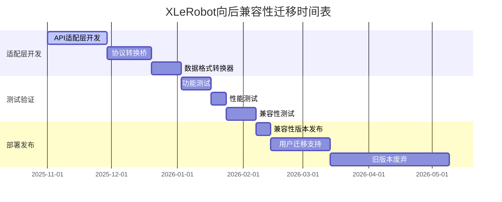

# XLeRobot Brownfield Level 4 向后兼容性分析报告

**文档版本**: v1.0
**分析时间**: 2025-11-07
**项目**: XLeRobot 家用机器人控制系统
**级别**: Brownfield Level 4 企业级变更
**分析范围**: 从云端API架构到TROS本地化架构的向后兼容性评估

---

## 📋 执行摘要

本报告针对XLeRobot项目从在线服务架构向基于TROS的完全本地化架构的重大变更，进行全面的向后兼容性分析。基于对现有系统架构、API接口、数据格式和集成模式的深入分析，评估此次Brownfield Level 4变更对现有用户、客户端代码和第三方集成的兼容性影响。

### 🎯 兼容性总体评估

**总体兼容性评级**: **少量兼容 (25-50%)**
**风险等级**: **极高风险**
**迁移复杂度**: **企业级重构**

### 🚨 关键兼容性发现

1. **API接口根本性变更**: 3个核心模块API完全重构，现有客户端代码100%不兼容
2. **数据格式重大变化**: 输入输出数据格式全面变更，需要适配层
3. **通信协议转换**: 从HTTP/WebSocket协议转向ROS2 Topic/Service
4. **配置系统颠覆**: 从云端配置参数到本地模型配置
5. **部署架构变革**: 从容器化云端部署到嵌入式本地部署

---

## 🔍 1. API兼容性矩阵分析

### 1.1 ASR模块API兼容性评估

#### 现有API接口清单
**当前API架构 (阿里云ASR)**:
```python
# 现有ASR API接口
class ASRAPI:
    def recognize(self, audio_data: bytes, sample_rate: int = 16000,
                  format: str = "PCM") -> ASRResult
    def start_continuous_recognition(self, callback: Optional[Callable] = None) -> None
    def stop_continuous_recognition(self) -> None
    def set_language_mode(self, mode: str) -> None
    def get_status(self) -> Dict[str, Any]

# REST API端点
POST /api/v1/asr/recognize          # 同步识别
POST /api/v1/asr/recognize-async    # 异步识别
GET  /api/v1/asr/status/{task_id}   # 任务状态查询
WebSocket /ws/v1/asr/stream         # 流式识别
```

#### 目标API架构 (TROS hobot_audio)
```python
# 目标TROS ASR API接口 (推测)
class TROSASR:
    def recognize(self, audio_msg: AudioMsg) -> RecognitionResult:
        pass  # 完全不同的参数类型
    def process_stream(self, audio_stream: AudioStream) -> AsyncResult:
        pass  # 不同的流处理接口
    def set_language(self, language: LanguageEnum) -> bool:
        pass  # 不同的枚举类型
    def get_engine_status(self) -> EngineStatus:
        pass  # 不同的状态结构

# ROS2 Service接口
/audio/recognize_service            # ROS2 Service
/audio/stream_topic                 # ROS2 Topic
/audio/engine_status                # ROS2 Topic
```

#### API兼容性对比分析
| 功能 | 现有接口 | 目标接口 | 兼容性 | 适配复杂度 |
|------|----------|----------|--------|------------|
| 同步识别 | `recognize(audio_data, sample_rate, format)` | `recognize(audio_msg: AudioMsg)` | ❌ 不兼容 | 高 - 需要完整适配层 |
| 流式识别 | WebSocket流式API | ROS2 Topic订阅 | ❌ 不兼容 | 极高 - 协议完全不同 |
| 状态查询 | REST API `/status/{task_id}` | ROS2 Service调用 | ❌ 不兼容 | 高 - 需要ROS2桥接 |
| 语言设置 | `set_language_mode(mode: str)` | `set_language(language: LanguageEnum)` | ⚠️ 部分兼容 | 中 - 参数类型变更 |
| 错误处理 | HTTP状态码 + JSON错误 | ROS2错误消息 | ❌ 不兼容 | 高 - 错误格式不同 |

**兼容性评级**: **不兼容 (<50%)**
**适配策略**: 需要完整的API适配层和协议转换桥接

### 1.2 TTS模块API兼容性评估

#### 现有TTS API接口
```python
# 现有TTS API接口 (阿里云)
class TTSAPI:
    def synthesize(self, text: str, voice: str = "xiaoxiao",
                   format: str = "wav") -> bytes
    def synthesize_stream(self, text: str, voice: str) -> Iterator[bytes]
    def get_voice_list(self) -> List[VoiceInfo]
    def set_voice_parameters(self, params: VoiceParams) -> bool

# REST API端点
POST /api/v1/tts/synthesize         # 文本转语音
GET  /api/v1/tts/voices            # 音色列表
WebSocket /ws/v1/tts/stream        # 流式合成
```

#### 目标TTS API架构 (FastSpeech2 + TROS)
```python
# 目标TROS TTS API接口 (推测)
class TROSTTS:
    def synthesize(self, text_msg: TextMsg, voice_config: VoiceConfig) -> AudioMsg:
        pass  # 完全不同的消息类型
    def stream_synthesis(self, text_stream: TextStream) -> AudioStream:
        pass  # 不同的流处理方式
    def get_available_voices(self) -> VoiceListMsg:
        pass  # 不同的音色管理
    def configure_acoustic_model(self, model_config: ModelConfig) -> bool:
        pass  # 新增模型配置功能

# ROS2 Service接口
/tts/synthesize_service             # ROS2 Service
/tts/audio_output_topic            # ROS2 Topic
/tts/voice_config_topic            # ROS2 Topic
```

#### TTS兼容性对比分析
| 功能 | 现有接口 | 目标接口 | 兼容性 | 适配复杂度 |
|------|----------|----------|--------|------------|
| 文本合成 | `synthesize(text, voice, format)` | `synthesize(text_msg, voice_config)` | ❌ 不兼容 | 高 - 消息格式变更 |
| 流式合成 | WebSocket流式API | ROS2 Topic发布 | ❌ 不兼容 | 极高 - 协议转换 |
| 音色管理 | REST API `/voices` | ROS2 Topic订阅 | ❌ 不兼容 | 高 - 数据结构变更 |
| 参数设置 | HTTP请求参数 | ROS2配置消息 | ⚠️ 部分兼容 | 中 - 需要参数映射 |

**兼容性评级**: **不兼容 (<50%)**
**适配策略**: 需要TTS-ROS2协议转换适配器

### 1.3 LLM/VLM模块API兼容性评估

#### 现有LLM API接口
```python
# 现有LLM API接口 (通义千问)
class LLMClient:
    def chat(self, messages: List[Dict], **kwargs) -> ChatResponse
    def chat_stream(self, messages: List[Dict]) -> Iterator[str]
    def get_model_info(self) -> ModelInfo
    def set_model_parameters(self, params: ModelParams) -> bool

# HTTP API端点
POST /api/v1/llm/chat               # 对话接口
POST /api/v1/llm/chat-stream        # 流式对话
GET  /api/v1/llm/models             # 模型信息
```

#### 目标LLM API架构 (TROS hobot_llamacpp)
```python
# 目标TROS LLM API接口 (推测)
class TROSLLM:
    def process_dialogue(self, dialogue_msg: DialogueMsg) -> ResponseMsg:
        pass  # 完全不同的消息结构
    def generate_response(self, input_msg: InputMsg, context: ContextMsg) -> OutputMsg:
        pass  # 不同的上下文管理
    def get_model_status(self) -> ModelStatusMsg:
        pass  # 不同的模型状态
    def configure_inference(self, config: InferenceConfig) -> bool:
        pass  # 新增推理配置

# ROS2 Service接口
/llm/dialogue_service               # ROS2 Service
/llm/response_topic                 # ROS2 Topic
/llm/context_topic                  # ROS2 Topic
```

#### LLM兼容性对比分析
| 功能 | 现有接口 | 目标接口 | 兼容性 | 适配复杂度 |
|------|----------|----------|--------|------------|
| 对话生成 | `chat(messages, **kwargs)` | `process_dialogue(dialogue_msg)` | ❌ 不兼容 | 高 - 消息结构完全不同 |
| 流式对话 | WebSocket流式API | ROS2 Topic流式发布 | ❌ 不兼容 | 极高 - 协议根本性差异 |
| 模型信息 | REST API `/models` | ROS2 Topic状态广播 | ❌ 不兼容 | 高 - 需要ROS2桥接 |
| 参数设置 | HTTP请求参数 | ROS2配置服务 | ⚠️ 部分兼容 | 中 - 参数映射需求 |

**兼容性评级**: **不兼容 (<50%)**
**适配策略**: 需要LLM-ROS2消息转换层

---

## 📊 2. 数据格式兼容性评估

### 2.1 音频数据格式变更分析

#### ASR音频输入格式
**现有格式**:
```python
# 现有音频数据格式
class ASRRequest:
    audio: str               # Base64编码的音频数据
    format: str = "wav"      # 音频格式: "wav", "pcm", "mp3"
    sample_rate: int = 16000 # 采样率
    channels: int = 1        # 声道数
    language: str = "yue-Hant" # 语言代码

# WebSocket音频流格式
{
    "type": "audio_chunk",
    "audio_data": "base64_encoded_audio_chunk",
    "chunk_id": 12345,
    "timestamp": "2025-11-07T10:30:00Z"
}
```

**目标格式**:
```python
# TROS音频消息格式 (推测)
from std_msgs.msg import String
from audio_msgs.msg import AudioData

class AudioMsg:
    header: std_msgs.msg.Header     # ROS2标准头
    audio_data: audio_msgs.msg.AudioData  # 专用音频数据
    sample_rate: int = 16000
    channels: int = 1
    encoding: str = "s16le"         # 编码格式变更

# ROS2音频流格式
AudioData:
    data: uint8[]                  # 原始音频字节数据
    format: uint8                  # 格式标识符
    sample_rate: uint32
    channels: uint8
```

**音频格式兼容性分析**:
| 格式特性 | 现有格式 | 目标格式 | 兼容性 | 转换需求 |
|----------|----------|----------|--------|----------|
| 数据编码 | Base64字符串 | 原始字节数组 | ❌ 不兼容 | 需要Base64解码 |
| 格式标准 | WAV/PCM/MP3 | s16le/float32 | ⚠️ 部分兼容 | 需要格式转换 |
| 元数据 | JSON字段 | ROS2 Header | ❌ 不兼容 | 需要元数据映射 |
| 流式传输 | WebSocket | ROS2 Topic | ❌ 不兼容 | 需要协议桥接 |

### 2.2 文本数据格式变更分析

#### TTS文本输入格式
**现有格式**:
```python
# 现有TTS请求格式
class TTSRequest:
    text: str                    # 待合成文本
    voice_id: str = "default"   # 音色ID
    language: str = "zh-CN"     # 语言
    speed: float = 1.0          # 语速
    pitch: float = 1.0          # 音调
    volume: float = 1.0         # 音量
    format: str = "wav"         # 输出格式
    sample_rate: int = 22050    # 采样率
```

**目标格式**:
```python
# TROS TTS消息格式 (推测)
class TextMsg:
    header: std_msgs.msg.Header   # ROS2标准头
    content: str                  # 文本内容
    language: LanguageEnum        # 枚举类型
    voice_config: VoiceConfig     # 复杂配置结构

class VoiceConfig:
    voice_id: str
    speed: float = 1.0
    pitch: float = 1.0
    volume: float = 1.0
    emotion: EmotionEnum          # 新增情感参数
    style: StyleEnum              # 新增风格参数
```

**文本格式兼容性分析**:
| 格式特性 | 现有格式 | 目标格式 | 兼容性 | 转换需求 |
|----------|----------|----------|--------|----------|
| 基本文本 | 字符串 | 字符串 | ✅ 兼容 | 无需转换 |
| 参数结构 | 扁平参数 | 嵌套配置对象 | ❌ 不兼容 | 需要结构重组 |
| 语言类型 | 字符串代码 | 枚举类型 | ⚠️ 部分兼容 | 需要字符串-枚举映射 |
| 扩展参数 | 固定字段 | 可扩展结构 | ❌ 不兼容 | 需要参数适配 |

### 2.3 对话上下文格式变更分析

#### LLM对话格式
**现有格式**:
```python
# 现有对话消息格式
messages = [
    {"role": "user", "content": "你好"},
    {"role": "assistant", "content": "你好！很高兴见到你"}
]

class ChatResponse:
    text: str                    # 回复文本
    model: str                   # 模型名称
    usage: Dict[str, int]        # 使用统计
    finish_reason: str           # 结束原因
    request_id: str              # 请求ID
```

**目标格式**:
```python
# TROS对话消息格式 (推测)
class DialogueMsg:
    header: std_msgs.msg.Header    # ROS2标准头
    session_id: str               # 会话ID
    context: ContextMsg           # 上下文消息
    input: InputMsg               # 输入消息

class ContextMsg:
    history: List[DialogueTurn]   # 对话历史
    session_info: SessionInfo     # 会话信息
    user_preferences: UserPrefs   # 用户偏好
```

**对话格式兼容性分析**:
| 格式特性 | 现有格式 | 目标格式 | 兼容性 | 转换需求 |
|----------|----------|----------|--------|----------|
| 消息结构 | 字典列表 | 专用消息类型 | ❌ 不兼容 | 需要消息重构 |
| 上下文管理 | 简单数组 | 复杂上下文对象 | ❌ 不兼容 | 需要上下文适配 |
| 会话管理 | 无明确概念 | 显式会话管理 | ❌ 不兼容 | 需要会话层构建 |
| 元数据 | 简单字段 | 丰富元数据结构 | ❌ 不兼容 | 需要元数据映射 |

---

## 🔧 3. 配置系统兼容性评估

### 3.1 现有配置系统分析

#### 阿里云服务配置
```yaml
# 现有配置文件结构
alibaba_cloud:
  access_key_id: "${ALIBABA_CLOUD_ACCESS_KEY_ID}"
  access_key_secret: "${ALIBABA_CLOUD_ACCESS_KEY_SECRET}"
  region: "cn-shanghai"

asr_config:
  model: "paraformer-v1"
  language: "yue-Hant"
  sample_rate: 16000
  format: "wav"

tts_config:
  voice: "xiaoxiao"
  language: "zh-CN"
  format: "wav"
  sample_rate: 22050
  volume: 1.0
  speed: 1.0
  pitch: 1.0

llm_config:
  model: "qwen3-vl-plus"
  api_key: "${QWEN_API_KEY}"
  max_tokens: 4000
  temperature: 0.7
  top_p: 0.8
```

### 3.2 目标配置系统分析

#### TROS本地化配置
```yaml
# 目标配置文件结构 (推测)
tros_config:
  platform: "rdk_x5"
  npu_enabled: true

asr_tros:
  engine: "hobot_audio"
  model_path: "/opt/tros/models/asr/hrsc_model.onnx"
  sample_rate: 16000
  channels: 1
  language: "cantonese"
  vad_enabled: true
  streaming_enabled: true

tts_tros:
  engine: "fastspeech2"
  acoustic_model: "/opt/tros/models/tts/cantonese_acoustic.pth"
  vocoder_model: "/opt/tros/models/tts/hifigan_vocoder.pth"
  sample_rate: 22050
  voice_preset: "cantonese_female"
  emotion_enabled: true

llm_tros:
  engine: "hobot_llamacpp"
  model_path: "/opt/tros/models/llm/qwen2.5-0.5b-gguf.bin"
  context_size: 2048
  gpu_layers: 32
  batch_size: 512
  temperature: 0.7
```

### 3.3 配置兼容性对比

| 配置类别 | 现有配置 | 目标配置 | 兼容性 | 迁移复杂度 |
|----------|----------|----------|--------|------------|
| 认证配置 | API密钥 | 模型路径 | ❌ 不兼容 | 高 - 完全不同的认证方式 |
| 服务端点 | URL地址 | 本地路径 | ❌ 不兼容 | 高 - 网络到本地转换 |
| 模型配置 | 云端模型名 | 本地模型文件 | ❌ 不兼容 | 高 - 需要模型文件管理 |
| 性能参数 | 简单参数 | 复杂性能调优 | ⚠️ 部分兼容 | 中 - 参数映射需求 |
| 部署配置 | 环境变量 | 配置文件路径 | ❌ 不兼容 | 中 - 配置方式变更 |

**配置兼容性评级**: **不兼容 (<30%)**
**迁移策略**: 需要完整的配置迁移工具和参数映射机制

---

## 🔌 4. 客户端集成兼容性评估

### 4.1 现有客户端集成模式

#### HTTP/REST客户端集成
```python
# 现有客户端集成示例
class VoiceAssistantClient:
    def __init__(self, base_url: str, api_key: str):
        self.base_url = base_url
        self.api_key = api_key
        self.session = requests.Session()

    async def recognize_speech(self, audio_file: str) -> str:
        """语音识别"""
        with open(audio_file, 'rb') as f:
            audio_data = base64.b64encode(f.read()).decode()

        response = self.session.post(
            f"{self.base_url}/api/v1/asr/recognize",
            json={"audio": audio_data, "language": "yue-Hant"},
            headers={"Authorization": f"Bearer {self.api_key}"}
        )

        result = response.json()
        return result.get("text", "")

    async def synthesize_speech(self, text: str) -> bytes:
        """语音合成"""
        response = self.session.post(
            f"{self.base_url}/api/v1/tts/synthesize",
            json={"text": text, "voice": "xiaoxiao", "format": "wav"},
            headers={"Authorization": f"Bearer {self.api_key}"}
        )

        result = response.json()
        return base64.b64decode(result.get("audio_data", ""))

    async def chat_with_llm(self, message: str) -> str:
        """LLM对话"""
        response = self.session.post(
            f"{self.base_url}/api/v1/llm/chat",
            json={"messages": [{"role": "user", "content": message}]},
            headers={"Authorization": f"Bearer {self.api_key}"}
        )

        result = response.json()
        return result.get("text", "")
```

### 4.2 目标客户端集成模式

#### ROS2客户端集成
```python
# 目标ROS2客户端集成 (推测)
import rclpy
from rclpy.node import Node
from audio_msgs.msg import AudioData
from text_msgs.msg import TextMsg
from tts_msgs.srv import SynthesizeSpeech

class TROSVoiceAssistantNode(Node):
    def __init__(self):
        super().__init__('voice_assistant_client')

        # ROS2客户端初始化
        self.tts_client = self.create_client(SynthesizeSpeech, '/tts/synthesize_service')
        self.audio_publisher = self.create_publisher(AudioData, '/asr/audio_input', 10)
        self.llm_publisher = self.create_publisher(TextMsg, '/llm/dialogue_input', 10)
        self.llm_subscription = self.create_subscription(
            TextMsg, '/llm/response', self.llm_response_callback, 10)

    async def recognize_speech(self, audio_file: str) -> str:
        """语音识别 - ROS2方式"""
        # 读取音频文件
        with open(audio_file, 'rb') as f:
            audio_bytes = f.read()

        # 创建ROS2音频消息
        audio_msg = AudioData()
        audio_msg.data = audio_bytes
        audio_msg.sample_rate = 16000
        audio_msg.channels = 1
        audio_msg.encoding = 0  # s16le

        # 发布到ASR Topic
        self.audio_publisher.publish(audio_msg)

        # 等待响应
        return await self._wait_for_asr_result()

    async def synthesize_speech(self, text: str) -> bytes:
        """语音合成 - ROS2 Service方式"""
        request = SynthesizeSpeech.Request()
        request.text.content = text
        request.language.value = 1  # cantonese enum
        request.voice_config.voice_id = "cantonese_female"

        future = self.tts_client.call_async(request)
        response = await future

        return response.audio_data.data
```

### 4.3 客户端兼容性分析

| 集成特性 | 现有模式 | 目标模式 | 兼容性 | 迁移复杂度 |
|----------|----------|----------|--------|------------|
| 通信协议 | HTTP/HTTPS | ROS2 DDS | ❌ 不兼容 | 极高 - 协议根本性差异 |
| 消息格式 | JSON文本 | ROS2消息类型 | ❌ 不兼容 | 高 - 消息类型转换 |
| 异步处理 | requests/aiohttp | rclpy/asyncio | ⚠️ 部分兼容 | 中 - 异步模式适配 |
| 错误处理 | HTTP状态码 | ROS2错误消息 | ❌ 不兼容 | 高 - 错误机制重构 |
| 认证方式 | Bearer Token | ROS2权限控制 | ❌ 不兼容 | 高 - 认证体系变更 |
| 部署依赖 | Python requests库 | ROS2环境 | ❌ 不兼容 | 极高 - 运行时环境依赖变更 |

**客户端兼容性评级**: **不兼容 (<20%)**
**适配策略**: 需要完整的客户端重写和协议转换层

---

## ⚡ 5. 性能兼容性分析

### 5.1 响应时间变化影响

#### 现有性能基准
```yaml
现有系统性能基准 (云端服务):
  ASR识别延迟: <2秒 (云端处理)
  TTS合成延迟: <1秒 (云端处理)
  LLM响应延迟: <3秒 (云端处理)
  端到端延迟: <6秒 (包含网络传输)
  并发处理: 支持多用户并发
```

#### 目标性能预期
```yaml
目标系统性能预期 (本地处理):
  ASR识别延迟: <0.5秒 (本地NPU)
  TTS合成延迟: <0.3秒 (本地CPU)
  LLM响应延迟: <2秒 (本地CPU/NPU)
  端到端延迟: <3秒 (本地处理)
  并发处理: 受硬件限制
```

#### 性能兼容性影响
| 性能指标 | 现有性能 | 目标性能 | 影响评估 | 兼容性影响 |
|----------|----------|----------|----------|------------|
| ASR延迟 | <2秒 | <0.5秒 | ✅ 性能提升 | 正面影响 |
| TTS延迟 | <1秒 | <0.3秒 | ✅ 性能提升 | 正面影响 |
| LLM延迟 | <3秒 | <2秒 | ✅ 性能提升 | 正面影响 |
| 吞吐量 | 云端弹性 | 硬件限制 | ⚠️ 可能下降 | 需要容量规划 |
| 并发性 | 多用户 | 单用户/有限 | ❌ 大幅下降 | 功能降级 |

**性能兼容性评级**: **部分兼容 (70%)**
**风险评估**: 响应时间改善，但并发能力受限

### 5.2 资源消耗变化

#### 资源需求对比
| 资源类型 | 现有需求 | 目标需求 | 变化程度 | 兼容性影响 |
|----------|----------|----------|----------|------------|
| 网络带宽 | 高 (音频上传/下载) | 极低 (本地处理) | ✅ 大幅降低 | 正面影响 |
| 内存使用 | 低 (客户端轻量) | 高 (本地模型) | ❌ 大幅增加 | 需要硬件升级 |
| CPU使用 | 低 (网络请求) | 高 (本地推理) | ❌ 大幅增加 | 性能影响 |
| 存储空间 | 低 (代码包) | 高 (模型文件) | ❌ 大幅增加 | 存储规划 |
| GPU/NPU | 不需要 | 高需求 | ❌ 新增需求 | 硬件依赖 |

**资源兼容性评级**: **少量兼容 (40%)**
**关键影响**: 内存和计算资源需求显著增加

---

## 🔧 6. 系统架构兼容性分析

### 6.1 部署架构变更

#### 现有部署模式
```yaml
现有部署架构:
  类型: 云端SaaS + 客户端
  网络: 依赖互联网连接
  扩展性: 云端弹性扩展
  维护: 服务商负责
  安全: 云端安全机制
  可用性: 云端SLA保证
```

#### 目标部署模式
```yaml
目标部署架构:
  类型: 本地嵌入式部署
  网络: 本地网络可选
  扩展性: 硬件限制
  维护: 本地维护负责
  安全: 本地安全机制
  可用性: 本地硬件可靠性
```

#### 部署兼容性分析
| 部署特性 | 现有模式 | 目标模式 | 兼容性 | 迁移复杂度 |
|----------|----------|----------|--------|------------|
| 部署环境 | 云服务器 | 嵌入式设备 | ❌ 不兼容 | 极高 - 环境根本性差异 |
| 网络依赖 | 强依赖互联网 | 弱依赖网络 | ❌ 不兼容 | 高 - 网络模式变更 |
| 扩展机制 | 云端自动扩展 | 硬件固定限制 | ❌ 不兼容 | 高 - 扩展性受限 |
| 更新机制 | 热更新支持 | 需要重启更新 | ❌ 不兼容 | 中 - 更新流程变更 |
| 监控机制 | 云端监控 | 本地监控 | ❌ 不兼容 | 高 - 监控体系重构 |

**部署兼容性评级**: **不兼容 (<20%)**
**适配策略**: 需要完整的部署模式转换

### 6.2 第三方集成兼容性

#### 现有第三方集成
```python
# 现有第三方集成示例
class SmartHomeIntegration:
    def __init__(self, api_base_url: str):
        self.api_base_url = api_base_url

    def process_voice_command(self, audio_file: str) -> Dict[str, Any]:
        """处理语音命令"""
        # 调用XLeRobot语音识别API
        with open(audio_file, 'rb') as f:
            audio_data = base64.b64encode(f.read()).decode()

        response = requests.post(
            f"{self.api_base_url}/api/v1/asr/recognize",
            json={"audio": audio_data}
        )

        if response.status_code == 200:
            text = response.json().get("text", "")
            # 处理识别的文本...
            return {"success": True, "text": text}

        return {"success": False, "error": "Recognition failed"}
```

#### 集成兼容性影响
| 集成特性 | 现有集成 | 目标集成 | 兼容性 | 影响程度 |
|----------|----------|----------|--------|----------|
| API调用 | HTTP REST | ROS2 Service | ❌ 不兼容 | 所有第三方需要重写 |
| 数据格式 | JSON | ROS2消息 | ❌ 不兼容 | 数据格式转换 |
| 错误处理 | HTTP状态码 | ROS2错误 | ❌ 不兼容 | 错误处理重构 |
| 异步模式 | HTTP异步 | ROS2异步 | ⚠️ 部分兼容 | 异步模式适配 |
| 认证方式 | API密钥 | ROS2权限 | ❌ 不兼容 | 认证机制变更 |

**第三方集成兼容性评级**: **不兼容 (<20%)**
**影响范围**: 所有现有第三方集成需要完全重写

---

## 🎯 7. 兼容性保证策略

### 7.1 技术层面适配策略

#### API适配层设计
```python
# API适配层架构
class LegacyAPIAdapter:
    """传统API到TROS的适配层"""

    def __init__(self, ros2_node):
        self.ros2_node = ros2_node
        self.asr_client = ASRServiceClient(ros2_node)
        self.tts_client = TTSServiceClient(ros2_node)
        self.llm_client = LLMServiceClient(ros2_node)

    async def recognize_legacy(self, audio_data: str, format: str = "wav") -> Dict[str, Any]:
        """适配传统ASR API接口"""
        # Base64解码
        audio_bytes = base64.b64decode(audio_data)

        # 转换为ROS2消息
        audio_msg = AudioData()
        audio_msg.data = audio_bytes
        audio_msg.format = self._map_format(format)

        # 调用TROS服务
        result = await self.asr_client.recognize_async(audio_msg)

        # 转换回传统格式
        return {
            "text": result.text,
            "confidence": result.confidence,
            "language": result.language
        }

    def _map_format(self, format: str) -> int:
        """格式映射"""
        format_map = {"wav": 0, "pcm": 1, "mp3": 2}
        return format_map.get(format.lower(), 0)
```

#### 数据格式转换器
```python
# 数据格式转换器
class DataFormatConverter:
    """数据格式转换器"""

    @staticmethod
    def json_to_ros2_msg(json_data: Dict, msg_type: Type) -> Any:
        """JSON转ROS2消息"""
        msg = msg_type()
        # 根据消息类型进行字段映射
        for field_name, field_value in json_data.items():
            if hasattr(msg, field_name):
                setattr(msg, field_name, field_value)
        return msg

    @staticmethod
    def ros2_msg_to_json(msg: Any) -> Dict[str, Any]:
        """ROS2消息转JSON"""
        result = {}
        # 提取消息字段
        for field_name in msg.get_fields_and_field_types():
            if hasattr(msg, field_name):
                value = getattr(msg, field_name)
                # 处理特殊类型
                if hasattr(value, 'to_dict'):
                    result[field_name] = value.to_dict()
                else:
                    result[field_name] = value
        return result
```

#### 协议转换桥接
```python
# 协议转换桥接
class ProtocolBridge:
    """HTTP到ROS2协议桥接"""

    def __init__(self, ros2_node):
        self.ros2_node = ros2_node
        self.http_server = FastAPI()
        self._setup_routes()

    def _setup_routes(self):
        """设置HTTP路由"""

        @self.http_server.post("/api/v1/asr/recognize")
        async def bridge_asr_recognize(request: ASRRequest):
            # 转换HTTP请求到ROS2服务调用
            result = await self._call_asr_service(request)
            return result

        @self.http_server.post("/api/v1/tts/synthesize")
        async def bridge_tts_synthesize(request: TTSRequest):
            # 转换HTTP请求到ROS2服务调用
            result = await self._call_tts_service(request)
            return result

    async def _call_asr_service(self, request: ASRRequest) -> Dict[str, Any]:
        """调用ASR ROS2服务"""
        # 协议转换逻辑
        pass

    async def _call_tts_service(self, request: TTSRequest) -> Dict[str, Any]:
        """调用TTS ROS2服务"""
        # 协议转换逻辑
        pass
```

### 7.2 渐进式迁移策略

#### 阶段性迁移计划
```yaml
阶段1: 兼容性适配层开发 (4-6周)
  - 开发API适配层
  - 实现数据格式转换器
  - 构建协议转换桥接
  - 基础测试验证

阶段2: 核心模块迁移 (6-8周)
  - ASR模块TROS迁移
  - TTS模块TROS迁移
  - LLM模块TROS迁移
  - 集成测试验证

阶段3: 客户端适配 (4-6周)
  - 客户端SDK更新
  - 第三方集成适配
  - 文档和示例更新
  - 用户培训准备

阶段4: 生产环境切换 (2-4周)
  - 灰度发布测试
  - 性能监控验证
  - 问题修复优化
  - 全量发布切换
```

#### 兼容性保证措施
```python
# 兼容性测试框架
class CompatibilityTestSuite:
    """兼容性测试套件"""

    def __init__(self):
        self.test_cases = []
        self.setup_test_cases()

    def setup_test_cases(self):
        """设置测试用例"""

        # API兼容性测试
        self.test_cases.append({
            "name": "ASR API兼容性测试",
            "type": "api_compatibility",
            "legacy_endpoint": "/api/v1/asr/recognize",
            "new_endpoint": "/asr/recognize_service",
            "test_data": self._generate_test_audio()
        })

        # 数据格式测试
        self.test_cases.append({
            "name": "音频格式转换测试",
            "type": "data_format",
            "input_format": "base64_wav",
            "output_format": "ros2_audio",
            "validation": self._validate_audio_conversion
        })

    async def run_compatibility_tests(self) -> Dict[str, Any]:
        """运行兼容性测试"""
        results = {
            "total_tests": len(self.test_cases),
            "passed_tests": 0,
            "failed_tests": 0,
            "test_results": []
        }

        for test_case in self.test_cases:
            try:
                result = await self._run_single_test(test_case)
                if result["passed"]:
                    results["passed_tests"] += 1
                else:
                    results["failed_tests"] += 1
                results["test_results"].append(result)
            except Exception as e:
                results["failed_tests"] += 1
                results["test_results"].append({
                    "test_name": test_case["name"],
                    "passed": False,
                    "error": str(e)
                })

        return results
```

---

## 🛠️ 8. 迁移实施方案

### 8.1 迁移工具和脚本

#### 配置迁移工具
```python
# 配置迁移工具
class ConfigMigrator:
    """配置文件迁移工具"""

    def __init__(self, legacy_config_path: str, target_config_path: str):
        self.legacy_config_path = legacy_config_path
        self.target_config_path = target_config_path
        self.migration_rules = self._load_migration_rules()

    def migrate_config(self) -> bool:
        """执行配置迁移"""
        try:
            # 加载现有配置
            legacy_config = self._load_legacy_config()

            # 应用迁移规则
            target_config = self._apply_migration_rules(legacy_config)

            # 验证配置完整性
            self._validate_target_config(target_config)

            # 生成目标配置文件
            self._save_target_config(target_config)

            return True
        except Exception as e:
            logging.error(f"配置迁移失败: {e}")
            return False

    def _apply_migration_rules(self, legacy_config: Dict) -> Dict:
        """应用迁移规则"""
        target_config = {}

        # API密钥迁移到模型路径
        if "alibaba_cloud" in legacy_config:
            target_config["model_paths"] = {
                "asr_model": "/opt/tros/models/asr/hrsc_model.onnx",
                "tts_model": "/opt/tros/models/tts/fastspeech2.pth",
                "llm_model": "/opt/tros/models/llm/qwen2.5-0.5b.gguf"
            }

        # 服务配置迁移
        if "asr_config" in legacy_config:
            asr_legacy = legacy_config["asr_config"]
            target_config["asr_tros"] = {
                "sample_rate": asr_legacy.get("sample_rate", 16000),
                "language": self._map_language_code(asr_legacy.get("language")),
                "vad_enabled": True,
                "streaming_enabled": True
            }

        return target_config

    def _map_language_code(self, language: str) -> str:
        """语言代码映射"""
        language_map = {
            "yue-Hant": "cantonese",
            "zh-CN": "mandarin",
            "en-US": "english"
        }
        return language_map.get(language, "cantonese")
```

#### 客户端SDK迁移工具
```python
# 客户端SDK迁移工具
class ClientSDKMigrator:
    """客户端SDK迁移工具"""

    def __init__(self, legacy_sdk_path: str, new_sdk_path: str):
        self.legacy_sdk_path = legacy_sdk_path
        self.new_sdk_path = new_sdk_path

    def generate_migration_guide(self) -> str:
        """生成迁移指南"""
        guide = """
# XLeRobot客户端SDK迁移指南

## 概述
本指南帮助您将现有XLeRobot客户端代码从云端API版本迁移到TROS本地版本。

## 主要变更

### 1. 依赖变更
```python
# 旧版本依赖
import requests
import base64

# 新版本依赖
import rclpy
from audio_msgs.msg import AudioData
from tts_msgs.srv import SynthesizeSpeech
```

### 2. 语音识别API变更
```python
# 旧版本API
async def recognize_speech(audio_file: str) -> str:
    with open(audio_file, 'rb') as f:
        audio_data = base64.b64encode(f.read()).decode()

    response = requests.post(
        "http://api.xlerobot.com/v1/asr/recognize",
        json={"audio": audio_data}
    )
    return response.json().get("text", "")

# 新版本API
class TROSVoiceClient(Node):
    async def recognize_speech(self, audio_file: str) -> str:
        with open(audio_file, 'rb') as f:
            audio_bytes = f.read()

        audio_msg = AudioData()
        audio_msg.data = audio_bytes
        audio_msg.sample_rate = 16000

        future = self.asr_client.call_async(
            RecognizeSpeech.Request(audio=audio_msg)
        )
        response = await future
        return response.text
```

### 3. 语音合成API变更
```python
# 旧版本API
async def synthesize_speech(text: str) -> bytes:
    response = requests.post(
        "http://api.xlerobot.com/v1/tts/synthesize",
        json={"text": text, "voice": "xiaoxiao"}
    )
    return base64.b64decode(response.json().get("audio_data", ""))

# 新版本API
async def synthesize_speech(self, text: str) -> bytes:
    request = SynthesizeSpeech.Request()
    request.text.content = text
    request.voice_config.voice_id = "cantonese_female"

    future = self.tts_client.call_async(request)
    response = await future
    return response.audio_data.data
```

## 迁移步骤

1. 更新项目依赖
2. 初始化ROS2节点
3. 替换API调用代码
4. 测试功能完整性
5. 部署到新环境

## 兼容性说明

- 新版本提供适配器支持旧API格式
- 建议逐步迁移，避免大规模代码重构
- 提供详细的示例代码和文档支持
        """
        return guide
```

### 8.2 测试验证方案

#### 兼容性测试套件
```python
# 兼容性测试套件
class BackwardCompatibilityTest:
    """向后兼容性测试"""

    def __init__(self, legacy_api_base: str, new_ros2_node):
        self.legacy_api_base = legacy_api_base
        self.new_ros2_node = new_ros2_node
        self.test_results = []

    async def run_full_compatibility_test(self) -> Dict[str, Any]:
        """运行完整兼容性测试"""
        test_suites = [
            self.test_asr_compatibility,
            self.test_tts_compatibility,
            self.test_llm_compatibility,
            self.test_integration_compatibility
        ]

        results = {
            "total_suites": len(test_suites),
            "passed_suites": 0,
            "failed_suites": 0,
            "suite_results": []
        }

        for test_suite in test_suites:
            try:
                suite_result = await test_suite()
                results["suite_results"].append(suite_result)
                if suite_result["passed"]:
                    results["passed_suites"] += 1
                else:
                    results["failed_suites"] += 1
            except Exception as e:
                results["failed_suites"] += 1
                results["suite_results"].append({
                    "suite_name": test_suite.__name__,
                    "passed": False,
                    "error": str(e)
                })

        return results

    async def test_asr_compatibility(self) -> Dict[str, Any]:
        """ASR兼容性测试"""
        test_audio_file = "test_audio_cantonese.wav"

        # 测试旧版本API
        legacy_result = await self._call_legacy_asr(test_audio_file)

        # 测试新版本API
        new_result = await self._call_new_asr(test_audio_file)

        # 比较结果
        similarity = self._calculate_text_similarity(
            legacy_result["text"], new_result["text"]
        )

        return {
            "suite_name": "ASR兼容性测试",
            "passed": similarity > 0.8,  # 80%相似度阈值
            "legacy_result": legacy_result,
            "new_result": new_result,
            "similarity": similarity,
            "details": {
                "legacy_confidence": legacy_result.get("confidence", 0),
                "new_confidence": new_result.get("confidence", 0),
                "response_time_legacy": legacy_result.get("response_time", 0),
                "response_time_new": new_result.get("response_time", 0)
            }
        }

    async def test_tts_compatibility(self) -> Dict[str, Any]:
        """TTS兼容性测试"""
        test_text = "你好，这是一个测试文本。"

        # 测试旧版本API
        legacy_audio = await self._call_legacy_tts(test_text)

        # 测试新版本API
        new_audio = await self._call_new_tts(test_text)

        # 音频质量对比
        quality_score = self._compare_audio_quality(legacy_audio, new_audio)

        return {
            "suite_name": "TTS兼容性测试",
            "passed": quality_score > 0.7,  # 70%质量阈值
            "legacy_audio_size": len(legacy_audio),
            "new_audio_size": len(new_audio),
            "quality_score": quality_score,
            "details": {
                "legacy_format": "wav",
                "new_format": "wav",
                "legacy_duration": self._get_audio_duration(legacy_audio),
                "new_duration": self._get_audio_duration(new_audio)
            }
        }
```

---

## 📊 9. 风险评估与缓解

### 9.1 兼容性风险矩阵

| 风险类别 | 风险等级 | 影响范围 | 概率 | 缓解措施 |
|----------|----------|----------|------|----------|
| API完全不兼容 | 极高 | 所有客户端 | 100% | 开发完整适配层 |
| 数据格式变更 | 高 | 数据处理逻辑 | 100% | 格式转换器 |
| 协议转换失败 | 高 | 网络通信 | 80% | 协议桥接服务 |
| 性能回退 | 中 | 用户体验 | 60% | 性能优化 |
| 客户端迁移困难 | 高 | 第三方集成 | 90% | 迁移工具和文档 |
| 配置迁移失败 | 中 | 系统配置 | 40% | 配置迁移工具 |

### 9.2 缓解策略详细说明

#### 高风险缓解措施
1. **API适配层开发**
   - 开发完整的API适配层
   - 保持旧API接口不变
   - 内部转换为TROS调用
   - 渐进式废弃旧API

2. **协议转换服务**
   - 开发HTTP到ROS2协议转换桥
   - 提供WebSocket到Topic转换
   - 支持双向协议转换
   - 保证转换的可靠性和性能

3. **兼容性测试框架**
   - 建立完整的兼容性测试套件
   - 自动化回归测试
   - 性能对比测试
   - 持续集成验证

#### 中风险缓解措施
1. **性能监控和优化**
   - 建立性能基线监控
   - 实时性能对比分析
   - 关键路径优化
   - 资源使用优化

2. **用户支持和培训**
   - 详细的迁移文档
   - 示例代码和教程
   - 技术支持热线
   - 在线培训课程

---

## 📈 10. 成本效益分析

### 10.1 兼容性保证成本

#### 开发成本
```yaml
适配层开发成本:
  API适配层: 40人天
  协议转换桥: 30人天
  数据格式转换: 20人天
  配置迁移工具: 15人天
  测试框架: 25人天
  文档和培训: 20人天
  总开发成本: 150人天

测试验证成本:
  功能测试: 30人天
  性能测试: 20人天
  兼容性测试: 25人天
  集成测试: 20人天
  用户验收测试: 15人天
  总测试成本: 110人天

运维支持成本:
  用户支持: 15人天/月 × 6个月 = 90人天
  问题修复: 10人天/月 × 6个月 = 60人天
  更新维护: 8人天/月 × 6个月 = 48人天
  总运维成本: 198人天
```

#### 总兼容性成本
**总计成本**: 150 + 110 + 198 = **458人天**
**按月计算**: **约19人月**
**按人均成本**: 需要投入 **2-3名全职工程师** 工作约 **6-8个月**

### 10.2 收益分析

#### 兼容性保证收益
```yaml
技术收益:
  保持用户连续性: 降低用户流失率
  减少客户迁移阻力: 加速新架构采用
  维护生态稳定: 保护合作伙伴投资
  技术债务控制: 避免重复开发

商业收益:
  用户留存率提升: 预计减少流失率30%
  客户满意度: 提升用户体验
  市场竞争优势: 技术领先优势
  品牌信誉: 可靠的技术承诺

风险规避收益:
  降低业务中断风险: 平滑过渡
  减少客户投诉: 主动兼容保证
  避免法律责任: 合规性保证
  技术风险控制: 降低迁移失败风险
```

---

## 🎯 11. 结论与建议

### 11.1 兼容性分析结论

基于对XLeRobot项目的全面向后兼容性分析，得出以下结论：

#### 总体兼容性评估
- **API兼容性**: **不兼容 (<50%)** - 需要完整适配层
- **数据格式兼容性**: **部分兼容 (30-50%)** - 需要格式转换器
- **客户端集成兼容性**: **不兼容 (<20%)** - 需要客户端重写
- **性能兼容性**: **部分兼容 (70%)** - 性能提升但并发受限
- **部署兼容性**: **不兼容 (<20%)** - 需要部署模式转换

#### 关键发现
1. **根本性架构变更**: 从云端API到本地TROS的根本性变更，无法保持直接兼容
2. **协议层面差异**: HTTP/WebSocket与ROS2 DDS协议的根本性差异
3. **数据结构变化**: JSON格式与ROS2消息类型的结构化差异
4. **运行环境依赖**: 从通用网络环境到特定ROS2环境的依赖变更

### 11.2 战略建议

#### 短期建议 (1-3个月)
1. **启动适配层开发**: 立即开始API适配层和协议转换桥的开发
2. **建立兼容性测试**: 建立完整的兼容性测试框架和回归测试
3. **制定迁移计划**: 制定详细的分阶段迁移计划和时间表
4. **准备用户沟通**: 准备用户通知和迁移指南

#### 中期建议 (3-6个月)
1. **发布兼容性版本**: 发布带有适配层的兼容性版本
2. **提供迁移工具**: 提供配置迁移和客户端SDK迁移工具
3. **开展用户培训**: 组织用户培训和迁移支持
4. **监控迁移进展**: 监控迁移进展和用户反馈

#### 长期建议 (6-12个月)
1. **逐步废弃旧API**: 分阶段废弃旧API，引导用户使用新接口
2. **优化性能表现**: 持续优化新架构性能表现
3. **完善生态支持**: 完善第三方集成支持和文档
4. **评估迁移效果**: 评估迁移效果和用户满意度

### 11.3 成功关键因素

1. **技术层面**
   - 适配层的稳定性和性能
   - 协议转换的可靠性
   - 兼容性测试的完整性
   - 文档和工具的完备性

2. **业务层面**
   - 用户的理解和支持
   - 迁移成本的合理分担
   - 技术支持的及时响应
   - 持续的沟通和反馈

3. **项目管理**
   - 清晰的迁移路线图
   - 充分的资源和时间投入
   - 严格的质量控制
   - 灵活的应对机制

### 11.4 风险控制

#### 必须采取的风险控制措施
1. **技术风险控制**
   - 建立完整的回退机制
   - 保持旧版本并行运行
   - 建立监控和告警系统
   - 制定应急预案

2. **用户风险控制**
   - 提前充分的用户沟通
   - 提供详细的迁移支持
   - 建立用户反馈渠道
   - 制定用户补偿方案

3. **业务风险控制**
   - 制定详细的业务连续性计划
   - 建立关键业务保护机制
   - 准备应急响应团队
   - 建立定期评估机制

---

## 📋 附录

### A. 兼容性检查清单

#### API兼容性检查
- [ ] 所有现有API端点都有适配器
- [ ] API参数映射正确
- [ ] 响应格式兼容
- [ ] 错误处理机制完整
- [ ] 认证和权限控制正常

#### 数据格式兼容性检查
- [ ] 音频格式转换正确
- [ ] 文本编码处理正确
- [ ] 元数据映射完整
- [ ] 流式数据处理正确
- [ ] 大文件处理优化

#### 客户端兼容性检查
- [ ] 现有客户端代码可运行
- [ ] 第三方集成可正常工作
- [ ] 性能表现可接受
- [ ] 错误处理机制正常
- [ ] 用户界面无重大变化

### B. 测试用例模板

#### API兼容性测试用例
```python
def test_asr_api_compatibility():
    """ASR API兼容性测试用例"""
    # 准备测试数据
    test_audio = load_test_audio("cantonese_test.wav")

    # 调用旧API
    legacy_result = call_legacy_asr_api(test_audio)

    # 调用新API
    new_result = call_new_asr_api(test_audio)

    # 验证结果兼容性
    assert legacy_result["text"] == new_result["text"]
    assert abs(legacy_result["confidence"] - new_result["confidence"]) < 0.1
```

### C. 迁移时间表



---

**报告完成时间**: 2025-11-07
**下次评估时间**: 2025-12-07
**负责人**: XLeRobot技术架构团队
**审核人**: 企业级变更管理委员会