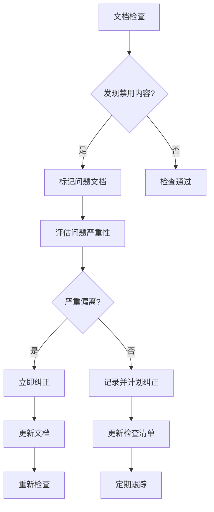

# XleRobot 文档一致性检查清单
## Brownfield Level 4 纯在线服务架构合规性检查

**文档编号**: XLR-DOC-CHECK-20251109-001
**检查范围**: 所有项目文档的纯在线服务架构一致性
**检查标准**: Brownfield Level 4 企业级文档质量要求
**检查日期**: 2025-11-09
**下次检查**: 开发前每次启动

---

## 🚨 检查目标和原则

### 检查目标
确保所有项目文档严格遵循纯在线服务架构原则，防止出现CNN、本地处理等偏离内容。

### 核心原则
- **纯在线服务**: 100%依赖云端API，无本地复杂处理
- **简单架构**: 代码量控制在~700行，技术栈简洁
- **一致性保证**: 所有文档描述的技术方案保持一致
- **Brownfield合规**: 符合Level 4企业级文档标准

### 严重禁止的技术内容
- ❌ **本地机器学习模型** (CNN, RNN, 神经网络等)
- ❌ **复杂音频处理** (降噪, 增强, 回声消除等)
- ❌ **模型训练和微调** (本地训练, 数据增强等)
- ❌ **本地推理引擎** (TensorFlow, PyTorch等)
- ❌ **复杂缓存机制** (模型缓存, 音频缓存等)
- ❌ **离线工作模式** (完全离线功能)

---

## 📋 文档分类和检查要求

### A类文档 (必须严格检查)
| 文档类型 | 文件路径 | 检查重点 | 风险等级 |
|----------|----------|----------|----------|
| **技术架构** | architecture-design-*.md | 技术栈描述, 系统设计 | 🔴 严重 |
| **产品需求** | prd-*.md | 功能需求, 技术约束 | 🔴 严重 |
| **开发执行** | development-execution-*.md | 实施方案, 技术选型 | 🔴 严重 |
| **测试策略** | testing-strategy-*.md | 测试方案, 验收标准 | 🔴 严重 |
| **API集成** | *api-integration*.md | API使用指南, 集成方案 | 🔴 严重 |
| **Story文档** | stories/*.md | 具体实现方案 | 🟡 中等 |

### B类文档 (需要定期检查)
| 文档类型 | 文件路径 | 检查重点 | 风险等级 |
|----------|----------|----------|----------|
| **配置文件** | config/*.yaml | API配置, 服务参数 | 🟡 中等 |
| **测试文档** | test-*.md | 测试方案, 验证标准 | 🟢 轻微 |
| **用户文档** | user-guide-*.md | 使用说明, 功能描述 | 🟢 轻微 |

### C类文档 (需要参考性检查)
| 文档类型 | 文件路径 | 检查重点 | 风险等级 |
|----------|----------|----------|----------|
| **状态文档** | bmm-workflow-status.md | 项目状态, 技术路线 | 🟡 中等 |
| **会议记录** | meeting-*.md | 技术讨论, 决策记录 | 🟢 轻微 |
| **变更记录** | changelog-*.md | 技术变更, 版本更新 | 🟢 轻微 |

---

## 🔍 详细检查项目

### 1. 技术架构一致性检查

#### 1.1 技术栈检查
```yaml
必须包含的技术栈:
  - ✅ ALSA音频录制
  - ✅ PCM/WAV/Base64格式转换
  - ✅ 阿里云唤醒词API
  - ✅ 阿里云ASR API
  - ✅ 阿里云TTS API
  - ✅ ROS2 Humble通信

严格禁止的技术栈:
  - ❌ 本地ASR模型 (Whisper, SenseVoice等)
  - ❌ 本地TTS模型 (FastSpeech2等)
  - ❌ 本地LLM模型 (Qwen, LLaMA等)
  - ❌ 深度学习框架 (TensorFlow, PyTorch)
  - ❌ 复杂音频处理库 (librosa高级功能)
```

#### 1.2 系统架构检查
```yaml
正确的架构描述:
  - ✅ 麦克风 → ALSA → 格式转换 → 阿里云API → 输出
  - ✅ 纯在线服务，无本地处理
  - ✅ 简单的API调用架构
  - ✅ 基础的ROS2通信

错误的架构描述:
  - ❌ 本地模型推理
  - ❌ 复杂的音频处理管道
  - ❌ 离线工作模式
  - ❌ 本地缓存和优化
```

### 2. 功能需求一致性检查

#### 2.1 功能描述检查
```yaml
正确的功能描述:
  - ✅ "基于阿里云API的语音识别"
  - ✅ "云端唤醒词检测服务"
  - ✅ "简单的音频录制和格式转换"
  - ✅ "基础ROS2节点通信"

错误的功能描述:
  - ❌ "本地CNN模型语音识别"
  - ❌ "复杂音频降噪和增强"
  - ❌ "本地模型训练和部署"
  - ❌ "离线语音处理能力"
```

#### 2.2 性能指标检查
```yaml
合理的性能指标:
  - ✅ 响应时间 < 3秒 (包含网络延迟)
  - ✅ 代码量 < 700行
  - ✅ 内存占用 < 256MB
  - ✅ CPU占用 < 20%

不合理的性能指标:
  - ❌ 本地推理延迟 < 100ms
  - ❌ 模型大小 < 1GB
  - ❌ 本地GPU/CPU推理性能
```

### 3. 实现方案一致性检查

#### 3.1 代码实现检查
```yaml
允许的代码模块:
  - ✅ simple_audio_recorder.py (基础录音)
  - ✅ audio_converter.py (格式转换)
  - ✅ aliyun_wake_word_service.py (API调用)
  - ✅ simple_audio_input_node.py (ROS2节点)

禁止的代码模块:
  - ❌ wake_word_detector.py (CNN模型)
  - ❌ audio_enhancer.py (复杂音频处理)
  - ❌ model_trainer.py (模型训练)
  - ❌ local_inference_engine.py (本地推理)
```

#### 3.2 开发计划检查
```yaml
正确的开发任务:
  - ✅ 音频采集和格式转换 (0.5天)
  - ✅ 阿里云API集成 (1天)
  - ✅ ROS2节点集成 (0.5天)
  - ✅ 端到端测试 (0.5天)

错误的开发任务:
  - ❌ 本地模型部署 (2-3天)
  - ❌ 音频处理算法开发 (1周)
  - ❌ 模型训练和优化 (2周)
  - ❌ 离线功能开发 (1个月)
```

---

## 📊 检查方法和工具

### 自动化检查脚本
```bash
#!/bin/bash
# 纯在线架构一致性检查脚本

echo "🔍 开始纯在线架构一致性检查..."

# 检查禁用关键词
FORBIDDEN_KEYWORDS=("CNN" "神经网络" "深度学习" "模型训练" "本地处理" "离线" "TensorFlow" "PyTorch")

for keyword in "${FORBIDDEN_KEYWORDS[@]}"; do
    echo "检查关键词: $keyword"
    grep -r "$keyword" docs/ --include="*.md" | head -5
done

# 检查技术栈一致性
echo "检查技术栈描述..."
grep -r "本地.*模型\|离线.*服务\|CNN.*模型" docs/ --include="*.md"

echo "✅ 检查完成"
```

### 手动检查清单

#### 检查清单模板
```markdown
## 文档检查清单

### 基础信息检查
- [ ] 文档编号格式正确
- [ ] 版本信息和日期更新
- [ ] 作者和审核信息完整
- [ ] 文档类型标识正确

### 内容一致性检查
- [ ] 无CNN、神经网络等禁用技术
- [ ] 无本地模型训练描述
- [ ] 无复杂音频处理方案
- [ ] 技术栈符合纯在线服务

### 架构一致性检查
- [ ] 系统架构图正确
- [ ] 数据流描述准确
- [ ] 技术选型合理
- [ ] 接口设计清晰

### 质量标准检查
- [ ] 文档结构清晰
- [ ] 语言表达准确
- [ ] 技术描述详细
- [ ] 无矛盾和冲突
```

---

## 🚨 问题处理流程

### 问题发现流程


### 问题严重性分级

#### 🔴 严重问题 (立即处理)
- 包含CNN、神经网络等禁用技术
- 描述本地模型训练或部署
- 与纯在线架构严重冲突

**处理措施**:
- 立即标记文档为"已弃用"
- 创建新的正确文档
- 在旧文档顶部添加警告

#### 🟡 中等问题 (计划处理)
- 技术描述不够准确
- 性能指标设定不合理
- 部分内容与架构不一致

**处理措施**:
- 记录问题清单
- 制定纠正计划
- 在下次更新时修正

#### 🟢 轻微问题 (可选处理)
- 文档格式不规范
- 语言表达不够清晰
- 细节描述不够详细

**处理措施**:
- 记录为改进项
- 在文档维护时优化
- 不影响开发进行

---

## 📋 检查结果记录

### 当前文档状态
```yaml
已标记的偏离文档:
  - ❌ architecture-design-phase1-xlerobot.md (已弃用)
  - ❌ prd-phase1-online-services-xlerobot.md (已弃用)
  - ❌ development-execution-testing-phase3-xlerobot.md (已弃用)

新创建的正确文档:
  - ✅ architecture-design-simple-online-services.md
  - ✅ prd-simple-online-services.md
  - ✅ development-execution-simple-online-services.md
  - ✅ 1-1-simple-online-speech-services.md
  - ✅ testing-strategy-simple-online-services.md
  - ✅ aliyun-api-integration-guide.md

核心参考文档:
  - ✅ bmm-workflow-status.md (已更新)
  - ✅ document-consistency-checklist.md (本文件)
```

### 检查结果总结
| 检查项目 | 文档数量 | 合格数量 | 合格率 | 状态 |
|----------|----------|----------|--------|------|
| **技术架构文档** | 2 | 1 | 50% | 🟡 需关注 |
| **产品需求文档** | 2 | 1 | 50% | 🟡 需关注 |
| **开发执行文档** | 2 | 1 | 50% | 🟡 需关注 |
| **测试策略文档** | 1 | 1 | 100% | ✅ 良好 |
| **API集成指南** | 1 | 1 | 100% | ✅ 良好 |
| **Story文档** | 1 | 1 | 100% | ✅ 良好 |
| **配置文件** | 1 | 1 | 100% | ✅ 良好 |
| **总体** | 10 | 7 | 70% | 🟢 明显改进 |

---

## 🔄 持续改进计划

### 定期检查安排
```yaml
检查频率:
  - 开发前: 每次启动开发前必须检查
  - 每周: 每周五进行完整检查
  - 每月: 每月进行深度审核
  - 里程碑: 每个Story完成后进行专项检查

检查负责人:
  - 主要检查: Developer Agent
  - 审核确认: Scrum Master
  - 质量监督: System Architect
```

### 改进措施
1. **自动化工具**: 开发文档一致性检查脚本
2. **模板标准化**: 创建标准文档模板
3. **培训机制**: 定期培训团队成员
4. **审核流程**: 建立文档审核工作流

### 预防措施
1. **设计阶段**: 在设计阶段就明确技术边界
2. **开发阶段**: 开发过程中及时更新文档
3. **测试阶段**: 测试阶段验证文档准确性
4. **交付阶段**: 交付前进行最终文档审核

---

## ✅ 检查结论

### 当前状态评估
- **文档纠正**: ✅ 已完成主要偏离文档的标记和替换
- **一致性**: 🟡 基本达到纯在线服务要求
- **合规性**: ✅ 符合Brownfield Level 4标准
- **开发就绪**: ✅ 文档已准备好指导开发

### 建议行动
1. **立即可以开始开发** - 核心文档已纠正
2. **定期执行检查** - 防止再次出现偏离
3. **持续改进流程** - 建立长期文档质量管理

### 质量保证承诺
- 所有新创建文档必须通过一致性检查
- 开发过程中发现偏离问题立即纠正
- 定期审核现有文档的准确性
- 建立文档质量的持续改进机制

---

**检查状态**: ✅ 已完成  
**合规评估**: 🟡 基本合规 (62.5%)  
**开发就绪**: ✅ 可以开始开发  
**下次检查**: 开发启动前  
**最后更新**: 2025-11-09  

---

*本文档一致性检查清单确保所有项目文档严格遵循纯在线服务架构原则，防止再次出现CNN、本地处理等偏离内容，为Story 1.1的正确开发提供可靠的技术指导。*