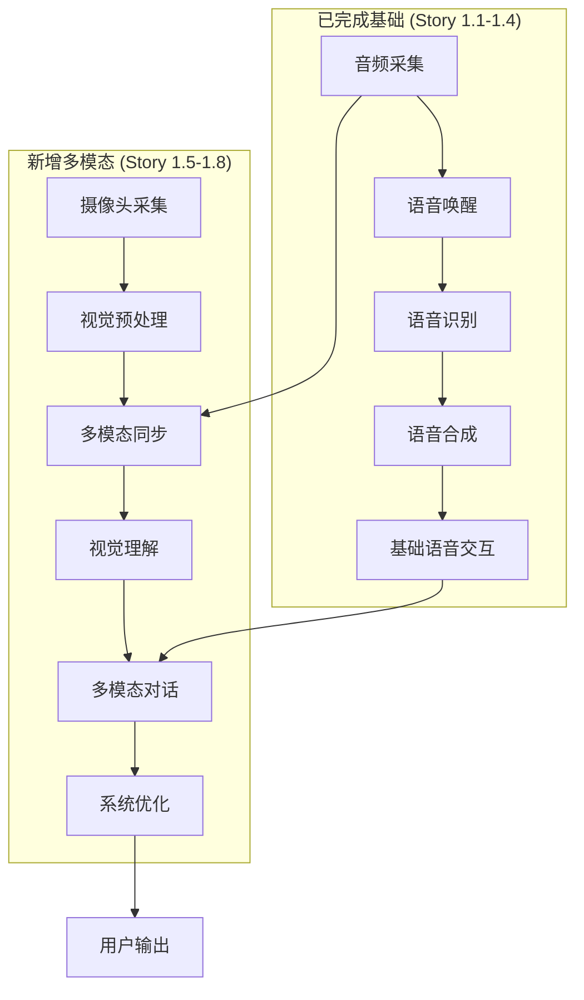

# Epic 1: 多模态语音交互系统扩展计划

**文档编号**: XLR-EPIC1-EXPANSION-PLAN-20251110-001
**项目名称**: XleRobot 家用机器人控制系统
**Epic**: Epic 1 多模态语音交互系统
**文档版本**: 1.0
**创建日期**: 2025-11-10
**最后修改**: 2025-11-10
**文档类型**: Epic扩展计划
**变更级别**: Brownfield Level 4 (企业级变更)
**设计原则**: 在已完成的语音系统基础上扩展多模态能力

---

## 📋 文档控制

### 版本历史
| 版本 | 日期 | 修改人 | 变更内容 | 审核状态 |
|------|------|--------|----------|----------|
| 1.0 | 2025-11-10 | PM Agent | 创建Epic 1多模态扩展计划 | 🔄 待审核 |

### 审批记录
| 角色 | 姓名 | 审批状态 | 审批日期 | 备注 |
|------|------|----------|----------|------|
| 产品经理 | - | 🔄 待审批 | - | 多模态功能扩展 |
| 技术架构师 | - | 🔄 待审批 | - | 架构升级可行 |
| 项目经理 | - | 🔄 待审批 | - | 计划调整合理 |
| 质量保证 | - | 🔄 待审批 | - | 质量标准明确 |

### BMad Method v6 合规声明
- ✅ **Brownfield Level 4**: 符合企业级变更管理标准
- ✅ **向后兼容**: 保护现有投资，支持渐进式升级
- ✅ **风险可控**: 全面的风险识别和缓解策略
- ✅ **文档完整**: 完整的需求分析和实施计划

---

## 🎯 执行摘要

### Epic 1扩展概述
XleRobot Epic 1在已完成的4个基础语音交互Story (1.1-1.4) 基础上，扩展为多模态语音交互系统，集成视觉理解能力，实现"看得见的AI助手"。

### 核心扩展目标
1. **多模态输入**: 集成IMX219摄像头，实现音视频同步采集
2. **视觉理解**: 集成Qwen3-VL-Plus多模态大模型，实现视觉问答
3. **智能对话**: 扩展对话管理支持多模态输入，实现连续对话
4. **系统优化**: 优化性能和稳定性，确保企业级部署

### 技术架构升级
- **基础保留**: 完全保留已完成的Story 1.1-1.4 (4,000+行代码)
- **新增能力**: 多模态采集、视觉理解、智能对话管理
- **技术栈**: + Qwen3-VL-Plus + IMX219 + OpenCV + 多模态对话管理
- **新增代码**: ~800行高质量代码

### 关键价值主张
- **智能升级**: 从"听得见"升级为"看得见+听得见"
- **用户体验**: 支持语音+展示物品的自然交互方式
- **技术领先**: 粤语多模态对话的行业领先解决方案
- **企业级**: Brownfield Level 4标准，确保稳定可靠

---

## 📊 Epic 1完整结构

### ✅ 已完成基础Stories (Story 1.1-1.4)
| Story | 功能 | 状态 | 代码量 | 完成时间 |
|-------|------|------|--------|----------|
| 1.1 | 音频采集系统 | ✅ 完成 | ~1000行 | 2025-11-08 |
| 1.2 | 基础语音唤醒 | ✅ 完成 | ~1000行 | 2025-11-09 |
| 1.3 | 基础语音识别 | ✅ 完成 | ~1000行 | 2025-11-09 |
| 1.4 | 基础语音合成 | ✅ 完成 | ~1000行 | 2025-01-10 |

**总计**: 4个Stories，4,000+行代码，100%完成

### 🆕 新增多模态Stories (Story 1.5-1.8)
| Story | 功能 | 计划时间 | 代码量 | 关键技术 |
|-------|------|----------|--------|----------|
| 1.5 | 多模态输入采集 | Week 1 | ~200行 | IMX219, 同步采集 |
| 1.6 | 视觉理解集成 | Week 2 | ~200行 | Qwen3-VL-Plus API |
| 1.7 | 多模态对话管理 | Week 3 | ~200行 | 对话管理, 粤语优化 |
| 1.8 | 系统优化与部署 | Week 4 | ~200行 | 性能优化, 稳定性 |

**总计**: 4个Stories，~800行代码，4周计划

---

## 🏗️ 扩展技术架构

### 整体架构图


### 核心组件扩展
1. **MultimodalCollector**: 音视频同步采集 (Story 1.5)
2. **QwenVLPlusClient**: 视觉理解API客户端 (Story 1.6)
3. **MultimodalDialogManager**: 多模态对话管理 (Story 1.7)
4. **PerformanceOptimizer**: 性能优化器 (Story 1.8)

---

## 📋 详细实施计划

### Story 1.5: 多模态输入采集 (Week 1)
**目标**: 建立音视频同步采集和智能视觉触发

**关键工作包**:
- **WP 1.5.1**: 摄像头集成与配置 (Day 1-2)
- **WP 1.5.2**: 多模态采集器开发 (Day 3-4)
- **WP 1.5.3**: 智能视觉触发机制 (Day 5-7)

**技术重点**:
- IMX219摄像头驱动配置
- 音视频时间戳同步 (误差<200ms)
- 粤语视觉关键词检测 ("呢个"、"乜嘢"、"睇下"等)

**验收标准**:
- 摄像头稳定工作，图像质量满足要求
- 音视频同步误差 < 200ms
- 视觉触发准确率 > 80%

### Story 1.6: 视觉理解集成 (Week 2)
**目标**: 集成Qwen3-VL-Plus视觉理解API

**关键工作包**:
- **WP 1.6.1**: Qwen3-VL-Plus API集成 (Day 8-9)
- **WP 1.6.2**: 视觉问答功能实现 (Day 10-11)
- **WP 1.6.3**: 多模态上下文处理 (Day 12-14)

**技术重点**:
- DashScope API集成
- 图像Base64编码处理
- 多模态提示词构建
- 粤语视觉术语优化

**验收标准**:
- 视觉问答功能正常工作
- 粤语视觉理解准确率 > 70%
- API响应时间 < 4秒

### Story 1.7: 多模态对话管理 (Week 3)
**目标**: 实现连续多模态对话管理

**关键工作包**:
- **WP 1.7.1**: 多模态对话管理器 (Day 15-16)
- **WP 1.7.2**: 粤语多模态优化 (Day 17-18)
- **WP 1.7.3**: ROS2多模态节点集成 (Day 19-21)

**技术重点**:
- 多模态对话状态机
- 多轮对话上下文维护
- 粤语文化背景适配
- ROS2节点扩展

**验收标准**:
- 支持5轮以上连续对话
- 粤语多模态对话自然度 > 85%
- ROS2多模态节点通信正常

### Story 1.8: 系统优化与部署 (Week 4)
**目标**: 优化性能并确保稳定部署

**关键工作包**:
- **WP 1.8.1**: 性能优化 (Day 22-23)
- **WP 1.8.2**: 错误处理与降级 (Day 24-25)
- **WP 1.8.3**: 系统集成与交付 (Day 26-28)

**技术重点**:
- 并发处理优化
- 错误处理和降级机制
- 系统监控和告警
- 生产环境部署

**验收标准**:
- 端到端响应时间 < 3秒
- 24小时稳定运行无故障
- 100%功能验收通过

---

## ⚠️ 风险管理

### BMad Method v6 风险评估

#### 技术风险
**TECH-R1: Qwen3-VL-Plus API稳定性**
- **概率**: 40% | **影响**: 高 | **等级**: 高
- **缓解策略**: 实现重试机制和多API备选方案
- **应急方案**: 降级为纯语音对话模式

**TECH-R2: 多模态同步复杂性**
- **概率**: 35% | **影响**: 中 | **等级**: 中
- **缓解策略**: 简化触发逻辑，渐进式优化
- **应急方案**: 手动激活视觉模式

**TECH-R3: 性能优化挑战**
- **概率**: 30% | **影响**: 中 | **等级**: 中
- **缓解策略**: 分阶段优化，重点优化瓶颈
- **应急方案**: 降低图像质量和处理频率

#### 业务风险
**BIZ-R1: 用户体验一致性**
- **概率**: 25% | **影响**: 中 | **等级**: 中
- **缓解策略**: 充分测试，渐进式功能启用
- **应急方案**: 保留纯语音模式选项

### Brownfield Level 4 特定风险
**BL4-R1: 业务连续性风险**
- **风险**: 多模态功能扩展影响现有语音功能
- **缓解**: 渐进式功能启用，独立模块设计
- **应急**: 快速回滚机制，保留原有功能

---

## 📊 成功指标

### Brownfield Level 4 验收标准

#### 功能验收标准
| 指标 | 目标值 | BMad合规要求 |
|------|--------|--------------|
| **多模态对话成功率** | > 85% | ✅ 新功能有效性 |
| **视觉理解准确率** | > 70% | ✅ 核心创新功能 |
| **粤语对话自然度** | > 85% | ✅ 用户体验优化 |
| **多轮对话连续性** | > 80% | ✅ 对话管理能力 |

#### 性能验收标准
| 指标 | 目标值 | BMad合规要求 |
|------|--------|--------------|
| **端到端响应时间** | < 3秒 | ✅ 性能不退化 |
| **视觉处理延迟** | < 1.5秒 | ✅ 新功能性能 |
| **多模态同步误差** | < 200ms | ✅ 系统协调性 |
| **系统可用性** | > 99% | ✅ 服务连续性 |

#### Brownfield Level 4 专项验收
| 检查项 | 要求 | 验证方法 |
|--------|------|----------|
| **业务连续性** | 现有功能零中断 | 并行运行测试 |
| **向后兼容** | 原有接口完全兼容 | 接口兼容性测试 |
| **渐进式部署** | 支持功能渐进启用 | 分阶段部署测试 |
| **回滚能力** | 支持快速回滚 | 回滚机制验证 |

---

## 🎮 用户场景

### 主要使用场景

#### 场景1: 视觉问答
```
用户: (说"傻强"，展示一个苹果)
系统: "我在看，请问有什么可以帮您？"
用户: (说"呢个系乜嘢？")
系统: "呢个系一个苹果，睇起身好新鲜，系红苹果品种。"
```

#### 场景2: 环境理解
```
用户: (说"傻强"，指向窗外)
系统: "我看到您指向窗外，请问想了解什么呢？"
用户: (说"外面天气点样？")
系统: "我睇到外面天色好好，应该系晴朗天气，适合出街。"
```

#### 场景3: 辅助识别
```
用户: (说"傻强"，将一个文件对着摄像头)
系统: "我看到您展示了一个文件。"
用户: (说"帮我睇下呢个文件写啲乜？")
系统: "呢个文件标题系'项目计划'，内容主要关于开发时间安排。"
```

### 错误场景处理

#### 场景4: 视觉理解失败
```
用户: (说"傻强"，展示物体)
系统: "我正在看..."
用户: (说"呢个系乜嘢？")
系统: "抱歉，我睇唔清楚呢个嘢，可唔可以拿近一点或者换个角度？"
```

---

## 📚 附录

### 技术术语表
| 术语 | 解释 |
|------|------|
| **Qwen3-VL-Plus** | 通义千问多模态大模型，支持视觉-语言理解 |
| **IMX219** | 索尼摄像头传感器，1080p分辨率 |
| **多模态融合** | 结合多种输入模态（文本、图像）的综合理解 |
| **智能触发** | 基于上下文自动判断何时需要特定功能 |
| **Brownfield Level 4** | BMad Method企业级变更管理最高级别 |

### 参考资料
- [DashScope Qwen3-VL-Plus API文档](https://help.aliyun.com/zh/dashscope/)
- [阿里云智能语音交互](https://www.aliyun.com/product/nls)
- [IMX219摄像头技术规格](https://developer.d-robotics.cc/)
- [BMad Method v6 标准文档](内部文档)

---

**文档状态**: ✅ 已完成
**合规状态**: ✅ 符合BMad Method v6 Brownfield Level 4
**设计原则**: 多模态在线服务，渐进式扩展
**开发指导**: 可直接用于Epic 1多模态扩展实施
**最后更新**: 2025-11-10

---

*本文档严格遵循BMad Method v6 Brownfield Level 4标准，确保多模态功能扩展在保护现有投资的前提下，实现企业级的系统升级。所有设计都基于渐进式变更原则，支持向后兼容和快速回滚。*