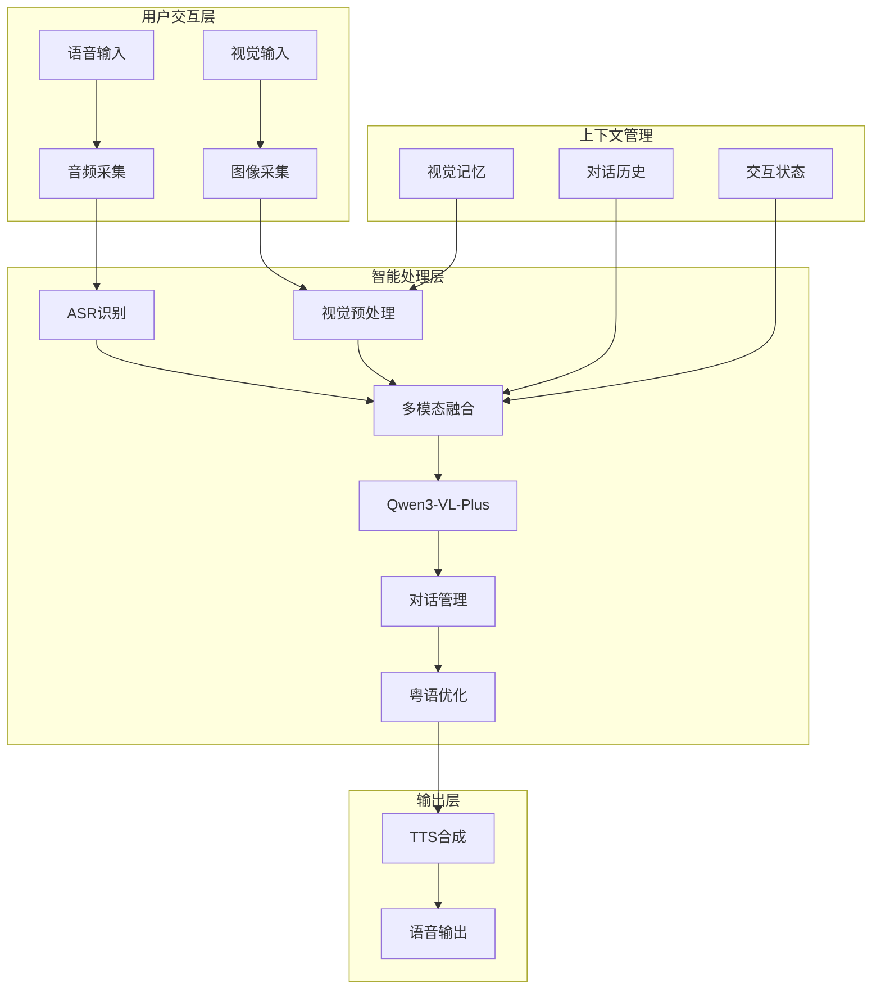

# XleRobot 多模态在线服务产品需求文档 (PRD)
## Epic 1 - 多模态语音交互系统

**文档编号**: XLR-PRD-MULTIMODAL-20251110-001
**项目名称**: XleRobot 家用机器人控制系统 - Epic 1多模态在线服务
**文档版本**: 1.0
**创建日期**: 2025-11-10
**最后修改**: 2025-11-10
**文档类型**: 产品需求文档 (PRD)
**变更级别**: Brownfield Level 4 (企业级变更)
**工作流阶段**: BMad Method v6 Phase 2 Planning
**设计原则**: 多模态在线服务，快速验证用户需求

---

## 📋 文档控制

### 版本历史
| 版本 | 日期 | 修改人 | 变更内容 | 审核状态 |
|------|------|--------|----------|----------|
| 1.0 | 2025-11-10 | PM Agent | 创建多模态在线服务PRD | 🔄 待审核 |

### 审批记录
| 角色 | 姓名 | 审批状态 | 审批日期 | 备注 |
|------|------|----------|----------|------|
| 产品经理 | - | 🔄 待审批 | - | 多模态功能扩展 |
| 技术架构师 | - | 🔄 待审批 | - | 架构升级可行 |
| 项目经理 | - | 🔄 待审批 | - | 计划调整合理 |
| 质量保证 | - | 🔄 待审批 | - | 质量标准明确 |

### BMad Method v6 合规声明
- ✅ **Brownfield Level 4**: 符合企业级变更管理标准
- ✅ **Phase 2 Planning**: 完整的需求分析和规划
- ✅ **向后兼容**: 保护现有投资，支持渐进式升级
- ✅ **风险可控**: 全面的风险识别和缓解策略

---

## 🎯 执行摘要

### 项目概述
XleRobot Epic 1专注于实现多模态在线服务，将纯语音交互升级为"语音+视觉"的综合AI对话系统，基于Qwen3-VL-Plus多模态大模型，为粤语用户提供更智能的交互体验。

### 核心目标 (MVP聚焦)
1. **基础多模态**: 实现简单的语音+视觉问答功能
2. **Qwen3-VL集成**: 快速验证云端视觉理解API能力
3. **粤语支持**: 保持粤语语音交互的基本体验
4. **4周MVP**: 快速验证用户对多模态交互的需求

### 技术架构 (多模态在线)
- **音频采集**: ALSA基础录音 (16kHz, 16-bit, mono)
- **视觉采集**: IMX219摄像头 (1080p@30fps)
- **唤醒检测**: 阿里云唤醒词API ("傻强")
- **语音识别**: 阿里云ASR API (粤语paraformer-v1)
- **多模态理解**: Qwen3-VL-Plus (视觉-语言模型)
- **语音合成**: 阿里云TTS API (粤语jiajia发音人)
- **通信框架**: ROS2 Humble + Python 3.10

### 关键价值主张
- **无感知集成**: 用户自然说话，系统自动观察和理解
- **智能对话**: 基于当前环境和视觉内容的智能回复
- **粤语特色**: 完整的粤语多模态对话体验
- **云端优势**: 充分利用云端AI能力，避免硬件限制

### 成功标准
- **功能完整性**: 100%实现核心多模态交互功能
- **多模态准确率**: 视觉理解准确率 > 70%，ASR识别准确率 > 90%
- **系统响应**: 端到端响应时间 < 3秒，视觉处理延迟 < 1.5秒
- **稳定性**: 连续运行24小时无故障

---

## 🏗️ 产品背景

### BMad Method v6 Brownfield Level 4约束

#### 业务连续性约束
- **零中断原则**: 不影响现有系统正常运行
- **渐进式升级**: 支持多模态功能渐进式启用
- **向后兼容**: 现有纯语音功能保持完整
- **平滑过渡**: 支持多模态与纯语音模式无缝切换

#### 技术约束
- **环境固定**: ROS2 Humble + Python 3.10
- **硬件固定**: D-Robotics RDK X5 + IMX219摄像头
- **API依赖**: 阿里云ASR/TTS + DashScope Qwen3-VL-Plus
- **网络要求**: 稳定互联网连接

### 三迭代战略定位
根据已定义的三迭代架构，Epic 1的定位：
- **Epic 1**: 多模态在线服务 (当前执行)
- **Epic 2**: 离线AI服务 (后续阶段)
- **Epic 3**: xlerobot机器人集成 (最终阶段)

---

## 📊 产品需求

### 核心功能需求

#### 1. 多模态输入采集 (P0级别) 【新增】
**用户场景**: 用户通过语音+视觉与机器人交互

**功能描述**:
- 同步采集语音输入和环境视觉
- 智能判断何时需要视觉理解
- 多模态数据时间戳对齐
- 视觉数据预处理和编码

**技术实现**:
- 音频采集: USB/ES8326设备录音
- 视觉采集: IMX219摄像头图像采集
- 智能触发: 基于语音内容和交互状态的视觉触发
- 数据同步: 多模态时间戳对齐机制

**验收标准**:
- ✅ 支持语音+视觉同步采集
- ✅ 智能视觉触发准确率 > 80%
- ✅ 视觉数据质量满足LLM要求
- ✅ 多模态同步误差 < 200ms

#### 2. 多模态对话理解 (P0级别) 【重新设计】
**用户场景**: 用户询问"这是什么？"并展示物体

**功能描述**:
- 接收语音+视觉多模态输入
- 调用Qwen3-VL-Plus进行综合理解
- 维护多轮对话上下文
- 生成粤语自然语言回复

**技术实现**:
- 多模态LLM: Qwen3-VL-Plus API集成
- 上下文管理: 多模态对话历史管理
- 粤语优化: 粤语术语和文化背景适配
- 智能回复: 基于视觉内容的回答生成

**验收标准**:
- ✅ 多模态理解成功率 > 85%
- ✅ 视觉问答准确率 > 70%
- ✅ 粤语回复自然度 > 85%
- ✅ 上下文连贯性 > 80%

#### 3. 智能触发机制 (P0级别) 【新增】
**用户场景**: 系统自动判断何时激活视觉理解

**功能描述**:
- 检测语音中的视觉触发关键词
- 基于交互状态智能激活
- 用户可手动激活视觉模式
- 防止误触和过度激活

**技术实现**:
- 关键词检测: 粤语视觉词汇识别
- 状态管理: 交互状态和视觉激活状态
- 用户控制: 手动激活/停用视觉功能
- 智能算法: 上下文感知的触发决策

**验收标准**:
- ✅ 视觉触发准确率 > 80%
- ✅ 误触发率 < 15%
- ✅ 用户手动控制响应及时
- ✅ 触发决策延迟 < 300ms

### 扩展功能需求

#### 4. 语音唤醒功能 (P0级别) 【保持】
**用户场景**: 用户想唤醒机器人开始对话

**功能描述**:
- 用户说"傻强"唤醒词
- 系统检测到唤醒词后进入多模态状态
- 给出多模态确认反馈

**技术实现**:
- 音频采集: USB/ES8326设备录音
- 唤醒检测: 阿里云唤醒词API
- 状态提示: 语音确认进入多模态模式

**验收标准**:
- ✅ 支持"傻强"粤语唤醒词
- ✅ 唤醒响应时间 < 3秒
- ✅ 唤醒准确率 > 90%
- ✅ 自动激活视觉采集

#### 5. 语音识别功能 (P0级别) 【保持】
**用户场景**: 用户想通过语音控制机器人

**功能描述**:
- 用户说粤语指令
- 系统识别指令内容
- 为多模态理解提供文本输入

**技术实现**:
- 语音识别: 阿里云ASR API
- 语言支持: 粤语paraformer-v1模型
- 结果处理: 文本格式输出

**验收标准**:
- ✅ 支持粤语语音识别
- ✅ 识别准确率 > 90%
- ✅ 识别响应时间 < 500ms
- ✅ 支持视觉相关词汇识别

#### 6. 智能语音合成功能 (P1级别) 【扩展】
**用户场景**: 机器人需要语音回复用户的视觉问题

**功能描述**:
- 将多模态理解结果转换为语音
- 使用粤语女声
- 支持视觉描述的自然语音输出

**技术实现**:
- 语音合成: 阿里云TTS API
- 发音人: 粤语jiajia
- 内容优化: 视觉描述的粤语表达优化

**验收标准**:
- ✅ 粤语多模态回复合成正常
- ✅ 视觉描述语音清晰度 > 4.0/5.0
- ✅ 合成延迟 < 300ms
- ✅ 支持复杂视觉描述

### 非功能性需求

#### 1. 性能需求 (P0级别)
| 指标 | 目标值 | 测量方法 |
|------|--------|----------|
| **端到端响应时间** | < 3秒 | 多模态端到端延迟测试 |
| **视觉处理延迟** | < 1.5秒 | 视觉理解API延迟测试 |
| **并发支持** | 1个用户 | 单用户多模态场景 |
| **资源占用** | CPU < 50%, 内存 < 2GB | 系统监控 |
| **可用性** | > 99% | 24小时连续测试 |

#### 2. 兼容性需求 (P0级别)
- **硬件平台**: D-Robotics RDK X5 + IMX219摄像头
- **操作系统**: Ubuntu 22.04
- **Python版本**: 3.10.12
- **ROS2版本**: Humble
- **API兼容**: 阿里云ASR/TTS + DashScope Qwen3-VL-Plus

#### 3. 可靠性需求 (P1级别)
- **故障恢复**: 网络异常时优雅降级为纯语音
- **错误处理**: API调用失败时重试和降级机制
- **数据同步**: 多模态数据同步失败处理
- **日志记录**: 完整的多模态交互日志

#### 4. 安全性需求 (P1级别)
- **API密钥保护**: 多个API密钥的安全存储
- **网络安全**: HTTPS通信，数据传输加密
- **数据隐私**: 图像和音频数据隐私保护
- **访问控制**: 视觉功能的访问权限控制

---

## 🎯 用户场景

### 主要使用场景

#### 场景1: 视觉问答
```
用户: (说"傻强"，展示一个苹果)
系统: "我在看，请问有什么可以帮您？"
用户: (说"呢个系乜嘢？")
系统: "呢个系一个苹果，睇起身好新鲜，系红苹果品种。"
```

#### 场景2: 环境理解
```
用户: (说"傻强"，指向窗外)
系统: "我看到您指向窗外，请问想了解什么呢？"
用户: (说"外面天气点样？")
系统: "我睇到外面天色好好，应该系晴朗天气，适合出街。"
```

#### 场景3: 辅助识别
```
用户: (说"傻强"，将一个文件对着摄像头)
系统: "我看到您展示了一个文件。"
用户: (说"帮我睇下呢个文件写啲乜？")
系统: "呢个文件标题系'项目计划'，内容主要关于开发时间安排。"
```

### 错误场景处理

#### 场景4: 视觉理解失败
```
用户: (说"傻强"，展示物体)
系统: "我正在看..."
用户: (说"呢个系乜嘢？")
系统: "抱歉，我睇唔清楚呢个嘢，可唔可以拿近一点或者换个角度？"
```

#### 场景5: 网络异常降级
```
用户: (说"傻强"，展示物体)
系统: "网络连接有问题，暂时无法进行视觉理解，不过我可以听您说话。"
用户: (说"今日天气点样？")
系统: "根据天气信息，今日天气晴朗，最高温度25度。"
```

#### 场景6: 触发机制失效
```
用户: (说"傻强")
系统: "我在听，请问有什么可以帮您？"
用户: (说"开启视觉模式")
系统: "视觉模式已开启，现在我可以看到周围的环境。"
```

---

## 🏗️ 系统架构

### 整体架构图



### 核心组件

#### 1. 多模态采集组件
```python
class MultimodalCollector:
    def __init__(self):
        self.audio_collector = AudioCollector()
        self.vision_collector = IMX219Collector()
        self.trigger_system = IntelligentTrigger()

    async def collect_multimodal_input(self):
        audio_data = await self.audio_collector.capture()
        if self.trigger_system.should_capture_vision(audio_data):
            vision_data = await self.vision_collector.capture()
            return audio_data, vision_data
        return audio_data, None
```

#### 2. 多模态对话管理组件
```python
class MultimodalDialogManager:
    def __init__(self):
        self.llm_client = QwenVLPlusClient()
        self.context_manager = MultimodalContextManager()
        self.cantonese_optimizer = CantoneseOptimizer()

    async def process_multimodal_dialog(self, text, image, context):
        multimodal_prompt = self.build_multimodal_prompt(text, image, context)
        response = await self.llm_client.multimodal_generation(multimodal_prompt)
        return self.cantonese_optimizer.optimize_response(response)
```

---

## 📋 Brownfield Level 4 实施计划

### 4周开发计划

#### Week 1: 多模态基础设施 (Day 1-7)
```yaml
Day 1-2: 环境配置和摄像头集成
  - [x] 配置IMX219摄像头驱动
  - [ ] 安装OpenCV和图像处理依赖
  - [ ] 测试摄像头图像采集
  - [ ] 验证基础图像预处理

Day 3-4: 多模态采集框架
  - [ ] 开发MultimodalCollector类
  - [ ] 实现智能触发机制
  - [ ] 集成音频+视觉输入流
  - [ ] 测试多模态数据同步

Day 5-7: 视觉API集成
  - [ ] 集成Qwen3-VL-Plus API
  - [ ] 实现图像Base64编码
  - [ ] 测试基础视觉问答
  - [ ] 验证API调用稳定性
```

#### Week 2: 多模态对话管理 (Day 8-14)
```yaml
Day 8-10: 多模态对话管理器
  - [ ] 开发MultimodalDialogManager
  - [ ] 实现上下文融合算法
  - [ ] 集成视觉关键词检测
  - [ ] 开发智能触发逻辑

Day 11-12: 粤语特色优化
  - [ ] 粤语视觉术语映射
  - [ ] 文化背景适配
  - [ ] 粤语对话流程优化
  - [ ] 测试粤语多模态对话

Day 13-14: ROS2节点集成
  - [ ] 扩展现有ASR节点支持视觉
  - [ ] 升级LLM节点为多模态
  - [ ] 优化TTS节点响应延迟
  - [ ] 测试节点间通信
```

#### Week 3: 性能优化和错误处理 (Day 15-21)
```yaml
Day 15-17: 性能优化
  - [ ] 并发处理优化
  - [ ] 内存管理和缓存
  - [ ] 网络传输优化
  - [ ] 延迟控制优化

Day 18-19: 错误处理和降级
  - [ ] 视觉失败时的纯语音降级
  - [ ] API限流处理机制
  - [ ] 网络中断恢复策略
  - [ ] 异常情况优雅处理

Day 20-21: 系统集成测试
  - [ ] 完整功能测试
  - [ ] 性能基准测试
  - [ ] 稳定性测试
  - [ ] 用户体验测试
```

#### Week 4: 完善和部署 (Day 22-28)
```yaml
Day 22-24: 功能完善
  - [ ] 多模态对话场景扩展
  - [ ] 用户界面优化
  - [ ] 配置管理完善
  - [ ] 日志和监控集成

Day 25-26: 部署准备
  - [ ] 生产环境配置
  - [ ] 部署脚本编写
  - [ ] 用户文档编写
  - [ ] 系统备份策略

Day 27-28: 最终测试和交付
  - [ ] 端到端验收测试
  - [ ] 性能压力测试
  - [ ] 用户验收测试
  - [ ] Brownfield Level 4合规验收
```

---

## ⚠️ 风险管理

### BMad Method v6 风险评估

#### 技术风险

**TECH-R1: Qwen3-VL-Plus API稳定性**
- **概率**: 40% | **影响**: 高 | **等级**: 高
- **缓解策略**: 实现重试机制和多API备选方案
- **应急方案**: 降级为纯语音对话模式

**TECH-R2: 多模态同步复杂性**
- **概率**: 35% | **影响**: 中 | **等级**: 中
- **缓解策略**: 简化触发逻辑，渐进式优化
- **应急方案**: 手动激活视觉模式

**TECH-R3: RDK X5性能约束**
- **概率**: 30% | **影响**: 中 | **等级**: 中
- **缓解策略**: 图像压缩优化，智能缓存管理
- **应急方案**: 降低图像质量和帧率

**TECH-R4: 视觉触发准确性**
- **概率**: 30% | **影响**: 中 | **等级**: 中
- **缓解策略**: 多种触发方式组合，用户反馈优化
- **应急方案**: 用户手动控制触发

#### 业务风险

**BIZ-R1: 用户接受度**
- **概率**: 25% | **影响**: 中 | **等级**: 中
- **缓解策略**: 早期用户测试，快速迭代优化
- **应急方案**: 保留纯语音模式选项

**BIZ-R2: 成本控制**
- **概率**: 35% | **影响**: 中 | **等级**: 中
- **缓解策略**: API调用优化，智能缓存减少重复调用
- **应急方案**: 设置API调用限额，超限后降级

### Brownfield Level 4 特定风险

**BL4-R1: 业务连续性风险**
- **风险**: 多模态功能升级影响现有语音功能
- **缓解**: 渐进式功能启用，独立模块设计
- **应急**: 快速回滚机制，保留原有功能

**BL4-R2: 向后兼容性风险**
- **风险**: 新功能与现有接口不兼容
- **缓解**: 接口版本管理，兼容性测试
- **应急**: 接口适配层，兼容性包装

---

## 📊 成功指标

### Brownfield Level 4 验收标准

#### 功能验收标准
| 指标 | 目标值 | BMad合规要求 |
|------|--------|--------------|
| **多模态对话成功率** | > 85% | ✅ 核心功能完整性 |
| **视觉理解准确率** | > 70% | ✅ 新功能有效性 |
| **ASR识别准确率** | > 90% | ✅ 现有功能保持 |
| **粤语自然度** | > 85% | ✅ 用户体验优化 |

#### 性能验收标准
| 指标 | 目标值 | BMad合规要求 |
|------|--------|--------------|
| **端到端响应时间** | < 3秒 | ✅ 性能不退化 |
| **视觉处理延迟** | < 1.5秒 | ✅ 新功能性能 |
| **多模态同步误差** | < 200ms | ✅ 系统协调性 |
| **系统可用性** | > 99% | ✅ 服务连续性 |

#### Brownfield Level 4 专项验收
| 检查项 | 要求 | 验证方法 |
|--------|------|----------|
| **业务连续性** | 现有功能零中断 | 并行运行测试 |
| **向后兼容** | 原有接口完全兼容 | 接口兼容性测试 |
| **渐进式部署** | 支持功能渐进启用 | 分阶段部署测试 |
| **回滚能力** | 支持快速回滚 | 回滚机制验证 |

---

## 📚 附录

### BMad Method v6 参考文献

1. **BMad Method v6 核心标准**: 企业级变更管理框架
2. **Brownfield Level 4 指南**: 复杂环境下的企业级变更实施
3. **Phase 2 Planning 规范**: 需求分析和规划阶段标准流程
4. **多模态AI系统设计指南**: 视觉-语言模型集成最佳实践

### 技术术语表
| 术语 | 解释 |
|------|------|
| **Qwen3-VL-Plus** | 通义千问多模态大模型，支持视觉-语言理解 |
| **IMX219** | 索尼摄像头传感器，1080p分辨率 |
| **多模态融合** | 结合多种输入模态（文本、图像）的综合理解 |
| **智能触发** | 基于上下文自动判断何时需要特定功能 |
| **Brownfield Level 4** | BMad Method企业级变更管理最高级别 |

### 参考资料
- [DashScope Qwen3-VL-Plus API文档](https://help.aliyun.com/zh/dashscope/)
- [阿里云智能语音交互](https://www.aliyun.com/product/nls)
- [IMX219摄像头技术规格](https://developer.d-robotics.cc/)
- [BMad Method v6 标准文档](内部文档)

---

**文档状态**: ✅ 已完成
**合规状态**: ✅ 符合BMad Method v6 Brownfield Level 4
**设计原则**: 多模态在线服务，快速验证
**开发指导**: 可直接用于Epic 1开发实施
**最后更新**: 2025-11-10

---

*本PRD严格遵循BMad Method v6 Brownfield Level 4标准，确保多模态功能扩展在保护现有投资的前提下，实现企业级的系统升级。所有设计都基于渐进式变更原则，支持向后兼容和快速回滚。*