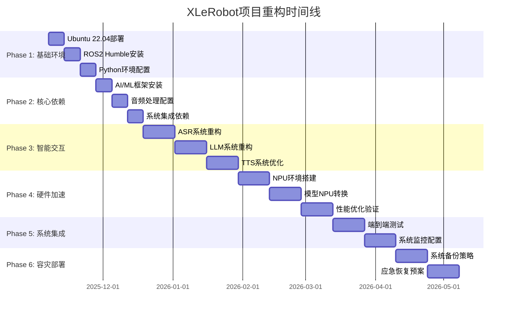

# XLeRobot智能语音机器人 - 项目文档集

## 📖 文档导航

欢迎来到XLeRobot智能语音机器人项目的完整文档集。本文档集提供了项目的全面技术文档、架构设计和实施指南。

---

## 🏠 项目概览

**项目名称**: XLeRobot智能语音机器人系统  
**项目类型**: Software - 机器人控制系统 (Level 4 企业级)  
**技术栈**: Ubuntu 22.04 + ROS2 Humble + Python 3.10.12  
**核心功能**: 粤语语音交互、智能对话、机器人控制  
**文档版本**: v1.0  
**生成时间**: 2025-11-07  

### 🎯 项目特色

- 🎤 **粤语语音识别**: 基于SenseVoiceSmall的高精度ASR系统
- 🧠 **智能对话**: 集成通义千问大语言模型，支持自然对话  
- 🔊 **语音合成**: Piper VITS粤语TTS，清晰自然的语音输出
- 🚀 **硬件加速**: RDK X5 NPU/BPU加速，提升推理性能
- 🤖 **机器人控制**: 完整的机器人运动控制和环境感知
- 📹 **视觉系统**: IMX219摄像头视觉处理能力
- 🏠 **智能家居**: 集成智能家居控制功能

---

## 📚 文档结构

### 🎯 [项目概览](./项目概览.md)
项目的总体介绍，包括基本信息、核心特性、项目目标、系统架构、当前状态等。

### 🔧 [技术栈文档](./技术栈文档.md)
详细的技术栈分析，包括操作系统、编程语言、AI模型、硬件加速等各个技术组件的详细说明。

### 🏗️ [架构分析](./架构分析.md)
系统架构的深入分析，包括整体架构设计、核心组件、性能优化、安全架构、部署架构等。

### 📁 [代码结构分析](./代码结构分析.md)
代码组织和结构的详细分析，包括目录结构、设计模式、通信机制、异步处理、错误处理等。

### 🚀 [项目重构规划](./项目重构规划.md)
基于重构SOP的完整项目规划，包括重构目标、实施计划、验收标准、风险评估、质量保证等。

---

## 🗺️ 快速导航

### 🔍 按角色查看文档

#### 👨‍💻 开发者
- [项目概览](./项目概览.md) → 了解项目基本情况
- [技术栈文档](./技术栈文档.md) → 掌握技术栈和依赖
- [代码结构分析](./代码结构分析.md) → 理解代码组织结构
- [架构分析](./架构分析.md) → 深入系统架构

#### 🏗️ 架构师
- [架构分析](./架构分析.md) → 核心架构文档
- [技术栈文档](./技术栈文档.md) → 技术选型分析
- [项目重构规划](./项目重构规划.md) → 重构架构设计
- [代码结构分析](./代码结构分析.md) → 代码架构实现

#### 🚀 项目经理
- [项目概览](./项目概览.md) → 项目整体信息
- [项目重构规划](./项目重构规划.md) → 完整实施计划
- [架构分析](./架构分析.md) → 技术架构决策
- [技术栈文档](./技术栈文档.md) → 技术风险评估

#### 🔧 运维工程师
- [技术栈文档](./技术栈文档.md) → 环境和依赖管理
- [架构分析](./架构分析.md) → 部署和监控架构
- [项目重构规划](./项目重构规划.md) → 容灾和备份策略
- [代码结构分析](./代码结构分析.md) → 部署代码结构

### 🔍 按主题查看文档

#### 🤖 核心功能模块
- **ASR语音识别**: [项目概览](./项目概览.md#核心特性) → [架构分析](./架构分析.md#语音交互架构)
- **LLM智能对话**: [项目概览](./项目概览.md#核心特性) → [架构分析](./架构分析.md#大语言模型架构)
- **TTS语音合成**: [项目概览](./项目概览.md#核心特性) → [架构分析](./架构分析.md#文本转语音架构)
- **机器人控制**: [项目概览](./项目概览.md#系统架构) → [架构分析](./架构分析.md#机器人控制架构)

#### ⚡ 性能优化
- **NPU硬件加速**: [技术栈文档](./技术栈文档.md#硬件加速技术) → [架构分析](./架构分析.md#npu-bpu加速架构)
- **异步处理架构**: [代码结构分析](./代码结构分析.md#异步处理架构) → [架构分析](./架构分析.md#性能优化架构)
- **缓存机制**: [架构分析](./架构分析.md#缓存架构) → [代码结构分析](./代码结构分析.md#性能优化代码结构)

#### 🛡️ 系统可靠性
- **容错设计**: [架构分析](./架构分析.md#容灾与高可用架构) → [代码结构分析](./代码结构分析.md#错误处理架构)
- **监控体系**: [架构分析](./架构分析.md#监控与运维架构) → [项目重构规划](./项目重构规划.md#系统监控配置)
- **备份恢复**: [项目重构规划](./项目重构规划.md#容灾备份部署) → [架构分析](./架构分析.md#高可用架构)

---

## 🎯 重构实施路线图

### 📅 重构时间轴



### 🎯 关键里程碑

| 里程碑 | 时间 | 主要交付 | 状态 |
|--------|------|----------|------|
| **M1: 基础环境** | Week 2 | Ubuntu+ROS2+Python环境 | 📋 计划中 |
| **M2: 核心依赖** | Week 4 | AI/音频/网络依赖 | 📋 计划中 |
| **M3: ASR重构** | Week 6 | ASR模块重构完成 | 📋 计划中 |
| **M4: LLM重构** | Week 8 | LLM模块重构完成 | 📋 计划中 |
| **M5: TTS优化** | Week 10 | TTS模块优化完成 | 📋 计划中 |
| **M6: NPU加速** | Week 12 | NPU加速集成完成 | 📋 计划中 |
| **M7: 系统集成** | Week 14 | 端到端集成完成 | 📋 计划中 |
| **M8: 容灾部署** | Week 16 | 备份恢复系统完成 | 📋 计划中 |

---

## 📊 项目状态总览

### 🔧 技术栈状态

| 技术组件 | 版本 | 状态 | 重构优先级 |
|---------|------|------|------------|
| **操作系统** | Ubuntu 22.04 LTS | 🔄 待重构 | P0 |
| **ROS框架** | ROS2 Humble | 🔄 待重构 | P0 |
| **编程语言** | Python 3.10.12 | 🔄 待重构 | P0 |
| **ASR引擎** | SenseVoiceSmall | ⚠️ 需修复 | P0 |
| **LLM引擎** | 通义千问API | ❌ 需重构 | P0 |
| **TTS引擎** | Piper VITS | ✅ 正常 | P1 |
| **音频处理** | PyAudio | ✅ 正常 | P1 |
| **视觉模块** | IMX219 | ✅ 正常 | P1 |
| **NPU加速** | RDK X5 | 🚀 规划中 | P2 |

### 📈 性能指标目标

| 指标 | 目标值 | 当前值 | 状态 |
|------|--------|--------|------|
| **ASR响应时间** | <2秒(CPU) / <0.5秒(NPU) | ~3.5秒 | ⚠️ 需优化 |
| **TTS合成时间** | <1秒(CPU) / <0.3秒(NPU) | ~1.2秒 | ⚠️ 需优化 |
| **LLM响应时间** | <3秒 | ~4秒 | ⚠️ 需优化 |
| **完整交互延迟** | <5秒(CPU) / <2秒(NPU) | ~8秒 | ❌ 需大幅优化 |
| **粤语识别准确率** | >85% | ~70% | ⚠️ 需提升 |
| **系统稳定性** | >24小时无崩溃 | ~12小时 | ❌ 需改进 |

### 🎯 重构重点

#### 🔴 P0 - 关键重构项目
1. **Ubuntu 22.04系统重新部署** - 确保环境一致性
2. **ASR系统完全重构** - 修复模型加载和识别问题
3. **LLM API重新集成** - 恢复智能对话功能
4. **NPU加速实施** - 实现性能大幅提升

#### 🟡 P1 - 重要优化项目
1. **TTS系统优化** - 提升语音质量和性能
2. **音频处理增强** - 改善输入输出质量
3. **系统集成测试** - 确保端到端功能正常
4. **监控体系建设** - 建立完整的运维监控

#### 🟢 P2 - 增强功能项目
1. **视觉模块集成** - 实现图像处理能力
2. **运动控制系统** - 完成机器人控制功能
3. **智能家居集成** - 实现设备控制能力
4. **用户界面优化** - 提升用户体验

---

## 🔍 文档使用指南

### 📖 如何阅读文档

1. **新手入门**: 从[项目概览](./项目概览.md)开始，了解项目基本情况
2. **技术开发**: 阅读[技术栈文档](./技术栈文档.md)和[代码结构分析](./代码结构分析.md)
3. **架构设计**: 重点查看[架构分析](./架构分析.md)和[项目重构规划](./项目重构规划.md)
4. **项目实施**: 严格按照[项目重构规划](./项目重构规划.md)的时间节点执行

### 🔍 文档搜索技巧

- 使用目录快速定位相关章节
- 按角色和主题分类查找相关内容
- 关注"🎯"、"⚡"、"🛡️"等标记的重点内容
- 参考代码示例和配置模板

### 📝 文档贡献

- 如发现问题或建议，请及时反馈
- 欢迎贡献技术文档和最佳实践
- 保持文档的及时更新和维护
- 遵循文档编写规范和格式要求

---

## 🛠️ 开发环境快速搭建

### 🎯 环境要求

```bash
# 系统要求
- Ubuntu 22.04 LTS
- 内存: >=8GB
- 存储: >=100GB
- 网络: 稳定连接
- 音频设备: 麦克风+扬声器

# 硬件要求 (可选)
- RDK X5 NPU开发板
- IMX219摄像头
- 机器人硬件平台
```

### 🚀 快速开始

```bash
# 1. 克隆项目
git clone <repository-url>
cd xlerobot

# 2. 阅读重构SOP
cat xlerobot-project-reconstruction-sop.md

# 3. 查看项目文档
ls docs/project-docs/

# 4. 开始环境搭建 (按照重构规划执行)
# 详见: 项目重构规划.md → Phase 1: 基础环境搭建
```

### 📚 相关资源

- **重构SOP**: `xlerobot-project-reconstruction-sop.md`
- **BMAD工作流**: `bmad/bmm/workflows/`
- **项目源码**: `src/`
- **AI模型**: `MODELS/`
- **测试脚本**: `tests/`

---

## 📞 联系与支持

### 👥 项目团队

- **项目负责人**: Jody (sunrise)
- **技术架构**: Dev Agent Team
- **开发团队**: 多个功能模块开发组
- **测试团队**: 质量保证与验证
- **运维团队**: 部署与监控

### 🔗 相关链接

- **项目路径**: `/home/sunrise/xlerobot`
- **文档路径**: `/home/sunrise/xlerobot/docs/project-docs/`
- **工作目录**: `/home/sunrise/xlerobot`
- **重构SOP**: `xlerobot-project-reconstruction-sop.md`

### 📋 文档信息

- **文档版本**: v1.0
- **生成时间**: 2025-11-07
- **下次更新**: 2025-12-07
- **维护团队**: 项目开发团队
- **文档格式**: Markdown + Mermaid图表

---

## 🎯 下一步行动

### 📋 立即行动项

1. **📖 阅读重构SOP**: 详细了解重构标准和流程
2. **🏗️ 查看架构文档**: 理解系统设计和技术选型
3. **📊 评估当前环境**: 确认重构前的系统状态
4. **🗓️ 制定执行计划**: 根据重构规划制定详细时间表

### 🚀 本周重点

1. **环境准备**: 开始Ubuntu 22.04系统部署
2. **团队组建**: 确定重构项目团队成员
3. **工具准备**: 准备开发和测试环境
4. **文档熟悉**: 团队成员熟悉项目文档

---

**🎯 重构成功标准**: 零风险部署、完整功能恢复、NPU性能提升、容灾能力完备！

**📞 如有问题，请联系项目团队或查阅相关技术文档。**

---

*本文档最后更新: 2025-11-07*  
*文档维护: XLeRobot项目团队*