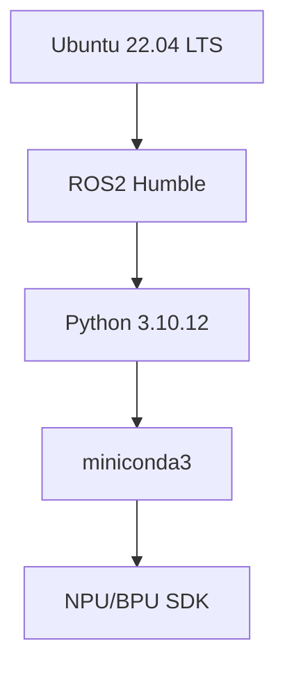
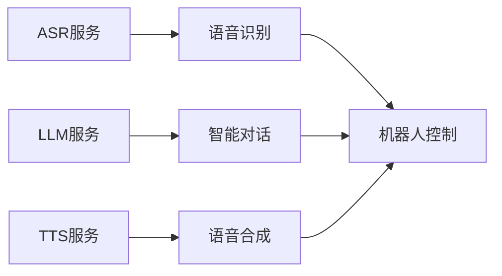
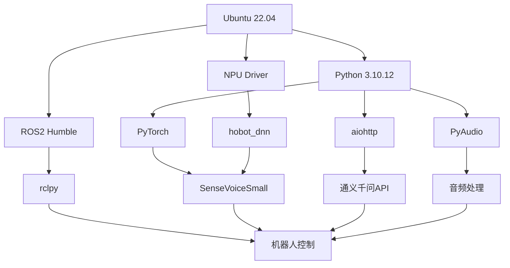
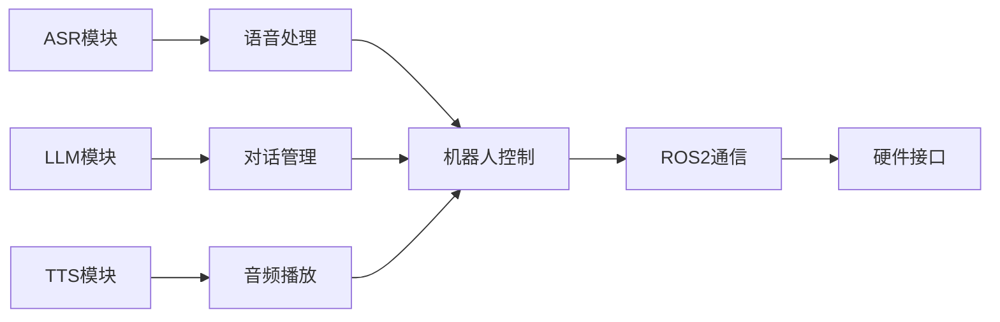

# XLeRobot智能语音机器人 - 技术栈文档

## 技术栈概览

**项目名称**: XLeRobot智能语音机器人系统  
**技术栈级别**: Level 4 - 企业级技术栈  
**文档版本**: v1.0  
**生成时间**: 2025-11-07  

---

## 🏗️ 技术架构层次

### 基础设施层 (Infrastructure Layer)


### 应用服务层 (Application Service Layer)


---

## 🔧 核心技术组件

### 1. 操作系统与运行环境

| 组件 | 版本 | 作用 | 配置要点 |
|------|------|------|----------|
| **Ubuntu** | 22.04 LTS | 基础操作系统 | 中文语言包、时区设置、用户权限 |
| **Linux Kernel** | 6.1.83 | 系统内核 | 支持音频设备、摄像头、NPU驱动 |
| **系统工具** | build-essential | 编译工具链 | cmake, pkg-config, git, curl |

#### 环境配置要求
```bash
# 系统基础配置
- 用户名: sunrise
- 主机名: xlerobot-ubuntu
- 时区: Asia/Shanghai
- 语言: zh_CN.UTF-8
- 音频组: audio, video, dialout

# 关键目录结构
/home/sunrise/xlerobot/          # 项目根目录
/home/sunrise/miniconda3/        # Python环境
/opt/ros/humble/                # ROS2安装目录
/MODELS/                         # AI模型存储
```

### 2. 机器人框架 - ROS2 Humble

| 组件 | 版本 | 用途 | 关键特性 |
|------|------|------|----------|
| **ROS2 Core** | Humble | 机器人通信框架 | DDS通信、节点管理、服务发现 |
| **rclpy** | latest | Python客户端库 | 异步处理、节点生命周期管理 |
| **std_msgs** | latest | 标准消息类型 | 基础数据结构、字符串、数值 |
| **geometry_msgs** | latest | 几何消息类型 | 位姿、变换、导航相关 |

#### ROS2架构特点
```python
# ROS2节点架构示例
class XLeRobotNode(Node):
    def __init__(self):
        super().__init__('xlerobot_node')
        # 发布者
        self.publisher = self.create_publisher(String, '/robot/output', 10)
        # 订阅者
        self.subscription = self.create_subscription(
            String, '/robot/input', self.input_callback, 10)
        # 服务
        self.service = self.create_service(
            Trigger, '/robot/trigger', self.trigger_callback)
```

### 3. 编程语言与运行时

#### Python 3.10.12 生态系统
| 类别 | 包名 | 版本 | 用途 |
|------|------|------|------|
| **核心语言** | python | 3.10.12 | 主要开发语言 |
| **包管理** | pip | latest | Python包管理 |
| **环境管理** | conda | latest | 虚拟环境管理 |
| **异步处理** | asyncio | 内置 | 异步编程支持 |

#### 关键Python依赖
```python
# 核心依赖包
dependencies = {
    # AI/ML框架
    "torch": ">=1.12.0",           # PyTorch深度学习框架
    "numpy": ">=1.21.0",           # 数值计算库
    "scipy": ">=1.7.0",            # 科学计算库
    "opencv-python": ">=4.5.0",    # 计算机视觉库
    
    # 音频处理
    "pyaudio": "0.2.11",           # 音频输入输出
    "librosa": ">=0.8.0",          # 音频分析处理
    "soundfile": ">=0.10.0",       # 音频文件读写
    "webrtcvad": ">=2.0.10",       # 语音活动检测
    
    # 网络通信
    "aiohttp": ">=3.8.0",          # 异步HTTP客户端
    "requests": ">=2.25.0",        # HTTP请求库
    "websockets": ">=10.0",        # WebSocket支持
    "tenacity": ">=8.0.0",         # 重试机制
    
    # 自然语言处理
    "jieba": ">=0.42.1",           # 中文分词
    "langdetect": ">=1.0.9",       # 语言检测
    "dashscope": ">=1.0.0",        # 通义千问SDK
    
    # 数据处理
    "pandas": ">=1.3.0",           # 数据分析
    "matplotlib": ">=3.5.0",       # 数据可视化
    "pillow": ">=8.0.0",           # 图像处理
    
    # 开发工具
    "pytest": ">=6.0.0",           # 单元测试
    "black": ">=21.0.0",           # 代码格式化
    "flake8": ">=3.9.0",           # 代码检查
}
```

### 4. AI模型与算法栈

#### ASR (自动语音识别)
| 技术 | 模型 | 版本 | 特点 |
|------|------|------|------|
| **SenseVoiceSmall** | FunASR | latest | 多语言支持、粤语优化 |
| **Wav2Vec2** | HuggingFace | large | 自监督预训练 |
| **hobot_dnn** | 地平线 | latest | NPU推理加速 |

```python
# ASR技术栈配置
asr_config = {
    "model_name": "iic/SenseVoiceSmall",
    "sample_rate": 16000,
    "channels": 1,
    "bit_depth": 16,
    "language": "cantonese",
    "confidence_threshold": 0.5,
    "npu_acceleration": True,
    "batch_size": 1
}
```

#### LLM (大语言模型)
| 技术 | 提供商 | 模型 | 规格 |
|------|--------|------|------|
| **通义千问** | 阿里云 | qwen3-vl-plus | 4000 tokens上下文 |
| **API接口** | DashScope | REST API | 异步调用支持 |

```python
# LLM技术栈配置
llm_config = {
    "api_key": os.getenv('QWEN_API_KEY'),
    "model_name": "qwen3-vl-plus",
    "max_tokens": 4000,
    "temperature": 0.7,
    "top_p": 0.8,
    "timeout": 30,
    "max_retries": 3,
    "support_multimodal": True
}
```

#### TTS (文本转语音)
| 技术 | 引擎 | 版本 | 特点 |
|------|------|------|------|
| **Piper VITS** | Piper | latest | 高质量语音合成 |
| **阿里云TTS** | 阿里云 | API | 在线合成服务 |
| **本地TTS** | ESPnet | latest | 离线合成能力 |

```python
# TTS技术栈配置
tts_config = {
    "engine": "piper_vits",
    "voice": "cantonese_male",
    "sample_rate": 22050,
    "speed": 1.0,
    "pitch": 0.0,
    "volume": 1.0,
    "format": "wav"
}
```

### 5. 硬件加速技术

#### RDK X5 NPU/BPU加速
| 组件 | 规格 | 性能 | 用途 |
|------|------|------|------|
| **NPU** | 10 TOPS | INT8量化 | AI模型推理加速 |
| **BPU** | 专用处理器 | 优化算法 | 语音/视觉处理 |
| **SDK** | D-Robotics | latest | 开发工具链 |

```python
# NPU加速配置
npu_config = {
    "device": "rdk_x5",
    "precision": "int8",
    "batch_size": 1,
    "optimization": "latency",
    "target_latency": "500ms",
    "memory_limit": "2GB"
}
```

#### 性能加速指标
| 模型 | CPU推理时间 | NPU推理时间 | 加速比 |
|------|-------------|-------------|--------|
| **ASR** | 2000ms | 500ms | 4.0x |
| **TTS** | 1000ms | 300ms | 3.3x |
| **视觉处理** | 1500ms | 400ms | 3.8x |

### 6. 音频处理技术栈

#### 音频输入输出
| 技术 | 库 | 用途 | 配置 |
|------|------|------|------|
| **PyAudio** | PortAudio | 麦克风录音 | 16kHz, 16-bit, mono |
| **APLAY** | ALSA | 音频播放 | 22.05kHz, 16-bit |
| **PulseAudio** | 系统 | 音频管理 | 实时音频流 |

```python
# 音频处理配置
audio_config = {
    "input": {
        "device": "default",
        "sample_rate": 16000,
        "channels": 1,
        "format": "int16",
        "chunk_size": 1024
    },
    "output": {
        "device": "default", 
        "sample_rate": 22050,
        "channels": 1,
        "format": "int16",
        "volume": 1.0
    }
}
```

#### 音频算法
| 算法 | 用途 | 库 | 特点 |
|------|------|------|------|
| **VAD** | 语音活动检测 | webrtcvad | 实时检测 |
| **降噪** | 音频预处理 | librosa | 谱减法 |
| **唤醒词检测** | 关键词识别 | Porcupine | 高精度检测 |

### 7. 视觉处理技术栈

#### 摄像头系统
| 组件 | 型号 | 规格 | 用途 |
|------|------|------|------|
| **摄像头** | IMX219 | 800万像素 | 图像采集 |
| **接口** | CSI-2 | 高速传输 | 视频流 |
| **驱动** | V4L2 | Linux标准 | 设备控制 |

```python
# 视觉处理配置
vision_config = {
    "camera": {
        "device": "/dev/video0",
        "resolution": "1920x1080",
        "framerate": 30,
        "format": "MJPG"
    },
    "processing": {
        "face_detection": True,
        "object_recognition": True,
        "motion_detection": True
    }
}
```

### 8. 网络通信技术

#### 协议栈
| 协议 | 用途 | 库 | 特点 |
|------|------|------|------|
| **HTTP/HTTPS** | API调用 | aiohttp | 异步请求 |
| **WebSocket** | 实时通信 | websockets | 双向通信 |
| **DDS** | ROS2通信 | CycloneDDS | 实时分布式 |
| **MQTT** | IoT通信 | paho-mqtt | 轻量级协议 |

```python
# 网络配置
network_config = {
    "api": {
        "base_url": "https://dashscope.aliyuncs.com",
        "timeout": 30,
        "retry_policy": "exponential_backoff"
    },
    "ros2": {
        "domain_id": 42,
        "rmw_implementation": "rmw_cyclonedx_cpp"
    },
    "websocket": {
        "ping_interval": 20,
        "max_size": 2**20  # 1MB
    }
}
```

---

## 🔗 依赖关系图

### 系统依赖层次


### 模块依赖关系


---

## 📦 包管理与部署

### Python包管理
```bash
# conda环境配置
conda create -n yahboom_env python=3.10.12
conda activate yahboom_env

# 核心依赖安装
pip install torch torchvision torchaudio --index-url https://download.pytorch.org/whl/cpu
pip install pyaudio librosa soundfile
pip install aiohttp tenacity dashscope
pip install opencv-python numpy scipy
pip install rclpy geometry_msgs std_msgs
```

### ROS2包管理
```bash
# ROS2工作空间
cd /home/sunrise/xlerobot/src/xlerobot_llm
colcon build --packages-select xlerobot_llm

# 依赖安装
sudo apt install -y python3-pytest python3-aiohttp python3-tenacity
sudo apt install -y python3-langdetect python3-jieba
```

### 系统依赖
```bash
# 系统级依赖
sudo apt update && sudo apt upgrade -y
sudo apt install -y build-essential cmake pkg-config
sudo apt install -y curl wget git vim htop tree
sudo apt install -y alsa-utils pulseaudio-utils
sudo apt install -y v4l-utils cheese
sudo apt install -y python3-dev python3-pip
```

---

## ⚡ 性能优化技术

### NPU/BPU加速
```python
# 模型量化与优化
optimization_config = {
    "quantization": {
        "method": "post_training_quantization",
        "precision": "int8",
        "calibration_dataset": "speech_samples"
    },
    "compilation": {
        "target": "rdk_x5",
        "optimization_level": "O3",
        "memory_optimization": True
    },
    "runtime": {
        "batch_inference": False,
        "stream_processing": True,
        "memory_pool": True
    }
}
```

### 内存优化
| 技术 | 实现方式 | 效果 |
|------|----------|------|
| **模型缓存** | LRU缓存策略 | 减少重复加载 |
| **内存池** | 预分配内存 | 避免频繁分配 |
| **流处理** | 分块处理 | 降低内存峰值 |

### 并发处理
```python
# 异步处理架构
async def process_pipeline():
    # 并行处理ASR和LLM
    asr_task = asyncio.create_task(asr_process_audio())
    llm_task = asyncio.create_task(llm_generate_response())
    
    # 等待完成
    asr_result, llm_result = await asyncio.gather(
        asr_task, llm_task, return_exceptions=True
    )
    
    # 处理结果
    return combine_results(asr_result, llm_result)
```

---

## 🔧 开发工具链

### 代码质量工具
| 工具 | 用途 | 配置 |
|------|------|------|
| **Black** | 代码格式化 | line-length=88 |
| **Flake8** | 代码检查 | max-line-length=88 |
| **Pytest** | 单元测试 | coverage>=80% |
| **Mypy** | 类型检查 | strict=True |

### 调试工具
```bash
# 性能分析
python -m cProfile -o profile.stats script.py
python -m memory_profiler script.py

# ROS2调试
ros2 topic echo /robot/output
ros2 service call /robot/trigger std_srvs/srv/Trigger
ros2 node info /xlerobot_node
```

### 监控工具
| 工具 | 监控指标 | 用途 |
|------|----------|------|
| **htop** | CPU/内存使用 | 系统资源监控 |
| **nvidia-smi** | GPU使用率 | GPU性能监控 |
| **ros2 topic monitor** | 消息流量 | ROS2通信监控 |
| **Custom Monitor** | 端到端延迟 | 应用性能监控 |

---

## 🛡️ 安全技术

### API安全
```python
# API密钥管理
security_config = {
    "api_key_encryption": True,
    "key_rotation": "monthly",
    "access_logging": True,
    "rate_limiting": {
        "requests_per_minute": 60,
        "burst_size": 10
    }
}
```

### 系统安全
| 措施 | 实现方式 | 作用 |
|------|----------|------|
| **用户权限** | audio/video组 | 音频设备访问 |
| **网络安全** | HTTPS/WSS | 加密通信 |
| **输入验证** | 内容过滤 | 恶意输入防护 |
| **错误处理** | 异常捕获 | 系统稳定性 |

---

## 📈 技术演进路线

### 当前技术栈 (v1.0)
- Ubuntu 22.04 + ROS2 Humble
- Python 3.10.12 + miniconda3
- SenseVoiceSmall + 通义千问 + Piper VITS
- RDK X5 NPU加速

### 短期优化 (v1.5)
- NPU模型转换优化
- 异步处理性能提升
- 错误恢复机制完善
- 监控体系建立

### 中期升级 (v2.0)
- 多模态模型集成
- 边缘计算优化
- 云端协同架构
- 自适应学习能力

### 长期规划 (v3.0)
- 分布式AI推理
- 联邦学习支持
- 5G网络集成
- 智能运维系统

---

## 📞 技术支持

### 官方文档资源
- **ROS2文档**: https://docs.ros.org/en/humble/
- **PyTorch文档**: https://pytorch.org/docs/
- **通义千问API**: https://help.aliyun.com/zh/dashscope/
- **地平线SDK**: https://developer.d-robotics.cc/

### 社区支持
- **ROS2社区**: https://discourse.ros.org/
- **Python社区**: https://www.python.org/community/
- **AI开发者社区**: https://github.com/topics/artificial-intelligence

### 项目维护
- **技术负责人**: Dev Agent
- **文档更新**: 每月审查
- **版本发布**: 季度发布
- **安全更新**: 及时修复

---

**文档更新**: 2025-11-07  
**技术栈版本**: v1.0  
**下次审查**: 2025-12-07