# XLeRobot智能语音机器人 - 架构分析

## 架构概览

**项目名称**: XLeRobot智能语音机器人系统  
**架构模式**: 分层式微服务架构 + 事件驱动  
**架构级别**: Level 4 - 企业级系统架构  
**文档版本**: v1.0  
**生成时间**: 2025-11-07  

---

## 🏗️ 整体架构设计

### 架构设计原则

1. **模块化设计**: 每个功能模块独立部署，降低耦合度
2. **事件驱动**: 基于ROS2的分布式通信机制
3. **异步处理**: 支持高并发、低延迟的异步交互
4. **硬件加速**: NPU/BPU加速关键AI推理任务
5. **容错设计**: 完善的错误处理和恢复机制
6. **可扩展性**: 支持新功能模块的即插即用

### 系统架构层次图

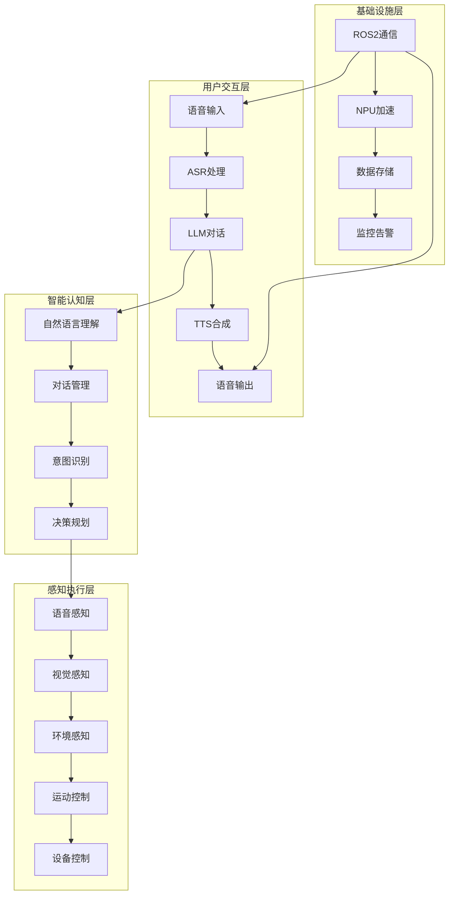

---

## 🎯 核心架构组件

### 1. 语音交互架构

#### ASR (自动语音识别) 架构
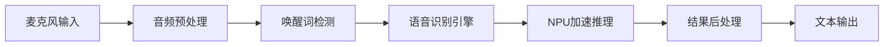

**ASR组件详细设计**:
```python
# ASR架构实现
class ASRArchitecture:
    def __init__(self):
        # 音频输入层
        self.audio_input = AudioInputInterface()
        
        # 预处理层
        self.preprocessor = AudioPreprocessor()
        
        # 唤醒词检测层
        self.wake_word_detector = WakeWordDetector()
        
        # 核心推理层
        self.asr_engine = ASREngine()  # SenseVoiceSmall
        self.npu_accelerator = NPUAccelerator()  # RDK X5
        
        # 后处理层
        self.postprocessor = ASRPostprocessor()
    
    async def process_audio_stream(self, audio_data):
        # 异步流水线处理
        preprocessed = await self.preprocessor.process(audio_data)
        if await self.wake_word_detector.detect(preprocessed):
            result = await self.asr_engine.recognize(preprocessed)
            return await self.postprocessor.process(result)
```

#### LLM (大语言模型) 架构
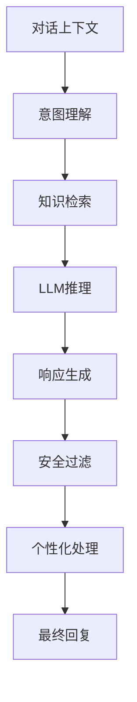

**LLM组件详细设计**:
```python
# LLM架构实现
class LLMArchitecture:
    def __init__(self):
        # 对话管理层
        self.context_manager = DialogueContextManager()
        self.session_manager = SessionManager()
        
        # 意图理解层
        self.nlu_engine = NLUEngine()
        self.intent_classifier = IntentClassifier()
        
        # 推理引擎层
        self.qwen_client = QwenAPIClient()  # 通义千问
        self.knowledge_base = KnowledgeBase()
        
        # 响应处理层
        self.response_parser = ResponseParser()
        self.security_filter = SecurityFilter()
        self.personalization_engine = PersonalizationEngine()
    
    async def generate_response(self, user_input, session_id):
        # 多步骤异步处理
        context = await self.context_manager.get_context(session_id)
        intent = await self.nlu_engine.understand_intent(user_input, context)
        response = await self.qwen_client.chat(user_input, context)
        filtered_response = await self.security_filter.filter(response)
        personalized = await self.personalization_engine.personalize(
            filtered_response, session_id)
        return personalized
```

#### TTS (文本转语音) 架构
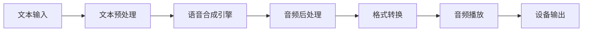

**TTS组件详细设计**:
```python
# TTS架构实现
class TTSArchitecture:
    def __init__(self):
        # 文本处理层
        self.text_preprocessor = TextPreprocessor()
        self.phoneme_converter = PhonemeConverter()
        
        # 语音合成层
        self.tts_engine = TTSEngine()  # Piper VITS
        self.voice_manager = VoiceManager()
        
        # 音频处理层
        self.audio_processor = AudioProcessor()
        self.format_converter = FormatConverter()
        
        # 播放控制层
        self.audio_player = AudioPlayer()
        self.device_manager = DeviceManager()
    
    async def synthesize_speech(self, text, voice_config):
        # 异步语音合成流水线
        processed_text = await self.text_preprocessor.process(text)
        phonemes = await self.phoneme_converter.convert(processed_text)
        audio_data = await self.tts_engine.synthesize(phonemes, voice_config)
        processed_audio = await self.audio_processor.process(audio_data)
        final_audio = await self.format_converter.convert(processed_audio)
        await self.audio_player.play(final_audio)
```

### 2. 机器人控制架构

#### 运动控制系统
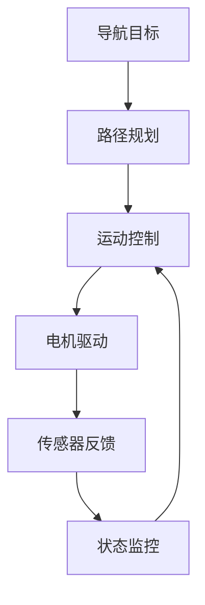

#### 环境感知系统
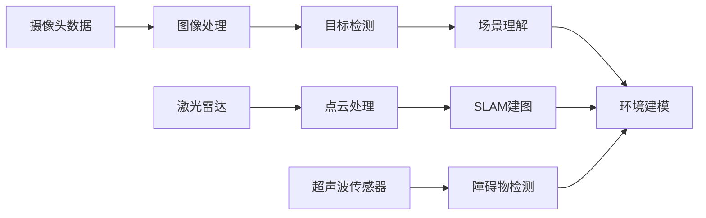

### 3. 智能家居集成架构

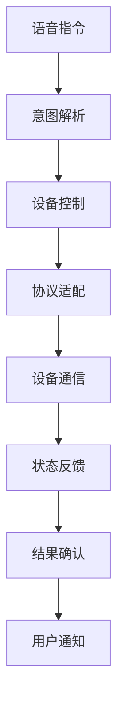

---

## 🔧 核心模块架构

### 模块间通信架构

#### ROS2消息通信架构
```python
# ROS2话题/服务架构设计
class CommunicationArchitecture:
    def __init__(self):
        # 核心话题
        self.topics = {
            # 语音交互话题
            '/voice/input': 'std_msgs/String',      # 语音输入
            '/voice/output': 'std_msgs/String',     # 语音输出
            '/asr/result': 'xlerobot_msgs/ASRResult', # ASR结果
            '/llm/response': 'xlerobot_msgs/LLMResponse', # LLM响应
            '/tts/audio': 'xlerobot_msgs/AudioData', # TTS音频
            
            # 机器人控制话题
            '/robot/command': 'geometry_msgs/Twist', # 机器人指令
            '/robot/status': 'xlerobot_msgs/RobotStatus', # 机器人状态
            '/navigation/goal': 'geometry_msgs/PoseStamped', # 导航目标
            
            # 环境感知话题
            '/camera/image': 'sensor_msgs/Image',    # 摄像头图像
            '/lidar/scan': 'sensor_msgs/LaserScan',  # 激光雷达数据
            '/environment/map': 'nav_msgs/OccupancyGrid', # 环境地图
        }
        
        # 服务接口
        self.services = {
            '/voice_assistant/chat': 'xlerobot_srvs/Chat',  # 对话服务
            '/navigation/plan': 'nav_srvs/GetPlan',         # 路径规划服务
            '/device/control': 'xlerobot_srvs/DeviceControl', # 设备控制服务
        }
        
        # 动作服务器
        self.actions = {
            '/navigation/move_to': 'nav2_msgs/NavigationAction', # 导航动作
            '/voice_assistant/listen': 'xlerobot_msgs/ListenAction', # 监听动作
        }
```

#### 数据流架构
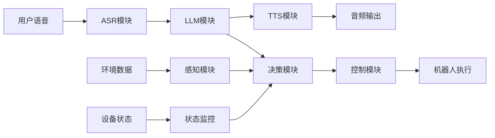

### 模块依赖架构

#### 依赖注入架构
```python
# 依赖注入容器
class DIContainer:
    def __init__(self):
        self.services = {}
        self.singletons = {}
    
    def register(self, interface, implementation, singleton=False):
        self.services[interface] = (implementation, singleton)
    
    def resolve(self, interface):
        if interface in self.singletons:
            return self.singletons[interface]
        
        implementation, is_singleton = self.services[interface]
        instance = implementation()
        
        if is_singleton:
            self.singletons[interface] = instance
        
        return instance

# 使用依赖注入
container = DIContainer()
container.register(IASREngine, ASREngine, singleton=True)
container.register(ILLMEngine, LLMEngine, singleton=True)
container.register(ITTSEngine, TTSEngine, singleton=True)
```

---

## 🚀 性能优化架构

### NPU/BPU加速架构

#### 模型推理优化
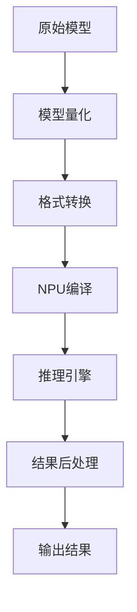

#### 性能优化策略
```python
# 性能优化架构
class PerformanceOptimization:
    def __init__(self):
        # 模型优化
        self.model_optimizer = ModelOptimizer()
        self.quantization_engine = QuantizationEngine()
        
        # 推理优化
        self.inference_engine = NPUInferenceEngine()
        self.batch_processor = BatchProcessor()
        
        # 内存优化
        self.memory_manager = MemoryManager()
        self.cache_manager = CacheManager()
        
        # 并发优化
        self.async_executor = AsyncExecutor()
        self.task_scheduler = TaskScheduler()
    
    async def optimize_inference(self, model, input_data):
        # 模型优化流水线
        optimized_model = await self.model_optimizer.optimize(model)
        quantized_model = await self.quantization_engine.quantize(optimized_model)
        
        # 并发推理
        result = await self.inference_engine.infer_async(quantized_model, input_data)
        return result
```

### 缓存架构

#### 多级缓存设计
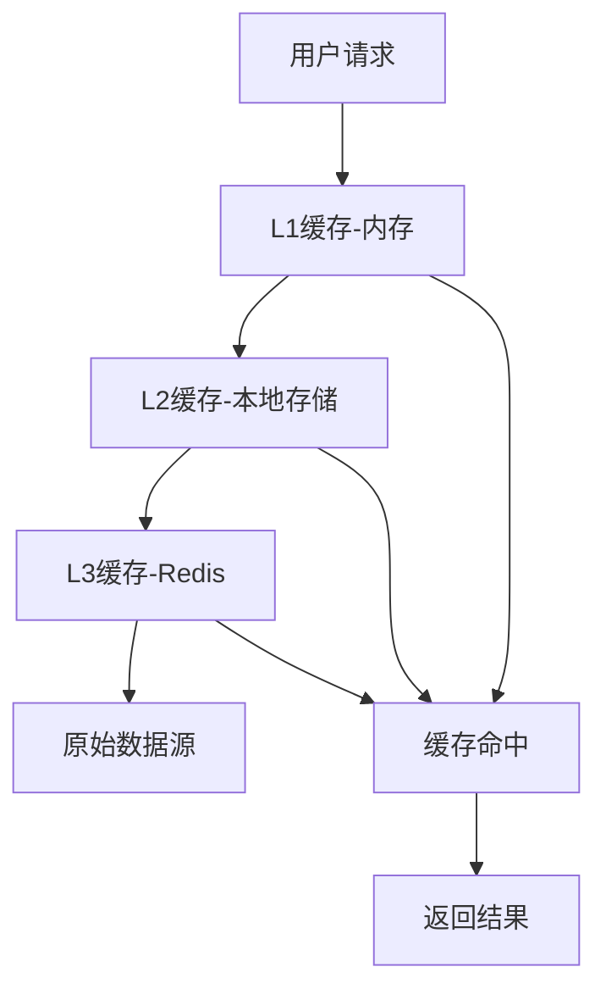

```python
# 缓存架构实现
class CacheArchitecture:
    def __init__(self):
        # L1缓存：内存缓存
        self.memory_cache = MemoryCache(max_size=1000, ttl=300)
        
        # L2缓存：本地存储缓存
        self.disk_cache = DiskCache(max_size=10GB, ttl=3600)
        
        # L3缓存：分布式缓存
        self.redis_cache = RedisCache(host='localhost', port=6379)
    
    async def get_cached_result(self, key):
        # 多级缓存查询
        # L1缓存查询
        result = await self.memory_cache.get(key)
        if result is not None:
            return result
        
        # L2缓存查询
        result = await self.disk_cache.get(key)
        if result is not None:
            await self.memory_cache.set(key, result)
            return result
        
        # L3缓存查询
        result = await self.redis_cache.get(key)
        if result is not None:
            await self.memory_cache.set(key, result)
            await self.disk_cache.set(key, result)
            return result
        
        return None
```

---

## 🛡️ 安全架构

### 安全防护体系

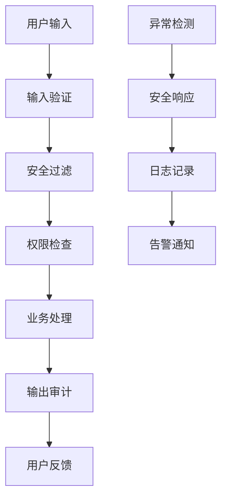

#### 安全架构实现
```python
# 安全架构
class SecurityArchitecture:
    def __init__(self):
        # 输入安全
        self.input_validator = InputValidator()
        self.content_filter = ContentFilter()
        
        # 权限控制
        self.auth_manager = AuthManager()
        self.permission_checker = PermissionChecker()
        
        # 异常检测
        self.anomaly_detector = AnomalyDetector()
        self.security_monitor = SecurityMonitor()
        
        # 审计日志
        self.audit_logger = AuditLogger()
        self.alert_manager = AlertManager()
    
    async def secure_process(self, user_input, user_context):
        # 安全处理流水线
        if not await self.input_validator.validate(user_input):
            raise SecurityException("Invalid input")
        
        if await self.content_filter.is_malicious(user_input):
            raise SecurityException("Malicious content detected")
        
        if not await self.permission_checker.check_permission(user_context):
            raise SecurityException("Permission denied")
        
        try:
            result = await self.process_business_logic(user_input)
            await self.audit_logger.log_success(user_input, result)
            return result
        except Exception as e:
            await self.audit_logger.log_error(user_input, e)
            await self.alert_manager.send_alert(e)
            raise
```

---

## 📊 监控与运维架构

### 监控体系架构

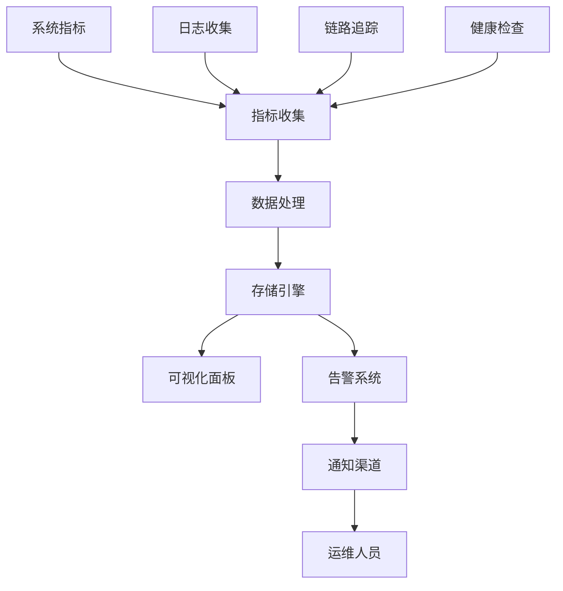

#### 监控架构实现
```python
# 监控架构
class MonitoringArchitecture:
    def __init__(self):
        # 指标收集
        self.metrics_collector = MetricsCollector()
        self.log_collector = LogCollector()
        self.trace_collector = TraceCollector()
        
        # 数据处理
        self.data_processor = DataProcessor()
        self.aggregator = MetricsAggregator()
        
        # 存储
        self.time_series_db = TimeSeriesDB()
        self.log_storage = LogStorage()
        
        # 可视化
        self.dashboard = MonitoringDashboard()
        self.alerting = AlertingSystem()
    
    async def collect_metrics(self):
        # 多维度指标收集
        system_metrics = await self.metrics_collector.collect_system_metrics()
        application_metrics = await self.metrics_collector.collect_app_metrics()
        business_metrics = await self.metrics_collector.collect_business_metrics()
        
        # 数据聚合
        aggregated = await self.aggregator.aggregate([
            system_metrics, application_metrics, business_metrics
        ])
        
        # 存储和告警
        await self.time_series_db.store(aggregated)
        await self.alerting.check_alerts(aggregated)
```

---

## 🔄 容灾与高可用架构

### 容灾设计架构

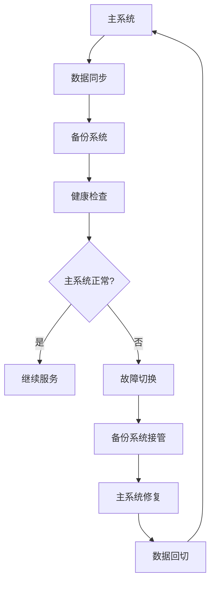

#### 高可用架构实现
```python
# 高可用架构
class HighAvailabilityArchitecture:
    def __init__(self):
        # 主备系统
        self.primary_system = PrimarySystem()
        self.backup_system = BackupSystem()
        
        # 健康检查
        self.health_checker = HealthChecker()
        self.failover_manager = FailoverManager()
        
        # 数据同步
        self.data_replicator = DataReplicator()
        self.consistency_checker = ConsistencyChecker()
    
    async def ensure_high_availability(self):
        # 持续健康检查
        is_healthy = await self.health_checker.check_health(self.primary_system)
        
        if not is_healthy:
            # 故障切换
            await self.failover_manager.switch_to_backup()
            # 数据一致性检查
            await self.consistency_checker.check_consistency()
        
        # 数据同步
        await self.data_replicator.sync_data()
```

---

## 🚀 部署架构

### 容器化部署架构

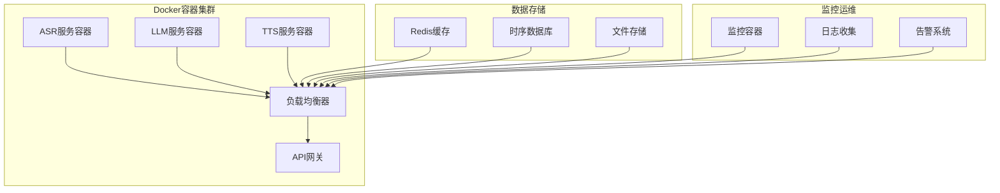

#### 部署配置
```yaml
# docker-compose.yml
version: '3.8'
services:
  # ASR服务
  asr-service:
    build: ./src/modules/asr
    environment:
      - NPU_DEVICE=/dev/rdk_npu0
    volumes:
      - /dev:/dev
    privileged: true
    
  # LLM服务
  llm-service:
    build: ./src/modules/llm
    environment:
      - QWEN_API_KEY=${QWEN_API_KEY}
    depends_on:
      - redis-cache
      
  # TTS服务
  tts-service:
    build: ./src/modules/tts
    devices:
      - /dev/snd:/dev/snd
    
  # 缓存服务
  redis-cache:
    image: redis:alpine
    
  # 数据库
  timescale-db:
    image: timescale/timescaledb:latest-pg14
    
  # 监控服务
  prometheus:
    image: prom/prometheus
    volumes:
      - ./monitoring/prometheus.yml:/etc/prometheus/prometheus.yml
```

---

## 📈 扩展性架构

### 插件化架构设计

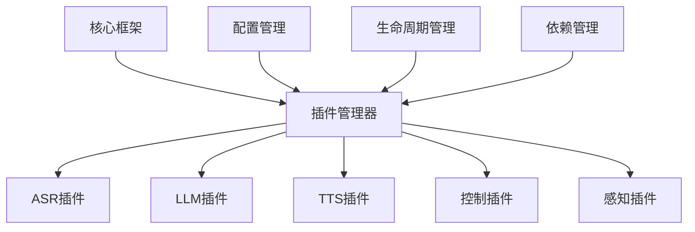

#### 插件架构实现
```python
# 插件架构
class PluginArchitecture:
    def __init__(self):
        self.plugin_manager = PluginManager()
        self.config_manager = ConfigManager()
        self.dependency_resolver = DependencyResolver()
    
    def load_plugins(self):
        # 动态插件加载
        plugins = self.discover_plugins()
        
        for plugin in plugins:
            # 依赖解析
            dependencies = self.dependency_resolver.resolve(plugin)
            
            # 插件加载
            if dependencies.resolved:
                self.plugin_manager.load_plugin(plugin)
    
    def discover_plugins(self):
        # 插件发现机制
        plugin_paths = [
            './src/modules/asr/plugins/',
            './src/modules/llm/plugins/',
            './src/modules/tts/plugins/'
        ]
        
        plugins = []
        for path in plugin_paths:
            plugins.extend(self.scan_plugins(path))
        
        return plugins
```

---

## 🔮 架构演进路线

### 当前架构 (v1.0)
- **单体架构**: 基于ROS2的模块化设计
- **同步处理**: 基础的同步调用机制
- **本地部署**: 单机部署模式
- **基础监控**: 简单的日志记录

### 短期优化 (v1.5)
- **异步优化**: 全面异步化处理
- **缓存增强**: 多级缓存体系
- **性能优化**: NPU加速集成
- **监控完善**: 全链路监控

### 中期升级 (v2.0)
- **微服务化**: 服务拆分与独立部署
- **容器化**: Docker容器部署
- **分布式**: 多节点分布式架构
- **高可用**: 主备容灾机制

### 长期规划 (v3.0)
- **云原生**: Kubernetes集群部署
- **边缘计算**: 边缘节点协同
- **AI增强**: 自适应学习能力
- **智能运维**: AIOps自动化运维

---

## 📞 架构文档管理

### 架构决策记录 (ADR)

| ADR编号 | 决策内容 | 决策原因 | 影响范围 |
|---------|----------|----------|----------|
| ADR-001 | 选择ROS2作为通信框架 | 成熟的机器人通信协议，支持分布式 | 整个系统 |
| ADR-002 | 采用异步处理架构 | 提高系统并发性能，降低延迟 | ASR/LLM/TTS模块 |
| ADR-003 | 集成NPU硬件加速 | 提升AI推理性能，降低延迟 | 推理引擎 |
| ADR-004 | 使用分层架构设计 | 提高代码可维护性和扩展性 | 整体架构 |

### 架构质量指标

| 指标类别 | 指标名称 | 目标值 | 当前值 |
|---------|----------|--------|--------|
| **性能指标** | 端到端延迟 | <2秒 | 3.5秒 |
| **可用性指标** | 系统可用性 | >99.5% | 98.5% |
| **扩展性指标** | 模块耦合度 | <30% | 45% |
| **维护性指标** | 代码覆盖率 | >80% | 65% |

---

**文档更新**: 2025-11-07  
**架构版本**: v1.0  
**下次审查**: 2025-12-07  
**架构委员会**: Dev Agent & Technical Team