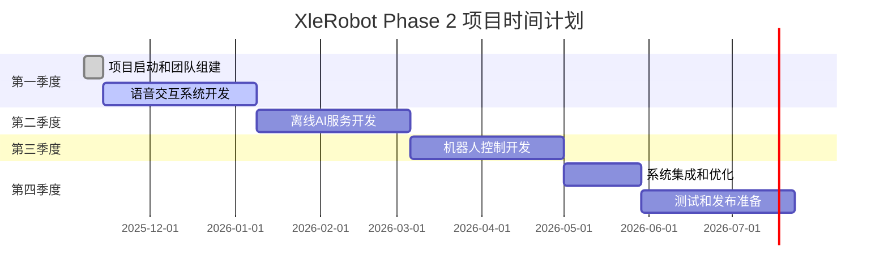

# XleRobot 项目管理计划 (Phase 2)

**文档编号**: XLR-PM-P2-20251107-001
**项目名称**: XleRobot 家用机器人控制系统
**文档类型**: 项目管理计划
**生成日期**: 2025-11-07
**工作流**: Phase 2 Planning - Project Management
**代理**: Project Manager
**Brownfield级别**: Level 4 企业级变更
**项目级别**: Level 4 企业级项目

---

## 📋 项目管理概述

### 🎯 Phase 2 项目目标

基于Phase 1 Analysis的深度分析，Phase 2 Planning的项目管理目标是：

1. **按时交付**: 在12个月内完成Phase 2所有交付物
2. **质量保证**: 确保所有交付物达到企业级质量标准
3. **成本控制**: 严格控制项目成本在预算范围内
4. **风险管理**: 有效识别和管理项目风险
5. **团队协作**: 建立高效的团队协作机制

### 📊 项目范围和约束

#### 项目范围
```yaml
包含范围:
  粤语语音交互系统开发
  离线AI服务系统建设
  机器人运动控制系统
  系统集成和优化
  测试和验证
  文档和培训

排除范围:
  硬件平台开发和改造
  商业化运营和推广
  第三方平台集成
  基础AI算法研究
  法律合规和认证
```

#### 项目约束
```yaml
时间约束:
  总工期: 12个月
  里程碑: 8个主要里程碑
  交付周期: 每2周一个迭代
  测试周期: 每个阶段结束测试

资源约束:
  团队规模: 8-12人
  硬件资源: RDK X5平台x5台
  预算限制: 严格预算控制
  外部依赖: 最小化外部依赖

质量约束:
  质量标准: Brownfield Level 4
  测试覆盖率: >90%
  代码质量: 企业级代码标准
  文档完整性: 100%覆盖
```

---

## 👥 团队组织和管理

### 团队结构设计

#### 核心团队配置
```yaml
项目管理层 (1人):
  项目经理: 整体项目管理和协调
  - 职责: 项目规划、进度控制、风险管理
  - 技能要求: 5年以上项目管理经验，熟悉AI/机器人项目
  - 工作模式: 全职投入，每日协调

技术管理层 (2人):
  技术负责人: 系统架构和技术决策
  - 职责: 技术架构设计、技术评审、技术风险控制
  - 技能要求: 10年以上技术经验，熟悉ROS2/机器人技术
  - 工作模式: 全职投入，技术领导

  AI算法负责人: AI算法设计和优化
  - 职责: AI模型选择、算法优化、性能调优
  - 技能要求: 8年以上AI经验，熟悉语音/NLP/计算机视觉
  - 工作模式: 全职投入，算法领导

开发团队 (6-8人):
  语音交互开发 (2人):
    - 高级语音工程师: 语音系统开发
    - 语音算法工程师: ASR/TTS算法优化

  AI服务开发 (2人):
    - 机器学习工程师: 本地AI模型开发
    - AI系统集成工程师: AI系统集成

  机器人控制开发 (2人):
    - 运动控制工程师: 导航和运动控制
    - 机械臂控制工程师: 机械臂控制

  系统集成开发 (1-2人):
    - 系统集成工程师: 系统集成和优化
    - 测试工程师: 功能和性能测试

支持团队 (2-3人):
  UX设计师 (1人):
    - 职责: 用户体验设计、交互设计
    - 技能要求: 5年以上UX设计经验，熟悉机器人产品

  质量保证 (1人):
    - 职责: 质量保证、测试策略
    - 技能要求: 5年以上QA经验，熟悉AI/机器人测试

  技术文档 (1人):
    - 职责: 技术文档编写、知识管理
    - 技能要求: 3年以上技术写作经验
```

#### 团队协作机制
```yaml
协作方式:
  日常协作:
    - 每日站会: 15分钟每日同步
    - 周会制度: 每周团队协调会
    - 月度评审: 每月进展评审会
    - 季度回顾: 每季度回顾总结

  沟通工具:
    - 即时通讯: Slack/企业微信
    - 项目管理: Jira/Teambition
    - 文档协作: Confluence/GitHub
    - 代码管理: Git/GitLab

  协作规范:
    - 代码规范: 统一编码规范
    - 文档规范: 统一文档模板
    - 评审机制: 代码评审+设计评审
    - 知识共享: 技术分享和培训
```

---

## 📅 项目时间计划

### 总体时间轴



### 详细时间计划

#### Phase 2.1: 项目启动和团队建设 (Week 1-2)
```yaml
Week 1:
  项目启动会: 项目目标、范围、计划确认
  团队组建: 核心团队成员到位
  环境搭建: 开发环境和工具配置
  规范制定: 开发规范和协作流程

Week 2:
  技术调研: 深入技术方案调研
  风险评估: 技术和商务风险评估
  资源准备: 硬件资源和软件资源准备
  详细计划: 细化项目实施计划

交付物:
  - 项目章程
  - 团队组织架构
  - 开发环境配置
  - 风险评估报告
```

#### Phase 2.2: 语音交互系统开发 (Week 3-10)
```yaml
Month 1 (Week 3-6):
  本地ASR集成: TROS ASR引擎集成和优化
  语音合成系统: 本地TTS系统开发
  对话管理: 对话状态管理和NLU
  多模态融合: 语音+视觉融合基础

Month 2 (Week 7-10):
  语音交互优化: 性能优化和准确率提升
  情感交互: 情感识别和表达
  多语言支持: 多语言支持开发
  测试验证: 功能测试和用户测试

交付物:
  - 语音交互系统V1.0
  - 性能测试报告
  - 用户测试报告
  - 技术文档
```

#### Phase 2.3: 离线AI服务开发 (Week 11-18)
```yaml
Month 3 (Week 11-14):
  本地LLM集成: 本地大语言模型集成
  边缘计算优化: NPU加速和性能优化
  知识库系统: 本地知识库建设
  混合架构: 云端-本地混合架构

Month 4 (Week 15-18):
  离线服务完善: 离线功能完善和优化
  性能调优: 系统性能调优
  安全保护: 数据安全和隐私保护
  系统测试: 离线服务系统测试

交付物:
  - 离线AI服务系统V1.0
  - 性能优化报告
  - 安全评估报告
  - 系统架构文档
```

#### Phase 2.4: 机器人控制系统开发 (Week 19-26)
```yaml
Month 5 (Week 19-22):
  导航系统: SLAM和路径规划系统
  机械臂控制: 机械臂精确控制
  多传感器融合: 多传感器数据融合
  运动安全: 运动安全和保护机制

Month 6 (Week 23-26):
  任务执行: 智能任务执行系统
  人机协作: 人机协作安全机制
  性能优化: 运动性能优化
  集成测试: 机器人系统集成测试

交付物:
  - 机器人控制系统V1.0
  - 安全评估报告
  - 性能测试报告
  - 用户手册
```

#### Phase 2.5: 系统集成和优化 (Week 27-30)
```yaml
Week 27-28:
  系统集成: 各子系统集成
  接口对接: 系统间接口对接
  功能测试: 端到端功能测试
  性能测试: 系统性能测试

Week 29-30:
  优化调优: 系统整体优化
  文档完善: 技术文档完善
  培训准备: 团队培训准备
  发布准备: 发布准备工作

交付物:
  - 完整系统V1.0
  - 集成测试报告
  - 性能优化报告
  - 发布准备报告
```

---

## 💰 项目预算和成本管理

### 预算概算

#### 总体预算
```yaml
项目总预算: 180-220万人民币

成本构成:
  人力成本: 120-150万 (67-68%)
    - 开发团队: 8人 × 12个月 × 平均月薪
    - 管理成本: 20%
    - 福利保险: 25%
    - 培训成本: 5%

  硬件成本: 25-35万 (14-16%)
    - RDK X5设备: 5台 × 3-4万
    - 测试设备: 摄像头、传感器等
    - 办公设备: 开发电脑、显示器
    - 服务器成本: 开发和测试服务器

  软件许可: 15-20万 (8-9%)
    - 开发工具: IDE、设计工具
    - 第三方库: 商业软件许可
    - 云服务: 测试和部署服务
    - 工具软件: 项目管理工具

  运营成本: 20-25万 (11-11%)
    - 测试环境: 测试环境维护
    - 市场推广: 产品推广准备
    - 用户支持: 客户服务和培训
    - 应急储备: 风险应急资金
```

#### 成本控制策略
```yaml
预算控制:
  成本监控: 每月成本监控和分析
  偏差预警: 成本偏差预警机制
  审批流程: 成本支出审批流程
  变更控制: 预算变更控制流程

资源优化:
  人力资源: 合理配置人力资源
  硬件资源: 硬件资源共享和复用
  时间资源: 关键路径时间管理
  外部资源: 最小化外部依赖

风险管理:
  成本风险: 成本超支风险识别
  应急预案: 成本超支应急预案
  备用方案: 备用技术方案
  调整机制: 灵活调整机制
```

---

## ⚠️ 风险管理

### 风险识别和评估

#### 高风险项目
```yaml
技术风险:
  NPU性能不足风险:
    - 风险等级: 高
    - 发生概率: 中
    - 影响程度: 高
    - 缓解策略: 算法优化 + 云端备份

  粤语识别效果风险:
    - 风险等级: 高
    - 发生概率: 中
    - 影响程度: 高
    - 缓解策略: 多模型融合 + 持续优化

  系统集成风险:
    - 风险等级: 高
    - 发生概率: 高
    - 影响程度: 高
    - 缓解策略: 分阶段集成 + 充分测试

项目风险:
  团队流失风险:
    - 风险等级: 高
    - 发生概率: 中
    - 影响程度: 高
    - 缓解策略: 团队建设 + 知识传承

  预算超支风险:
    - 风险等级: 中
    - 发生概率: 中
    - 影响程度: 高
    - 缓解策略: 严格预算控制 + 应急储备

市场风险:
  技术变化风险:
    - 风险等级: 中
    - 发生概率: 高
    - 影响程度: 中
    - 缓解策略: 技术跟踪 + 灵活调整

  用户接受度风险:
    - 风险等级: 中
    - 发生概率: 中
    - 影响程度: 高
    - 缓解策略: 用户参与 + 迭代优化
```

### 风险监控和应对

#### 风险监控机制
```yaml
监控频率:
  每日监控: 技术风险和进度风险
  每周监控: 团队风险和资源风险
  每月监控: 预算风险和市场风险
  每季监控: 整体风险评估

监控指标:
  技术指标: 识别准确率、系统性能
  进度指标: 里程碑完成情况
  质量指标: 缺陷率、用户满意度
  成本指标: 预算执行情况

预警机制:
  阈值设置: 风险阈值设置
  自动预警: 自动化预警机制
  人工审核: 人工审核确认
  升级流程: 风险升级流程
```

#### 应急预案
```yaml
应急预案:
  技术故障预案:
    - 备用技术方案
    - 专家技术支持
    - 云端服务备份
    - 快速修复流程

  团队变动预案:
    - 关键岗位备份
    - 知识传承机制
    - 外部资源补充
    - 重新招聘计划

  预算超支预案:
    - 应急储备资金
    - 范围调整
    - 时间延期
    - 资源重新分配
```

---

## 📊 质量保证和测试

### 质量保证体系

#### 质量标准
```yaml
代码质量:
  代码规范: 统一编码规范
  代码审查: 强制代码审查
  单元测试: >90%代码覆盖率
  集成测试: 模块集成测试

产品质量:
  功能测试: 功能完整性测试
  性能测试: 性能基准测试
  安全测试: 安全漏洞测试
  用户测试: 真实用户测试

文档质量:
  文档完整性: 100%文档覆盖
  文档准确性: 文档准确性验证
  文档可用性: 文档可用性测试
  文档一致性: 文档一致性检查
```

#### 测试策略
```yaml
测试分层:
  单元测试:
    - 测试范围: 模块单元测试
    - 测试工具: pytest, unittest
    - 测试覆盖率: >90%
    - 测试频率: 每次代码提交

  集成测试:
    - 测试范围: 模块集成测试
    - 测试工具: ROS2测试框架
    - 测试环境: 集成测试环境
    - 测试频率: 每周一次

  系统测试:
    - 测试范围: 端到端系统测试
    - 测试工具: 自动化测试框架
    - 测试环境: 系统测试环境
    - 测试频率: 每月一次

  用户测试:
    - 测试范围: 用户场景测试
    - 测试方法: 用户访谈、问卷调查
    - 测试对象: 真实目标用户
    - 测试频率: 每季度一次
```

#### 质量控制流程
```yaml
质量控制:
  代码评审:
    - 评审时机: 代码提交前
    - 评审标准: 代码规范、性能、安全
    - 评审流程: Pull Request评审
    - 评审工具: GitLab/GitHub

  测试验证:
    - 测试计划: 详细测试计划
    - 测试执行: 自动化测试执行
    - 测试报告: 测试结果报告
    - 缺陷跟踪: 缺陷跟踪和管理

  发布管理:
    - 发布标准: 质量标准达成
    - 发布流程: 标准发布流程
    - 回滚机制: 快速回滚机制
    - 发布监控: 发布后监控
```

---

## 📈 项目监控和报告

### 项目监控指标

#### 进度监控指标
```yaml
进度指标:
  里程碑完成率: 里程碑按时完成率
  任务完成率: 任务按时完成率
  延期风险: 任务延期风险评估
  整体进度: 整体项目进度

监控方式:
  每日跟踪: 每日进度跟踪
  每周报告: 每周进度报告
  每月评估: 每月进度评估
  季度回顾: 季度进度回顾
```

#### 质量监控指标
```yaml
质量指标:
  代码质量: 代码质量评分
  缺陷率: 系统缺陷率
  测试覆盖率: 测试覆盖率
  用户满意度: 用户满意度评分

监控方式:
  自动化监控: 自动化质量监控
  定期评审: 定期质量评审
  用户反馈: 用户反馈收集
  第三方评估: 第三方质量评估
```

#### 成本监控指标
```yaml
成本指标:
  预算执行率: 预算执行率
  成本偏差: 成本偏差率
  成本效率: 成本效率比
  ROI指标: 投资回报率

监控方式:
  实时监控: 实时成本监控
  定期分析: 定期成本分析
  预算对比: 预算对比分析
  成本优化: 成本优化建议
```

### 报告机制

#### 报告体系
```yaml
日报:
  报告对象: 项目团队
  报告内容: 每日进展、问题、风险
  报告格式: 简洁日报
  报告时间: 每日下班前

周报:
  报告对象: 项目管理层
  报告内容: 每周进展、质量、成本、风险
  报告格式: 详细周报
  报告时间: 每周一上午

月报:
  报告对象: 项目决策层
  报告内容: 每月总结、里程碑、问题、计划
  报告格式: 综合月报
  报告时间: 每月第一天

季报:
  报告对象: 项目发起人
  报告内容: 季度总结、目标达成、问题、策略
  报告格式: 战略季报
  报告时间: 每季第一周
```

---

## 📋 项目成功标准

### 成功标准定义

#### 技术成功标准
```yaml
技术目标:
  语音识别准确率 >90%
  系统响应时间 <3秒
  系统可用性 >99%
  集成测试通过率 >95%

技术验收:
  功能完整性: 100%功能实现
  性能指标: 100%性能达标
  安全标准: 100%安全达标
  质量标准: 100%质量达标
```

#### 业务成功标准
```yaml
业务目标:
  用户满意度 >85%
  用户接受度 >80%
  产品可用性 >90%
  商业化准备度 >95%

业务验收:
  用户体验: 优秀用户体验
  产品价值: 明确产品价值
  市场定位: 准确市场定位
  竞争优势: 明确竞争优势
```

#### 项目管理成功标准
```yaml
管理目标:
  按时交付: 100%按时交付
  预算控制: 预算控制率 >95%
  质量控制: 质量达标率 >95%
  团队协作: 团队协作满意度 >85%

管理验收:
  项目管理: 优秀项目管理
  团队建设: 高效团队建设
  知识传承: 完整知识传承
  持续改进: 持续改进机制
```

---

## 📚 项目文档管理

### 文档体系

#### 项目文档
```yaml
规划文档:
  项目章程
  项目管理计划
  风险管理计划
  质量保证计划

技术文档:
  技术规格文档
  系统架构文档
  接口设计文档
  测试计划文档

过程文档:
  会议纪要
  决策记录
  变更记录
  问题跟踪记录

交付文档:
  产品需求文档
  用户手册
  技术文档
  测试报告
```

#### 文档管理
```yaml
文档标准:
  文档模板: 统一文档模板
  版本控制: 严格版本控制
  审查流程: 文档审查流程
  归档管理: 文档归档管理

文档工具:
  协作平台: Confluence/飞书
  版本控制: Git/GitLab
  文档编辑: Markdown编辑器
  图表工具: 绘图工具
```

---

## 🔄 项目收尾和总结

### 项目收尾

#### 交付物验收
```yaml
验收标准:
  功能验收: 100%功能验收通过
  质量验收: 100%质量验收通过
  文档验收: 100%文档验收通过
  培训验收: 100%培训验收通过

验收流程:
  内部验收: 项目团队内部验收
  用户验收: 真实用户验收
  专家验收: 外部专家验收
  管理验收: 管理层验收
```

#### 经验总结
```yaml
总结内容:
  项目成果: 项目成果总结
  经验教训: 经验教训总结
  最佳实践: 最佳实践提炼
  改进建议: 改进建议总结

总结方式:
  团队总结: 项目团队总结
  管理总结: 项目管理总结
  技术总结: 技术方案总结
  业务总结: 业务价值总结
```

---

*本文档遵循Brownfield Level 4企业级标准，为XleRobot项目Phase 2提供了全面的项目管理指导。文档基于Phase 1 Analysis的分析结果，确保项目管理的可行性和可靠性。*