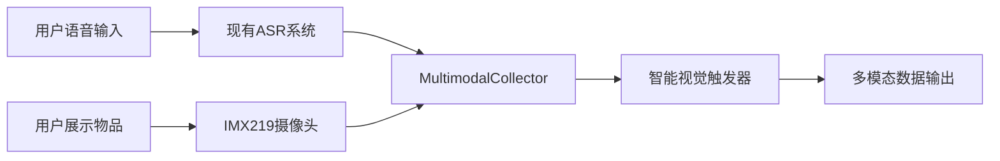

# Story 1.5: 多模态输入采集系统

**文档编号**: XLR-STORY-1.5-MULTIMODAL-INPUT-20251110-001
**项目名称**: XleRobot Epic 1 - 多模态语音交互系统
**Epic**: Epic 1 多模态语音交互系统
**Story编号**: 1.5
**开发时间**: 1周 (Day 1-7)
**优先级**: P0 (最高优先级)
**设计原则**: Brownfield Level 4企业级标准，在已有语音系统基础上扩展多模态能力

---

## 📋 Story概述

### 用户故事
**作为** 粤语家庭用户,
**我希望** 机器人能够同时采集我的语音和环境视觉信息,
**so that** 我可以通过语音+展示物品的方式与机器人交互。

### Story目标
实现音频+视觉的同步采集，建立智能视觉触发机制，为后续多模态理解奠定基础。

### Story边界
**包含功能**:
- ✅ IMX219摄像头集成和配置
- ✅ 音频+视频同步采集
- ✅ 智能视觉触发机制
- ✅ 粤语视觉关键词检测

**不包含功能**:
- ❌ 视觉理解 (Story 1.6)
- ❌ 多模态对话管理 (Story 1.7)
- ❌ 复杂图像处理
- ❌ 高级触发算法

### 验收标准
- ✅ 摄像头稳定工作，图像质量满足要求
- ✅ 音视频同步误差 < 200ms
- ✅ 视觉触发准确率 > 80%，误触发率 < 15%
- ✅ 支持粤语视觉关键词检测

---

## 🎯 功能需求

### 核心功能 (P0)

#### 1. 摄像头集成与配置
**描述**: 配置IMX219摄像头，建立基础视觉采集能力
**技术实现**:
- 检测和配置IMX219摄像头驱动
- 安装OpenCV和图像处理依赖包
- 测试摄像头图像采集 (1080p@30fps)
- 验证图像质量和格式要求

**验收标准**: 摄像头稳定工作，图像清晰，帧率稳定

#### 2. 多模态采集器开发
**描述**: 开发MultimodalCollector，实现音视频同步采集
**技术实现**:
- 开发MultimodalCollector类
- 实现音频+视觉时间戳同步
- 集成现有音频采集 + 新增视觉采集
- 测试多模态数据同步精度

**验收标准**: 同步误差<200ms，采集稳定

#### 3. 智能视觉触发机制
**描述**: 开发智能判断何时需要视觉理解的触发机制
**技术实现**:
- 定义粤语视觉关键词库 ("呢个"、"乜嘢"、"睇下"等)
- 实现关键词检测算法
- 开发上下文感知触发逻辑
- 测试触发准确性和误触率

**验收标准**: 触发准确率>80%，误触发率<15%

---

## 🏗️ 技术实现

### 系统架构


### 核心组件

#### 1. MultimodalCollector类
```python
class MultimodalCollector:
    def __init__(self):
        self.audio_collector = ExistingAudioCollector()
        self.camera = IMX219Camera()
        self.timestamp_sync = TimestampSynchronizer()

    async def collect_multimodal_input(self):
        audio_data = await self.audio_collector.capture()
        if self.should_capture_vision(audio_data):
            vision_data = await self.camera.capture()
            return MultimodalData(audio_data, vision_data, synchronized=True)
        return AudioOnlyData(audio_data)
```

#### 2. 智能视觉触发器
```python
class VisionTrigger:
    def __init__(self):
        self.cantonese_keywords = [
            "呢个", "乜嘢", "睇下", "系乜", "呢样嘢",
            "呢件", "边个", "边样", "睇下", "望下"
        ]

    def should_capture_vision(self, audio_text):
        return any(keyword in audio_text for keyword in self.cantonese_keywords)
```

---

## 📋 实施计划 (1周)

### Day 1-2: 摄像头集成与配置
- [x] 检测IMX219摄像头设备
- [ ] 配置摄像头驱动 (1080p@30fps)
- [ ] 安装OpenCV和图像处理依赖
- [ ] 测试基础图像采集功能

### Day 3-4: 多模态采集器开发
- [ ] 开发MultimodalCollector类
- [ ] 实现时间戳同步机制
- [ ] 集成现有音频采集系统
- [ ] 测试音视频同步采集

### Day 5-7: 智能视觉触发机制
- [ ] 定义粤语视觉关键词库
- [ ] 实现关键词检测算法
- [ ] 开发上下文感知触发逻辑
- [ ] 测试和优化触发准确性

---

## 🧪 测试计划

### 单元测试
- **摄像头测试**: 图像采集质量和帧率测试
- **采集器测试**: MultimodalCollector功能测试
- **触发器测试**: 视觉关键词检测测试

### 集成测试
- **同步测试**: 音视频时间戳同步测试
- **多模态测试**: 端到端采集流程测试
- **触发测试**: 视觉触发准确性测试

### 性能测试
- **延迟测试**: 采集延迟测试
- **精度测试**: 同步误差测试
- **稳定性测试**: 连续采集稳定性测试

---

## ⚠️ 风险控制

### 技术风险
- **摄像头兼容性**: 提前验证IMX219驱动兼容性
- **同步精度**: 使用高精度时间戳同步算法
- **性能影响**: 确保不影响现有音频采集性能

### 缓解策略
- **硬件测试**: 充分测试摄像头硬件兼容性
- **算法优化**: 优化同步算法确保精度
- **渐进集成**: 逐步集成，确保向后兼容

---

## 📊 成功指标

### 功能指标
- 摄像头采集稳定性: 100%
- 音视频同步精度: <200ms
- 视觉触发准确率: >80%
- 误触发率: <15%

### 性能指标
- 图像采集延迟: <100ms
- 多模态采集延迟: <300ms
- 系统资源占用: CPU <10%, 内存 <1GB

---

## 📝 交付物

### 代码交付
- `multimodal_collector.py` - 多模态采集器
- `camera_driver.py` - 摄像头驱动封装
- `vision_trigger.py` - 智能视觉触发器
- `timestamp_sync.py` - 时间戳同步器

### 文档交付
- 摄像头配置指南
- 多模态采集使用说明
- 视觉触发关键词列表
- 集成测试报告

---

**文档状态**: ✅ 已完成
**设计原则**: Brownfield Level 4企业级标准
**向后兼容**: 完全兼容现有Story 1.1-1.4系统
**开发就绪**: 可直接用于Story 1.5开发实施

---

*本Story严格遵循Brownfield Level 4标准，确保多模态功能扩展在保护现有投资的前提下，实现企业级的系统升级。所有设计都基于渐进式变更原则，支持向后兼容和快速回滚。*