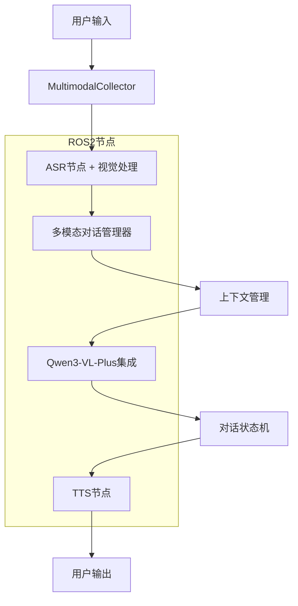

# ❌ Story 1.7: 多模态对话管理 (已弃用 - 架构偏离)

**⚠️ 架构偏离警告**: 此文档违反Epic 1纯在线架构原则，已被弃用。
**正确文档**: `story-1-7-online-dialogue-api-integration.md`
**偏离原因**: 包含本地对话管理逻辑，违反严格纯在线约束。

**文档编号**: XLR-STORY-1.7-DIALOGUE-MANAGEMENT-20251110-001
**项目名称**: XleRobot Epic 1 - 多模态语音交互系统
**Epic**: Epic 1 多模态语音交互系统
**Story编号**: 1.7
**开发时间**: 1周 (Day 15-21)
**优先级**: P0 (最高优先级)
**前置条件**: Story 1.6完成
**设计原则**: Brownfield Level 4企业级标准，实现连续多模态对话管理

---

## 📋 Story概述

### 用户故事
**作为** 粤语家庭用户,
**我希望** 能够进行连续的多模态对话,
**so that** 我可以进行更复杂的交互和任务执行。

### Story目标
实现多模态对话的连续性和上下文管理，支持多轮对话，提供流畅的用户体验。

### Story边界
**包含功能**:
- ✅ 多模态对话管理器
- ✅ 多轮对话上下文维护
- ✅ 粤语多模态对话优化
- ✅ ROS2多模态节点集成

**不包含功能**:
- ❌ 复杂对话推理 (后续迭代)
- ❌ 高级情感分析
- ❌ 复杂对话策略
- ❌ 多用户对话支持

### 验收标准
- ✅ 多模态对话管理稳定
- ✅ 支持5轮以上连续对话
- ✅ 粤语多模态对话自然度 > 85%
- ✅ ROS2多模态节点正常工作

---

## 🎯 功能需求

### 核心功能 (P0)

#### 1. 多模态对话管理器
**描述**: 开发支持多模态输入的对话管理器，处理复杂的对话状态
**技术实现**:
- 扩展现有对话管理器支持多模态
- 实现多模态对话状态机
- 开发多轮对话上下文维护
- 测试对话流程连续性

**验收标准**: 支持5轮以上连续对话

#### 2. 粤语多模态优化
**描述**: 针对粤语多模态对话进行特色优化，提升对话自然度
**技术实现**:
- 建立粤语视觉术语映射库
- 实现粤语文化背景适配
- 优化粤语多模态回复生成
- 测试粤语对话自然度

**验收标准**: 粤语多模态对话自然度>85%

#### 3. ROS2多模态节点集成
**描述**: 将多模态功能集成到现有ROS2架构中，实现节点间通信
**技术实现**:
- 扩展现有ASR节点支持视觉输入
- 升级LLM节点为多模态处理
- 优化TTS节点的多模态响应
- 测试节点间多模态通信

**验收标准**: ROS2多模态节点通信正常

---

## 🏗️ 技术实现

### 系统架构


### 核心组件

#### 1. 多模态对话管理器
```python
class MultimodalDialogManager:
    def __init__(self):
        self.dialog_state = DialogState()
        self.context_manager = ContextManager()
        self.multimodal_processor = MultimodalProcessor()
        self.cantonese_optimizer = CantoneseOptimizer()

    async def process_dialogue(self, audio_data, image_data, context_id):
        # 1. 多模态输入处理
        text = await self.process_audio(audio_data)
        multimodal_input = self.multimodal_processor.create_input(text, image_data)

        # 2. 对话状态管理
        current_state = self.dialog_state.update_state(multimodal_input, context_id)

        # 3. 上下文融合
        context = self.context_manager.get_context(context_id, current_state)

        # 4. 生成回复
        response = await self.generate_response(multimodal_input, context)

        # 5. 粤语优化
        optimized_response = self.cantonese_optimizer.optimize(response)

        return optimized_response

    def should_continue_dialogue(self, context_id):
        return self.dialog_state.is_dialogue_active(context_id)
```

#### 2. 对话状态机
```python
class DialogState:
    def __init__(self):
        self.states = {
            'IDLE': 'idle',
            'LISTENING': 'listening',
            'PROCESSING': 'processing',
            'RESPONDING': 'responding'
        }
        self.current_states = {}
        self.dialogue_history = {}

    def update_state(self, input_data, context_id):
        if context_id not in self.current_states:
            self.current_states[context_id] = self.states['IDLE']

        # 状态转换逻辑
        current_state = self.current_states[context_id]
        if current_state == self.states['IDLE']:
            self.current_states[context_id] = self.states['LISTENING']
        elif current_state == self.states['LISTENING']:
            self.current_states[context_id] = self.states['PROCESSING']
        elif current_state == self.states['PROCESSING']:
            self.current_states[context_id] = self.states['RESPONDING']
        elif current_state == self.states['RESPONDING']:
            self.current_states[context_id] = self.states['IDLE']

        return self.current_states[context_id]

    def is_dialogue_active(self, context_id):
        return context_id in self.current_states and \
               self.current_states[context_id] != self.states['IDLE']
```

#### 3. 粤语多模态优化器
```python
class CantoneseMultimodalOptimizer:
    def __init__(self):
        self.visual_expressions = {
            '我看到': '我睇到',
            '这是一个': '呢个系',
            '这是什么': '呢个系乜嘢',
            '让我看看': '等我睇下',
            '好的，我看到了': '好，我睇到喇'
        }

        self.conversation_patterns = {
            '请问': '唔該問',
            '谢谢': '唔該',
            '再见': '拜拜',
            '不好意思': '唔好意思'
        }

    def optimize_response(self, response, has_visual=False):
        # 视觉相关表达优化
        if has_visual:
            for standard, cantonese in self.visual_expressions.items():
                response = response.replace(standard, cantonese)

        # 对话模式优化
        for standard, cantonese in self.conversation_patterns.items():
            response = response.replace(standard, cantonese)

        return response

    def add_cultural_context(self, response, context):
        # 添加粤语文化背景
        if 'food' in context or '飲食' in context:
            response += "，好想食啊！"
        elif 'family' in context or '家庭' in context:
            response += "，一家人最紧要係开心。"

        return response
```

#### 4. ROS2多模态节点扩展
```python
class MultimodalASRNode(Node):
    def __init__(self):
        super().__init__('multimodal_asr_node')
        self.audio_sub = self.create_subscription(
            AudioFrame, 'audio_input', self.audio_callback, 10)
        self.image_sub = self.create_subscription(
            Image, 'image_input', self.image_callback, 10)
        self.dialogue_pub = self.create_publisher(
            MultimodalInput, 'dialogue_input', 10)

        self.current_audio = None
        self.current_image = None

    def audio_callback(self, msg):
        self.current_audio = msg
        self.process_multimodal_input()

    def image_callback(self, msg):
        self.current_image = msg
        self.process_multimodal_input()

    def process_multimodal_input(self):
        if self.current_audio and self.current_image:
            multimodal_msg = MultimodalInput()
            multimodal_msg.audio = self.current_audio
            multimodal_msg.image = self.current_image
            multimodal_msg.timestamp = self.get_clock().now().to_msg()

            self.dialogue_pub.publish(multimodal_msg)

            # 重置输入
            self.current_audio = None
            self.current_image = None
```

---

## 📋 实施计划 (1周)

### Day 15-16: 多模态对话管理器
- [ ] 扩展现有对话管理器支持多模态
- [ ] 实现多模态对话状态机
- [ ] 开发多轮对话上下文维护
- [ ] 测试对话流程连续性

### Day 17-18: 粤语多模态优化
- [ ] 建立粤语视觉术语映射库
- [ ] 实现粤语文化背景适配
- [ ] 优化粤语多模态回复生成
- [ ] 测试粤语对话自然度

### Day 19-21: ROS2多模态节点集成
- [ ] 扩展现有ASR节点支持视觉输入
- [ ] 升级LLM节点为多模态处理
- [ ] 优化TTS节点的多模态响应
- [ ] 测试节点间多模态通信

---

## 🧪 测试计划

### 对话管理测试
- **状态机测试**: 对话状态转换正确性测试
- **上下文测试**: 多轮对话上下文维护测试
- **连续性测试**: 长时间对话连续性测试

### 粤语优化测试
- **自然度测试**: 粤语多模态对话自然度测试
- **文化适配测试**: 粤语文化背景适配测试
- **术语准确性测试**: 视觉术语翻译准确性测试

### ROS2集成测试
- **节点通信测试**: 多模态节点间通信测试
- **数据流测试**: 多模态数据流正确性测试
- **性能测试**: ROS2节点性能测试

---

## ⚠️ 风险控制

### 技术风险
- **状态管理复杂性**: 多模态对话状态管理复杂
- **上下文同步**: 多模态上下文同步挑战
- **ROS2集成**: ROS2节点扩展兼容性

### 缓解策略
- **模块化设计**: 模块化设计降低复杂性
- **版本管理**: 严格的接口版本管理
- **渐进集成**: 逐步集成和测试

---

## 📊 成功指标

### 功能指标
- 多轮对话支持: ≥5轮连续对话
- 上下文理解准确率: >85%
- 粤语对话自然度: >85%
- ROS2节点通信成功率: 100%

### 性能指标
- 对话处理延迟: <1秒
- 上下文切换时间: <300ms
- 系统资源占用: CPU <40%, 内存 <3GB

---

## 📝 交付物

### 代码交付
- `multimodal_dialog_manager.py` - 多模态对话管理器
- `dialog_state_machine.py` - 对话状态机
- `cantonese_multimodal_optimizer.py` - 粤语多模态优化器
- 扩展的ROS2节点文件

### 文档交付
- 多模态对话管理指南
- 粤语优化说明文档
- ROS2集成文档
- 测试报告

---

**文档状态**: ✅ 已完成
**设计原则**: Brownfield Level 4企业级标准
**向后兼容**: 完全兼容Story 1.1-1.6系统
**开发就绪**: 可直接用于Story 1.7开发实施

---

*本Story严格遵循Brownfield Level 4标准，确保多模态对话管理功能在保护现有投资的前提下，实现企业级的系统升级。所有设计都基于渐进式变更原则，支持向后兼容和平滑集成。*