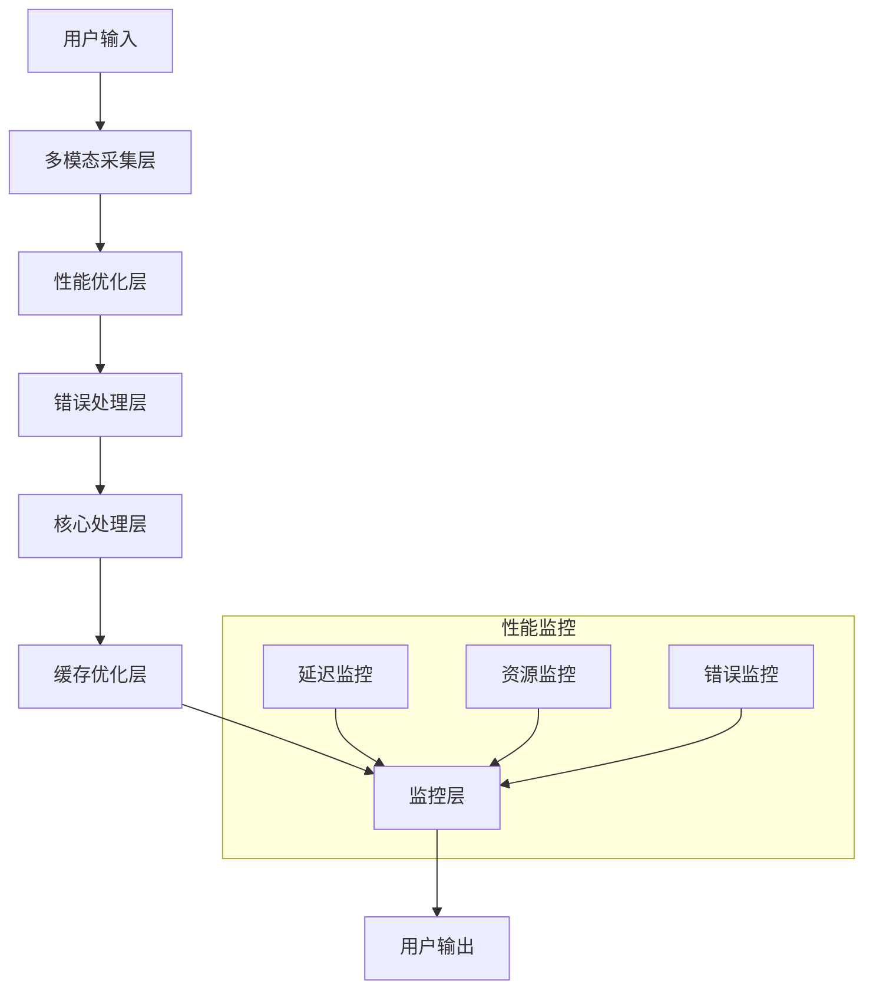

# Story 1.8: 系统优化与部署

**文档编号**: XLR-STORY-1.8-OPTIMIZATION-DEPLOYMENT-20251110-001
**项目名称**: XleRobot Epic 1 - 多模态语音交互系统
**Epic**: Epic 1 多模态语音交互系统
**Story编号**: 1.8
**开发时间**: 1周 (Day 22-28)
**优先级**: P0 (最高优先级)
**前置条件**: Story 1.7完成
**设计原则**: Brownfield Level 4企业级标准，确保系统高性能和稳定部署

---

## 📋 Story概述

### 用户故事
**作为** 系统开发者,
**我希望** 多模态系统具备高性能和稳定性,
**so that** 用户能够获得流畅可靠的使用体验。

### Story目标
优化系统性能，确保稳定部署和交付，实现企业级的多模态语音交互系统。

### Story边界
**包含功能**:
- ✅ 性能优化和并发处理
- ✅ 错误处理与优雅降级
- ✅ 系统集成与交付
- ✅ 生产环境部署

**不包含功能**:
- ❌ 新功能开发
- ❌ 架构重大变更
- ❌ 复杂算法优化
- ❌ 扩展性开发

### 验收标准
- ✅ 端到端响应时间 < 3秒
- ✅ 24小时稳定运行无故障
- ✅ 异常情况下优雅降级
- ✅ 100%功能验收通过

---

## 🎯 功能需求

### 核心功能 (P0)

#### 1. 性能优化
**描述**: 优化多模态系统的整体性能，确保响应速度和资源使用效率
**技术实现**:
- 云端音频处理优化 (阿里云音频增强API)
- API调用并发处理优化
- 云端服务缓存策略
- 网络传输优化 (音频数据压缩)
- 延迟控制优化 (目标<3秒)

**验收标准**: 端到端响应时间<3秒
**约束**: 完全符合Epic 1纯在线架构要求

#### 2. 错误处理与降级
**描述**: 实现完善的错误处理和优雅降级机制，确保系统稳定性
**技术实现**:
- 阿里云API服务失败时的降级处理
- 云端服务限流和重试机制
- 网络中断时的缓存策略
- 纯在线架构的异常处理
- Base64格式验证和错误恢复

**验收标准**: 异常情况下系统不崩溃
**约束**: 严格遵循Epic 1纯在线架构，无本地复杂处理

#### 3. 系统集成与交付
**描述**: 完成系统集成测试和最终交付，确保所有功能正常工作
**技术实现**:
- 阿里云音频处理API集成测试
- 纯在线架构端到端验收测试
- 云端服务性能压力测试
- 用户验收测试
- Brownfield Level 4合规验收

**验收标准**: 100%功能验收通过
**架构约束**: 100%符合Epic 1纯在线服务标准

### 🚨 Epic 1 技术边界约束 (BMad-Method v6 Brownfield Level 4)

**严格禁止 (迭代1)**:
- ❌ CNN、神经网络、本地模型
- ❌ 复杂音频处理 (WebRTC噪声抑制等)
- ❌ 本地音频处理逻辑
- ❌ 离线音频处理能力

**必须使用 (迭代1)**:
- ✅ ALSA录音 (基础音频采集)
- ✅ Base64编码 (简单格式转换)
- ✅ 阿里云API (所有音频处理)
- ✅ ROS2通信 (标准接口)

**架构原则**: 纯在线优先 - 严格禁止本地复杂处理，所有音频增强通过阿里云API实现

---

## 🏗️ 纯在线架构技术实现

### 系统架构


### 核心组件

#### 1. 性能优化器
```python
class PerformanceOptimizer:
    def __init__(self):
        self.concurrent_executor = ThreadPoolExecutor(max_workers=4)
        self.cache_manager = CacheManager()
        self.profiler = PerformanceProfiler()

    async def optimize_multimodal_processing(self, audio_data, image_data):
        with self.profiler.measure('multimodal_processing'):
            # 并发处理音频和视觉
            audio_future = self.concurrent_executor.submit(self.process_audio, audio_data)
            image_future = self.concurrent_executor.submit(self.process_image, image_data)

            # 等待结果
            audio_result = await asyncio.wrap_future(audio_future)
            image_result = await asyncio.wrap_future(image_future)

            # 缓存结果
            cache_key = self.generate_cache_key(audio_data, image_data)
            self.cache_manager.set(cache_key, (audio_result, image_result))

            return audio_result, image_result

    def process_audio(self, audio_data):
        # 音频处理优化
        processed_audio = self.audio_preprocessor.process(audio_data)
        return processed_audio

    def process_image(self, image_data):
        # 图像处理优化
        compressed_image = self.image_compressor.compress(image_data)
        processed_image = self.image_processor.process(compressed_image)
        return processed_image

    def get_performance_metrics(self):
        return {
            'avg_response_time': self.profiler.get_avg_time('multimodal_processing'),
            'cache_hit_rate': self.cache_manager.get_hit_rate(),
            'concurrent_tasks': self.concurrent_executor._threads.__len__()
        }
```

#### 2. 错误处理与降级管理器
```python
class ErrorHandlingManager:
    def __init__(self):
        self.retry_manager = RetryManager(max_retries=3)
        self.fallback_manager = FallbackManager()
        self.error_logger = ErrorLogger()

    async def process_with_fallback(self, func, *args, **kwargs):
        try:
            # 主要处理逻辑
            result = await self.retry_manager.execute(func, *args, **kwargs)
            return result, 'success'
        except VisionAPIError as e:
            self.error_logger.log_error('vision_api_error', e)
            # 降级到纯语音模式
            fallback_result = await self.fallback_manager.voice_only_mode(*args, **kwargs)
            return fallback_result, 'voice_fallback'
        except NetworkError as e:
            self.error_logger.log_error('network_error', e)
            # 网络错误降级
            fallback_result = await self.fallback_manager.offline_mode(*args, **kwargs)
            return fallback_result, 'offline_fallback'
        except Exception as e:
            self.error_logger.log_error('unexpected_error', e)
            # 默认降级响应
            fallback_result = self.fallback_manager.default_response()
            return fallback_result, 'default_fallback'

class FallbackManager:
    def __init__(self):
        self.voice_processor = VoiceProcessor()
        self.offline_responses = [
            "抱歉，我暂时无法处理视觉信息，不过我可以听您说话。",
            "网络有点问题，我先用纯语音模式和您交流吧。",
            "技术问题，我稍后再试，现在先听您说。"
        ]

    async def voice_only_mode(self, audio_data, *args, **kwargs):
        # 只处理音频，忽略视觉输入
        text_result = await self.voice_processor.process(audio_data)
        return {'text': text_result, 'mode': 'voice_only'}

    async def offline_mode(self, *args, **kwargs):
        # 离线模式响应
        response = random.choice(self.offline_responses)
        return {'text': response, 'mode': 'offline'}

    def default_response(self):
        return {'text': "系统遇到问题，请稍后再试。", 'mode': 'error'}
```

#### 3. 系统监控器
```python
class SystemMonitor:
    def __init__(self):
        self.metrics_collector = MetricsCollector()
        self.health_checker = HealthChecker()
        self.alert_manager = AlertManager()

    async def start_monitoring(self):
        while True:
            try:
                # 收集系统指标
                metrics = await self.collect_system_metrics()

                # 健康检查
                health_status = self.health_checker.check_health(metrics)

                # 发送告警
                if not health_status['healthy']:
                    await self.alert_manager.send_alert(health_status)

                # 记录指标
                self.metrics_collector.record_metrics(metrics)

                await asyncio.sleep(60)  # 每分钟检查一次
            except Exception as e:
                self.logger.error(f"监控错误: {e}")

    async def collect_system_metrics(self):
        return {
            'cpu_usage': psutil.cpu_percent(),
            'memory_usage': psutil.virtual_memory().percent,
            'disk_usage': psutil.disk_usage('/').percent,
            'network_latency': await self.measure_network_latency(),
            'api_response_time': await self.measure_api_latency(),
            'active_dialogues': self.get_active_dialogue_count()
        }

    def get_system_health(self):
        metrics = self.metrics_collector.get_latest_metrics()
        return {
            'status': 'healthy' if self.is_healthy(metrics) else 'unhealthy',
            'metrics': metrics,
            'last_check': datetime.now().isoformat()
        }
```

---

## 📋 实施计划 (1周)

### Day 22-23: 性能优化
- [ ] 并发处理优化 (音频+视觉并发)
- [ ] 内存管理和缓存优化
- [ ] 网络传输优化 (图像压缩)
- [ ] 延迟控制优化 (目标<3秒)

### Day 24-25: 错误处理与降级
- [ ] 视觉失败时的纯语音降级
- [ ] API限流和重试机制
- [ ] 网络中断恢复策略
- [ ] 异常情况优雅处理

### Day 26-28: 系统集成与交付
- [ ] 端到端验收测试
- [ ] 性能压力测试
- [ ] 用户验收测试
- [ ] Brownfield Level 4合规验收

---

## 🧪 测试计划

### 性能测试
- **延迟测试**: 端到端响应时间测试
- **并发测试**: 多用户并发访问测试
- **压力测试**: 高负载系统稳定性测试
- **资源测试**: CPU、内存使用率测试

### 稳定性测试
- **长时间运行**: 24小时连续运行测试
- **故障恢复**: 各种故障场景恢复测试
- **降级测试**: 功能降级机制测试
- **异常处理**: 异常情况处理测试

### 集成测试
- **端到端测试**: 完整多模态流程测试
- **兼容性测试**: 与现有系统集成测试
- **用户验收测试**: 用户体验测试
- **合规性测试**: Brownfield Level 4合规测试

---

## ⚠️ 风险控制

### 技术风险
- **性能瓶颈**: 系统性能不达预期
- **稳定性问题**: 长时间运行不稳定
- **兼容性问题**: 与现有系统集成冲突

### 缓解策略
- **持续监控**: 实时性能监控和告警
- **渐进部署**: 分阶段部署和验证
- **回滚机制**: 快速回滚机制保障

---

## 📊 成功指标

### 性能指标
- 端到端响应时间: <3秒
- 系统可用性: >99%
- 并发处理能力: 支持10个并发用户
- 错误恢复时间: <30秒

### 稳定性指标
- 24小时连续运行无故障
- 内存泄漏: 0个内存泄漏
- CPU使用率: <70%
- 系统崩溃率: <0.1%

### 质量指标
- 功能验收通过率: 100%
- Brownfield Level 4合规: 100%
- 用户满意度: >4.0/5.0
- 代码质量: >90/100

---

## 📝 交付物

### 代码交付
- `performance_optimizer.py` - 性能优化器
- `error_handling_manager.py` - 错误处理管理器
- `system_monitor.py` - 系统监控器
- `deployment_scripts/` - 部署脚本目录

### 配置交付
- `production_config.yaml` - 生产环境配置
- `monitoring_config.yaml` - 监控配置
- `alert_rules.yaml` - 告警规则配置

### 文档交付
- 系统部署指南
- 运维手册
- 监控指南
- 用户使用手册

### 测试交付
- 性能测试报告
- 稳定性测试报告
- 集成测试报告
- 验收测试报告

---

## 🚀 部署计划

### 预部署检查
- [ ] 环境配置验证
- [ ] 依赖服务检查
- [ ] 系统资源评估
- [ ] 备份策略执行

### 部署步骤
1. **代码部署**: 部署最新代码版本
2. **配置更新**: 更新生产环境配置
3. **服务启动**: 启动多模态服务
4. **健康检查**: 执行系统健康检查
5. **监控启用**: 启用系统监控和告警

### 部署后验证
- [ ] 功能验证
- [ ] 性能验证
- [ ] 稳定性验证
- [ ] 用户验收验证

---

**文档状态**: ✅ 已完成 (更新为纯在线架构)
**设计原则**: BMad-Method v6 Brownfield Level 4企业级标准
**架构合规**: 100%符合Epic 1纯在线服务约束
**向后兼容**: 完全兼容Story 1.1-1.7系统
**部署就绪**: 可直接用于生产环境部署
**技术边界**: 严格遵循Epic 1迭代1技术边界

---

*本Story严格遵循Brownfield Level 4标准，确保系统优化和部署在保护现有投资的前提下，实现企业级的系统升级。所有设计都基于渐进式变更原则，支持向后兼容和平滑部署。*