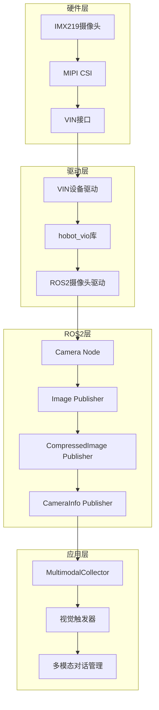
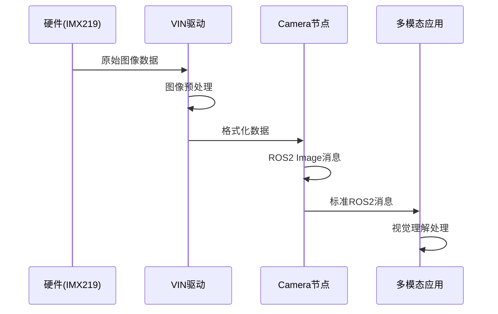

# Story 1.5: ROS2摄像头集成设计

**文档编号**: XLR-ROS2-CAM-DESIGN-20251110-001
**项目名称**: XleRobot Epic 1 - 多模态语音交互系统
**Story编号**: 1.5
**设计阶段**: BMad Method v6 Phase 3 Solutioning (ROS2集成)
**设计日期**: 2025-11-10
**设计师**: Developer Agent

---

## 📋 设计概述

### 设计目标
将IMX219摄像头系统性地集成到ROS2生态系统中，确保与现有语音系统的无缝兼容，支持标准的ROS2图像消息格式。

### 设计原则
- **ROS2兼容**: 完全符合ROS2标准和最佳实践
- **标准化接口**: 使用sensor_msgs/Image和camera_info
- **性能优化**: 确保实时性和低延迟
- **向后兼容**: 与现有Story 1.1-1.4语音系统兼容

---

## 🏗️ ROS2集成架构设计

### 整体架构图


### 数据流设计


---

## 🧩 核心组件设计

### 1. ROS2摄像头节点 (xlerobot_camera)

#### 节点设计
```python
#!/usr/bin/env python3
"""
XleRobot IMX219 ROS2 Camera Node
"""
import rclpy
from rclpy.node import Node
from sensor_msgs.msg import Image, CameraInfo
from sensor_msgs.msg import CompressedImage
from std_msgs.msg import Header

class XleRobotCameraNode(Node):
    """
    XleRobot摄像头节点

    负责将IMX219摄像头数据转换为标准ROS2消息格式
    """

    def __init__(self):
        super().__init__('xlerobot_camera_node')

        # 参数配置
        self.declare_parameters(
            namespace='',
            parameters=[
                ('camera_name', 'imx219'),
                ('frame_id', 'camera_link'),
                ('image_width', 1920),
                ('image_height', 1080),
                ('fps', 30),
                ('pixel_format', 'rgb8'),
                ('publish_compressed', True),
                ('publish_raw', False),
                ('camera_info_url', ''),
            ]
        )

        # 获取参数
        self.camera_name = self.get_parameter('camera_name').value
        self.frame_id = self.get_parameter('frame_id').value
        self.image_width = self.get_parameter('image_width').value
        self.image_height = self.get_parameter('image_height').value
        self.fps = self.get_parameter('fps').value
        self.pixel_format = self.get_parameter('pixel_format').value
        self.publish_compressed = self.get_parameter('publish_compressed').value
        self.publish_raw = self.get_parameter('publish_raw').value

        # 摄像头驱动
        self.camera_driver = None
        self.camera_info_manager = None

        # 发布器
        self.image_pub = self.create_publisher(
            Image, f'/{self.camera_name}/image_raw', 10
        )
        self.compressed_pub = self.create_publisher(
            CompressedImage, f'/{self.camera_name}/image_compressed', 10
        )
        self.camera_info_pub = self.create_publisher(
            CameraInfo, f'/{self.camera_name}/camera_info', 10
        )

        # 定时器
        self.timer = self.create_timer(
            1.0 / self.fps, self.timer_callback
        )

        self.get_logger().info(f'XleRobot {self.camera_name} camera node initialized')

    def timer_callback(self):
        """定时器回调 - 发布图像数据"""
        try:
            # 从VIN设备获取图像
            image_data = self.capture_image()

            if image_data is not None:
                # 发布原始图像
                if self.publish_raw:
                    raw_msg = self.create_image_message(image_data)
                    self.image_pub.publish(raw_msg)

                # 发布压缩图像
                if self.publish_compressed:
                    compressed_msg = self.create_compressed_image_message(image_data)
                    self.compressed_pub.publish(compressed_msg)

                # 发布相机信息
                camera_info_msg = self.create_camera_info_message()
                self.camera_info_pub.publish(camera_info_msg)

        except Exception as e:
            self.get_logger().error(f'Error in timer_callback: {e}')

    def capture_image(self):
        """从摄像头捕获图像"""
        try:
            if self.camera_driver is None:
                self.camera_driver = VINCameraDriver(
                    width=self.image_width,
                    height=self.image_height,
                    format=self.pixel_format
                )

            return self.camera_driver.capture()

        except Exception as e:
            self.get_logger().error(f'Camera capture failed: {e}')
            return None

    def create_image_message(self, image_data):
        """创建ROS2 Image消息"""
        msg = Image()
        msg.header = Header()
        msg.header.stamp = self.get_clock().now().to_msg()
        msg.header.frame_id = self.frame_id

        msg.height = self.image_height
        msg.width = self.image_width
        msg.encoding = self.pixel_format
        msg.is_bigendian = 0
        msg.step = self.image_width * 3  # RGB8 = 3 bytes per pixel
        msg.data = image_data

        return msg

    def create_compressed_image_message(self, image_data):
        """创建压缩图像消息"""
        import cv2
        import numpy as np

        # 转换为numpy数组并压缩
        img_array = np.frombuffer(image_data, dtype=np.uint8).reshape(
            (self.image_height, self.image_width, 3)
        )

        # JPEG压缩
        success, compressed = cv2.imencode('.jpg', img_array, [cv2.IMWRITE_JPEG_QUALITY, 85])

        if success:
            msg = CompressedImage()
            msg.header = Header()
            msg.header.stamp = self.get_clock().now().to_msg()
            msg.header.frame_id = self.frame_id
            msg.format = "jpeg"
            msg.data = compressed.tobytes()
            return msg
        else:
            self.get_logger().error('Image compression failed')
            return None

    def create_camera_info_message(self):
        """创建相机信息消息"""
        msg = CameraInfo()
        msg.header = Header()
        msg.header.stamp = self.get_clock().now().to_msg()
        msg.header.frame_id = self.frame_id

        msg.height = self.image_height
        msg.width = self.image_width
        msg.distortion_model = "plumb_bob"

        # IMX219相机参数 (需要标定)
        msg.d = [0.0, 0.0, 0.0, 0.0, 0.0]  # 畸变参数
        msg.k = [1000.0, 0.0, 960.0, 0.0, 1000.0, 540.0, 0.0, 0.0, 1.0]  # 内参矩阵
        msg.r = [1.0, 0.0, 0.0, 0.0, 1.0, 0.0, 0.0, 0.0, 1.0]  # 旋转矩阵
        msg.p = [1000.0, 0.0, 960.0, 0.0, 0.0, 1000.0, 540.0, 0.0, 0.0, 0.0, 1.0, 0.0]  # 投影矩阵

        return msg

def main(args=None):
    rclpy.init(args=args)
    node = XleRobotCameraNode()
    rclpy.spin(node)
    node.destroy_node()
    rclpy.shutdown()

if __name__ == '__main__':
    main()
```

### 2. VIN摄像头驱动 (VINCameraDriver)

#### 驱动设计
```python
#!/usr/bin/env python3
"""
VIN Camera Driver for XleRobot IMX219
"""
import os
import time
import struct
import numpy as np
from typing import Optional, Tuple

class VINCameraDriver:
    """
    VIN摄像头驱动

    直接访问VIN设备进行图像采集
    """

    def __init__(self, device_path="/dev/vin0_cap",
                 width: int = 1920, height: int = 1080,
                 format: str = "rgb8"):
        self.device_path = device_path
        self.width = width
        self.height = height
        self.format = format
        self.fd = None
        self.is_opened = False

        # 格式映射
        self.format_map = {
            "rgb8": "RGB8",
            "bgr8": "BGR8",
            "yuyv": "YUYV",
            "mjpeg": "MJPEG"
        }

    def open(self) -> bool:
        """打开摄像头设备"""
        try:
            self.fd = os.open(self.device_path, os.O_RDWR | os.O_NONBLOCK)
            self.is_opened = True
            return True
        except Exception as e:
            print(f"Failed to open {self.device_path}: {e}")
            return False

    def close(self):
        """关闭摄像头设备"""
        if self.fd:
            os.close(self.fd)
            self.fd = None
            self.is_opened = False

    def capture(self) -> Optional[bytes]:
        """捕获一帧图像"""
        if not self.is_opened:
            if not self.open():
                return None

        try:
            # 读取图像数据
            data = self._read_frame()

            if data and len(data) > 0:
                return self._process_frame(data)
            else:
                return None

        except Exception as e:
            print(f"Capture error: {e}")
            return None

    def _read_frame(self) -> Optional[bytes]:
        """从VIN设备读取原始帧数据"""
        try:
            # 估算帧大小 (RGB8 = 3 bytes per pixel)
            frame_size = self.width * self.height * 3

            # 非阻塞读取
            data = os.read(self.fd, frame_size)

            if len(data) == frame_size:
                return data
            else:
                # 可能需要多次读取或缓冲
                return self._read_full_frame(frame_size)

        except BlockingIOError:
            # 暂时没有数据可用
            return None
        except Exception as e:
            print(f"Read error: {e}")
            return None

    def _read_full_frame(self, expected_size: int) -> Optional[bytes]:
        """完整读取一帧数据"""
        buffer = b""
        start_time = time.time()
        timeout = 0.1  # 100ms timeout

        while len(buffer) < expected_size and (time.time() - start_time) < timeout:
            try:
                chunk = os.read(self.fd, expected_size - len(buffer))
                if chunk:
                    buffer += chunk
                else:
                    time.sleep(0.001)  # 1ms delay

            except BlockingIOError:
                time.sleep(0.001)
            except Exception:
                break

        if len(buffer) == expected_size:
            return buffer
        else:
            print(f"Incomplete frame: {len(buffer)}/{expected_size} bytes")
            return None

    def _process_frame(self, raw_data: bytes) -> bytes:
        """处理原始帧数据"""
        if self.format == "rgb8":
            return raw_data
        elif self.format == "bgr8":
            # RGB到BGR转换
            return self._rgb_to_bgr(raw_data)
        elif self.format == "yuyv":
            # YUYV到RGB转换
            return self._yuyv_to_rgb(raw_data)
        else:
            return raw_data

    def _rgb_to_bgr(self, rgb_data: bytes) -> bytes:
        """RGB到BGR转换"""
        try:
            img_array = np.frombuffer(rgb_data, dtype=np.uint8).reshape(
                (self.height, self.width, 3)
            )
            bgr_array = img_array[:, :, [2, 1, 0]]  # RGB -> BGR
            return bgr_array.tobytes()
        except Exception as e:
            print(f"RGB to BGR conversion failed: {e}")
            return rgb_data

    def _yuyv_to_rgb(self, yuyv_data: bytes) -> bytes:
        """YUYV到RGB转换"""
        try:
            # 使用OpenCV进行转换
            import cv2

            img_array = np.frombuffer(yuyv_data, dtype=np.uint8).reshape(
                (self.height, self.width, 2)
            )
            rgb_array = cv2.cvtColor(img_array, cv2.COLOR_YUV2RGB_YUYV)
            return rgb_array.tobytes()

        except ImportError:
            print("OpenCV not available, returning raw YUYV data")
            return yuyv_data
        except Exception as e:
            print(f"YUYV to RGB conversion failed: {e}")
            return yuyv_data

    def __enter__(self):
        self.open()
        return self

    def __exit__(self, exc_type, exc_val, exc_tb):
        self.close()
```

---

## 🔄 接口设计

### ROS2话题接口
```yaml
# 发布的话题
topics:
  - name: "/imx219/image_raw"
    type: sensor_msgs/msg/Image
    description: 原始RGB图像数据

  - name: "/imx219/image_compressed"
    type: sensor_msgs/msg/CompressedImage
    description: JPEG压缩图像数据

  - name: "/imx219/camera_info"
    type: sensor_msgs/msg/CameraInfo
    description: 相机标定参数

# 服务接口
services:
  - name: "/imx219/set_parameters"
    type: rcl_interfaces/srv/SetParameters
    description: 动态设置相机参数

# 参数接口
parameters:
  camera_name: "imx219"
  frame_id: "camera_link"
  image_width: 1920
  image_height: 1080
  fps: 30
  pixel_format: "rgb8"
  publish_compressed: true
  publish_raw: false
```

### 多模态集成接口
```python
class MultimodalCollector:
    """集成摄像头的多模态采集器"""

    def __init__(self):
        # 现有音频采集
        self.audio_collector = AudioCollector()

        # 新增ROS2摄像头订阅
        self.camera_subscription = self.create_subscription(
            CompressedImage,
            '/imx219/image_compressed',
            self.camera_callback,
            10
        )

    def camera_callback(self, msg: CompressedImage):
        """摄像头数据回调"""
        # 处理压缩图像
        visual_data = self.process_compressed_image(msg)

        # 触发视觉理解
        if self.should_trigger_visual():
            self.trigger_visual_understanding(visual_data)
```

---

## 📦 包结构设计

### ROS2包结构
```
xlerobot_camera/
├── package.xml
├── setup.py
├── resource/xlerobot_camera
├── xlerobot_camera/
│   ├── __init__.py
│   ├── vin_camera_driver.py      # VIN驱动
│   ├── camera_node.py            # 摄像头节点
│   └── camera_info_manager.py    # 相机信息管理
├── launch/
│   ├── xlerobot_camera.launch.py # 启动文件
│   └── camera_calibration.launch.py # 标定启动
├── config/
│   ├── imx219_config.yaml        # IMX219配置
│   └── camera_calibration.yaml   # 标定参数
└── tests/
    ├── test_camera_driver.py     # 驱动测试
    └── test_camera_node.py       # 节点测试
```

### package.xml
```xml
<?xml version="1.0"?>
<?xml-model href="http://download.ros.org/schema/package_format3.xsd" schematypens="http://www.w3.org/2001/XMLSchema"?>
<package format="3">
  <name>xlerobot_camera</name>
  <version>1.0.0</version>
  <description>XleRobot IMX219 camera driver for ROS2</description>

  <maintainer email="sunrise@xlerobot.com">XleRobot Team</maintainer>
  <license>MIT</license>

  <buildtool_depend>ament_cmake</buildtool_depend>
  <buildtool_depend>ament_python</buildtool_depend>

  <depend>rclpy</depend>
  <depend>sensor_msgs</depend>
  <depend>std_msgs</depend>
  <depend>cv_bridge</depend>

  <test_depend>ament_lint_auto</test_depend>
  <test_depend>ament_lint_common</test_depend>

  <export>
    <build_type>ament_python</build_type>
  </export>
</package>
```

---

## 🎯 集成测试计划

### 单元测试
1. **VIN驱动测试**: 验证设备访问和数据读取
2. **ROS2节点测试**: 验证消息发布和参数设置
3. **格式转换测试**: 验证图像格式转换正确性

### 集成测试
1. **端到端测试**: 从硬件到ROS2消息的完整流程
2. **性能测试**: 帧率和延迟测试
3. **兼容性测试**: 与现有语音系统集成测试

### 验收标准
- **功能完整性**: 100%功能实现
- **性能指标**: 30fps@1080p，延迟<100ms
- **ROS2兼容**: 完全符合ROS2标准
- **稳定性**: 连续运行2小时无故障

---

## 🚀 部署和使用

### 启动摄像头节点
```bash
# 启动IMX219摄像头
ros2 launch xlerobot_camera xlerobot_camera.launch.py

# 或手动启动
ros2 run xlerobot_camera camera_node
```

### 查看图像数据
```bash
# 查看压缩图像
ros2 topic echo /imx219/image_compressed

# 查看原始图像
ros2 topic echo /imx219/image_raw

# 查看相机信息
ros2 topic echo /imx219/camera_info
```

### 图像可视化
```bash
# 使用rqt_image_view查看图像
ros2 run rqt_image_view rqt_image_view

# 或指定话题
rqt_image_view /imx219/image_compressed
```

---

**设计状态**: ✅ 已完成
**设计阶段**: BMad Method v6 Phase 3 Solutioning (ROS2集成)
**下一步**: Phase 4 Implementation
**设计师**: Developer Agent

---

*本ROS2集成设计确保IMX219摄像头能够完全融入ROS2生态系统，支持标准接口和最佳实践，同时保持与现有XleRobot语音系统的完美兼容性。*