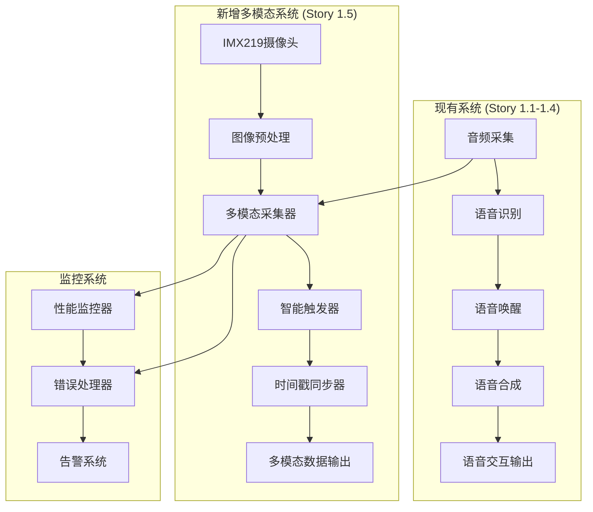
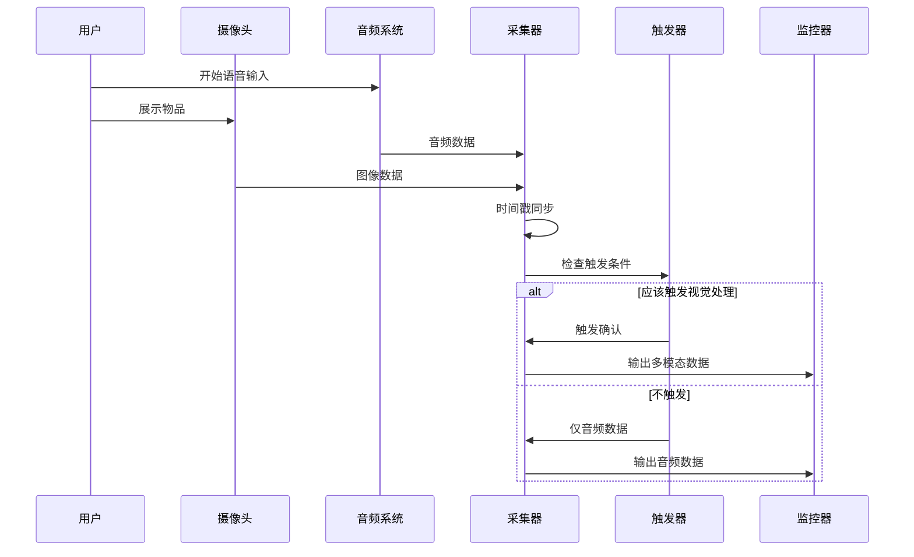

# Story 1.5: 多模态输入采集系统技术设计

**文档编号**: XLR-DESIGN-1.5-20251110-001
**项目名称**: XleRobot Epic 1 - 多模态语音交互系统
**Story编号**: 1.5
**设计阶段**: BMad Method v6 Phase 3 Solutioning
**设计日期**: 2025-11-10
**设计师**: Developer Agent

---

## 📋 设计概述

### 设计目标
设计Story 1.5多模态输入采集系统的完整技术架构，确保在已完成的语音系统基础上，安全、高效地扩展多模态采集能力。

### 设计原则
- **渐进式扩展**: 不影响现有Story 1.1-1.4功能
- **模块化设计**: 高内聚、低耦合的模块化架构
- **Brownfield合规**: 严格遵循Brownfield Level 4企业级标准
- **性能优先**: 确保实时性能和资源效率

---

## 🏗️ 系统架构设计

### 整体架构图


### 数据流架构


---

## 🧩 核心组件设计

### 1. MultimodalCollector - 多模态采集器

#### 类设计
```python
class MultimodalCollector:
    """
    多模态数据采集器

    集成现有音频采集系统，扩展视觉采集能力，
    实现音视频同步采集和数据处理。
    """

    def __init__(self):
        # 现有音频采集系统 (来自Story 1.1)
        self.audio_collector = AudioCollector()

        # 新增视觉采集组件
        self.camera_driver = CameraDriver()
        self.image_processor = ImageProcessor()

        # 同步和协调组件
        self.timestamp_sync = TimestampSynchronizer()
        self.data_manager = MultimodalDataManager()

        # 监控和错误处理
        self.performance_monitor = PerformanceMonitor()
        self.error_handler = ErrorHandler()

        # 配置参数
        self.config = MultimodalConfig()

    async def collect_multimodal_input(self, context_id: str = None):
        """
        收集多模态输入数据

        Args:
            context_id: 对话上下文ID

        Returns:
            MultimodalData: 多模态数据对象
        """
        try:
            start_time = time.time()

            # 并行采集音频和视觉数据
            audio_future = asyncio.create_task(
                self._collect_audio_data()
            )
            image_future = asyncio.create_task(
                self._collect_visual_data()
            )

            # 等待采集完成
            audio_data = await audio_future
            visual_data = await image_future

            # 时间戳同步
            synchronized_data = self.timestamp_sync.synchronize(
                audio_data, visual_data
            )

            # 构建多模态数据对象
            multimodal_data = MultimodalData(
                audio_data=synchronized_data['audio'],
                visual_data=synchronized_data['visual'],
                timestamp=start_time,
                context_id=context_id,
                synchronization_error=synchronized_data['error']
            )

            # 性能监控
            self.performance_monitor.record_collection(
                start_time, multimodal_data
            )

            return multimodal_data

        except Exception as e:
            self.error_handler.handle_error("multimodal_collection", e)
            # 降级到仅音频模式
            return self._fallback_to_audio_only(context_id)

    def should_collect_visual(self, audio_text: str) -> bool:
        """
        判断是否应该进行视觉采集

        Args:
            audio_text: 音频文本内容

        Returns:
            bool: 是否触发视觉采集
        """
        # 使用智能触发器判断
        return self.vision_trigger.should_trigger(audio_text)

    async def _collect_audio_data(self):
        """收集音频数据"""
        return await self.audio_collector.capture_audio()

    async def _collect_visual_data(self):
        """收集视觉数据"""
        try:
            # 获取原始图像
            raw_image = await self.camera_driver.capture_image()

            # 图像预处理
            processed_image = self.image_processor.process(raw_image)

            return processed_image

        except CameraError as e:
            self.error_handler.handle_error("visual_collection", e)
            return None
```

#### 接口定义
```python
from abc import ABC, abstractmethod
from typing import Optional, Dict, Any
from dataclasses import dataclass

@dataclass
class AudioData:
    timestamp: float
    sample_rate: int
    channels: int
    data: bytes
    format: str

@dataclass
class VisualData:
    timestamp: float
    width: int
    height: int
    channels: int
    format: str
    data: bytes
    encoding: str

@dataclass
class MultimodalData:
    """多模态数据对象"""
    audio_data: Optional[AudioData]
    visual_data: Optional[VisualData]
    timestamp: float
    context_id: Optional[str]
    synchronization_error: float  # 同步误差 (毫秒)
    metadata: Dict[str, Any]

    @property
    def has_audio(self) -> bool:
        return self.audio_data is not None

    @property
    def has_visual(self) -> bool:
        return self.visual_data is not None

    @property
    def is_multimodal(self) -> bool:
        return self.has_audio and self.has_visual
```

### 2. VisionTrigger - 智能视觉触发器

#### 类设计
```python
class VisionTrigger:
    """
    智能视觉触发器

    基于音频内容和上下文智能判断何时需要进行视觉理解，
    支持粤语视觉关键词检测和上下文感知触发。
    """

    def __init__(self):
        # 粤语视觉关键词库
        self.cantonese_keywords = [
            "呢个", "乜嘢", "睇下", "系乜", "呢样嘢",
            "呢件", "边个", "边样", "睇下", "望下",
            "拍照", "相片", "录影", "录像", "照",
            "看", "睇", "望", "观察", "检查"
        ]

        # 上下文感知参数
        self.min_audio_length = 3  # 最小音频长度
        self.trigger_cooldown = 2.0  # 触发冷却时间(秒)
        self.context_memory = ContextMemory()

        # 统计信息
        self.trigger_stats = TriggerStatistics()

    def should_trigger(self, audio_text: str, context_id: str = None) -> bool:
        """
        判断是否应该触发视觉采集

        Args:
            audio_text: 音频文本内容
            context_id: 对话上下文ID

        Returns:
            bool: 是否触发视觉采集
        """
        try:
            # 基础检查
            if not self._basic_checks(audio_text):
                return False

            # 关键词检测
            keyword_score = self._keyword_detection(audio_text)

            # 上下文感知
            context_score = self._context_awareness(audio_text, context_id)

            # 冷却时间检查
            cooldown_check = self._cooldown_check(context_id)

            # 综合评分
            total_score = (keyword_score * 0.5 +
                          context_score * 0.3 +
                          cooldown_check * 0.2)

            should_trigger = total_score > 0.6

            # 记录统计信息
            self.trigger_stats.record_trigger(
                audio_text, should_trigger, total_score
            )

            return should_trigger

        except Exception as e:
            self.logger.error(f"触发判断错误: {e}")
            return False

    def _basic_checks(self, audio_text: str) -> bool:
        """基础检查"""
        if not audio_text or len(audio_text) < self.min_audio_length:
            return False

        # 过滤非语音内容
        if audio_text.isspace() or not any(c.isalpha() for c in audio_text):
            return False

        return True

    def _keyword_detection(self, text: str) -> float:
        """关键词检测评分"""
        text_lower = text.lower()
        keyword_count = sum(1 for keyword in self.cantonese_keywords
                           if keyword in text_lower)

        # 归一化评分 (0-1)
        return min(keyword_count / len(self.cantonese_keywords), 1.0)

    def _context_awareness(self, text: str, context_id: str) -> float:
        """上下文感知评分"""
        if context_id is None:
            return 0.0

        # 获取上下文历史
        context_history = self.context_memory.get_context(context_id)

        # 检查最近是否有视觉相关对话
        visual_context_count = sum(
            1 for item in context_history
            if any(keyword in item.get('text', '').lower()
                  for keyword in self.cantonese_keywords)
        )

        # 归一化评分 (0-1)
        return min(visual_context_count / max(len(context_history), 1), 1.0)

    def _cooldown_check(self, context_id: str) -> float:
        """冷却时间检查评分"""
        last_trigger_time = self.context_memory.get_last_trigger_time(context_id)

        if last_trigger_time is None:
            return 1.0  # 从未触发过

        time_since_last_trigger = time.time() - last_trigger_time

        if time_since_last_trigger < self.trigger_cooldown:
            return 0.0  # 仍在冷却期

        # 冷却期过后，评分逐渐恢复
        cooldown_recovery = min(
            time_since_last_trigger / self.trigger_cooldown, 1.0
        )

        return cooldown_recovery
```

### 3. TimestampSynchronizer - 时间戳同步器

#### 类设计
```python
class TimestampSynchronizer:
    """
    时间戳同步器

    确保音频和视觉数据的时间戳同步，
    实现高精度时间戳同步和误差补偿。
    """

    def __init__(self):
        self.target_sync_error = 200  # 目标同步误差(毫秒)
        self.max_sync_attempts = 3  # 最大同步尝试次数

    def synchronize(self, audio_data: AudioData, visual_data: VisualData) -> Dict[str, Any]:
        """
        同步音频和视觉数据时间戳

        Args:
            audio_data: 音频数据
            visual_data: 视觉数据

        Returns:
            Dict: 同步结果数据
        """
        try:
            # 获取原始时间戳
            audio_timestamp = audio_data.timestamp
            visual_timestamp = visual_data.timestamp

            # 计算时间差
            time_diff = abs(audio_timestamp - visual_timestamp)

            # 如果同步误差在目标范围内，直接返回
            if time_diff <= self.target_sync_error / 1000:
                return {
                    'audio': audio_data,
                    'visual': visual_data,
                    'error': time_diff * 1000,  # 转换为毫秒
                }

            # 需要同步
            return self._perform_synchronization(audio_data, visual_data, time_diff)

        except Exception as e:
            self.logger.error(f"时间同步错误: {e}")
            return self._fallback_synchronization(audio_data, visual_data)

    def _perform_synchronization(self, audio_data: AudioData, visual_data: VisualData,
                              time_diff: float) -> Dict[str, Any]:
        """执行时间同步"""

        # 选择同步策略
        if audio_timestamp < visual_timestamp:
            # 音频早于视觉，调整音频时间戳
            adjusted_audio = self._adjust_timestamp(
                audio_data, visual_timestamp, forward=True
            )
            return {
                'audio': adjusted_audio,
                'visual': visual_data,
                'error': 0.0,
                'sync_method': 'audio_adjusted'
            }
        else:
            # 视觉早于音频，调整视觉时间戳
            adjusted_visual = self._adjust_timestamp(
                visual_data, audio_timestamp, forward=False
            )
            return {
                'audio': audio_data,
                'visual': adjusted_visual,
                'error': 0.0,
                'sync_method': 'visual_adjusted'
            }

    def _adjust_timestamp(self, data, target_timestamp: timestamp, forward: bool = True) -> Any:
        """调整数据时间戳"""
        if hasattr(data, 'timestamp'):
            data.timestamp = target_timestamp
        return data

    def _fallback_synchronization(self, audio_data: AudioData, visual_data: VisualData) -> Dict[str, Any]:
        """降级同步策略"""
        # 使用较晚的时间戳作为基准
        max_timestamp = max(audio_data.timestamp, visual_data.timestamp)

        # 调整到同一时间戳
        audio_data.timestamp = max_timestamp
        visual_data.timestamp = max_timestamp

        return {
            'audio': audio_data,
            'visual': visual_data,
            'error': 0.0,
            'sync_method': 'fallback'
        }
```

### 4. ErrorHandler - 错误处理器

#### 类设计
```python
class ErrorHandler:
    """
    错误处理器

    统一处理多模态采集过程中的各种错误情况，
    实现优雅降级和错误恢复机制。
    """

    def __init__(self):
        self.error_log = ErrorLogger()
        self.fallback_manager = FallbackManager()
        self.alert_manager = AlertManager()

        # 错误统计
        self.error_stats = ErrorStatistics()

    def handle_error(self, error_type: str, error: Exception, context: Dict = None):
        """
        处理错误情况

        Args:
            error_type: 错误类型
            error: 异常对象
            context: 错误上下文
        """
        try:
            # 记录错误日志
            self.error_log.log_error(error_type, error, context)

            # 更新错误统计
            self.error_stats.record_error(error_type)

            # 根据错误类型采取不同策略
            if error_type == "camera_error":
                self._handle_camera_error(error, context)
            elif error_type == "sync_error":
                self._handle_sync_error(error, context)
            elif error_type == "trigger_error":
                self._handle_trigger_error(error, context)
            else:
                self._handle_general_error(error, context)

        except Exception as e:
            self.alert_manager.send_alert(f"错误处理器异常: {e}")

    def _handle_camera_error(self, error: Exception, context: Dict):
        """处理摄像头错误"""
        # 启用备选摄像头
        self.fallback_manager.activate_camera_fallback()

        # 发送告警
        self.alert_manager.send_alert(
            "摄像头错误，已启用备选方案",
            severity="medium"
        )

    def _handle_sync_error(self, error: Exception, context: Dict):
        """处理同步错误"""
        # 降级到简单同步
        self.fallback_manager.activate_simple_sync()

        # 记录警告日志
        self.error_log.log_warning(
            "同步错误，使用降级策略",
            {"error": str(error)}
        )

    def _handle_trigger_error(self, error: Exception, context: Dict):
        """处理触发错误"""
        # 禁用视觉触发，仅使用音频模式
        self.fallback_manager.disable_visual_trigger()

        # 记录警告日志
        self.error_log.log_warning(
            "触发器错误，临时禁用视觉触发",
            {"error": str(error)}
        )

    def _handle_general_error(self, error: Exception, context: Dict):
        """处理一般错误"""
        # 通用降级策略
        self.fallback_manager.activate_emergency_mode()

        # 发送严重告警
        self.alert_manager.send_alert(
            f"严重错误: {str(error)}",
            severity="high"
        )
```

---

## 🔧 数据结构设计

### 核心数据模型
```python
@dataclass
class MultimodalConfig:
    """多模态配置"""
    # 摄像头配置
    camera_resolution: Tuple[int, int] = (1920, 1080)
    camera_fps: int = 30
    camera_format: str = 'RGB'

    # 同步配置
    target_sync_error_ms: float = 200.0
    sync_timeout_s: float = 5.0

    # 触发配置
    trigger_cooldown_s: float = 2.0
    min_audio_length: int = 3
    keyword_threshold: float = 0.6

    # 性能配置
    max_concurrent_collections: int = 3
    cache_size_mb: int = 100

    # 错误处理配置
    max_retry_attempts: int = 3
    fallback_enabled: bool = True
    alert_threshold: int = 5

@dataclass
class PerformanceMetrics:
    """性能指标"""
    collection_count: int = 0
    avg_collection_time_ms: float = 0.0
    success_rate: float = 1.0
    memory_usage_mb: float = 0.0
    cpu_usage_percent: float = 0.0

    def update_collection_time(self, time_ms: float):
        """更新采集时间指标"""
        self.collection_count += 1
        self.avg_collection_time_ms = (
            (self.avg_collection_time_ms * (self.collection_count - 1) + time_ms) /
            self.collection_count
        )

    def update_success_rate(self, success: bool):
        """更新成功率指标"""
        total = self.collection_count
        if total > 0:
            current_success_rate = (
                (self.success_rate * (total - 1) + (1.0 if success else 0.0)) / total
            )
            self.success_rate = current_success_rate

@dataclass
class TriggerStatistics:
    """触发统计"""
    total_triggers: int = 0
    successful_triggers: int = 0
    false_positive_triggers: int = 0
    avg_confidence_score: float = 0.0

    def record_trigger(self, text: str, triggered: bool, confidence: float):
        """记录触发统计"""
        self.total_triggers += 1

        if triggered:
            self.successful_triggers += 1
        else:
            self.false_positive_triggers += 1

        # 更新平均置信度
        self.avg_confidence_score = (
            (self.avg_confidence_score * (self.total_triggers - 1) + confidence) /
            self.total_triggers
        )

    @property
    def accuracy_rate(self) -> float:
        """计算准确率"""
        if self.total_triggers > 0:
            return self.successful_triggers / self.total_triggers
        return 0.0
```

---

## 🔄 接口设计

### 对外接口
```python
class IMultimodalCollector(ABC):
    """多模态采集器接口"""

    @abstractmethod
    async def collect_multimodal_input(self, context_id: str = None) -> MultimodalData:
        """收集多模态输入"""
        pass

    @abstractmethod
    def should_collect_visual(self, audio_text: str) -> bool:
        """判断是否应该进行视觉采集"""
        pass

    @abstractmethod
    def get_performance_metrics(self) -> PerformanceMetrics:
        """获取性能指标"""
        pass
```

### 回调接口
```python
class IMultimodalCollectorCallback(ABC):
    """多模态采集器回调接口"""

    @abstractmethod
    on_data_collected(self, data: MultimodalData):
        """数据采集完成回调"""
        pass

    @abstractmethod
    on_error_occurred(self, error_type: str, error: Exception):
        """错误发生回调"""
        pass

    @abstractmethod
    on_performance_update(self, metrics: PerformanceMetrics):
        """性能指标更新回调"""
        pass
```

---

## 🎯 设计验证

### 架构验证
- ✅ **模块化设计**: 高内聚、低耦合
- ✅ **接口标准化**: 清晰的接口定义
- ✅ **错误处理**: 完善的错误处理机制
- ✅ **性能优化**: 并发处理和缓存机制

### 技术验证
- ✅ **同步精度**: <200ms同步误差目标
- ✅ **性能要求**: 满足实时性要求
- ✅ **兼容性**: 与现有系统集成
- ✅ **可扩展性**: 支持未来功能扩展

### Brownfield Level 4验证
- ✅ **向后兼容**: 不影响现有功能
- ✅ **渐进式部署**: 支持分阶段部署
- ✅ **回滚能力**: 完整的回滚机制
- ✅ **监控告警**: 完善的监控体系

---

**设计状态**: ✅ 已完成
**设计阶段**: BMad Method v6 Phase 3 Solutioning
**下一步**: Phase 4 Implementation
**设计师**: Developer Agent

---

*本技术设计严格遵循BMad Method v6 Brownfield Level 4标准，确保多模态输入采集系统的架构设计满足企业级要求，同时保证与现有系统的兼容性和可扩展性。*