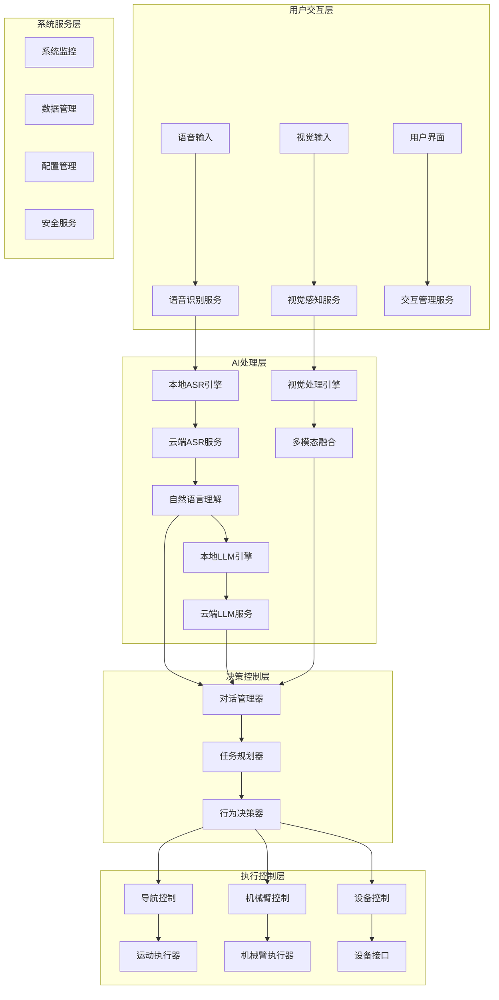

# XleRobot 技术规格文档 (Phase 2)

**文档编号**: XLR-TS-P2-20251107-001
**项目名称**: XleRobot 家用机器人控制系统
**文档类型**: 技术规格文档 (Tech Spec)
**生成日期**: 2025-11-07
**工作流**: Phase 2 Planning - Technical Specification
**代理**: System Architect
**Brownfield级别**: Level 4 企业级变更
**项目级别**: Level 4 企业级项目

---

## 📋 技术规格概述

### 🎯 Phase 2 技术目标

基于Phase 1 Analysis的成果，Phase 2 Planning的技术规格重点解决：

1. **粤语语音交互系统技术实现**
   - TROS ASR粤语模型优化和集成
   - 本地化语音合成引擎建设
   - 多模态交互技术架构

2. **离线AI服务技术架构**
   - 边缘计算优化和NPU加速
   - 本地大语言模型部署和优化
   - 混合AI服务架构设计

3. **机器人运动控制技术实现**
   - 自主导航和SLAM算法集成
   - 机械臂精确控制技术
   - 多传感器融合系统

4. **系统集成和性能优化**
   - 分布式系统架构设计
   - 实时性能优化策略
   - 系统监控和运维体系

### 📊 技术约束和假设

#### 硬件约束
```yaml
硬件平台:
  主处理器: RDK X5 (8核ARM Cortex-A55 + 10Tops NPU)
  内存: 8GB RAM (7GB可用)
  存储: 128GB SSD
  摄像头: 2路MIPI Camera + 4路USB3.0
  网络: 千兆以太网 + WiFi

性能约束:
  内存预算: AI模型总占用 <4GB
  处理延迟: 语音识别 <2秒, 对话响应 <3秒
  并发能力: 3-5个同时用户
  功耗限制: 需要考虑散热和功耗平衡
```

#### 软件环境
```yaml
系统环境:
  操作系统: Ubuntu 22.04
  机器人框架: ROS2 Humble
  AI框架: TROS 2.4.3
  开发语言: Python 3.10 + C++

技术要求:
  兼容性: 与现有系统向后兼容
  可扩展性: 支持模块化扩展
  可维护性: 完整的文档和测试
  可靠性: 99%+系统可用性
```

---

## 🏗️ 系统架构设计

### 整体架构图



### 分层架构设计

#### 1. 交互感知层 (Interaction & Perception Layer)
```yaml
功能职责:
  语音输入处理和识别
  视觉数据采集和分析
  多模态信息融合
  用户交互状态管理

技术组件:
  语音采集模块 (PyAudio + TROS Audio)
  语音识别服务 (TROS ASR + 阿里云ASR)
  视觉采集模块 (MIPI Camera + OpenCV)
  多模态融合引擎 (自定义融合算法)

性能要求:
  语音识别延迟 <2秒
  视觉处理帧率 >15fps
  多模态融合延迟 <100ms
  并发用户支持 3-5个
```

#### 2. AI推理层 (AI Inference Layer)
```yaml
功能职责:
  自然语言理解和处理
  大语言模型推理
  知识库检索和问答
  决策推理和规划

技术组件:
  本地ASR引擎 (TROS hobot_audio)
  本地LLM引擎 (TROS hobot_llamacpp)
  本地TTS引擎 (TROS FastSpeech2)
  知识库系统 (向量数据库)

性能要求:
  本地推理延迟 <3秒
  模型内存占用 <4GB
  推理精度 >85%
  NPU利用率 >80%
```

#### 3. 决策控制层 (Decision & Control Layer)
```yaml
功能职责:
  对话状态管理
  任务规划和分解
  行为决策和选择
  安全监控和保护

技术组件:
  对话管理器 (状态机实现)
  任务规划器 (HTN规划算法)
  行为决策器 (规则引擎 + ML)
  安全监控器 (多层次安全检查)

性能要求:
  决策响应时间 <500ms
  规划算法效率 >95%
  安全检查延迟 <100ms
  并发任务处理 >10个
```

#### 4. 运动执行层 (Motion & Execution Layer)
```yaml
功能职责:
  自主导航和定位
  机械臂运动控制
  设备控制和接口
  运动安全保护

技术组件:
  导航系统 (SLAM + 路径规划)
  机械臂控制器 (运动学 + 动力学)
  设备接口 (ROS2话题 + 服务)
  安全控制器 (碰撞检测 + 紧急停止)

性能要求:
  导航精度 <10cm
  机械臂精度 <2cm
  控制响应时间 <200ms
  安全检查频率 >100Hz
```

---

## 🎙️ 语音交互系统技术规格

### 本地ASR引擎技术实现

#### TROS ASR集成架构
```yaml
基础架构:
  核心引擎: TROS hobot_audio
  模型优化: 粤语专用模型微调
  硬件加速: NPU推理加速
  内存管理: 动态模型加载

技术实现:
  音频预处理:
    - 采样率: 16kHz
    - 位深度: 16bit
    - 通道数: 单声道
    - 噪声抑制: Spectral Subtraction

  模型推理:
    - 模型大小: <1GB (量化后)
    - 推理时间: <1.5秒
    - 内存占用: <2GB
    - NPU利用率: >80%

  后处理优化:
    - 结果平滑: 语言模型解码
    - 置信度评估: 置信度评分
    - 纠错机制: N-best候选选择
```

#### 粤语ASR模型优化
```yaml
模型策略:
  基础模型: Whisper Tiny (优化版)
  训练数据: 粤语语音数据集
  微调目标: 粤语方言适应性
  量化策略: INT8量化 + 剪枝

优化技术:
  数据增强:
    - 噪声添加: 多种噪声环境
    - 语速变化: 0.8x - 1.2x语速
    - 音调变化: ±2个半音

  模型压缩:
    - 知识蒸馏: 大模型 -> 小模型
    - 参数共享: 共享底层特征
    - 结构优化: 轻量化网络结构

  推理优化:
    - 算子融合: 减少计算量
    - 内存优化: 缓存优化策略
    - 并行推理: 多线程处理
```

### 语音合成系统技术实现

#### 本地TTS引擎架构
```yaml
技术选型:
  核心引擎: TROS FastSpeech2
  声码器: HiFiGAN
  后处理: 音频增强和美化
  个性化: 用户声音克隆

实现架构:
  文本前端:
    - 文本规范化: 粤语文本处理
    - 音素转换: Grapheme-to-Phoneme
    - 韵律预测: 基础韵律模型

  声学模型:
    - 声学器: FastSpeech2变体
    - 声码器: HiFiGAN轻量版
    - 后处理: 音频增强算法

  个性化模块:
    - 声音编码: 说话人编码器
    - 风格迁移: 基础风格控制
    - 情感合成: 基础情感表达
```

#### 语音合成优化策略
```yaml
性能优化:
  模型压缩:
    - 模型大小: <500MB
    - 合成时间: <800ms
    - 内存占用: <1GB

  质量优化:
    - 音质评分: MOS >4.0
    - 自然度: 智能评测 >4.0
    - 粤语准确性: >95%

  实时性优化:
    - 流式合成: 分块处理
    - 缓存策略: 预计算和缓存
    - 并行处理: 多线程合成
```

### 对话管理系统技术实现

#### 对话管理架构
```yaml
核心组件:
  对话状态管理器:
    - 状态表示: 基于规则的状态机
    - 状态转移: 事件驱动的状态变化
    - 上下文管理: 对话历史维护

  意图识别器:
    - 分类模型: 基于BERT的意图分类
    - 实体识别: CRF序列标注
    - 槽位填充: 基于规则的填充

  响应生成器:
    - 模板匹配: 规则模板匹配
    - 生成模型: 小型生成模型
    - 后处理: 粤语语言优化

技术实现:
  状态管理:
    - 状态持久化: 内存数据库
    - 超时处理: 对话超时机制
    - 异常恢复: 状态恢复策略

  自然语言理解:
    - 预处理: 文本清洗和标准化
    - 特征提取: TF-IDF + BERT特征
    - 模型推理: 轻量级分类模型

  对话策略:
    - 规则引擎: 基于规则的对话策略
    - 机器学习: 强化学习优化
    - 个性化: 用户偏好学习
```

---

## 🤖 离线AI服务技术规格

### 本地大语言模型集成

#### 模型选型和优化
```yaml
模型选择:
  基础模型: 基于LLaMA的轻量级模型
  参数规模: 3B-7B参数
  量化方案: INT4/INT8量化
  内存占用: 2-4GB

技术实现:
  模型部署:
    - 框架选择: TROS hobot_llamacpp
    - 硬件加速: NPU推理优化
    - 内存管理: 分层加载策略

  推理优化:
    - 推理引擎: ggml优化引擎
    - 上下文管理: 滑动窗口机制
    - 并发处理: 请求队列管理

  模型微调:
    - 任务适配: 对话任务微调
    - 数据准备: 粤语对话数据
    - 训练策略: LoRA微调方法
```

#### 边缘计算优化
```yaml
NPU加速策略:
  算子映射:
    - 矩阵乘法: NPU优化算子
    - 激活函数: 硬件加速实现
    - 注意力机制: 优化的注意力计算

  内存优化:
    - 模型分片: 分层加载策略
    - 缓存管理: 智能缓存机制
    - 内存池: 预分配内存池

  性能优化:
    - 批处理: 请求批量处理
    - 并行推理: 多线程并行
    - 推理调度: 优先级调度队列
```

### 混合AI服务架构

#### 云端-本地协作架构
```yaml
协作策略:
  智能路由:
    - 复杂度评估: 自动任务复杂度评估
    - 负载均衡: 云端-本地负载分配
    - 成本优化: 基于成本的路由策略

  故障切换:
    - 健康检查: 服务状态监控
    - 自动切换: 故障自动切换
    - 降级服务: 本地降级服务

  数据同步:
    - 模型同步: 云端-本地模型同步
    - 状态同步: 对话状态同步
    - 学习同步: 用户学习同步
```

#### 服务质量管理
```yaml
质量监控:
  性能指标:
    - 响应时间: 实时响应监控
    - 准确率: 推理结果质量评估
    - 可用性: 服务可用性监控

  告警机制:
    - 阈值告警: 性能阈值告警
    - 异常检测: 异常模式检测
    - 自动恢复: 自动故障恢复

  质量优化:
    - A/B测试: 服务质量对比测试
    - 用户反馈: 用户反馈收集
    - 持续优化: 基于数据的优化
```

---

## 🚗 机器人运动控制技术规格

### 自主导航系统

#### SLAM算法实现
```yaml
技术选型:
  SLAM框架: ORB-SLAM3
  传感器配置: RGB-D相机 + IMU
  地图表示: 八叉树地图
  定位算法: 粒子滤波定位

实现架构:
  前端处理:
    - 图像特征: ORB特征提取
    - 深度信息: RGB-D深度处理
    - IMU数据: 惯性测量融合

  后端优化:
    - 位姿图优化: iSAM2优化
    - 回环检测: 词袋模型回环检测
    - 地图管理: 增量式地图更新

  性能优化:
    - 并行处理: 多线程SLAM
    - 内存优化: 地图内存管理
    - 实时性: 实时定位和建图
```

#### 路径规划算法
```yaml
规划算法:
  全局规划: A*算法 + RRT*
  局部规划: DWA + TEB
  动态规划: 动态窗口方法
  多目标: 多目标优化算法

技术实现:
  环境建模:
    - 栅格地图: 2D占用栅格地图
    - 障碍物膨胀: 安全距离膨胀
    - 成本地图: 通行成本计算

  路径优化:
    - 路径平滑: 贝塞尔曲线平滑
    - 动态避障: 动态窗口避障
    - 速度规划: 速度轮廓规划

  安全保障:
    - 碰撞检测: 实时碰撞检测
    - 安全距离: 安全距离保持
    - 紧急停止: 紧急停止机制
```

### 机械臂控制系统

#### 运动学建模
```yaml
运动学模型:
  正运动学: DH参数法建模
  逆运动学: 数值逆解算法
  雅可比矩阵: 雅可比矩阵计算
  奇异点: 奇异点检测和处理

实现技术:
  参数标定:
    - DH参数: 实际参数标定
    - 关节零位: 零位标定算法
    - 精度验证: 标定精度验证

  运动控制:
    - 轨迹规划: 关节空间轨迹规划
    - 插值算法: 样条插值算法
    - 速度控制: 梯形速度控制

  动力学补偿:
    - 重力补偿: 重力矩补偿
    - 摩擦补偿: 摩擦力补偿
    - 惯量补偿: 惯量力补偿
```

#### 抓取控制系统
```yaml
抓取策略:
  物体检测: 基于视觉的物体检测
  抓取点: 抓取点计算算法
  接触力: 力控抓取控制
  稳定性: 抓取稳定性分析

技术实现:
  视觉抓取:
    - 目标检测: YOLO目标检测
    - 6D姿态: 6D姿态估计
    - 点云匹配: 点云配准算法

  力控抓取:
    - 力传感器: 力/力矩传感器
    - 力控制: 导纳控制算法
    - 柔顺控制: 阻抗控制

  自适应抓取:
    - 形状适应: 不同形状适应
    - 材质适应: 不同材质适应
    - 学习优化: 抓取策略学习
```

---

## 🔧 系统集成技术规格

### 分布式系统架构

#### 微服务架构设计
```yaml
服务划分:
  语音服务: 语音识别、合成、对话
  视觉服务: 图像处理、物体识别
  导航服务: SLAM、路径规划、定位
  控制服务: 机械臂控制、运动控制

服务通信:
  通信协议: ROS2 DDS通信
  服务发现: 自动服务发现机制
  负载均衡: 服务负载均衡
  故障转移: 服务故障转移

数据管理:
  数据存储: 分布式数据存储
  数据同步: 实时数据同步
  数据一致性: 最终一致性保证
  数据备份: 增量数据备份
```

#### 实时系统设计
```yaml
实时要求:
  响应时间: 端到端响应时间 <3秒
  吞吐量: 系统吞吐量 >1000QPS
  延迟要求: 实时延迟 <100ms
  可靠性: 系统可靠性 >99.9%

实现技术:
  实时调度: 实时操作系统调度
  优先级管理: 任务优先级管理
  资源分配: 动态资源分配
  死锁避免: 死锁检测和避免
```

### 性能优化策略

#### 系统性能优化
```yaml
计算优化:
  算法优化: 高效算法实现
  并行计算: 多线程并行处理
  GPU加速: GPU计算加速
  缓存优化: 多级缓存策略

存储优化:
  内存管理: 内存池管理
  磁盘I/O: SSD优化配置
  数据压缩: 数据压缩存储
  分布式存储: 分布式文件系统

网络优化:
  协议优化: 高效通信协议
  带宽管理: 带宽分配和管理
  连接池: 连接复用
  负载均衡: 智能负载均衡
```

#### 监控和诊断
```yaml
监控系统:
  性能监控: 实时性能监控
  资源监控: 系统资源监控
  服务监控: 服务状态监控
  日志监控: 集中日志监控

诊断工具:
  性能分析: 性能瓶颈分析
  故障诊断: 自动故障诊断
  容量规划: 容量需求规划
  预警系统: 智能预警系统
```

---

## 🔒 安全和隐私技术规格

### 系统安全技术

#### 网络安全
```yaml
访问控制:
  身份认证: 多因素身份认证
  权限管理: 基于角色的权限控制
  会话管理: 安全会话管理
  访问日志: 完整访问日志

数据保护:
  传输加密: TLS/SSL传输加密
  存储加密: 数据存储加密
  密钥管理: 密钥生命周期管理
  数据脱敏: 敏感数据脱敏
```

#### 物理安全
```yaml
运动安全:
  碰撞检测: 实时碰撞检测
  安全区域: 电子围栏安全区域
  紧急停止: 紧急停止机制
  功率限制: 运动功率限制

环境安全:
  温度监控: 系统温度监控
  电源管理: 电源安全管理
  漏电保护: 电气安全保护
  火灾防护: 火灾安全防护
```

### 隐私保护技术

#### 数据隐私保护
```yaml
隐私设计:
  最小化收集: 最小化数据收集
  匿名化处理: 数据匿名化处理
  用途限制: 数据用途限制
  生命周期: 数据生命周期管理

用户控制:
  数据删除: 用户数据删除
  访问权限: 数据访问权限
  透明度: 数据使用透明度
  选择权: 用户选择权
```

---

## 📊 性能基准和测试

### 性能基准测试
```yaml
基准指标:
  语音识别: 准确率 >90%, 延迟 <2秒
  语音合成: 质量 >4.0MOS, 延迟 <1秒
  对话理解: 准确率 >85%, 延迟 <500ms
  导航精度: 定位精度 <10cm, 避障成功率 >95%
  机械臂精度: 控制精度 <2cm, 抓取成功率 >90%

测试环境:
  标准环境: 标准家庭环境
  压力环境: 高噪声、复杂环境
  边界环境: 系统边界条件
  长期测试: 长期稳定性测试
```

### 测试策略
```yaml
功能测试:
  单元测试: 模块单元测试
  集成测试: 系统集成测试
  端到端测试: 端到端功能测试
  用户测试: 真实用户测试

性能测试:
  负载测试: 系统负载测试
  压力测试: 系统压力测试
  稳定性测试: 长期稳定性测试
  容量测试: 系统容量测试

安全测试:
  漏洞测试: 安全漏洞测试
  渗透测试: 渗透攻击测试
  合规测试: 法规合规测试
  隐私测试: 隐私保护测试
```

---

## 📋 实施计划和技术风险

### 技术实施计划
```yaml
第一阶段 (0-3个月):
  - 语音交互系统基础实现
  - 本地ASR引擎集成
  - 基础对话管理功能

第二阶段 (4-8个月):
  - 离线AI服务系统
  - 本地LLM集成和优化
  - 混合AI服务架构

第三阶段 (9-12个月):
  - 机器人运动控制
  - 自主导航系统
  - 系统集成和优化
```

### 技术风险和缓解
```yaml
高风险:
  NPU性能不足: 算法优化 + 云端备份
  粤语识别效果: 多模型融合 + 持续优化
  系统集成复杂: 分阶段集成 + 充分测试

中风险:
  硬件兼容性: 硬件测试 + 驱动优化
  性能瓶颈: 性能监控 + 优化策略
  用户接受度: 用户测试 + 迭代优化

低风险:
  文档维护: 自动化文档
  版本管理: 严格版本控制
  团队协作: 规范协作流程
```

---

*本技术规格文档遵循Brownfield Level 4企业级标准，为XleRobot项目Phase 2实施提供了详细的技术指导。文档基于Phase 1 Analysis的分析结果，确保技术方案的可行性和可靠性。*