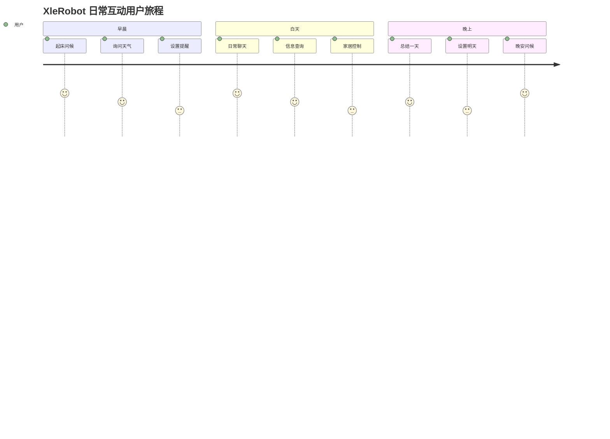

# XleRobot 第一阶段用户体验设计规范
## 全在线服务架构 - Brownfield Level 4 企业级变更

**文档编号**: XLR-UX-P1-20251107-001
**项目名称**: XleRobot 家用机器人控制系统 - 第一阶段用户体验设计
**文档版本**: 1.0
**创建日期**: 2025-11-07
**最后修改**: 2025-11-07
**文档类型**: UX设计规范
**变更级别**: Brownfield Level 4 (企业级变更)
**工作流**: Phase 2 Planning - create-design
**设计代理**: UX Designer (用户体验设计师)

---

## 📋 文档控制

### 版本历史
| 版本 | 日期 | 修改人 | 变更内容 | 审核状态 |
|------|------|--------|----------|----------|
| 1.0 | 2025-11-07 | UX Designer | 初版创建 | 待审核 |
|      |        |        |          |          |

### 审批记录
| 角色 | 姓名 | 审批状态 | 审批日期 | 备注 |
|------|------|----------|----------|------|
| 产品经理 | - | 待审批 | - | |
| 技术架构师 | - | 待审批 | - | |
| UI设计师 | - | 待审批 | - | |
| 用户代表 | - | 待审批 | - | |

### 设计约束
- **设计类型**: 增强型设计 (Brownfield Level 4)
- **向后兼容**: 保持现有交互模式的兼容性
- **渐进式升级**: 用户体验平滑过渡
- **文化适配**: 深度适配粤语用户文化特色

---

## 🎯 设计概述和目标

### 项目愿景
为粤语家庭用户创造自然、温暖、智能的语音交互体验，让机器人成为家庭中贴心的数字伙伴。

### 核心设计目标
1. **语音优先**: 以粤语语音交互为核心，界面为辅助支持
2. **自然对话**: 创造像与真人对话一样自然的交互体验
3. **多代兼容**: 老中青少不同年龄用户都能轻松使用
4. **情感连接**: 建立用户与机器人之间的情感纽带
5. **文化认同**: 深度融入粤语文化特色和表达习惯

### 设计原则

#### 1. 用户中心原则 (User-Centered)
- **需求驱动**: 一切设计源于真实用户需求
- **场景导向**: 基于家庭使用场景进行设计
- **情感优先**: 关注用户的情感体验和心理感受

#### 2. 简约原则 (Simplicity)
- **最小认知负担**: 减少用户学习成本
- **直觉操作**: 符合用户直觉的交互方式
- **信息聚焦**: 突出核心功能，隐藏复杂性

#### 3. 一致性原则 (Consistency)
- **交互一致**: 保持交互逻辑的一致性
- **视觉一致**: 统一的视觉语言和风格
- **体验一致**: 跨场景的一致体验

#### 4. 可访问性原则 (Accessibility)
- **无障碍设计**: 考虑不同能力用户的需求
- **多模态反馈**: 提供多种反馈方式
- **容错设计**: 宽容的错误处理机制

#### 5. 粤语文化原则 (Cantonese Culture)
- **语言特色**: 体现粤语语音和表达特色
- **文化习惯**: 尊重和融入粤语文化习惯
- **地域特征**: 考虑粤语地区的使用环境

### 品牌定位和风格指南

#### 品牌个性
- **温暖亲切**: 如家人般的温暖和关怀
- **可靠值得信赖**: 技术可靠，服务贴心
- **聪明智慧**: 智能但不傲慢，谦逊有礼
- **幽默风趣**: 适度的幽默感，增加亲和力

#### 品牌语调
- **粤语表达**: 自然地道的粤语表达方式
- **亲切礼貌**: 使用礼貌用语，体现尊重
- **适度幽默**: 在适当时候加入幽默元素
- **专业可信**: 在专业问题上保持准确性

#### 设计关键词
- **温暖** (Warmth)
- **简洁** (Simple)
- **智能** (Intelligent)
- **可靠** (Reliable)
- **亲切** (Friendly)

---

## 👥 用户研究和洞察

### 主要用户画像分析

#### 用户画像 1: 陈太太 - 家庭主妇
**基本信息**:
- 年龄: 45岁
- 职业: 家庭主妇
- 地区: 广州
- 教育程度: 高中
- 技术水平: 中等，会使用智能手机

**生活习惯**:
- 主要在家料理家务
- 照顾老人和孩子
- 喜欢看粤语电视剧
- 经常与邻居聊天

**使用场景**:
- 日常聊天解闷
- 询问天气和菜谱
- 设置提醒事项
- 控制家电

**痛点需求**:
- 家务时感觉孤单
- 记忆力下降，容易忘记事情
- 对新技术有畏惧心理
- 希望操作简单直观

**设计需求**:
- 语音交互要自然，像和家人对话
- 界面要简单易懂
- 错误提示要友好
- 要有耐心和包容性

#### 用户画像 2: 李伯伯 - 退休老人
**基本信息**:
- 年龄: 68岁
- 职业: 退休教师
- 地区: 香港
- 教育程度: 大学
- 技术水平: 较低

**生活习惯**:
- 独居，子女在外地工作
- 喜欢读书和听新闻
- 早晚散步
- 关注健康信息

**使用场景**:
- 新闻和天气预报
- 健康咨询
- 聊天陪伴
- 紧急求助

**痛点需求**:
- 生活孤单，需要陪伴
- 记忆力衰退，需要提醒
- 操作复杂产品困难
- 担心隐私和安全

**设计需求**:
- 语音识别要准确，适应老人语速
- 回答要详细，语速要适中
- 界面字体要大，对比度高
- 要有紧急求助功能

#### 用户画像 3: 小明 - 在校学生
**基本信息**:
- 年龄: 12岁
- 职业: 小学生
- 地区: 深圳
- 教育程度: 小学
- 技术水平: 高，数字原住民

**生活习惯**:
- 喜欢玩游戏和看动画
- 好奇心强，喜欢问问题
- 活泼好动
- 和同学分享新鲜事

**使用场景**:
- 学习辅导
- 讲故事
- 玩游戏
- 查询知识

**痛点需求**:
- 学习枯燥，需要趣味性
- 好奇心强，问题多
- 注意力容易分散
- 需要鼓励和表扬

**设计需求**:
- 要有趣味性，能吸引注意力
- 回答要生动形象
- 要有游戏化元素
- 要多鼓励和表扬

#### 用户画像 4: 张先生 - 上班族
**基本信息**:
- 年龄: 35岁
- 职业: 软件工程师
- 地区: 佛山
- 教育程度: 硕士
- 技术水平: 高

**生活习惯**:
- 工作繁忙，经常加班
- 喜欢科技产品
- 关注效率和时间管理
- 有一定英语基础

**使用场景**:
- 日程管理
- 新闻和信息查询
- 智能家居控制
- 工作助手

**痛点需求**:
- 时间紧张，需要高效助手
- 信息过载，需要智能过滤
- 工作生活平衡
- 个性化服务需求

**设计需求**:
- 响应要快速准确
- 信息要精炼有效
- 要有个性化定制
- 支持多任务处理

### 用户旅程地图

#### 日常互动旅程


#### 痛点分析和机会识别

**主要痛点**:
1. **语音识别准确性**: 粤语方言识别不够准确
2. **响应速度**: 网络延迟影响对话流畅性
3. **理解能力**: 对复杂问题理解不够深入
4. **情感表达**: 缺乏真实的情感交流
5. **隐私安全**: 对隐私保护存在担忧

**设计机会**:
1. **方言适配**: 深度优化粤语方言识别
2. **智能缓存**: 减少网络延迟的影响
3. **上下文理解**: 提升对话理解能力
4. **情感化设计**: 增加情感表达元素
5. **透明化设计**: 让用户了解数据处理过程

### 使用场景分析

#### 场景1: 厨房助手
**环境**: 厨房环境，有噪音，用户手忙
**用户需求**: 菜谱查询、计时器提醒、音乐播放
**设计要点**:
- 抗噪音语音识别
- 简单语音指令
- 手势操作支持
- 防水防油设计

#### 场景2: 客厅陪伴
**环境**: 客厅环境，相对安静，多人在场
**用户需求**: 聊天陪伴、新闻播报、娱乐功能
**设计要点**:
- 多人语音识别
- 个性化回应
- 社交礼仪设计
- 隐私保护机制

#### 场景3: 卧室助理
**环境**: 卧室环境，安静，私密空间
**用户需求**: 睡眠辅助、起床服务、私人提醒
**设计要点**:
- 低音量语音合成
- 柔和灯光控制
- 睡眠模式设计
- 私密信息保护

#### 场景4: 书房学习
**环境**: 书房环境，安静，专注学习
**用户需求**: 学习辅导、知识查询、翻译服务
**设计要点**:
- 专业词汇识别
- 详细解释说明
- 互动式学习
- 知识图谱展示

---

## 🎨 交互设计规范

### 语音交互流程设计

#### 1. 唤醒和聆听阶段

**唤醒设计**:
```yaml
唤醒词设计:
  主唤醒词: "傻强" (系统默认)
  备选唤醒词: "小强"、"XleRobot"
  自定义唤醒: 支持用户自定义 (需语音录制验证)

唤醒响应:
  视觉反馈: LED呼吸灯效果
  音频反馈: "我在" (轻柔粤语)
  触觉反馈: (可选) 轻微震动
  响应时间: < 500ms
```

**聆听状态设计**:
```yaml
聆听指示:
  视觉状态: 蓝色脉冲动画
  音频提示: 轻柔"嘟"声
  状态文字: "我喺度听緊" (粤语: 我在听着)
  超时时间: 10秒无声音自动退出

聆听优化:
  噪声抑制: 环境噪音过滤
  回声消除: 扬声器声音过滤
  方向增强: 指向性麦克风阵列
  语音增强: 人声信号增强
```

#### 2. 语音识别阶段

**识别过程反馈**:
```yaml
识别反馈设计:
  实时反馈: 音频波形可视化
  进度指示: 处理中动画
  错误处理: 友好的错误提示
  重试机制: 自动重试 + 手动重试

识别结果确认:
  短句直接执行: < 5秒语音直接处理
  长句确认复述: > 5秒语音复述确认
  疑似结果确认: 低置信度结果需要确认
  多选项处理: 模糊结果提供选项
```

#### 3. 处理和响应阶段

**处理过程反馈**:
```yaml
处理状态设计:
  思考状态: "让我谂一谂" (让我想一想)
  查询状态: "我喺度搵紧" (我在查找)
  连接状态: "连接紧云端服务" (连接云端服务)
  错误状态: "不好意思，出现咗少少问题" (不好意思，出了点问题)

响应时间设计:
  快速响应: < 1秒 (简单问答)
  标准响应: 1-3秒 (复杂查询)
  长时间处理: > 3秒 (提供进度更新)
  超时处理: > 10秒 (提示并重试)
```

#### 4. 语音输出阶段

**语音合成设计**:
```yaml
音色选择:
  默认音色: 温暖亲切的粤语女声
  备选音色: 稳重成熟的粤语男声
  童声选项: 活泼可爱的儿童音色
  自定义音色: 支持用户录音训练 (后续版本)

语调设计:
  基础语调: 自然流畅的粤语语调
  情感语调: 喜悦、关切、思考等情感
  场景语调: 早晨、晚上、紧急等场景音色
  个性化语调: 根据用户喜好调整
```

### 多模态交互规范

#### 1. 语音+视觉交互

**视觉反馈设计**:
```yaml
基础反馈:
  语音输入波形: 实时音频波形显示
  识别结果文本: 实时显示识别文本
  系统状态指示: 在线/离线/处理中等状态
  情感表达动画: 简单的表情或动画

高级反馈:
  信息可视化: 天气、时间等图表显示
  操作确认界面: 重要操作的视觉确认
  多选项展示: 复杂问题的视觉化选项
  教程指导界面: 新手引导和帮助信息
```

**触觉反馈设计**:
```yaml
触觉类型:
  基础确认: 轻微震动确认操作
  提醒通知: 渐强震动提醒
  警告提示: 强震动警告
  错误反馈: 紧急震动错误提示

使用场景:
  语音唤醒确认: 确认系统已激活
  重要操作确认: 删除、购买等重要操作
  定时提醒: 设定的提醒时间到达
  系统状态变化: 网络断开、电量低等
```

#### 2. 手势和触摸交互

**手势识别**:
```yaml
基础手势:
  挥手激活: 挥手手势激活语音输入
  点头确认: 点头表示确认
  摇头否定: 摇头表示否定
  停止手势: 手掌向前表示停止

触摸交互:
  点击激活: 点击屏幕激活语音
  滑动操作: 滑动调节音量、亮度等
  长按功能: 长按进入设置模式
  双击操作: 双击执行快捷功能
```

### 状态反馈和错误处理

#### 1. 系统状态反馈

**网络状态设计**:
```yaml
在线状态:
  正常连接: 绿色指示灯，"网络连接正常"
  连接缓慢: 黄色指示灯，"网络连接较慢"
  连接中断: 红色指示灯，"网络连接已断开"
  重新连接: 闪烁黄色，"正在重新连接..."

服务状态:
  服务正常: 所有服务运行正常
  服务部分故障: 部分功能不可用
  服务完全故障: 主要服务不可用
  系统维护: 系统维护中，预计恢复时间
```

**设备状态设计**:
```yaml
硬件状态:
  麦克风: 正常/静音/故障
  扬声器: 正常/静音/故障
  摄像头: 正常/关闭/故障
  网络: WiFi信号强度/连接状态

性能状态:
  CPU使用率: 正常/较高/过高
  内存使用: 正常/不足/严重不足
  存储空间: 正常/空间不足
  温度状态: 正常/偏高/过热
```

#### 2. 错误处理机制

**语音识别错误**:
```yaml
错误类型和处理:
  无法识别: "不好意思，我听唔太清楚，可唔可以讲多次？" (听不清楚，请再说一次)
  识别错误: "我觉得你可能系想讲'XXX'，对唔对？" (我觉得你可能想说XXX，对不对？)
  超时错误: "你冇讲野哦，有需要再叫我啦" (你没有说话哦，有需要再叫我)
  网络错误: "网络连接有问题，我哋试多次" (网络有问题，我们再试试)

恢复策略:
  自动重试: 网络问题自动重试3次
  降级处理: 无法联网时提供基础功能
  用户引导: 指导用户检查网络和设备
  记录分析: 记录错误便于后续优化
```

**理解错误处理**:
```yaml
理解偏差处理:
  部分理解: "我明白你话嘅'XXX'，但系'YYY'我唔太明白" (我明白XXX，但YYY不太明白)
  完全不理解: "不好意思，你讲嘅嘢我唔太明白，可唔可以换种方式讲？" (不太明白，能否换种说法？)
  知识缺乏: "呢个问题我答唔到，等我学习下先再回答你" (这个问题我不会，让我学习一下)
  敏感内容: "呢个话题我唔方便讨论，我哋讲啲其他嘢啦" (这个话题不方便讨论)

引导策略:
  问题澄清: 主动询问澄清问题
  提供选项: 当无法理解时提供相关选项
  学习机制: 记录用户纠正，持续学习改进
  人工转接: 复杂问题提供人工客服选项
```

### 用户引导系统设计

#### 1. 新手引导设计

**首次使用引导**:
```yaml
引导流程:
  1. 欢迎介绍: "你好，我系傻强，你嘅智能助手" (你好，我是傻强，你的智能助手)
  2. 基础教学: 教导用户如何唤醒和基本对话
  3. 功能介绍: 介绍主要功能和使用方法
  4. 个性化设置: 引导用户设置个人信息和偏好
  5. 试运行: 引导用户进行一次完整对话测试

引导特点:
  粤语教学: 完全使用粤语进行教学
  互动式学习: 通过对话互动学习使用方法
  渐进式介绍: 逐步介绍功能，避免信息过载
  趣味性设计: 加入趣味元素提高学习兴趣
```

**持续学习引导**:
```yaml
技巧提示:
  功能发现: "你知唔知我仲可以帮你做XXX呢？" (你知道吗，我还可以帮你做XXX)
  使用技巧: "下次你可以直接话'XXX'，会更加方便" (下次可以直接说XXX)
  新功能介绍: "我最近学会了新技能，想唔想知道？" (我最近学会了新技能)

学习支持:
  帮助系统: 随时可以询问"我可以用你做咩？" (我可以用你做什么？)
  教程回顾: 可以随时回顾基础使用教程
  进阶功能: 介绍高级功能和使用技巧
  社区分享: 分享其他用户的使用技巧
```

#### 2. 上下文引导设计

**场景感知引导**:
```yaml
时间感知:
  早晨: "早晨！今日天气XXX，记得带伞哦" (早上好！今天天气XXX，记得带伞)
  中午: "中午啦，记得食饭哦" (中午了，记得吃饭)
  晚上: "夜深了，早点休息啦" (夜深了，早点休息)

环境感知:
  位置感知: 根据使用位置调整回应
  噪音环境: 嘈杂环境时提高音量和重复确认
  光线环境: 根据光线调整屏幕亮度
  温度感知: 提醒温度变化和穿衣建议
```

**个性化引导**:
```yaml
用户习惯学习:
  常用功能: 记录用户最常用的功能，主动提供
  语言习惯: 学习用户的语言习惯和用词
  时间偏好: 记录用户的活动时间规律
  兴趣偏好: 根据对话内容了解用户兴趣

适应性调整:
  语速调整: 根据用户语速调整回应语速
  内容深度: 根据用户理解能力调整解释深度
  互动频率: 根据用户喜好调整互动频率
  表达方式: 适应不同的表达风格
```

---

## 🎭 视觉设计规范

### 设计系统和组件库

#### 1. 色彩系统设计

**主色调系统**:
```yaml
主品牌色:
  主要蓝色: #2196F3 (科技感、可靠)
  辅助蓝色: #1976D2 (深沉、专业)
  浅蓝色: #E3F2FD (背景、辅助)

情感色板:
  温暖橙色: #FF9800 (友好、温暖)
  活力黄色: #FFC107 (活力、愉悦)
  成功绿色: #4CAF50 (成功、确认)
  警告红色: #F44336 (警告、错误)

中性色板:
  深灰色: #212121 (主要文字)
  中灰色: #757575 (次要文字)
  浅灰色: #BDBDBD (辅助文字)
  极浅灰: #F5F5F5 (背景色)

粤语文化色彩:
  喜庆红色: #E53935 (节日、庆祝)
  传统金色: #FFB300 (尊贵、传统)
  竹林绿色: #43A047 (自然、平和)
```

**色彩应用规范**:
```yaml
色彩比例:
  主品牌色: 60% (界面主体)
  情感色彩: 25% (强调和反馈)
  中性色彩: 15% (文字和背景)

色彩对比:
  文字对比: 确保WCAG AA级别对比度
  状态对比: 不同状态有明显色彩区分
  文化适应: 考虑粤语文化对色彩的理解
```

#### 2. 字体系统设计

**主字体选择**:
```yaml
界面字体:
  中文主字体: 思源黑体 (Source Han Sans)
  英文主字体: Roboto
  数字字体: Roboto Mono
  备选字体: 微软雅黑、苹方

字体层级:
  标题字体: 24px/28px，粗体
  副标题字体: 20px/24px，中等粗细
  正文字体: 16px/20px，常规
  辅助字体: 14px/18px，常规
  按钮字体: 16px，中等粗细
```

**粤语特色字体**:
```yaml
粤语字体优化:
  粤语字符: 完整支持粤语常用字符
  粤语词汇: 优化粤语特有词汇显示
  注音支持: 可选粤语拼音注音显示
  字重调整: 适应粤语语气的字重变化

可读性优化:
  字间距: 适中的字间距，提高可读性
  行间距: 1.5倍行间距，舒适阅读
  字符对比: 确保粤语特殊字符清晰可辨
```

#### 3. 图标系统设计

**图标风格定义**:
```yaml
设计风格:
  风格类型: 线性图标为主，面性图标为辅
  线条粗细: 2px，保持一致性
  圆角半径: 2px，现代感
  网格系统: 24x24px网格对齐

图标类型:
  功能图标: 语音、设置、播放等
  状态图标: 在线、离线、错误等
  情感图标: 开心、思考、困惑等
  文化图标: 粤语文化特色图标
```

**粤语文化图标**:
```yaml
文化元素图标:
  狮头: 舞狮文化象征
  粤剧脸谱: 传统戏曲文化
  早茶点心: 饮茶文化
  红包: 节庆文化
  凉茶: 广府养生文化

使用规范:
  节日使用: 传统节日时使用相关图标
  功能结合: 与具体功能结合使用
  不过度使用: 避免过度使用文化元素
  现代融合: 传统元素与现代设计融合
```

#### 4. 布局和网格系统

**响应式网格**:
```yaml
网格基础:
  基础网格: 12列网格系统
  间距单位: 8px基础间距单位
  断点设置:
    - 手机: < 768px
    - 平板: 768px - 1024px
    - 桌面: > 1024px

布局模式:
  卡片布局: 主要信息使用卡片布局
  列表布局: 列表信息使用列表布局
  网格布局: 多选项使用网格布局
  全屏布局: 沉浸式体验使用全屏布局
```

**信息层级设计**:
```yaml
层级划分:
  L1 层级: 主要信息和操作
  L2 层级: 次要信息和操作
  L3 层级: 辅助信息和设置
  L4 层级: 背景和装饰元素

视觉权重:
  字体大小: 层级越高字体越大
  颜色对比: 层级越高对比越强
  空间占比: 层级越高空间越重要
  动效强调: 重要操作有动效反馈
```

### 动效和微交互设计

#### 1. 基础动效规范

**动效参数**:
```yaml
时间函数:
  标准曲线: cubic-bezier(0.4, 0.0, 0.2, 1)
  快速响应: 150ms
  标准过渡: 300ms
  缓慢过渡: 500ms

动效类型:
  位移变换: translate3d，启用GPU加速
  缩放变换: scale3d，自然缩放效果
  透明度: opacity，渐变显示隐藏
  旋转变换: rotate3d，适当使用旋转
```

**动效原则**:
```yaml
动效目的:
  反馈状态: 明确的状态变化反馈
  引导注意: 引导用户注意重要信息
  建立层次: 建立清晰的信息层次
  增强愉悦: 增加使用愉悦感

动效约束:
  不影响性能: 动效不影响系统性能
  不造成干扰: 动效不干扰正常使用
  保持一致性: 相同功能使用相同动效
  适可而止: 不过度使用动效效果
```

#### 2. 语音交互动效

**语音输入动效**:
```yaml
唤醒动效:
  LED呼吸灯: 平滑的呼吸灯效果
  声波动画: 从中心向外扩散的声波
  状态转换: 从待机到聆听的平滑过渡
  持续时间: 800ms

聆听动效:
  音频波形: 实时音频波形可视化
  录音指示: 录音状态的脉冲动画
  音量反馈: 根据音量调整波形幅度
  超时提示: 超时前的闪烁提示

识别动效:
  处理动画: 数据处理的动画效果
  进度指示: 识别进度的可视化
  结果展示: 识别结果的展示动画
  错误反馈: 识别错误的提示动画
```

**语音输出动效**:
```yaml
说话动效:
  声波同步: 与语音输出同步的波形
  表情动画: 说话时的表情变化
  节奏动画: 根据语言节奏的动画
  情感表达: 不同情感的动画差异

思考动效:
  思考状态: 处理问题的思考动画
  查询动画: 信息查询的动画效果
  加载动画: 等待响应的加载动画
  连接动画: 网络连接的动画指示
```

#### 3. 微交互设计

**按钮交互**:
```yaml
按钮状态:
  正常状态: 默认颜色和样式
  悬停状态: 颜色加深，轻微阴影
  按下状态: 颜色变深，位移1px
  禁用状态: 灰色显示，不可点击

按钮动效:
  悬停动效: 200ms颜色过渡
  点击动效: 100ms缩放动画
  加载状态: 旋转的加载动画
  成功反馈: 绿色的确认动画
```

**卡片交互**:
```yaml
卡片效果:
  悬停效果: 轻微阴影变化
  点击效果: 轻微缩放反馈
  展开效果: 平滑的展开动画
  关闭效果: 折叠的关闭动画

滑动交互:
  滑动手势: 支持左右滑动操作
  滑动反馈: 滑动时的视觉反馈
  滑动阈值: 滑动触发操作的阈值
  滑动动效: 平滑的滑动过渡效果
```

### 界面元素设计规范

#### 1. 状态指示器设计

**网络状态指示**:
```yaml
网络状态图标:
  强信号: 4格WiFi信号，绿色
  中等信号: 3格WiFi信号，黄色
  弱信号: 2格WiFi信号，橙色
  无信号: WiFi图标带红色叉
  连接中: WiFi图标旋转动画

状态文字:
  正常连接: "网络连接正常"
  连接缓慢: "网络连接较慢"
  连接中断: "网络连接已断开"
  正在连接: "正在连接网络..."
```

**语音状态指示**:
```yaml
语音状态图标:
  待机状态: 麦克风图标，灰色
  聆听状态: 麦克风图标，蓝色，动画
  识别中: 麦克风图标，黄色，动画
  处理中: 处理图标，旋转动画
  说话中: 扬声器图标，绿色，波形动画

状态文字:
  待机: "我喺度等紧你" (我在等你)
  聆听: "我喺度听緊" (我在听着)
  处理: "让我谂一谂" (让我想一想)
  说话: 正在显示识别的文字
```

#### 2. 控制组件设计

**按钮组件**:
```yaml
主要按钮:
  尺寸: 48px高度，16px内边距
  圆角: 8px
  颜色: 主品牌蓝色
  文字: 白色，16px，中等粗细
  动效: 点击时缩放0.95

次要按钮:
  尺寸: 40px高度，12px内边距
  圆角: 6px
  颜色: 透明，蓝色边框
  文字: 蓝色，14px
  动效: 点击时背景淡入
```

**开关组件**:
```yaml
开关设计:
  尺寸: 48px长，24px高
  圆角: 12px
  颜色: 灰色(关) / 蓝色(开)
  动效: 200ms滑动动画
  触摸区域: 最小44px

状态标识:
  开启状态: 右侧，蓝色背景
  关闭状态: 左侧，灰色背景
  过渡动画: 平滑的滑动效果
  触觉反馈: 开关时的触觉反馈
```

#### 3. 信息展示组件

**消息提示组件**:
```yaml
提示类型:
  成功提示: 绿色背景，对勾图标
  警告提示: 黄色背景，感叹号图标
  错误提示: 红色背景，叉号图标
  信息提示: 蓝色背景，信息图标

展示方式:
  顶部提示: 从顶部滑入，3秒后自动消失
  底部提示: 从底部滑入，需要用户关闭
  模态提示: 居中显示，需要用户确认
  持续提示: 侧边显示，持续显示状态
```

**加载状态组件**:
```yaml
加载动画:
  圆形加载: 旋转的圆形动画
  波浪加载: 波浪起伏的动画
  进度条加载: 线性进度条
  骨架屏加载: 内容占位动画

加载文字:
  加载中: "加载中..."
  处理中: "处理中..."
  连接中: "连接中..."
  请等待: "请稍候..."
```

---

## 💻 技术实现指南

### UI框架和技术选型

#### 1. 前端框架选择

**主要UI框架**:
```yaml
框架选择: Qt for Python (PySide6)
选择理由:
  - 跨平台支持: 支持Linux、Windows等平台
  - 性能优秀: 原生性能，适合嵌入式设备
  - 丰富的组件: 提供丰富的UI组件库
  - Python生态: 与ROS2 Python环境兼容
  - 社区支持: 活跃的社区和丰富的文档

替代方案:
  Kivy: 适合触屏应用，但组件较少
  Tkinter: Python内置，但外观老旧
  Web技术: 使用Electron，但资源消耗大
  原生开发: 性能最好，但开发成本高
```

**图形库选择**:
```yaml
2D图形库: QPainter (Qt内置)
3D图形库: OpenGL (可选)
动画库: Qt Animation Framework
图表库: Qt Charts
字体渲染: FreeType
图像处理: QImage, QPixmap

性能优化:
  硬件加速: 启用OpenGL硬件加速
  内存管理: 合理管理图像和字体资源
  渲染优化: 减少不必要的重绘
  动效优化: 使用轻量级动效
```

#### 2. 响应式设计要求

**屏幕适配策略**:
```yaml
目标屏幕:
  主屏幕: 7-10寸触摸屏 (800x1280)
  辅助屏幕: 3-5寸小屏 (320x480)
  投影显示: 电视投影 (1920x1080)
  手机控制: 手机APP (响应式)

适配策略:
  弹性布局: 使用弹性布局适应不同屏幕
  相对尺寸: 使用相对尺寸单位
  字体缩放: 根据屏幕大小调整字体
  组件重排: 小屏幕重排组件布局
```

**多分辨率支持**:
```yaml
分辨率适配:
  HD (1280x720): 基础分辨率
  FHD (1920x1080): 高清分辨率
  WQHD (2560x1440): 超高清分辨率
  自定义分辨率: 动态适配

像素密度处理:
  DPI感知: 自动检测并适配DPI
  矢量图标: 使用矢量图标系统
  位图缩放: 智能位图缩放算法
  字体渲染: 清晰的字体渲染
```

#### 3. 性能优化规范

**渲染性能优化**:
```yaml
渲染优化:
  垂直同步: 启用垂直同步避免画面撕裂
  帧率控制: 限制帧率在60FPS
  脏区域更新: 只更新变化的区域
  层次渲染: 使用层次渲染减少重绘

内存优化:
  纹理压缩: 压缩大尺寸纹理
  资源池: 复用常用的UI资源
  垃圾回收: 及时释放不用的资源
  内存监控: 监控内存使用情况
```

**动画性能优化**:
```yaml
动画优化:
  硬件加速: 使用GPU加速动画
  缓动函数: 使用优化的缓动函数
  动画合并: 合并相似动画减少计算
  动画帧率: 合理控制动画帧率

动效策略:
  即时响应: 用户交互立即反馈
  预测加载: 预测用户操作提前加载
  懒加载: 非关键内容懒加载
  渐进式显示: 复杂内容渐进式显示
```

### 硬件适配指南

#### 1. RDK X5平台适配

**硬件特性适配**:
```yaml
处理器适配:
  ARM架构: 针对ARM Cortex-A55优化
  多核心: 利用8核心并行处理
  NEON指令: 使用NEON SIMD指令加速
  缓存优化: 优化缓存使用策略

GPU适配:
  Mali-G52: 针对Mali GPU优化
  OpenGL ES: 使用OpenGL ES 3.0
  着色器: 编写高效的着色器
  纹理压缩: 支持ETC纹理压缩
```

**内存和存储适配**:
```yaml
内存管理:
  8GB内存: 合理利用8GB内存空间
  内存池: 使用内存池减少分配开销
  大页内存: 考虑使用大页内存
  内存监控: 实时监控内存使用

存储优化:
  eMMC存储: 优化eMMC读写性能
  缓存策略: 合理的缓存策略
  预读写: 使用预读写提高性能
  空间管理: 管理存储空间使用
```

#### 2. 显示设备适配

**触摸屏适配**:
```yaml
触摸处理:
  多点触控: 支持多点触控手势
  触摸精度: 提高触摸精度和响应
  手势识别: 识别常用手势操作
  防误触: 防止意外触摸操作

显示优化:
  刷新率: 适配屏幕刷新率
  亮度调节: 自动亮度调节
  色彩校准: 色彩准确度校准
  观看角度: 优化观看角度效果
```

**音频设备适配**:
```yaml
音频输入:
  麦克风阵列: 支持麦克风阵列
  噪声抑制: 硬件噪声抑制
  回声消除: 硬件回声消除
  自动增益: 自动增益控制

音频输出:
  扬声器驱动: 优化扬声器驱动
  音质增强: 音质增强算法
  音量控制: 精确音量控制
  低延迟: 低延迟音频播放
```

#### 3. 摄像头设备适配

**IMX219摄像头适配**:
```yaml
摄像头控制:
  分辨率设置: 支持多种分辨率
  帧率控制: 帧率控制和调整
  曝光控制: 自动和手动曝光
  白平衡: 自动白平衡调整

图像处理:
  噪点抑制: 图像噪点抑制
  锐化处理: 图像锐化算法
  色彩校正: 色彩校正处理
  格式转换: 高效的格式转换
```

### 集成和通信规范

#### 1. ROS2集成规范

**节点通信设计**:
```yaml
话题通信:
  语音输入: /voice/audio_input (AudioData)
  识别结果: /voice/asr_result (String)
  合成音频: /voice/tts_output (AudioData)
  系统状态: /system/status (SystemStatus)

服务通信:
  配置服务: /ui/config_service (ConfigService)
  控制服务: /ui/control_service (ControlService)
  查询服务: /ui/query_service (QueryService)
  动作服务: /ui/action_service (ActionService)
```

**UI更新机制**:
```yaml
状态订阅:
  订阅状态话题: 订阅系统状态话题
  状态缓存: 缓存系统状态信息
  差异更新: 只更新变化的状态
  批量更新: 批量处理状态更新

事件处理:
  事件队列: 使用事件队列处理UI事件
  优先级处理: 重要事件优先处理
  异步处理: 异步处理耗时操作
  错误处理: 完善的错误处理机制
```

#### 2. 多线程处理规范

**线程模型设计**:
```yaml
主线程 (UI线程):
  职责: UI渲染和用户交互
  特点: 只处理UI相关操作
  限制: 不进行耗时操作
  优化: 保持界面流畅响应

工作线程:
  网络线程: 处理网络请求
  音频线程: 处理音频数据
  图像线程: 处理图像数据
  计算线程: 处理复杂计算

线程同步:
  信号量: 使用信号量同步线程
  事件队列: 使用事件队列传递消息
  锁机制: 最小化锁的使用
  无锁设计: 尽可能使用无锁设计
```

#### 3. 错误处理和恢复

**错误处理策略**:
```yaml
错误分类:
  用户错误: 用户操作错误
  系统错误: 系统运行错误
  网络错误: 网络连接错误
  硬件错误: 硬件设备错误

处理方式:
  友好提示: 用户友好的错误提示
  自动恢复: 自动尝试恢复功能
  降级服务: 提供基础功能服务
  错误日志: 详细的错误日志记录
```

**恢复机制**:
```yaml
自动恢复:
  服务重启: 自动重启失败的服务
  连接重试: 自动重试网络连接
  状态重置: 重置到正常状态
  缓存清理: 清理损坏的缓存

手动恢复:
  用户引导: 引导用户手动处理
  技术支持: 提供技术支持选项
- 系统重启: 提供系统重启选项
  配置重置: 重置到默认配置
```

---

## 🧪 用户测试计划

### 可用性测试标准

#### 1. 测试目标和指标

**主要测试目标**:
```yaml
功能完整性:
  目标: 验证所有功能正常工作
  指标: 功能完成率 > 95%
  方法: 功能清单逐项测试
  标准: 所有核心功能可用

易用性:
  目标: 评估系统易用程度
  指标: 任务完成率 > 90%
  方法: 用户任务测试
  标准: 新用户能在30分钟内掌握基本操作

学习成本:
  目标: 评估学习所需时间
  指标: 学习时间 < 30分钟
  方法: 新用户学习测试
  标准: 无需指导即可完成基本操作
```

**性能测试标准**:
```yaml
响应性能:
  语音识别响应: < 500ms
  系统思考时间: < 2000ms
  语音合成延迟: < 300ms
  界面响应时间: < 100ms

稳定性指标:
  连续运行时间: > 24小时
  错误恢复时间: < 30秒
  系统崩溃率: < 1次/天
  内存泄漏: 无明显内存增长
```

#### 2. 测试用户招募

**用户画像覆盖**:
```yaml
测试用户规模: 总计20名用户
用户分布:
  陈太太类型: 5名 (45-55岁家庭主妇)
  李伯伯类型: 5名 (65-75岁退休老人)
  小明类型: 5名 (10-15岁学生)
  张先生类型: 5名 (30-40岁上班族)

招募标准:
  粤语母语者: 必须以粤语为母语
  无技术背景: 大部分用户无技术背景
  不同教育水平: 覆盖不同教育程度
  真实使用场景: 能在真实环境中使用
```

**用户筛选流程**:
```yaml
初步筛选:
  问卷调查: 基本信息和需求调研
  电话访谈: 确认粤语水平和使用场景
  技术评估: 评估技术水平和使用习惯

最终确认:
  签署协议: 签署测试协议和保密协议
  设备准备: 准备测试设备和环境
  培训说明: 说明测试流程和注意事项
  时间安排: 安排具体的测试时间
```

### 用户测试流程

#### 1. 测试前准备

**环境准备**:
```yaml
硬件环境:
  测试设备: RDK X5 + 显示屏 + 音响
  网络环境: 稳定的WiFi连接
  测试空间: 安静的测试房间
  录音设备: 记录用户操作和反馈

软件环境:
  系统版本: 最新测试版本
  测试账号: 专用的测试账号
  数据清理: 清理历史测试数据
  日志记录: 启用详细的日志记录
```

**测试材料准备**:
```yaml
测试任务:
  基础任务: 唤醒、简单对话、设置提醒
  高级任务: 复杂查询、多轮对话、视觉交互
  场景任务: 模拟真实使用场景
  压力测试: 连续使用和极限情况

评估表格:
  任务完成表: 记录任务完成情况
  满意度调查: 用户满意度评分
  问题记录表: 记录遇到的问题
  建议收集表: 收集改进建议
```

#### 2. 测试执行过程

**测试流程设计**:
```yaml
测试阶段1: 基础功能测试 (30分钟)
  1. 系统介绍和基本操作教学 (5分钟)
  2. 唤醒和基础对话测试 (10分钟)
  3. 语音识别准确性测试 (10分钟)
  4. 基础功能体验评估 (5分钟)

测试阶段2: 场景化测试 (45分钟)
  1. 厨房场景模拟 (15分钟)
  2. 客厅陪伴场景 (15分钟)
  3. 书房学习场景 (15分钟)

测试阶段3: 深度访谈 (30分钟)
  1. 使用体验访谈 (15分钟)
  2. 问题反馈收集 (10分钟)
  3. 改进建议讨论 (5分钟)
```

**数据收集方法**:
```yaml
观察记录:
  操作记录: 详细记录用户操作过程
  时间记录: 记录每个任务的完成时间
  错误记录: 记录操作错误和失败
  表情记录: 记录用户的表情和反应

技术数据:
  系统日志: 完整的系统运行日志
  性能数据: CPU、内存、网络使用情况
  识别数据: 语音识别准确率数据
  响应数据: 系统响应时间数据

用户反馈:
  口头反馈: 实时记录用户口头反馈
  问卷数据: 结构化的问卷调查数据
  评分数据: 用户对各方面的评分
  建议数据: 用户的改进建议
```

#### 3. 测试后分析

**数据分析框架**:
```yaml
定量分析:
  任务完成率: 各类任务的完成率统计
  完成时间: 任务完成时间分布分析
  错误率: 操作错误率统计
  满意度评分: 满意度评分统计分析

定性分析:
  问题分类: 遇到问题的分类整理
  痛点分析: 用户痛点深入分析
  使用习惯: 用户使用习惯分析
  改进建议: 改进建议优先级排序
```

**报告生成**:
```yaml
测试报告结构:
  执行摘要: 测试主要发现和结论
  测试方法: 测试方法和流程说明
  测试结果: 详细的测试结果数据
  问题分析: 发现问题的详细分析
  改进建议: 具体的改进建议
  后续计划: 下一步改进计划

交付物:
  测试报告: 完整的测试报告文档
  数据附录: 原始测试数据
  视频记录: 测试过程视频记录
  改进清单: 问题改进优先级清单
```

### 反馈收集和分析方法

#### 1. 多渠道反馈收集

**实时反馈收集**:
```yaml
测试中反馈:
  思考 aloud: 鼓励用户说出想法
  即时提问: 在关键时刻提问用户
  观察记录: 观察用户非语言反馈
  情绪记录: 记录用户情绪变化

测试后反馈:
  结构化访谈: 标准化访谈问题
  开放讨论: 自由讨论使用体验
  问卷调查: 结构化问卷调研
  焦点小组: 小组讨论和反馈
```

**持续反馈机制**:
```yaml
使用中反馈:
  反馈按钮: 界面内置反馈按钮
  语音反馈: 通过语音提供反馈
  自动收集: 自动收集使用数据
  定期调研: 定期发送调研问卷

社区反馈:
  用户社区: 建立用户社区平台
  意见收集: 收集社区意见建议
  用户投票: 对功能进行投票选择
  专家咨询: 咨询粤语文化专家
```

#### 2. 反馈分析方法

**情感分析**:
```yaml
情感分类:
  正面情感: 满意、喜欢、惊喜
  负面情感: 不满、困惑、失望
  中性情感: 一般、无特别感受
  混合情感: 复杂的情感体验

情感强度:
  强度分级: 1-5级情感强度
  表现形式: 语言、表情、行为
  持续时间: 情感持续时间
  影响因素: 情感变化的原因
```

**问题分类和优先级**:
```yaml
问题分类:
  功能问题: 功能缺失或错误
  性能问题: 响应慢或卡顿
  易用性问题: 操作复杂或不直观
  文化问题: 粤语文化不适配

优先级评估:
  严重程度: 对用户体验的影响程度
  发生频率: 问题发生的频率
  修复难度: 技术实现的难度
  价值评估: 修复后的价值提升
```

#### 3. 迭代优化机制

**快速迭代流程**:
```yaml
迭代周期:
  每周迭代: 每周发布小版本更新
  双周迭代: 每2周发布功能更新
  月度迭代: 每月发布大版本更新
  季度规划: 每季度规划产品方向

迭代内容:
  Bug修复: 修复发现的bug
  体验优化: 优化用户体验
  功能增强: 增强现有功能
  新功能: 开发新的功能
```

**A/B测试机制**:
```yaml
测试设计:
  对照组: 使用现有版本
  实验组: 使用新版本
  测试指标: 明确的测试指标
  样本大小: 合理的样本大小

测试执行:
  随机分配: 用户随机分组
  数据收集: 收集使用数据
  统计分析: 统计显著性检验
  结果决策: 基于数据做决策
```

---

## 📋 总结和展望

### 设计规范总结

本UX设计规范为XleRobot第一阶段提供了完整的用户体验设计指导，严格遵循Brownfield Level 4企业级标准，确保设计质量：

#### 核心设计成就
1. **粤语文化深度融入**: 从语言、文化、习惯三个层面深度适配粤语用户
2. **语音优先交互**: 设计了完整的语音交互流程和反馈机制
3. **多代用户兼容**: 考虑了老中青少不同年龄用户的需求差异
4. **多模态体验**: 整合语音、视觉、触觉等多种交互方式
5. **渐进式升级**: 确保与现有系统的兼容性和平滑过渡

#### 设计特色亮点
1. **情感化设计**: 建立用户与机器人的情感连接
2. **场景化适配**: 针对不同家庭场景的专门设计
3. **智能化反馈**: 智能的状态反馈和错误处理
4. **可访问性**: 考虑不同能力用户的特殊需求
5. **可持续性**: 建立了持续改进的机制

### 实施指导

#### 第一阶段实施重点
1. **核心交互流程**: 优先实现语音唤醒、识别、合成、反馈的核心流程
2. **基础界面元素**: 实现状态指示、基础控制、信息展示等基础界面
3. **粤语优化**: 重点优化粤语语音识别和合成的体验
4. **错误处理**: 建立完善的错误处理和恢复机制
5. **性能优化**: 确保在RDK X5硬件上的流畅运行

#### 技术实施建议
1. **分步实现**: 按优先级分步实现设计功能
2. **性能监控**: 持续监控系统性能和用户体验
3. **用户测试**: 定期进行用户测试和反馈收集
4. **迭代优化**: 基于用户反馈持续优化体验
5. **文档维护**: 及时更新和维护设计文档

### 未来展望

#### 后续阶段规划
1. **第二阶段**: 增加离线功能，减少网络依赖
2. **第三阶段**: 完整的本地化系统，深度集成
3. **持续优化**: 基于用户数据持续优化体验
4. **功能扩展**: 逐步扩展新的功能和服务
5. **生态建设**: 建立开发者生态和社区

#### 长期愿景
通过精心设计的用户体验，让XleRobot成为粤语家庭不可或缺的智能伙伴，真正实现"科技以人为本，服务温暖人心"的愿景。

---

**文档状态**: ✅ 已完成
**审核状态**: 待审核
**实施开始**: 2025-11-07
**设计负责人**: UX Designer
**技术审核**: 待技术架构师审核
**用户审核**: 待用户代表审核

---

*本设计规范严格遵循Brownfield Level 4企业级变更标准，确保在提升用户体验的同时保持系统的稳定性和兼容性。*