# XLeRobot系统数据流可视化图表

**文档版本**: 1.0
**创建日期**: 2025-11-16
**说明**: 本文档包含XLeRobot系统的所有关键流程图和架构图

---

## 📋 目录

1. [系统启动流程图](#1-系统启动流程图)
2. [ROS2节点通信架构图](#2-ros2节点通信架构图)
3. [完整语音交互数据流图](#3-完整语音交互数据流图)
4. [ASR状态机转换图](#4-asr状态机转换图)
5. [错误处理流程图](#5-错误处理流程图)

---

## 1. 系统启动流程图

### 1.1 完整启动时间线

```mermaid
gantt
    title XLeRobot系统启动时间线
    dateFormat ss
    axisFormat %Ss

    section 环境配置
    xlerobot_env.sh执行      :a1, 00, 2s
    清理conda路径            :a2, 00, 1s
    设置Python 3.10         :a3, 01, 1s
    加载ROS2环境            :a4, 01, 1s
    加载.env环境变量        :a5, 02, 1s

    section 环境检查
    显示启动横幅            :b1, 02, 1s
    硬件设备检查            :b2, 03, 3s
    运行环境检查            :b3, 06, 4s
    API服务连接测试         :b4, 10, 3s

    section ROS2启动
    Source ROS2工作空间     :c1, 13, 1s
    启动协调器节点          :c2, 14, 1s
    启动TTS节点(延迟1s)     :c3, 15, 1s
    启动LLM节点(延迟2s)     :c4, 16, 1s
    启动ASR节点(延迟3s)     :c5, 17, 1s

    section 系统就绪
    进入IDLE监听状态        :d1, 18, 1s
```

### 1.2 启动流程详细步骤

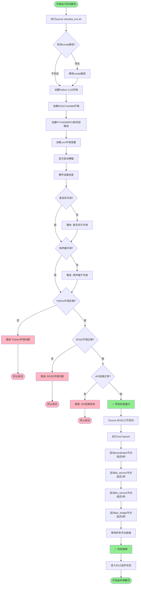

---

## 2. ROS2节点通信架构图

### 2.1 节点拓扑和话题连接

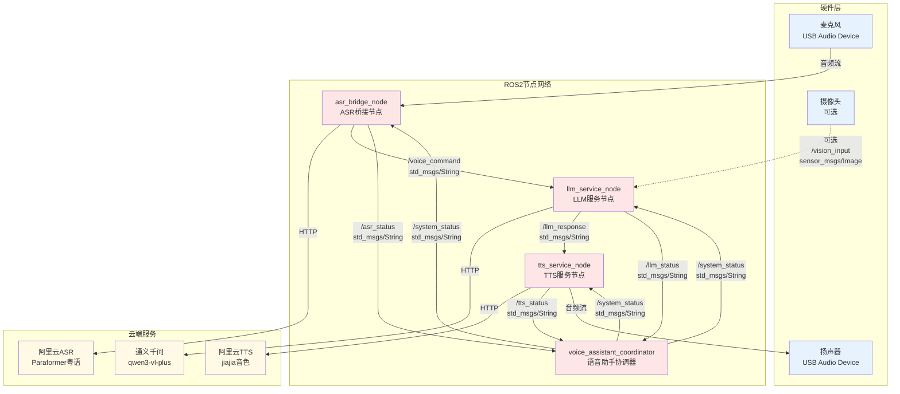

### 2.2 话题详细规范

```mermaid
graph LR
    subgraph 话题列表
        direction TB
        T1[/voice_command<br/>std_msgs/String<br/>ASR识别的文本命令]
        T2[/llm_response<br/>std_msgs/String<br/>LLM生成的回复文本]
        T3[/asr_status<br/>std_msgs/String JSON<br/>ASR节点状态信息]
        T4[/llm_status<br/>std_msgs/String JSON<br/>LLM节点状态信息]
        T5[/tts_status<br/>std_msgs/String JSON<br/>TTS节点状态信息]
        T6[/system_status<br/>std_msgs/String JSON<br/>整体系统状态]
        T7[/wake_word_detected<br/>std_msgs/Bool<br/>唤醒词检测事件]
        T8[/vision_input<br/>sensor_msgs/Image<br/>摄像头图像可选]
    end

    style T1 fill:#E6F7FF
    style T2 fill:#E6F7FF
    style T3 fill:#FFF7E6
    style T4 fill:#FFF7E6
    style T5 fill:#FFF7E6
    style T6 fill:#F0F0F0
    style T7 fill:#E6FFE6
    style T8 fill:#FFE6F0
```

---

## 3. 完整语音交互数据流图

### 3.1 "傻强，今日天气点样？" 完整流程

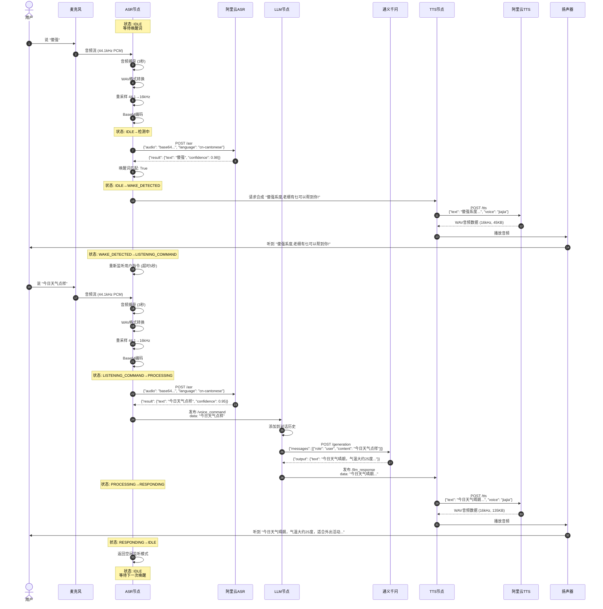

### 3.2 数据格式变换流程

```mermaid
graph LR
    subgraph 阶段1_音频采集
        A1[用户语音] -->|麦克风| A2[模拟音频]
        A2 -->|ALSA驱动| A3[PCM数字音频<br/>44.1kHz, 16-bit]
        A3 -->|speech_recognition| A4[sr.AudioData<br/>numpy array]
    end

    subgraph 阶段2_音频预处理
        A4 --> B1[get_wav_data]
        B1 --> B2[WAV bytes<br/>包含44字节头部<br/>132,344 bytes]
        B2 --> B3[检测采样率<br/>44100Hz]
        B3 --> B4[重采样<br/>44.1→16kHz]
        B4 --> B5[PCM bytes<br/>47,872 bytes<br/>减少64%]
        B5 --> B6[Base64编码<br/>63,829 chars<br/>增加33%]
    end

    subgraph 阶段3_ASR识别
        B6 --> C1[构建API请求<br/>JSON payload]
        C1 --> C2[HTTP POST<br/>阿里云ASR]
        C2 --> C3[等待响应<br/>~2.3秒]
        C3 --> C4[JSON响应<br/>status: 200000]
        C4 --> C5[提取文本<br/>今日天气点样]
    end

    subgraph 阶段4_LLM处理
        C5 --> D1[对话历史<br/>JSON array]
        D1 --> D2[构建API请求<br/>messages]
        D2 --> D3[HTTP POST<br/>通义千问]
        D3 --> D4[等待响应<br/>~2.8秒]
        D4 --> D5[提取回复<br/>今日天气晴朗...]
    end

    subgraph 阶段5_TTS合成
        D5 --> E1[构建TTS请求<br/>text+voice]
        E1 --> E2[HTTP POST<br/>阿里云TTS]
        E2 --> E3[等待响应<br/>~1.2秒]
        E3 --> E4[WAV音频<br/>135,234 bytes]
        E4 --> E5[临时文件<br/>/tmp/xxx.wav]
        E5 --> E6[pygame播放<br/>~7.5秒]
        E6 --> E7[扬声器输出<br/>用户听到回复]
    end

    style A1 fill:#E6F3FF
    style A7 fill:#E6F3FF
    style B5 fill:#FFE6E6
    style C5 fill:#E6FFE6
    style D5 fill:#FFF9E6
    style E7 fill:#F0E6FF
```

---

## 4. ASR状态机转换图

### 4.1 ASRState状态机

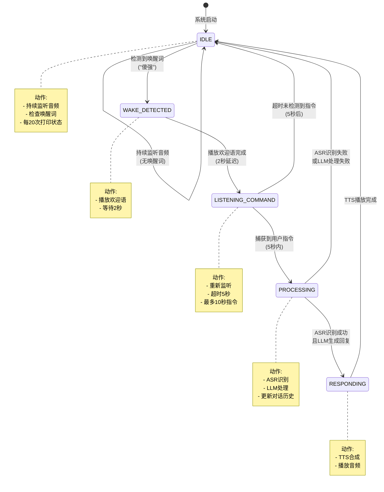

### 4.2 状态转换时间线

```mermaid
gantt
    title ASR状态转换时间线 (单次完整交互)
    dateFormat ss
    axisFormat %Ss

    section 状态转换
    IDLE (监听唤醒词)      :a1, 00, 2s
    WAKE_DETECTED (播放欢迎) :a2, 02, 2s
    LISTENING_COMMAND (等待指令) :a3, 04, 5s
    PROCESSING (ASR+LLM)   :a4, 09, 6s
    RESPONDING (TTS播放)   :a5, 15, 8s
    IDLE (返回监听)        :a6, 23, 1s

    section 关键事件
    检测到"傻强"           :milestone, m1, 02, 0s
    播放欢迎语完成         :milestone, m2, 04, 0s
    捕获用户指令           :milestone, m3, 09, 0s
    LLM响应完成           :milestone, m4, 15, 0s
    TTS播放完成           :milestone, m5, 23, 0s
```

---

## 5. 错误处理流程图

### 5.1 ASR错误处理流程

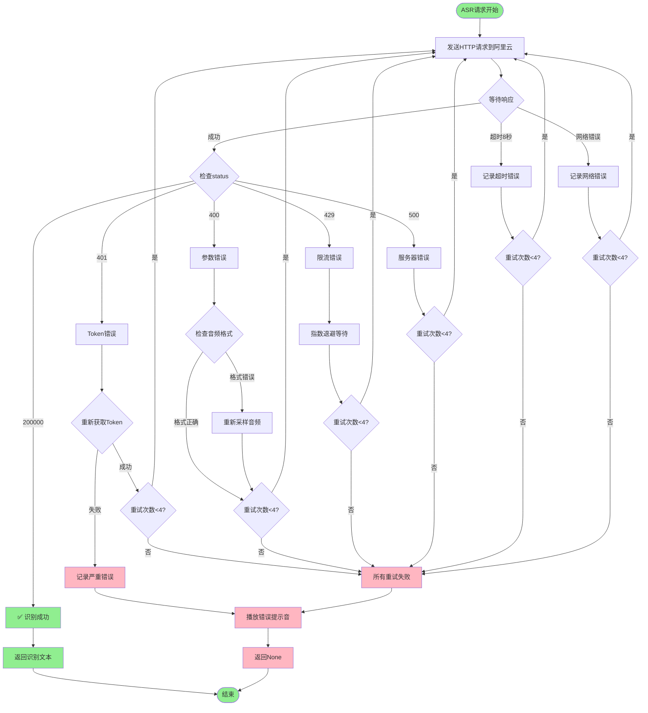

### 5.2 TTS降级链流程

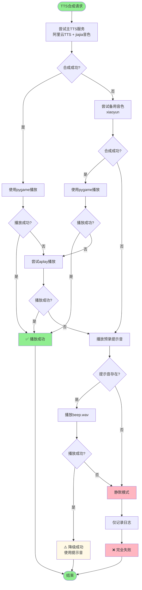

### 5.3 系统级错误恢复流程

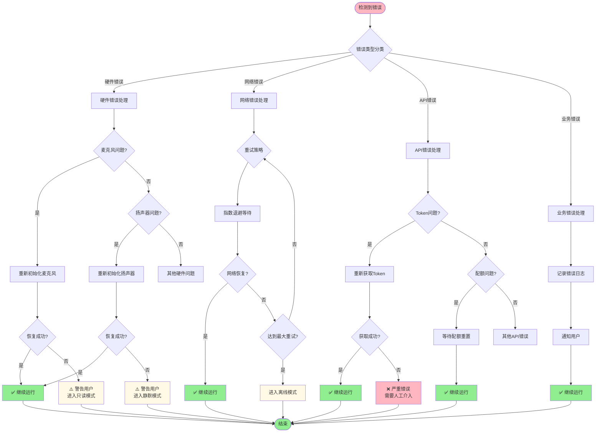

---

## 6. 性能分析图表

### 6.1 延迟分析饼图（文字版）

```
总延迟: 14.5秒 (从说话到听到回复)

┌─────────────────────────────────────┐
│  音频采集: 3.0秒 (21%)              │ ████
│  ASR处理: 3.1秒 (21%)               │ ████
│  LLM处理: 2.8秒 (19%)               │ ███
│  TTS处理: 1.2秒 (8%)                │ █
│  音频播放: 7.5秒 (52%)              │ ██████████
└─────────────────────────────────────┘

瓶颈分析:
⚠️ ASR API调用: 2.3秒 (主要瓶颈)
⚠️ LLM API调用: 2.8秒 (主要瓶颈)
ℹ️  音频播放: 7.5秒 (受回复长度影响，不可压缩)
```

### 6.2 并发性能对比

```mermaid
gantt
    title 串行 vs 并发处理对比
    dateFormat ss
    axisFormat %Ss

    section 串行处理 (当前)
    唤醒词检测       :a1, 00, 2s
    播放欢迎语       :a2, 02, 2s
    捕获用户指令     :a3, 04, 3s
    ASR识别         :a4, 07, 3s
    LLM处理         :a5, 10, 3s
    TTS合成         :a6, 13, 1s
    播放回复         :a7, 14, 8s
    总延迟22秒       :milestone, m1, 22, 0s

    section 并发处理 (优化后)
    唤醒词检测       :b1, 00, 2s
    播放欢迎语       :b2, 02, 2s
    捕获用户指令     :b3, 04, 3s
    ASR识别         :b4, 07, 2s
    LLM处理 (流式)   :b5, 09, 2s
    TTS合成 (并发)   :b6, 11, 1s
    播放回复         :b7, 12, 8s
    总延迟20秒       :milestone, m2, 20, 0s
```

---

## 附录

### A. Mermaid语法说明

本文档使用Mermaid创建流程图，支持以下渲染工具：
- GitHub (原生支持)
- VS Code (需要Mermaid插件)
- Typora
- Obsidian
- 在线工具: https://mermaid.live/

### B. 图表更新记录

| 版本 | 日期 | 更新内容 |
|------|------|---------|
| 1.0 | 2025-11-16 | 初始版本，包含5个核心流程图 |

### C. 相关文档

- [系统架构与数据流完全指南](xlerobot-system-architecture-dataflow.md)
- [快速参考卡片](xlerobot-quick-reference.md)

---

**文档维护**: 本文档应随系统架构变化而更新
**最后更新**: 2025-11-16
